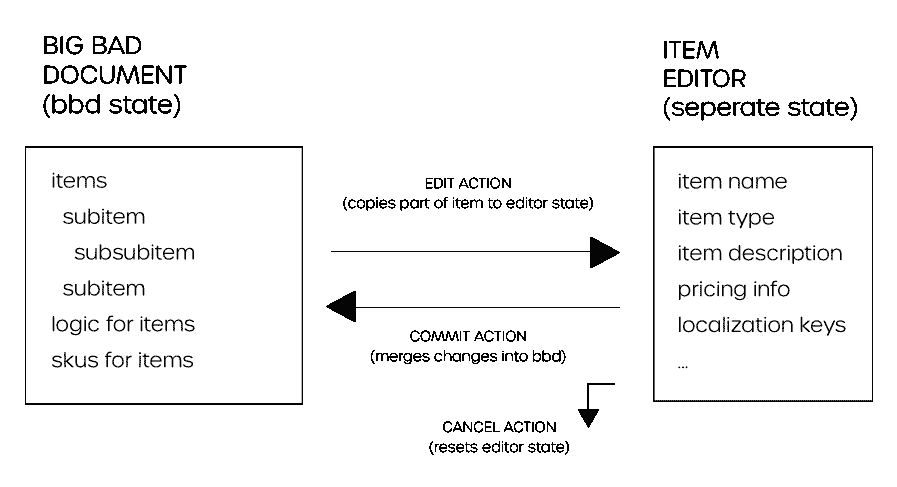

# GraphQL 和复杂客户端状态:我们为什么要使用 Redux

> 原文：<https://itnext.io/graphql-complex-client-state-why-we-reached-for-redux-804d767695c2?source=collection_archive---------2----------------------->

## (但也许没必要)

班尼特·威廉姆森在 [Unsplash](https://unsplash.com?utm_source=medium&utm_medium=referral) 上拍摄的照片

*这无意中描述了一些模式，人们可能认为这些模式有点像***在 React 应用程序中优雅地使用 Redux 和 GraphQL。随着 GraphQL 状态管理最近取得更多进展，我可能会鼓励走这条路。然而在当时，我不确定我们* ***没有*** *需要 Redux…**

*2018 年 4 月，我们启动了一个客户端项目，旨在取代非常旧的 ActionScript (Flash)应用程序。(是的，现在古 ECMA 语在编译中使用。swf 文件)。*

*我们的应用程序需要与多个后端服务对话，我们必须从某个节点(或某种 web)服务器提供单页面应用程序本身，所以我们认为 GraphQL 可能是一个不错的选择。*

*我们很快就能够在客户端后面实现 GraphQL 层，与我们的内部/域内 REST 服务进行对话，并拥有一个根据需要获取第三方数据的框架。*

## *好人*

*我们选择使用 [ApolloClient](https://www.apollographql.com/docs/react/) 作为我们的 React 应用程序的 GraphQL 内存存储提供者。ApolloClient 是一个非常活跃的 T21，自从我们开始以来已经走过了很长的路。真的很棒。如果你正在考虑 GraphQL(无论是客户端还是服务器),帮自己一个忙，看看 Apollo 的人在做什么。*

*我们马上开始看到无需任何异步获取样板文件的好处，以前是以一种选择的方式提供的(thunk、epic、saga 等)。GraphQL 绝对不需要这些代码。使用一个 HOC 或 render prop(如果您喜欢这类东西)，您可以编写查询来声明您的组件需要的数据，这样就完成了。有什么不喜欢的？*

*“第一阶段”的特性集非常平滑。除了使用 GraphQL 查询，我们开始使用一些小的变化来调用我们的下游服务，以持久化其他 REST 服务和命令——向队列添加工作负载等。*

## *坏事*

*在“第二阶段”特性集期间，开发有点困难。对于这一部分，我们的数据打包在一个庞大的文档中。(JSON 中有大约 5000 行代码)文档包含了各种各样的信息(很可能是独立的关注点)。与服务端点的合同是整个文档。*

*你说改文档？不太可能，使用该文档的前端体验每年带来 2 . 5 亿美元的收入。*

*文档的每个部分都由一个单独的 UI 管理——姑且称之为“编辑器”。每个编辑器都有一组独特的输入和控件，常见的用例是用户能够保存他们的更改或退出。*

*最终，我们在 UX 找到了这样一个工作流程:*

**

*疯狂的状态管理工作流使用一个大文档库和 UI 编辑小片段。*

*在这一点上，我们已经使用 Redux 来处理应用程序中的确认模式和通知——这些事情与服务器状态无关。使用 Redux，我们发现对上述工作流建模就像对是否显示通知建模一样简单。*

*不过，我们的支持 BFF(“后端对前端”)端是 GraphQL，所以当需要持久化文档时，我们现在有了这种有趣的混合方法，我个人认为这很酷。这里有一个要点示例:*

*Redux 中间件在某些动作上调用 GraphQL 变异*

## *丑陋的*

*虽然上面的例子看起来是两全其美的，但我们现在有机会将 GraphQL 客户端简单地嵌入到我们的 Redux 操作中，作为一种可接受的模式。没有任何强制的指导方针，我们很快也从这一层调用查询。*

*如果我们从一开始就决定在 redux 层中获取数据，这可能会看起来更干净一些，但是由于我们开始将 GraphQL 查询捆绑到我们的组件，我们最终像这样将数据推入 redux:*

*将数据从 graphql HOC 推送到 redux 组件上*

## *外卖食品*

*我不觉得响应 redux 动作而执行突变有多可怕，但我更喜欢一种更干净的方式来耦合 GraphQL 和 Redux——或者最好使用其中的一个。*

*我觉得我们可以通过应用程序更一致地实施某种更好的模式。话又说回来，我不确定我是否完成了一个应用程序而没有想到这一点。*

**两个月后……**

*在最终发表这篇文章之前，我决定先看一眼[https://www . apollographql . com/docs/react/essentials/local-state](https://www.apollographql.com/docs/react/essentials/local-state)。在我看来，至少可以将 Apollo 客户端缓存重新定位为一个统一存储，支持直接客户端写入:*

> *“直接写入缓存不需要 GraphQL 变异或解析函数”*

*太棒了。仍然有相当多的冗余特性，如中间件、多年的开发、可靠的开发工具、[商店实现可观察的](https://medium.com/@benipsen/introducing-redux-fusion-an-alternative-approach-to-react-reduxs-connect-method-for-rxjs-44248895b47d)、社区规模等。但是我非常期待继续从 Apollo 和 GraphQL 社区整体上看到更多的好东西。*