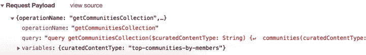
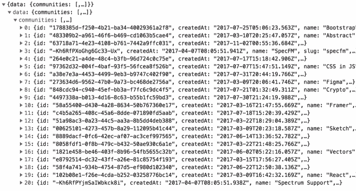
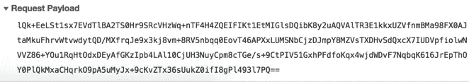

# 使用 Apollo 栈的 GraphQL 数据隐藏

> 原文：<https://itnext.io/graphql-data-hiding-using-apollo-stack-ad1ea92fa85c?source=collection_archive---------2----------------------->

> 如果你的网站有一个私有的 GraphQL API，而你不希望人们在浏览器中看到普通的查询和响应，那么下面是你如何使用 Apollo 栈库来破坏流量。

## 为什么需要隐藏 GraphQL 流量？

如你所知，当浏览器发送 HTTP 请求时，你的用户只需在浏览器的开发工具中打开网络标签就能看到它们。发送和接收的数据都是纯文本。很容易对你网站的私有 API 进行逆向工程。有些人可能会出于有害的原因这样做。

例如，这里有一页来自惊人的*光谱。聊天*:[https://spectrum.chat/explore](https://spectrum.chat/explore)

下面是他们的 GraphQL 请求在 Chrome DevTools 中的样子:



**请求负载**的屏幕截图

回应是:



**响应预览截图**

作者有意让 API 保持开放。但是当你开发一个高度安全的软件时，你会想要保护自己免受一系列黑客的攻击并隐藏那些数据。

# 这个想法

对发送和接收的 GraphQL 数据进行编码或加密。

下文假设:

*   您使用的是 GraphQL Apollo 服务器(但是，您可以将代码应用于任何其他服务器)
*   您使用 HTTP POST 请求来发送和接收数据(当然，您可以将下面的代码用于所有其他协议)。
*   您在客户端使用的是 Apollo Client(但是，您当然可以将下面的代码应用于任何其他客户端模块)。

我们将:

*   劫持发送的 Apollo 客户端请求，
*   将 JSON 字符串转换成二进制缓冲区，
*   加密缓冲区**(可选)**，
*   将其序列化为 base64，
*   将`Content-Type` HTTP 报头从`application/json`更改为`text/plain`，
*   添加[标准](https://www.w3.org/Protocols/rfc1341/5_Content-Transfer-Encoding.html) `Content-Transfer-Encoding: base64` HTTP 头、
*   并将其发送到服务器。

在服务器端，我们将:

*   在 Apollo GraphQL 服务器中间件之前添加我们的中间件，
*   使用`Content-Transfer-Encoding`头来检测主体是否需要解密，
*   将 base64 字符串转换为二进制缓冲区，
*   解密缓冲区**(可选)**，
*   将其作为 UTF-8 序列化为 JSON 字符串，
*   将 HTTP 头`Content-Type`改写为`application/json`，
*   将请求传递给阿波罗服务器。

对服务器回复进行相反的操作——在服务器上劫持和编码，在客户端劫持和解码。

## 下降趋势

请注意以下几点:

*   **这不是真正的数据保护。不可能在客户端 AFAIK 上安全地加密数据，因为私钥将保存在浏览器 JavaScript 代码中。这种方法很适合混淆 GraphQL 请求和反混淆响应。**
*   对于本地开发，您可能希望关闭它，而只在生产/暂存环境中启用。(见下文。)

## 编码算法

如果你决定不加密你的数据，那么跳过这一段。但是如果你要进行额外的数据隐藏，那么你需要在服务器端和客户端使用相同的算法。

下面是现代浏览器能做的事情的列表(可能列表不完整):[https://github.com/diafygi/webcrypto-examples](https://github.com/diafygi/webcrypto-examples)

Web Crypto API 得到了很好的支持，甚至在 IE11 中也是如此。就用这个垫片:[https://github.com/vibornoff/webcrypto-shim](https://github.com/vibornoff/webcrypto-shim)

下面是 node.js 的相同 webcrypto API 实现:[https://github.com/anvilresearch/webcrypto](https://github.com/anvilresearch/webcrypto)

您需要选择 node.js 和浏览器都支持的算法。

# 实现客户端

## 拦截传出的请求

[Apollo 文档](https://www.apollographql.com/docs/link/)提供了这段代码，作为如何创建客户端对象的示例:

```
**import** { ApolloLink } **from** '*apollo-link*';
**import** { ApolloClient } **from** '*apollo-client*';
**import** { InMemoryCache } **from** '*apollo-cache-inmemory*';
**import** { HttpLink } **from** '*apollo-link-http*';

**const** client = **new** ApolloClient({
  link: **new** HttpLink({ uri: '*http://api.githunt.com/graphql*' }),
  cache: **new** InMemoryCache()
});
```

我发现劫持传出请求和传入响应的最简单方法是覆盖可以传递给`HttpLink`构造函数的`fetch`选项:

```
**new** HttpLink({
  uri: '*http://api.githunt.com/graphql*',
  fetch: myFetchImplementation ***// overwriting the fetch function***
})
```

让我们从上面实施`myFetchImplementation`。

## 覆盖 HTTP 头

以由[杰森·米勒](https://medium.com/u/30b8f5921914?source=post_page-----ad1ea92fa85c--------------------------------)—[解锁](https://github.com/developit/unfetch/blob/master/src/index.js)模块实现的非常简单的获取功能为例。它在引擎盖下用的是`XMLHttpRequest`，对老浏览器支持也不错。

```
**function** myFetchImplementation(url, options) {
  options = options || {};...
```

检查此请求是否应被破坏:

```
**const** isEncoding = shouldEncode(url, options);
```

哪里的`shouldEncode()`由你来实施。此外，这也是在本地开发中跳过数据隐藏的好地方。例如:

```
**export** **function** shouldEncode(url, options) {
  **if** (process.env.NODE_ENV === "*development*") **return false**; **if** (!options.method || options.method.toLowerCase() !== "*post*")
    **return false**; url = url.split("*?*")[0].split("*#*")[0];
  **if** (!url.endsWith("*/graphql*")) **return false**; **return true**;
}
```

让我们开始重新实现`fetch`。

`fetch`应回承诺:

```
**return new** Promise(**async** (resolve, reject) => {
  **let** req = **new** XMLHttpRequest();
  req.open(options.method || "*get*", url);
```

是时候添加上面指定的标题了。

我们将检查`isEncoding`变量，并根据我们的喜好覆盖 HTTP 头(如上面的**想法**部分所述)。

```
**for** (**let** i **in** options.headers) {
  **if** (isEncoding && i.toLowerCase() === "*content-type*") {
    req.setRequestHeader(i, "*text/plain; charset=UTF-8*");
    req.setRequestHeader("*Content-Transfer-Encoding*", "*base64*");
  } **else** {
    req.setRequestHeader(i, options.headers[i]);
  }
}*// Some additional necessary bits of the fetch() standard function*
req.withCredentials = options.credentials == "*include*";
req.onload = () => {
    resolve(response());
};
req.onerror = reject;
```

## 编码 GraphQL 请求

我们的`fetch()`函数实现中的下一行只是发送数据:

```
**let** body = options.body;
req.send(isEncoding ? **await** encodeTextBody(body) : body);
```

现在我们需要实现`encodeTextBody`功能。

```
**function** encodeTextBody(text) { ... **return** encodedText;
}
```

如果您不想加密，那么这里是您需要的实现。它将 UTF-8 字符串转换为二进制缓冲区，然后转换为 base64 编码的文本。

```
**let** buffer = **new** Uint8Array(**new** TextEncoder().encode(text));
**const** encodedText = btoa(String.fromCharCode.apply(**null**, buffer));
```

## 加密 GraphQL 请求(可选)

如果你想要额外的安全层，那么这里是你如何从上面加密二进制文件`buffer`。

1.  创建加密密钥。
2.  用它来加密缓冲区。

密钥创建可以是这样的。但是您可以从[这里](https://github.com/diafygi/webcrypto-examples)选择您的实现:

```
**const** key = **await** self.crypto.subtle.importKey(
  "*jwk*",
  {
    kty: "*oct*",
    k: "*MY SHARED KEY*",
    alg: "*A256GCM*",
    ext: **true** },
  {
    name: "*AES-GCM*"
  },
  **false**,
  ["*encrypt*", "*decrypt*"]
);
```

服务器端和客户端的`“*MY SHARED KEY*”`字符串应该是相同的。您可能想要为每个用户创建一个，或者只是硬编码它。

创建一次`key`变量(每个浏览器/用户会话)并重用。

确保在服务器端和客户端使用相同的`iv`。

```
**const** iv = Uint8Array.from([0, 1, 2, 3, 4, 5, 6, 7, 8, 9, 10, 11, 12, 13, 14, 15]);
```

加密缓冲区。

```
buffer = **await** self.crypto.subtle.encrypt(
  {
    name: "*AES-GCM*",
    iv,
    tagLength: 128
  },
  key**,**
  buffer
);
```

`buffer`现在已经加密了。



Chrome DevTools 中编码的 HTTP 请求体示例

## 解码接收到的响应

下面是我们剩下的`myFetchImplementation`。参见[解锁](https://github.com/developit/unfetch/blob/master/src/index.js)源代码。

```
**function** response() {
  **let** keys = [], all = [], headers = {}, header;

  req.getAllResponseHeaders().
  replace(*/^(.*?):\s*([\s\S]*?)$/gm*, (m, key, value) => {
      keys.push((key = key.toLowerCase()));
      all.push([key, value]);
      header = headers[key];
      headers[key] = header ? `*${header},${value}*` : value;
  });

  **return** {
    ok: ((req.status / 200) | 0) == 1
    status: req.status,
    statusText: req.statusText,
    url: req.responseURL,
    clone: response,
    text: **async** () => (isCrypting ? 
      **await** decodeTextBody(req.responseText) : ***// decoding***
      req.responseText
    ),
    json: **async** () => JSON.parse(isCrypting ? 
      **await** decodeTextBody(req.responseText) : ***// decoding***
      req.responseText
    ),
    blob: () => Promise.resolve(**new** Blob([req.response])),
    headers: {
      keys: () => keys,
      entries: () => all,
      get: n => headers[n.toLowerCase()],
      has: n => n.toLowerCase() **in** headers
    }
  };
}
```

唯一剩下的位就是上面的`decodeTextBody()`函数。这很简单。

```
**function** decodeTextBody(text) { ... **return** decodedText;
}
```

如果您不想加密，那么这里是您需要的实现。它将 base64 字符串转换为二进制缓冲区，然后转换为 UTF 8 文本。

```
**let** buffer = **new** Uint8Array(
  [...atob(text)].map(char => char.charCodeAt(0))
);
**const** decodedText = **new** TextDecoder().decode(buffer);
```

## 解密 GraphQL 响应(可选)

1.  使用与上述加密功能相同的`key`和`iv`。
2.  解密缓冲区。

```
buffer = **await** self.crypto.subtle.decrypt(
  {
    name: "*AES-GCM*",
    iv,
    tagLength: 128
  },
  key,
  buffer
);
```


Chrome DevTools 中编码的 HTTP 响应体示例

# 实现服务器端

## 拦截传入的请求

[Apollo documentation](https://www.apollographql.com/docs/apollo-server/servers/express.html) 提供了这段代码，作为如何将 GraphQL 中间件添加到 Express.js 服务器应用程序的示例:

```
**const** bodyParser = require('*body-parser*'); **const** { graphqlExpress } = require('*apollo-server-express*');app.use(
  '*/graphql*',
  bodyParser.json(),
  graphqlExpress({ schema: myGraphQLSchema })
);
```

在一些 node.js 框架中，劫持请求和响应很容易。例如，在`koa`和`hapi`中，您可以拥有预处理程序中间件(用于传入请求)和后处理程序中间件(用于传出响应)。

Express.js 更难。我发现劫持 Express.js 中的传入请求和传出响应的最简单方法是覆盖整个`graphqlExpress`函数。好的一面是——它的[源代码](https://github.com/apollographql/apollo-server/blob/master/packages/apollo-server-express/src/expressApollo.ts)相当小。甚至比极简的`unfetch`模块还要小。感谢阿波罗团队！

这只是您的中间件的一种表现形式:

```
app.use(
  *'/graphql'*, 
  require(*"body-parser"*).text(),
  graphqlDecode,
  myGraphqlExpressImplementation
);
```

`require(*“body-parser”*).text()`将创建一个字符串形式的`req.body`属性。

如果需要的话，`graphqlDecode`只是简单地解码请求。

```
**async function** graphqlDecode(req, res, next) {
  **try** {
    **if** (req.get("*content-transfer-encoding*") === *"base64"*) {
      **const** str = **await** decodeTextBody(req.body); ***// decoding***
      req.body = JSON.parse(str);
      req.headers[*"content-type"*] = *"application/json"*;
      req.graphqlWasEncoded = **true**;
    }
    next();
  } **catch** (e) {
    next(e);
  }
}
```

如您所见，我们检查了“Content-Transfer-Encoding”头，解码了主体，为请求添加了`graphqlWasEncoded`标志，并将“Content-Type”重写回“application/json ”,以便 Apollo engine 可以正确处理它。

而`myGraphqlExpressImplementation`就是重新实现的阿波罗`graphqlExpress`。

```
**const** { runHttpQuery } = require(*"apollo-server-core"*);**async function** myGraphqlExpressImplementation(req, res, next) {
  **try** {
    **let** gqlResponse = **await** runHttpQuery([req, res], {
      method: req.method,
      options: {
        schema: mySchema,
        validationRules: myValidationRulesArray
      },
      query: req.method === "*POST*" ? req.body : req.query
    }); **let** type = *"application/json"*;
    **if** (req.graphqlWasEncoded) {
      gqlResponse = **await** encodeTextBody(gqlResponse); ***// encoding***
      type = *"text/plain"*;
      res.setHeader(*"content-transfer-encoding"*, *"base64"*);
    } res.setHeader(*"content-type"*, type);
    res.setHeader(
      *"content-length"*,
      Buffer.byteLength(gqlResponse, *"utf8"*).toString()
    );
    res.write(gqlResponse);
    res.end();
  } **catch** (error) {
    **if** (error.name !== "HttpQueryError") {
      **return** next(error);
    } res.setHeader(*"Content-Type"*, *"application/json"*);
    res.setHeader(
      *"Content-Length"*,
      Buffer.byteLength(gqlResponse, *"utf8"*).toString()
    );
    res.write(gqlResponse);
    res.end();
  }
}
```

在上面的代码中，我们检查了`req.graphqlWasEncoded`标志，并对发出的请求进行了编码。简单！

剩下的两位是`decodeTextBody`和`encodeTextBody`函数。

## 解码 GraphQL 请求

在 node.js 中将 base64 转换成 utf8 非常简单。

```
**async** decodeTextBody(text) {
  **let** buffer = Buffer.from(text, *"base64"*);
  **return** Buffer.from(buffer).toString(*"utf8"*);
}
```

## 解密传入的 GraphQL 请求(可选)

如果您选择进行加密，那么您需要遵循与客户端相同的路径—创建密钥、创建 iv、解密。

首先导入`webcrypto`模块:

```
**const** webcrypto = require(*"@trust/webcrypto"*);
```

创建相同的密钥。使用相同的`*“MY SHARED KEY”*`字符串。

```
**const** key = **await** webcrypto.subtle.importKey(
  "*jwk*",
  {
    kty: "*oct*",
    k: "*MY SHARED KEY*",
    alg: "*A256GCM*",
    ext: **true** },
  {
    name: "*AES-GCM*"
  },
  **false**,
  ["*encrypt*", "*decrypt*"]
);
```

然后创建与客户端相同的`iv`:

```
**const** iv = Uint8Array.from([0, 1, 2, 3, 4, 5, 6, 7, 8, 9, 10, 11, 12, 13, 14, 15]);
```

解密:

```
buffer = **await** webcrypto.subtle.decrypt(
  {
    name: "*AES-GCM*",
    iv,
    tagLength: 128
  },
  key,
  buffer
);
```

## 对传出响应进行编码

将 utf8 转换为 base64。

```
**async** encodeTextBody(text) {
  **let** buffer = Buffer.from(text, *"utf8"*);
  **return** Buffer.from(buffer).toString(*"*base64*"*);
}
```

## 加密 GraphQL 响应(可选)

同样，代码与客户端相同:

```
buffer = **await** webcrypto.subtle.encrypt(
  {
    name: "*AES-GCM*",
    iv,
    tagLength: 128
  },
  key**,**
  buffer
);
```

# 结论

*   隐藏 GraphQL 请求和响应数据是可能的。
*   Apollo 工具足够灵活，允许您劫持服务器端和客户端的请求和响应。尽管如此，更简单的解决方案会更好。

> **提示。**为了对外界隐藏你的 GraphQL 模式，把这个函数添加到 Apollo 的`validationRules`数组中(见上文)。

```
**const** { createError } = require(*"apollo-errors"*);
**const** ForbiddenError = createError(*"ForbiddenError"*, { message: *"Forbidden"* });**function** NoIntrospection(context) {
  **return** {
    Field(node) {
      **const** nodeValue = node.name.value;
      **if** (nodeValue === *"__schema"* || nodeValue === *"__type"*) {
        context.reportError(**new** ForbiddenError());
      }
    }
  };
}
```