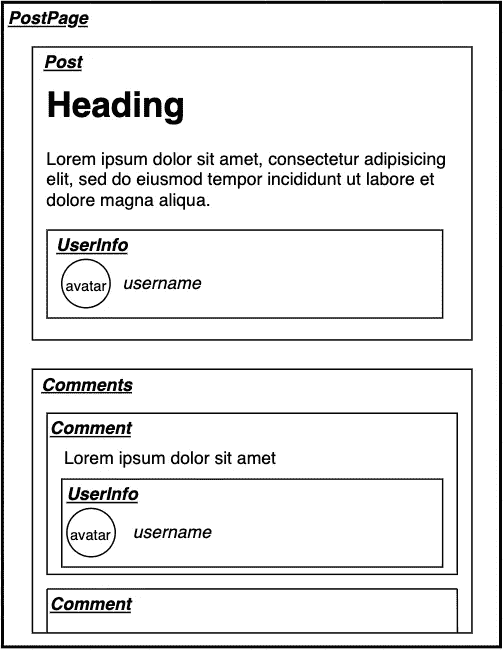

# 构建组件的基于片段的方法

> 原文：<https://itnext.io/graphql-fragment-based-approach-to-building-your-components-798647d011a5?source=collection_archive---------3----------------------->

当您开始在客户机上使用 GraphQL 并且您的代码库增长时，您可能会发现自己一次又一次地编写相同的查询。有时在查询中甚至会有死字段，因为很难跟踪组件树中使用了什么。通过这种重复，您会遇到一些我们将在本文中尝试回答的问题:

*   如何保持组件和 GraphQL 查询的可伸缩性和整洁？
*   如何避免查询中的超取和死代码？
*   如何获得您需要的所有数据并且不遗漏任何内容？
*   我应该在查询中放入什么，在片段中放入什么？

我们所有的现代 web 应用程序都由顶层和底层组件组成。大多数组件都有自己的数据依赖关系，我们应该以某种方式将它们正确地组合到一个查询中。

GraphQL 有一个很好的特性可以重用部分查询代码— [片段](https://graphql.org/learn/queries/#fragments)。基于这个特性，我们将构建我们的组件和查询。

我们将以一个简单的博客帖子为例。看起来会是这样的:

下面是该页面的一个简短的 GraphQL 模式:

首先，让我们计划查询来获取该页面的所有数据。我们的查询可能是这样的:

现在我们将尝试把这个查询分成更小的部分，并检查特定组件需要什么数据。

让我们从 *UserInfo* 组件开始。在那里，我们需要有一个用户名和头像。基于此，我们可以创建一个片段来指定该组件所需的数据。

这个片段是根据 Relay Modern 常用的约定来调用的:***component name _ propName***。尽管在 Relay Modern 中，是有意通过 Relay Compat 机制来编译查询，但我仍然发现这种方法有助于保持片段名称的一致和清晰。因为你总是知道这个碎片属于什么组件，属于什么道具。

好了，我们已经完成了 *UserInfo* 组件，我们可以上一层到使用该组件的地方——Comment*Comment***组件。**

**该组件呈现评论文本和作者的简短信息。它的片段可能如下所示:**

**好了，让我们进一步移动到*注释* 组件。该组件需要每个*评论* 组件的所有数据，此外还需要每个评论项的 id。基于此，它的片段可能看起来像:**

**您可以注意到，*注释*组件并不关心在*注释*组件中使用的数据。如果子组件中的某些东西发生了变化，那么这个片段就不需要任何变化。由于这种方法，我们为组件创建了数据依赖关系。**

**让我们通过完成剩余的组件和片段来多练习一下。那么还剩下什么呢？*帖子*和*帖子页*组件*。***

**我们的*帖子*需要有帖子内容和作者。对于作者，我们将使用用于*评论*组件的相同组件，由于这种方法，我们不需要再次指定 *UserInfo* 所需的所有字段*。我们可以重用 UserInfo_user* 片段。**

**最后，我们可以将所有这些片段组合到查询中:**

**注意，我们没有将任何帖子字段直接包含到 *PostPageQuery* 中，因为我们没有在 *PostPage* 组件中使用它们。如果我们需要一些，我们可以很容易地将其添加到查询中。唯一要记住的是，我们通过片段或查询在同一个组件级别上指定所有必需的字段。**

# **结论**

**这种基于片段的方法将有助于跟踪您的查询，因为您的所有字段都在确切使用它们的地方被提及。您可以安全地删除片段树中每一层的数据字段，因为片段只负责组件需要的数据。此外，您不必担心不同的片段名称必须是描述性的。**

**给这种基于片段的方法一个机会，您将看到 GraphQL 是如何与您的组件很好地协同工作的。**