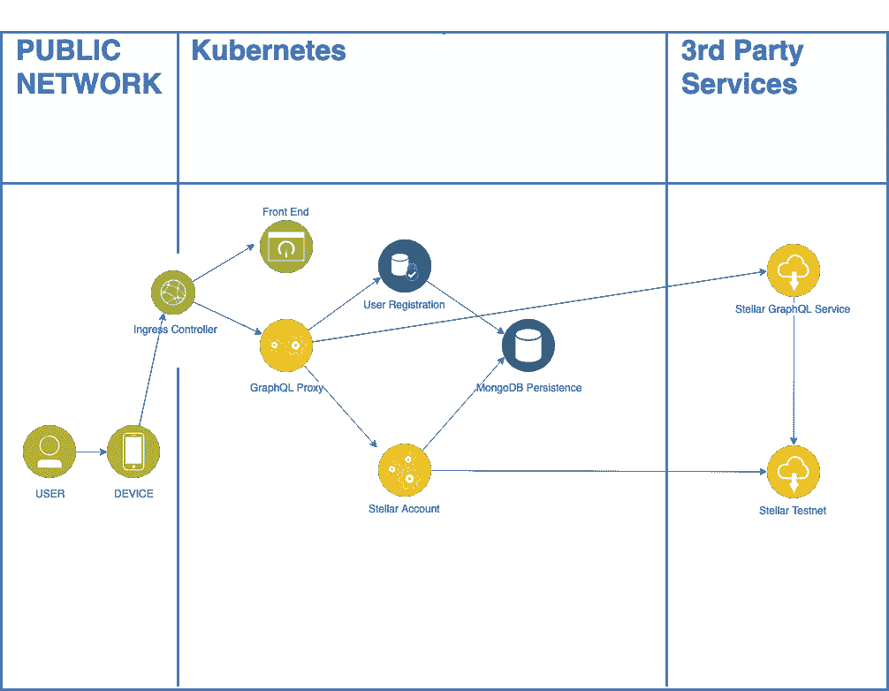

# 微服务架构中的 GraphQL

> 原文：<https://itnext.io/graphql-in-a-microservices-architecture-d17922b886eb?source=collection_archive---------0----------------------->

## GraphQL 拼接提高了开发人员的灵活性和生产力

# 背景

在最近的一篇文章[探索带有恒星的令牌](/exploring-tokens-with-stellar-291172208639)中，我顺便提到了在我们构建解决方案的方法中如何使用 [GraphQL 拼接](https://www.apollographql.com/docs/graphql-tools/schema-stitching.html)。为了理解我们如何以简单优雅的方式解决这个问题，我将首先分享我们解决方案的整体拓扑结构。

**作者注:**由于对这个话题的强烈兴趣，我们于 2019 年 3 月 14 日在 GitHub 上发布了组织 [token-factory](https://github.com/token-factory) 下的源代码。



# GraphQL 环境下微服务的成长烦恼

当我们使用 GraphQL 构建编程模型时，我们发现为我们的每项功能提供独立服务的好处是允许我们的团队快速工作并迭代编程模型，同时提供微服务和 12 因素应用程序的典型好处。另一方面，分离出这些服务阻止了团队充分利用更多 GraphQL 高级功能，如服务器端[批处理和缓存](https://graphql.org/learn/best-practices/#server-side-batching-caching)。与此同时，我们也在尝试简化客户端编程模型，而 Apollo 如何基于定义良好的端点来初始化客户端，这给开发团队带来了另一系列棘手问题。

# GraphQL 拼接如何解决我们的问题

为了尝试解决我们的痛点，团队决定看看其他人是如何用 GraphQL 处理微服务架构的，并很快想到了[模式拼接](https://www.apollographql.com/docs/graphql-tools/schema-stitching.html)的想法。在我们的微服务架构中，每个微服务都有自己独特的端点和为入口控制器配置的路由规则。这种方法要求前端开发团队定义多个 Apollo 客户端来支持各种端点，或者在入口中配置复杂的路由规则，而不仅仅是简单的上下文路径路由规则，以支持到各种微服务端点的路由。通过启用模式拼接，我们能够合并来自各种微服务的模式，这些微服务代表了所有支持 GraphQL APIs 的复合视图，从而简化了我们的客户端编程模型。结果是针对单个 GraphQL 端点进行编程。此外，这允许我们的客户端编程模型真正包含跨越多个服务的 GraphQL 和批处理查询，这在以前的架构中是不可能的。

# GraphQL 拼接的体系结构

GraphQL 拼接是一个额外的运行时服务，它被部署到一个现有的拓扑中(参见上面的拓扑)。在我们的解决方案中，我们部署了一个`GraphQL Proxy`，它在我们的`Ingress Controller`和 GraphQL 端点之间路由流量。核心功能由一个名为`graphql-tools`的社区 Node.js 模块提供，该模块带有一组需要实现的定义良好的 API。拼接的作用是从一组定义的 GraphQL 端点导入和合并模式。这个运行时服务负责将入站请求有效负载映射到适当的端点，以及错误处理和安全性。

# 我们服务的 GraphQL 拼接方法

在下面的例子中，我包含了负责合并模式和用各种 GraphQL 变化和查询初始化 Apollo 服务器的全部资源。请注意，拼接充当实际服务的代理，并且在模式合并后是静态的。因此，如果您所管理的缝合 GraphQL 模式是易变的，您将希望让定期监控这些端点的变化。在我们的例子中，我们利用 Kubernetes 的就绪性和活性探测来跟踪变化，并在发生变化时触发服务的重载。

# 引入远程第三方模式

这个脚本中的一个微妙之处可以在第 22 行看到

```
const STELLAR_NODE_URI = ‘https://core-test.gly.sh/graphql’
```

迁移到 GraphQL 拼接最强大的功能之一是能够使用第三方 API，并将它们与您现有的 GraphQL APIs 合并。Stellar 开发者社区相当活跃，为开发者提供了许多有用的资产。我们非常依赖的是 GraphQL 支持的 API 层，它位于 Stellar testnet 的 Postgres 数据库之上。在文章[构建明星应用](/building-stellar-apps-36303d0e6f45)中可以找到这个和其他关于开发者生态系统力量的令人敬畏的例子。这个端点扩展了我们的 API，为每个 stellar 核心数据库提供了一组丰富的 GraphQL 查询。太棒了。

# 结论

GraphQL 来自以 REST API 为中心的世界，它能够执行非常适合多个前端应用程序的细粒度查询，是真正的游戏规则改变者。通过利用 GraphQL 拼接，我们构建了一个健壮的 API 策略，该策略既可消费又可扩展，并且能够在未来添加额外的微服务。

# 信用

我还要感谢[罗崇信](https://medium.com/u/3e25da742cf4?source=post_page-----d17922b886eb--------------------------------)推动了这项工作的前期调研和实施。