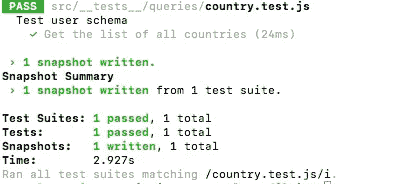
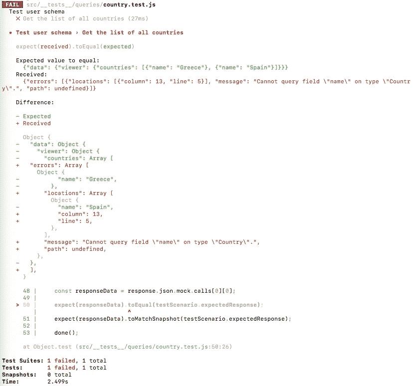
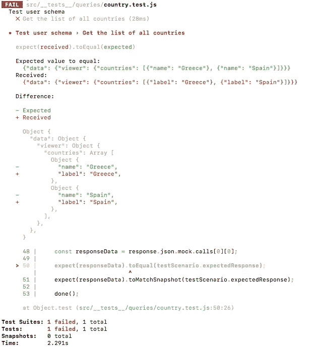
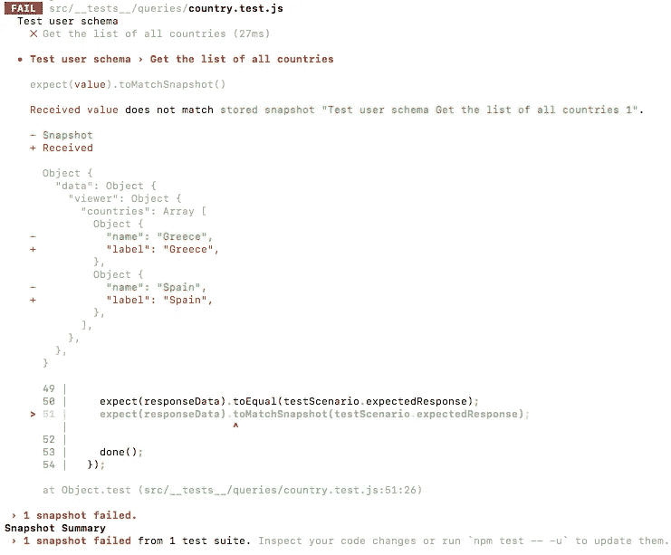
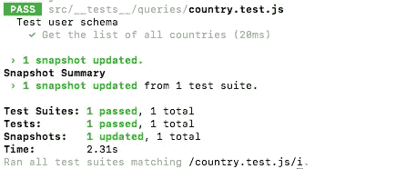

# GraphQL & Jest:快照测试

> 原文：<https://itnext.io/graphql-jest-snapshot-testing-7f7345ee2be?source=collection_archive---------3----------------------->


GraphQL & Jest

测试在日常开发流程中非常重要。每当你构建一个新的特性或者重构一个现有的特性时，你都希望确保你没有破坏其他的东西。你怎么能确定？您可以要求您的 QA 提交回归，但是如果您的团队中有 10 个以上的开发人员呢？对，QA 很可能很快就会退出。更糟糕的是，如果你的团队没有 QA，开发人员只会不断破坏彼此的代码。为了防止这种情况，您可以用测试来覆盖您的代码。稍后，当你改变一些东西或者增加一些东西时，你需要做的就是运行测试来确保你的应用程序没有被破坏。

**什么问题？**

在我目前的团队中，有 5 名后端开发人员，他们都并行工作。在开发应用的过程中，我们遇到了一些问题:

*   当有人改变一个模式时，我们的前端就会崩溃。
*   当有人更换旋变器时，我们的前端就会崩溃。

为了解决这些问题，我决定尽可能多地用测试来覆盖这些边角案例，这就是我最终的结果。

当模式改变时，我希望确保这四种情况都得到测试:

*   删除字段时。
*   当字段被重命名时。
*   添加字段时。
*   当解析器函数改变时，我希望确保我没有改变的数据与我之前得到的数据相同。

它非常类似于快照测试。我不检查特定的字段或长度或结构。我只检查我现在得到的和我以前得到的。唯一不同的是，我自己写快照。可以将这项工作委托给 graphql 服务器，但在我的情况下，手动完成也可以。

它给了我什么？至少我能看到有人的改变打破了别的东西。我在两个环境中运行这种测试:本地环境和 CI 环境。当我在本地运行它时，我会看到我的更改是什么，以及它们破坏了什么或没有破坏什么。当 CI 运行它时，我们的团队会在一个松弛通道中得到错误(如果有的话)。

**计划是什么？**

它是如何工作的非常简单:我向 graphql 服务器发送一个查询，因为它应该工作，但只有一个不同——我模仿了 resolvers 函数。我指定我想为一个查询获取什么数据。基本上，它是我手动创建的数据快照。如果有人更改了模式中的某些内容，graphql 服务器将返回一个与 mock 中所写内容不同的响应。

让我们写一些代码。它将会是 javascript，但是你可以把同样的想法应用到任何你喜欢的语言上。

我决定不在本地运行任何服务器，我使用一个 express 中间件，所以对我来说，它只是一个在响应对象 a.k.a 单元测试中获取模式、请求、响应和设置 JSON 对象的函数。对于相同的查询输入，我们总是期望相同的输出。

当我运行这个测试时，我得到了这样的响应:



它说我的测试已经正确地通过了。

现在，假设我想更改我的模式，并将 countries `name`字段重命名为`label`。让我们看看输出会是什么。



厉害！我的测试失败了，错误是国家类型中不存在字段名。让我们更改测试查询中的字段名称，并添加一个标签而不是名称

```
{ query: '{ viewer { countries { label } } }' } 
```



仍然没有通过。没错，我改变了模式，但是我的测试的快照和模拟仍然保持不变。现在我需要更新我的模拟并再次运行它。



所以，这样更好。现在我可以看到我的更改破坏了什么，如果我同意，我需要做的就是运行`npm run test -- -u`来更新我的测试快照。



**结论。**

基本就这些了。我还添加了一个额外的检查来确保响应的结构等于模拟的结构，但是我认为只使用 jest.snapshot 就足够了。这是我测试 graphql 的方法。它并不理想，还有很多需要改进的地方，但是到目前为止，这个解决方案帮助我的团队保持了代码的稳定性。

喜欢故事？鼓掌和分享。谢谢！