# AWS AppSync 简化了 GraphQL

> 原文：<https://itnext.io/graphql-made-easy-by-aws-appsync-21dfae586d51?source=collection_archive---------3----------------------->


堆栈

开始使用 GraphQL 可能会很困难。然而，我仍然听到有人加入了这项技术的宣传行列，他们讨厌它。

作为一名寻求学习 AWS 服务的前端开发人员，我对无服务器架构非常感兴趣。为我的应用程序忽略后端服务器的能力显示了很大的潜力，我很高兴了解支持这一点的技术。我相信前端和后端开发之间的界限将继续模糊，直到我们有了云管理者和开发者。我越来越多的开发人员同事可以互换工作，我自己每天看到的 Java Spring 比我承认的要多。

作为一个未来的开发者，我们将创建 GUI，查询数据库和 API，并创建用户友好的逻辑。

另一方面，您将拥有云管理器，通过用户池、身份验证、业务逻辑、数据库模式等设置后端即服务。

> 我的观点是——我认为无服务器架构是新的希望！

*学分* [*纳德达比特*](https://medium.com/u/695782484bda?source=post_page-----21dfae586d51--------------------------------) *你可以看到这个教程在这里帮了我很大的忙。他有一些关于媒体的很棒的教程。如果你喜欢视频，可以在这里看他的视频教程*

# **先决条件:**

*   客户端是用 React 或 React Native 编写的。
*   [有一些 AWS 控制台的经验是个好主意。](https://aws.amazon.com/console/)
*   您应该了解 AWS Cognito 和 AWS DynamoDB 的基本知识。
*   此外，我建议您熟悉一下 Apollo 客户机& GraphQL，尽管我开始时并不熟悉。他们都有很好的文档:

[](https://www.apollographql.com/) [## 阿波罗图表

### 了解 Apollo 平台:客户端、引擎、GraphQL 服务器、GraphQL 支持等等。

www.apollographql.com](https://www.apollographql.com/) [](https://graphql.org/learn/) [## GraphQL:一种 API 查询语言。

### GraphQL 在您的 API 中提供了完整的数据描述，使客户能够准确地要求他们…

graphql.org](https://graphql.org/learn/) 

**源代码 Github 链接:**

> 没有 AWS 配置文件(aws-mobile.js、AppSync.js 将丢失)

[https://github.com/Jeyloh/recipe-web-appsync](https://github.com/Jeyloh/recipe-web-appsync)

*   在这篇文章中，我使用 web 资源库作为指南。如果你想看源代码，请看这里:

[https://github.com/Jeyloh/recipe-react-native-appsync](https://github.com/Jeyloh/recipe-react-native-appsync)

*   如果您想对 React Native 也这样做，步骤 1–3 是相同的，而客户端实现几乎是相同的。看看我的 [github 回购](https://github.com/Jeyloh/recipe-react-native-appsync)。**我完成了 web 项目，并将 GraphQL 文件夹复制到我的 create-react-native-app 中，剩下的就是 React Native 方式的组件。**

# 入门—技术堆栈

*   反应/自然反应
*   GraphQL + Apollo 客户端
*   AWS Amplify + Mobilehub 用于配置
*   AWS AppSync、Cognito 和 DynamoDB

我们在这里要做的是一个简单的 Recipe 应用程序，带有 React 和 React 本地客户端。GraphQL 客户端是在 Apollo 客户端中编写的，而 GraphQL API 服务器托管在 AWS AppSync 上。我们将使用 Cognito 添加身份验证，并将我们的数据存储在 DynamoDB 中。几乎后端的一切都将通过点击按钮和简单的外观来完成。

> GraphQL 既不是语言也不是框架，而是规范。客户机和 DB/API 之间的一层。—就像 REST 端点一样。如果 GraphQL 是规范，那么 Apollo Client 就是实现。

[来自脸书的 Caleb Meredith](https://medium.com/@calebmer/whether-or-not-graphql-is-actually-a-graph-query-language-is-kind-of-a-technical-question-2f06bdb6788d) 的这篇文章可以更好地解释 GraphQL 是什么和不是什么！

# 1.AppSync 中的 GraphQL 服务器 API

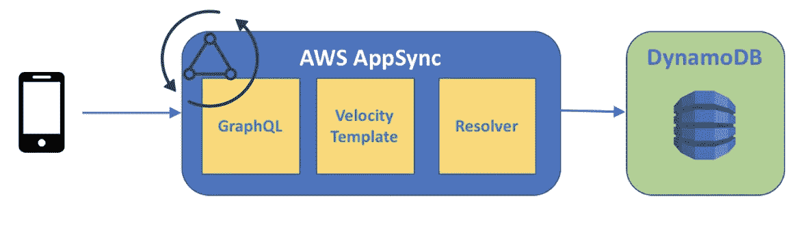

让我们从 AppSync 配置开始。[转到 AWS 控制台](https://aws.amazon.com/console/)。登录或注册[免费层](https://aws.amazon.com/free/)，通过搜索或点击服务找到 AppSync:

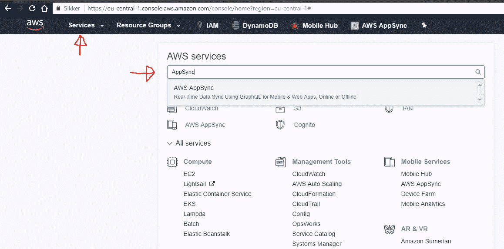

AWS 控制台登录屏幕

您会发现“创建 API”按钮。

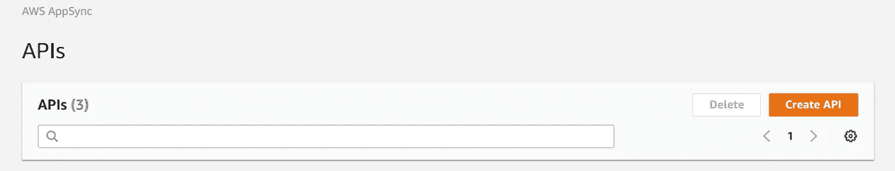

填写 API 名称(如 Recipe GraphQL Server)并创建。

单击 Schema 并删除注释。

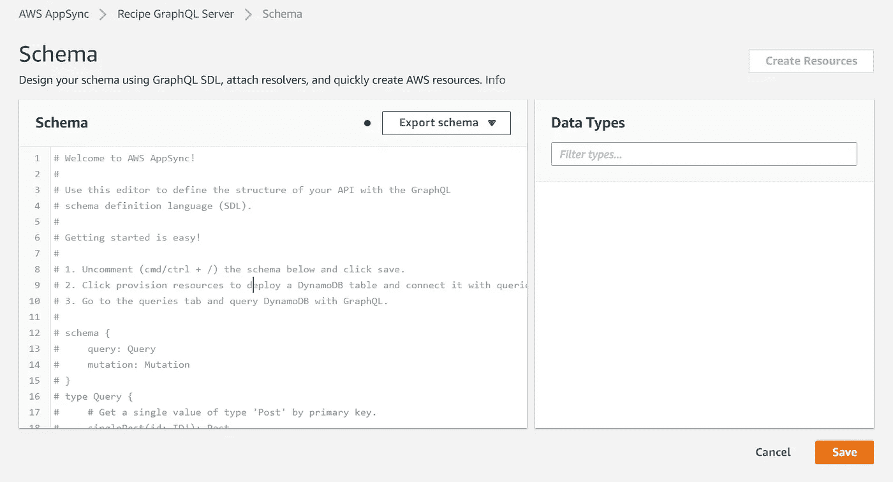

粘贴此代码，然后单击保存。这里我们定义了与我们的应用程序相关的 GraphQL 模式类型。

```
type Query {
 fetchRecipe(id: ID): Recipe
}type Recipe {
 id: ID!
 name: String!
 directions: [String]!
 ingredients: [String]!
}
```

接下来，我们将使用 AppSync 来生成更多代码，并将 DynamoDB 资源连接到我们的 GraphQL 服务器。在“架构”页面上，单击“创建资源”。在这里，您可以选择刚刚定义的类型。

选择配方，保留所有默认值，观察将生成的 GraphQL 代码。AppSync 根据您的类型为您创建整个 CRUD API。保存它，瞧，您现在有了一个与 GraphQL API 服务器通信的文档数据库。

为了测试这一点，您可以使用 AppSync 的查询功能来测试您的 GraphQL 服务器。这里有一些你可以复制进来测试你的 API 的查询。

```
query listRecipes {
  listRecipes {
    items {
      id
      name
      directions
      ingredients
    }
  }
}query fetchRecipe {
   getRecipe(id: "1") {
    id
    name
    ingredients
    directions
  }
}mutation createRecipe {
  createRecipe( input: {
    id:"1",
    name:"Blueberry Oats",
    directions: ["cook oats in milk", "add blueberries"],
    ingredients: ["oats", "milk", "blueberry fresh/yam"]
  }) {id, name, directions, ingredients}
}
```

测试它:


AppSync 查询

现在调用 createRecipe 并输入一些内容后，您可以在 DynamoDB 表“RecipeTable”中看到结果。

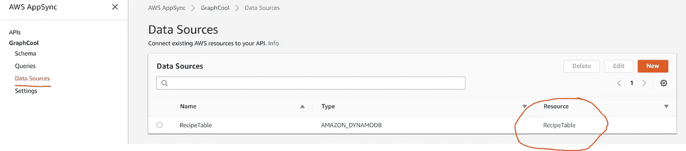

AppSync 数据源

这将把您带到 DynamoDB 表，并向您显示新添加的配方:

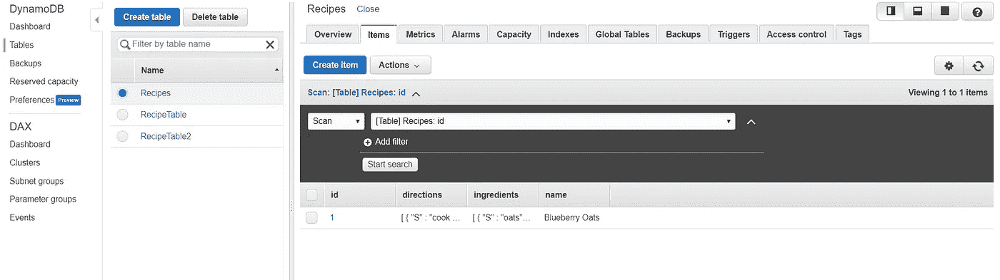

太好了！我们的 GraphQL 服务器 API 已经启动并运行。在我们继续之前，我们需要 AppSync.js 配置文件以便稍后使用。转到 AppSync 项目的根目录，向下滚动并点击:


请稍后保存，我们将使用它来连接客户端应用程序。

> AWS AppSync 有多种授权方法。默认值是每 7 天过期一次的 API 密钥。这是不够的。让我们用 Cognito 用户池实现一石二鸟。

# 2.AWS Amplify + mobilehub 连接

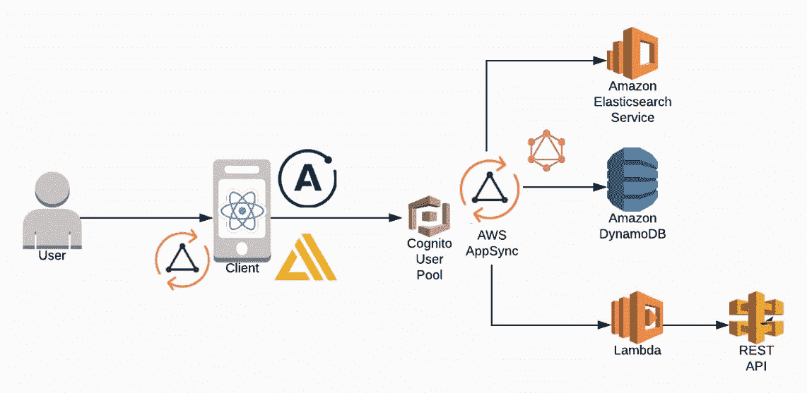

我们的客户使用 Amplify 与 Cognito 通信。它对用户进行身份验证，使他们能够通过一些特定的认知设置与 AppSync 进行通信。然后，客户端应用程序可以使用 AppSync GraphQL 服务器从 DynamoDB 获取数据

在我们开始用 Mobilehub 和 Amplify 设置 Cognito 之前，我们将创建我们的客户端应用程序，以便我们可以随时配置它。

我们使用 create-react-app 并从一开始就下载所有的包。这是你完成这个项目所需物品的完整清单。

```
npx create-react-app recipe-demo && cd recipe-demo/npm i -S aws-appsync aws-appsync-react graphql-tag react-apollo uuid aws-amplify aws-amplify-react
```

既然我们的应用程序已经初始化，我们就可以启动 AWS Mobilehub 了。这纯粹是一个配置工具，让你的生活更轻松。AppSync、Mobilehub 和 Amplify 差不多是同时发布的。

在 AWS 控制台中输入 Mobilehub，然后单击 Create Project。

1.  输入名称(如配方演示)
2.  选择平台，我将向您展示如何在同一个用户池中同时连接 Web 和 React Native。
3.  系统会提示您全局下载 awsmobile-cli。回到你的终端，cd 进入你的项目。请遵循以下步骤:

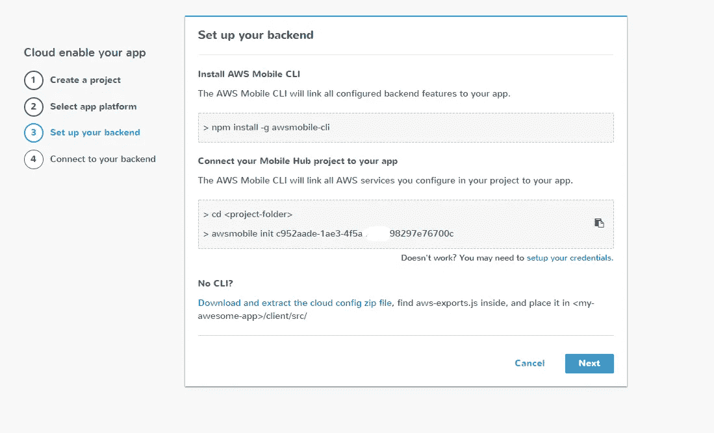

运行 awsmobile init 后，您可能会被重定向到 AWS 控制台以创建新的 IAM 用户。只需遵循这里的默认设置，完成后，记下用户名和密钥。NB！！请妥善保管，否则您将再也看不到秘钥。

> **AWS mobile init 的结果是根文件夹中的“aws-exports.js”文件。这个文件与前面的“AppSync.js”文件一起构成了您与 AWS 服务的连接。请确保现在已经将它们都放入了您的客户端应用程序中。**

**步骤 4** 要求您下载 Amplify，我们在启动客户端应用程序时已经下载了。忽略这个，点击“完成”！

# **3。集成 Cognito 用户池**


mobilehub“中心”,包含一系列项目和所有相关服务

在你的 mobile hub“hub”中，你会看到一个项目列表。当您向下滚动时，您可以添加许多与 npm 包 aws-amplify 相对应的 AWS 服务。

*   发电机数据库:NoSQL 数据库
*   Cognito:用户登录
*   λ:云函数
*   S3:静态文件存储
*   CloudFront:网站托管

对于我们的例子来说，用户登录就足够了。单击它，只添加设置用户名:用户名。所有这些设置都可以在以后更改。

创建用户池，回到 mobilehub 项目，点击 web 项目上的 Integrate。

我们被告知在终端中输入我们的客户端，我们之前在那里启动了 awsmobile。运行 awsmobile pull，您的本地应用程序应该与您的 AWS Mobilehub 项目保持一致。整个 AWS 过程会向您的客户端项目添加一些文件夹。

现在我们已经创建了 Cognito 用户池，您可以返回 AWS AppSync 并在项目设置中连接它:

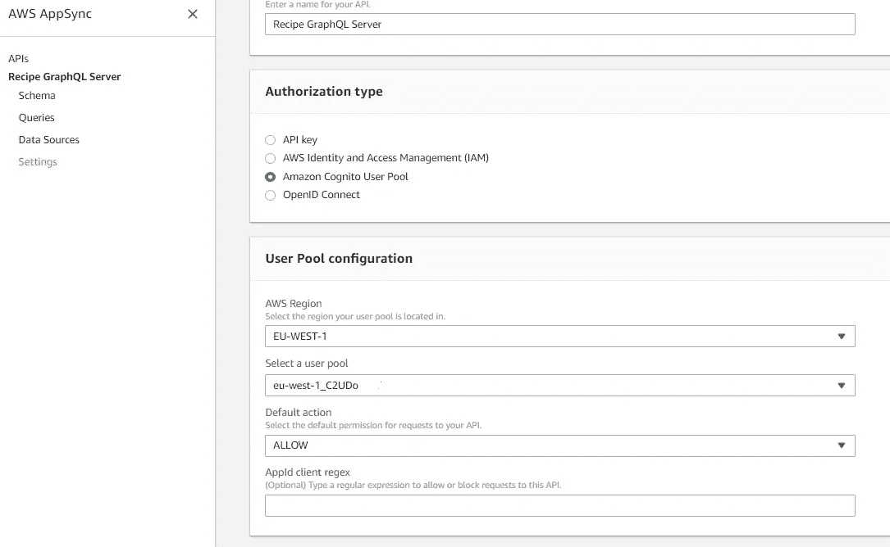

返回 AppSync 并添加您新创建的用户池。现在，这将成为您的 GraphQL 服务器的新认证方法

我们还将修改 AppSync GraphQL 服务器解析器。这是为了确保每个登录的 Cognito 用户只阅读他们自己创作的食谱。转到 AppSync > Schema 并浏览右边的 ListRecipes 列表。点击它的解析器。

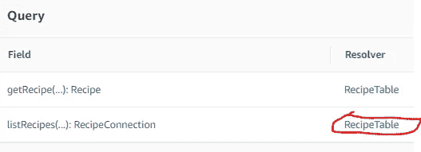

在那里，每次用户调用 ListRecipes 时，我们希望他们只浏览自己创作的食谱。在配置模板对象中，添加“表达式”、“表达式值”和“索引”，使对象看起来像这样:

```
{
  "version": "2017-02-28",
  "operation": "Query",
  **"query": {
   "expression": "author = :author",
    "expressionValues": {
     ":author": {"S": "${ctx.identity.username}" }
    }
  },**
  **"index": "author-index",**
  "limit": $util.defaultIfNull($ctx.args.first, 20),
  "nextToken": $util.toJson($util.defaultIfNullOrEmpty($ctx.args.after, null)),
}
```

现在我们的应用程序将在资源(DynamoDB)中寻找正确的作者。但是作者字段是怎么加进去的呢？我们必须为 CreateRecipe 的解析器做同样的事情。回到模式并找到它:

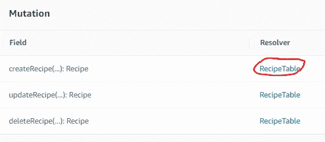

在这个解析器中，我们将添加用户名作为作者(参见第二个#set 行)。用突出显示的文本修改代码:

```
**#set($attribs = $util.dynamodb.toMapValues($ctx.args.input))
#set($attribs.author = $util.dynamodb.toDynamoDB($ctx.identity.username))**{
  "version": "2017-02-28",
  "operation": "PutItem",
  "key": {
    "id": $util.dynamodb.toDynamoDBJson($ctx.args.input.id),
  },
 **"attributeValues": $util.toJson($attribs),**  "condition": {
    "expression": "attribute_not_exists(#id)",
    "expressionNames": {
      "#id": "id",
    },
  },
}
```

太好了！现在，我们的用户将只能阅读他们自己创建的食谱:

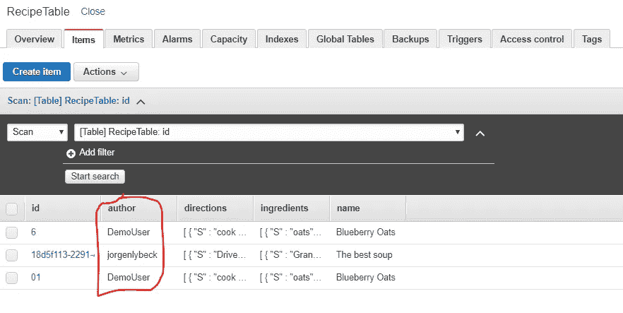

用户需要登录到客户端，只能看到他们的食谱

现在是我们动手编写代码的时候了。转到您的项目 index.js 文件，按照我在这里使用的设置进行操作。确保您的配置文件相对于 index.js 文件是正确的。

这段代码做了很多事情。

1.  ApolloProvider 让你在代码中使用 Apollo-Client。我们传递一个客户机作为 props，它是用 AppSync 特定数据和 Amplify Cognito 认证方法设置的。
2.  恢复后的容器允许 AppSync 进一步处理您的代码。
3.  AppWithAuth 是带有*AWS-amplify-react*HOC*with authenticator()*的应用程序，它为您的登录屏幕提供了一个预制的 GUI。
4.  amplify . configure(AWS-exports . js)将您的客户端与 AWS mobilehub 连接起来。再往下，我们就可以轻松使用所有的 mobilehub 服务了！这里有一个来自[Amplify docs](https://aws.github.io/aws-amplify/media/authentication_guide)的例子:

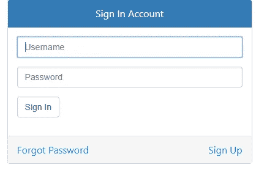

web 的 AWS GUI 登录屏幕，需要 2 行代码

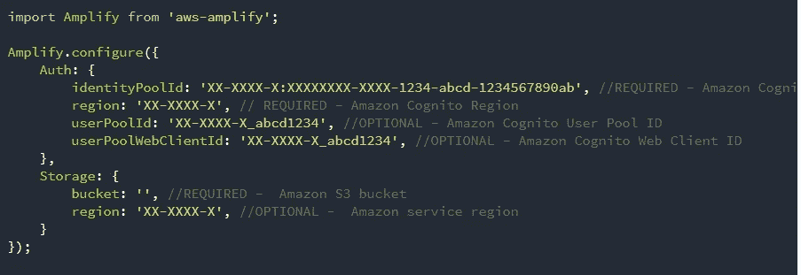

从他们的文档中放大进一步的配置

我们在 index.js 文件中设置这一切的原因是它们主要是特设的、容器和配置。它们将被设置一次。对于项目的最后一部分，我们将创建客户机，并将其与 Apollo-Client 连接起来。

# 4.创建客户端


React、GraphQL 和 Apollo 客户端

一切都归结于此。我们的客户代码时间到了。在终端中转到您的项目，创建两个文件夹 components 和 graphql。然后在 graphql 中，创建 4 个文件夹:突变、查询、订阅和解析器:

```
> cd src && mkdir components graphql> cd graphql && mkdir mutations queries subscriptions resolvers
```

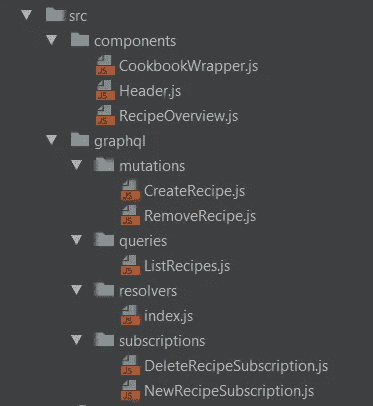

# 阿波罗+ GraphQL

在突变、查询和订阅文件夹中，我们保留了所有的 GraphQL API 函数，就像我们在 AppSync 查询选项卡中创建的一样。在解析器中，我们目前有一个 index.js 来保存我们所有的 Apollo 客户端解析器。它导入我们所有的 GraphQL。解析器是我们导入 App.js 并组合它们的函数，如下所示:

```
**import** React, { Component } **from** 'react';
**import** { compose } **from** 'react-apollo';
**import** * **as** resolver **from** './graphql/resolvers/index';**class** App **extends** Component { ... }**export default** compose(resolver.listRecipeGQLAction, resolver.createRecipeGQLAction, resolver.deleteRecipeAction)(App);
```

以下解析器包含我们应用程序的所有 Apollo 客户端逻辑。这是一份很重的文件，有很多事情要处理。Apollo 团队已经声明这不是一个非常友好的开发者体验，将来会被简化。要获得对实现的解释，请查看我在开始时链接的由 Nader Dabit 制作的视频。我通过添加 DeleteRecipe 和 DeleteRecipeSubscription 对他的代码做了一些修改。

我们在解析器中看到，它们在每个函数中都返回 props。因为我们在我们的 App.js 中对它们进行了合成，所以这些道具会自动映射到我们的 App.js 中，并且可以传递下去。我们的 Recipe 应用程序 App.js 的内容如下所示:

我们的 State 和 onChange、addDirection 和 addIngredient 函数管理当前添加的配方。

在 componentDidMount()中，我们设置了订阅流，这是与我们的数据库的实时连接！这确保了我们的客户随时得到更新。

addRecipe 函数调用我们的 props.onAdd()，它是在 Apollo Resolver createripegqlaction 中创建的。

我们的渲染组件被视为任何普通的 React 组件，并传递了属性。请在这里查看这些 github URL，因为它们大多是标准的 React 代码:

*   [Header.js](https://github.com/Jeyloh/recipe-web-appsync/blob/master/src/components/Header.js)
*   [CookbookWrapper.js](https://github.com/Jeyloh/recipe-web-appsync/blob/master/src/components/CookbookWrapper.js)
*   [RecipeOverview.js](https://github.com/Jeyloh/recipe-web-appsync/blob/master/src/components/RecipeOverview.js)

这里唯一的例外是在 Header.js 中，我用 aws-amplify 创建了一个注销函数:

# 额外好处

*   Apollo-Client 提供了出色的缓存和离线支持。有了这个应用程序，我可以关闭互联网，添加一个食谱，刷新错误信息，去厕所，返回返回互联网和刷新，食谱将在我的数据库中刷新。
*   如上所述，我能够在这里完成所有步骤，使用 create-react-native-app 并复制 GraphQL 文件夹，设置一些 RN 组件并获得我的食谱列表，如果我直接在 DynamoDB 或 web 客户端中删除，该列表会实时更新。

# **最终结果**

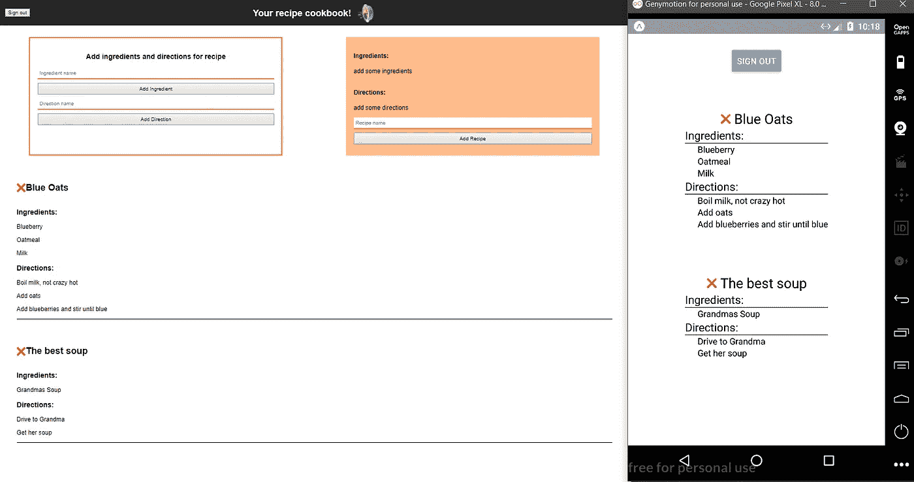

与 Webapp 并行运行的 React 原生 app 截图，在 Add 上实时更新！

# **结论**

这个项目真正有趣的是，我遵循了[纳德](https://medium.com/u/695782484bda?source=post_page-----21dfae586d51--------------------------------)的指南，除了几次会议之外，我没有任何 GraphQL 的经验，只有一些 AWS 的经验。这样做之后，我可以通过 youtube 和学习来完全提升我的技能。两周后，我在一个大约 50 名前端开发人员的会议上展示了这个，这相当不错。

我前阵子已经在 AWS 上卖了。现在我非常喜欢 Apollo 的 GraphQL，我得到了所有的宣传。

如果你还在，非常感谢你的阅读！！这是我在 Medium 上呆了几年后的第一篇技术文章，从社区中学到了很多。如果您有任何问题或有任何遗漏——评论或尽快联系我，我们会聊天！

干杯，乔根利贝克