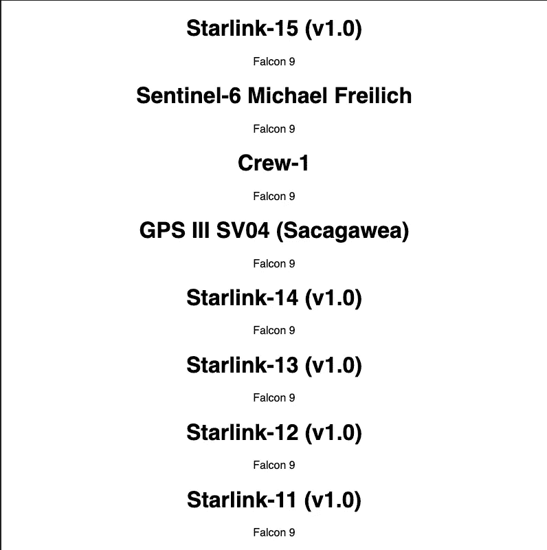

# 用 React 悬念和钩子简化了 GraphQL

> 原文：<https://itnext.io/graphql-made-simple-with-react-suspense-and-hooks-46e16d3f03bb?source=collection_archive---------4----------------------->

虽然仍然被认为是实验性的，React 悬念当然值得一试，即使是较小的个人项目。

悬念有助于以声明的方式控制组件的生命周期，并防止出现竞争情况。

使用暂挂和钩子，我们可以编写干净的功能性代码来管理状态，并在获取 GraphQL 数据时处理错误。

# 反应暂停概述

暂停的一个主要用例是在异步操作期间管理应用程序状态。有了悬念，您可以避免编写烦人的命令式代码，如条件呈现，以及组件内部的 try/catch 语句。

另一个众所周知的用例是[代码分解](https://developer.mozilla.org/en-US/docs/Glossary/Code_splitting)，但是我们不会在这篇文章中讨论它。

在一个典型的现代 UI 中，获取数据时有大量的事情要处理。您必须切换加载器，防止竞争情况，并保持事件的正确顺序。悬念让一切变得无比简单。以下是您通常使用 React 悬念的方式:

你可能已经注意到的一件有趣的事情是，我们在应用程序加载时创建了一个`initialResource`对象。那么这个资源到底是什么呢？让我们简单介绍一下资源，它们非常重要。

资源是暂记异步数据的来源。本质上，资源只是一个拥有`read`方法的对象。React Suspense 将根据内部工作需要调用该方法。

那么悬念到底对我们有什么作用呢？

注意我们如何调用`resource.user.read()`而没有任何安全检查。获取用户信息是一个异步过程，但我们同步使用资源，因为我们知道悬念将负责获取和检查数据。我们需要做的就是用一个`fallback`组件提供悬念。

这种方法通过消除对安全检查和条件呈现的需要以及防止竞争情况，使我们的应用程序更干净、更健壮。

# 使用 GraphQL 的悬念

我们将构建一个简单的应用程序，使用它们的公共 [GraphQL 端点](https://api.spacex.land/graphql/)显示 SpaceX 火箭发射。

我们将使用 [Apollo 客户端](https://www.apollographql.com/docs/react/)，因为根据我的经验，它更容易使用。但是您可以使用任何其他 GraphQL 客户端做同样的事情。

## 添加 apollo 客户端

首先，让我们设置我们的 Apollo 客户机，我们将使用它来发送查询。

## 添加 graphql 查询

现在我们将添加获取启动的查询。为了遵循良好的实践，我们将它存储在一个单独的文件中:

## 工厂功能

这就是悬念发挥作用的地方。让我们创建一个接受 GraphQL 查询并返回资源的工厂函数:

我们的工厂函数跟踪异步请求的状态和服务器响应。我们还有一个存储 GraphQL 查询承诺的`suspender`。当我们从服务器得到反馈时，我们更新`status`和`result`变量。

所以工厂函数返回一个资源，正如我提到的，资源只是一个带有`read`方法的对象。`read`方法执行以下操作:

*   如果状态是 pending，`read`抛出`suspender`承诺，该 Suspense 将捕获并显示`fallback`组件。
*   如果状态为`completed`，则`read`返回结果。
*   如果状态为`error`，则‘读取`throws the`结果’,在这种情况下，这是一个错误实例。信不信由你，那是最复杂的部分。

## 使用 API 挂钩

严格来说，我们可以直接使用`wrapGraphql`而不用把它打包成一个钩子。但是自定义钩子是一个很好的抽象，如果我们决定以后添加东西，比如在发送请求之前检查会话状态或权限，它会很方便。

`useAPI`的代码很简单。钩子接受一个查询并使用`wrapGraphql`工厂函数返回一个新的资源。

最后，我们将如何使用它:

# 结论

顺便提一下:我们对 GraphQL 客户端使用了 Apollo，然而，另一个可以考虑的选择是 [Relay](https://relay.dev/docs/) 。接力与反应悬念紧密结合，可能是你更好的选择。也就是说，它也更固执己见，我发现阿波罗更容易使用。

这个帖子到此为止。我们对 GraphQL 使用了 React Suspense，但是您当然可以对它进行修改，使其适用于任何其他异步源代码。除了处理异步操作，悬念还有更多应用。开始学习的最好地方是官方悬念[概述](https://reactjs.org/docs/concurrent-mode-suspense.html)文档。

这里有这个教程的[代码沙箱](https://codesandbox.io/s/suspense-hooks-graphql-mx0od)的链接。

*原载于 2021 年 6 月 2 日*[*【https://isamatov.com】*](https://isamatov.com/react-suspense-graphql-hooks/)*。*