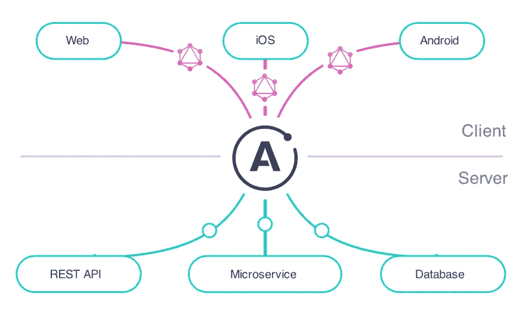
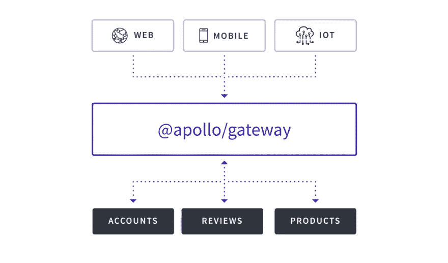

# 阿波罗的 GraphQL(微服务)架构

> 原文：<https://itnext.io/graphql-microservices-architecture-by-apollo-8b6eb557c5e2?source=collection_archive---------3----------------------->


# 为什么使用 GraphQL 而不使用 REST

如果从客户端(前端)的角度来看，REST API 在获取数据时会面临一些挑战。

# 休息挑战

多年来，我们一直在使用 REST API，因为它们比从服务器获取数据并与 HTML 同时呈现更方便，这导致了不断地重新加载应用程序的页面。

但是 REST 有很多优点，也有一些缺点。

1.  执行 REST 调用会给客户端提供比所需更多的数据，因此需要下载更多的数据
2.  REST 端点的数据结构在前端应用程序中是不可预测的
3.  在向用户显示屏幕之前，调用多个端点来合并数据

# GraphQL 来拯救

> *GraphQL 是一种用于 API 的查询语言，也是一种服务器端运行时，通过使用您为数据定义的类型系统来执行查询*

在我们严重依赖 REST API 的时候，我们学到了很多可以做得更好的东西。

使用 GraphQL，我们在客户机中描述我们想要哪些数据，而不仅仅是询问所有的数据。

**GraphQL 查询**

```
{
      me {
        name
      }
    }
```

**JSON 结果**

```
{
      "me": {
        "name": "Luke Skywalker"
      }
    }
```

在后端或 API 网关中，我们已经定义了将形成我们的模式的类型。这些模式可以在前端使用，使数据高度可预测。

**类型**

```
type Query {
      me: User
    } type User {
      id: ID
      name: String
    }
```

**每个字段类型的功能**

```
function Query_me(request) {
      return request.auth.user;
    } function User_name(user) {
      return user.getName();
    }
```

# GraphQL 解决了哪些问题

1.  只将数据返回给客户机，这是客户机所要求的
2.  只有一个从多个数据源获取数据的请求。
3.  不再需要检查您需要从哪个端点获取数据。
4.  需要下载的数据更少
5.  架构在前端应用程序中使用，用于为前端生成数据类型(Typescript)
6.  数据结构变得更加可预测

这是我们可以用 GraphQL 解决的一些挑战🙌

# Apollo 默认的对话方式 GraphQL

您可以在没有库的情况下使用 GraphQL，但大多数组织将使用库来完成繁重的工作，并使开发人员更容易使用 GraphQL

其中最大的或者可能是最大的是[阿波罗](https://www.apollographql.com/)。Apollo 有一个[客户端库](https://www.apollographql.com/docs/react/#community-integrations)用于许多 JavaScript (TypeScript)库和框架。接下来是 Apollo 服务器，这是一个在 NodeJS 中构建 API(网关)的工具。接下来，他们构建了 Apollo Federation 来更容易地处理多个团队的单个图。

如果你在谷歌上搜索几次，你很快就会发现 Apollo 几乎是 GraphQL 的默认使用方式，所以这就是我选择深入研究它的原因。

# 阿波罗客户端

Apollo 客户端是一个帮助你在前端使用 GraphQL 的工具。它有助于将查询作为 UI 组件的一部分来编写，并允许您以声明性的方式编写查询。

除了查询之外，它还有助于状态管理，这在大型应用程序中非常有用。

Apollo 客户端集成了多个 JavaScript 库和框架。React，React Native，Vue，Angular 和 Web 组件。对于 iOS 和 Android，也有可能使用 Apollo 客户端。

Apollo 客户机可以与任何 GraphQL 服务器一起工作，因此它不必是 Apollo 服务器，它只需理解 GraphQL。

# 阿波罗服务器(API 网关)



要让一个端点理解您的 GraphQL 查询，您需要一个 API 网关或一个可以处理 GraphQL 的服务。

Apollo 附带了 Apollo 服务器包，供您自己构建。您可以使用它作为您的主要 API 来直接与您的数据库对话，或者它可以作为 API 网关。

API 网关是我觉得有趣的地方。如果你有一些基于 REST 的(微)服务，你可以让它们保持原样。只需启动 Apollo 服务器，让它与您所有的 REST 服务对话。

使用 Apollo 服务器作为网关，您可以组合多个数据源。服务器在返回请求的数据之前处理所有不同的请求。当所有数据都被解析后，Apollo 服务器将数据发送回客户机。

通过这个 API 网关，任何服务都不需要理解 GraphQL。积极的一面是，当将来有比 GraphQL 更好的技术时，我们只需交换 API 网关和 Apollo 客户端，并构建一个新的网关。

甚至阿波罗也在推荐使用[阿波罗服务器作为网关](https://principledgraphql.com/operations#10-separate-the-graphql-layer-from-the-service-layer)。

# GraphQL 本地微服务

根据组织和架构的需要，创建 GraphQL(微)服务也是非常合适的。

根据您使用的语言，有几个库可以帮助您构建它们。

*   NodeJS: [Apollo Server](https://www.apollographql.com/docs/apollo-server/) ， [GraphQL.js](https://graphql.org/graphql-js/) ， [express-graphql](https://graphql.org/graphql-js/running-an-express-graphql-server/)
*   Python: [石墨烯 Python](https://graphene-python.org/)
*   PHP: [GraphQL-php](https://github.com/webonyx/graphql-php) ， [GraphQL-relay-php](https://github.com/ivome/graphql-relay-php) ， [Railt](https://github.com/railt/railt) ， [Lighthouse](https://github.com/nuwave/lighthouse) ， [GraphQLBundle (Symfony)](https://github.com/overblog/GraphQLBundle)
*   Java: [GraphQL-java](https://github.com/graphql-java/graphql-java)
*   Go: [Graphql-go](https://github.com/graphql-go/graphql)
*   。Net: [GraphQL-dotnet](https://github.com/graphql-dotnet/graphql-dotnet) ， [GraphQL-net](https://github.com/ckimes89/graphql-net) ，[热巧克力](https://hotchocolate.io/)
*   。Net Core: [实体 GraphQL](https://github.com/lukemurray/EntityGraphQL) ， [DotNetGraphQLQueryGen](https://github.com/lukemurray/DotNetGraphQLQueryGen) ，[热巧克力](https://hotchocolate.io/)
*   科特林: [GraphQL 科特林](https://expediagroup.github.io/graphql-kotlin/docs/getting-started.html)
*   斯威夫特:[图形](https://github.com/GraphQLSwift/Graphiti)
*   Ruby: [GraphQL-ruby](https://github.com/rmosolgo/graphql-ruby)

你可以在 GrapQL.org 找到一个更大的列表。

# 微服务世界中的 GraphQL 后端

出于多种原因，越来越多的公司选择微服务架构用于其应用。它在可伸缩性方面非常有效，但也带来了一些挑战。

但是如果要在微服务架构中使用 GraphQL 呢？Apollo 为“ [Apollo Federation](https://www.apollographql.com/docs/apollo-server/federation/introduction/) ”提供了一个解决方案，它可以与比 JavaScript 更多的语言一起工作👍

## GraphQL 和微服务面临的挑战

有了 GraphQL，您只需要让 [1 个图形](https://principledgraphql.com/integrity#1-one-graph)有一个端点，客户端可以调用该端点来获取数据。但是与多人甚至多个团队一起工作，在同一个 Graph 存储库中工作可能会非常困难。我预见到大量的合并冲突将会遍布各地。

## 如何让一个图表分布在多个团队中

好吧，我们可以将我们的图划分到多个域中，这些域最终将合并到一个图中，即所谓的[联邦实现](https://principledgraphql.com/integrity#2-federated-implementation)。

阿波罗联盟提出了这个解决方案。

## 阿波罗联邦核心概念

例如，我们想象中的应用程序有两个微服务。

*   帐户微服务
*   查看微服务

有了这些服务，我们有 2 种类型的数据`User`和`Review`。但是他们需要共享部分数据，即使它们是两个独立的服务。

## 类型引用

有了 Apollo federation，我们可以引用不同模式中的类型。

```
type User @key(fields: "id") {
   id: ID!
   username: String
}
```

通过`@key`指令，我们将`User`类型转换为实体。这表明您可以在其他模式中共享这个实体。

在评论模式中，我们希望通过参考`User`实体来显示评论的作者是谁。

```
type Review {
   author: User
}
```

如果客户想得到评论，GraphQL 查询将如下所示。

```
query GetReviews {
  reviews {
    author {
      username
    }
  }
}
```

有了类型引用，我们可以将所有的模式彼此分开，但仍然在我们需要的地方共享它们。

## 类型扩展

如果您想扩展在不同服务中定义的类型以在其中添加新字段，那么您可以通过`extend`来完成。

例如，我们想将 accounts 服务中定义的`User`扩展到 review services，并添加新的字段，我们可以通过这样定义来实现。

```
extend type User @key(fields: "id") {
   id: ID! @external
   reviews: [Review]
}
```

通过这种方式，客户可以通过这样的查询请求用户的评论。

```
query GetReviewsByUser($userId: String!) {
  user(id: $userId) {
    reviews(first: 10) {
        edges {
        node {
          id
          text
        }
      }
    }
  }
}
```

# 阿波罗联邦建筑公司



为了实现阿波罗联盟，我们需要两个组件。

*   一个**网关**来展示完整的图形并执行联邦查询
*   **联邦服务**，它们是独立的 GraphQL APIs，可以通过扩展类型和创建引用来连接它们的数据。

使用阿波罗服务器作为联盟将很快发生。只需在您的 Apollo Server 应用程序中包含`@apollo/gateway`，并定义一个所有联合服务所在的服务列表。

最棒的是，这为多个团队开发图形提供了高度的灵活性，但是 GraphQL 客户端将只看到一个模式。

# 谢谢

谢谢你一直读到这里🙌。我希望它给了你一些通过 [Apollo](https://medium.com/u/9360eb7d79eb?source=post_page-----8b6eb557c5e2--------------------------------) 使用 GraphQL 的新知识。

# 阅读更多

[](https://betterprogramming.pub/7-web-development-guidelines-to-speed-up-page-loading-e8f0e13a53b) [## 加速页面加载的 7 个 Web 开发指南

### 为了你的访问者的爱，改善用户体验

better 编程. pub](https://betterprogramming.pub/7-web-development-guidelines-to-speed-up-page-loading-e8f0e13a53b) [](https://medium.com/dev-together/use-cli-tools-from-mac-linux-on-windows-subsystem-for-linux-37d16f012489) [## 在适用于 Linux 的 Windows 子系统上使用 Mac/Linux 中的 CLI 工具

### WSL2 如此强大，使得从 Mac 到 wsl 2 的转换轻而易举。

medium.com](https://medium.com/dev-together/use-cli-tools-from-mac-linux-on-windows-subsystem-for-linux-37d16f012489) [](https://medium.com/dev-together/3-todos-before-applying-for-a-junior-developer-job-26fc0d8ba2b9) [## 申请初级开发人员工作前的 3 件事

### 我见过很多初级开发人员的求职申请。大多数申请都是出于好意…

medium.com](https://medium.com/dev-together/3-todos-before-applying-for-a-junior-developer-job-26fc0d8ba2b9) [](https://medium.com/better-programming/why-tutorials-wont-make-you-a-professional-developer-271108c74ddb) [## 为什么教程不能让你成为专业的开发者

### 精通不仅仅来自于做教程。尝试，失败，学习，重复！

medium.com](https://medium.com/better-programming/why-tutorials-wont-make-you-a-professional-developer-271108c74ddb) [](https://medium.com/better-programming/tips-to-create-developer-tutorials-62cb3a25b8e5) [## 创建开发人员教程的技巧

### 想写更多的教程，但你不知道从哪里开始？从这里开始

medium.com](https://medium.com/better-programming/tips-to-create-developer-tutorials-62cb3a25b8e5)