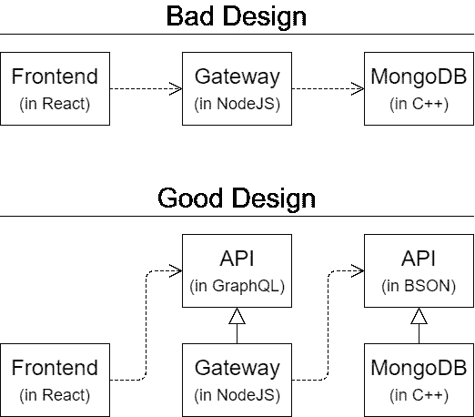

# graph QL+mongose:设计优先的方法

> 原文：<https://itnext.io/graphql-mongoose-a-design-first-approach-d97b7f0c869?source=collection_archive---------0----------------------->

[点击这里在 LinkedIn 上分享这篇文章](https://www.linkedin.com/cws/share?url=https%3A%2F%2Fitnext.io%2Fgraphql-mongoose-a-design-first-approach-d97b7f0c869)

为什么我们应该以及如何优雅地将 GraphQL 模式从解析器中分离出来。

# TL；速度三角形定位法(dead reckoning)

1.  在`docs/api.graphql`中设计你的 GraphQL 模式；
2.  在`server/models/users.js`中设计你的 Mongoose 模式；
3.  **使用`server/app/graphql/projection.js`中的**T2 将它们连接在一起；
4.  把你的商业逻辑写在`server/app/graphql/users.js`；
5.  设置猫鼬、阿波罗和快车；那就好好享受吧！

> 注意:本指南假设您应该对 MongoDB 有所了解，并且熟悉[建模关系](https://docs.mongodb.com/manual/applications/data-models-relationships/)。

# 好的设计

一个设计良好的后端服务应该具备哪些素质？
[依存倒置原则](https://en.wikipedia.org/wiki/Dependency_inversion_principle)表明:

> A.高层模块不应该依赖低层模块。两者都应该依赖于抽象。
> 
> B.抽象不应该依赖于细节。细节应该依赖于抽象。

所以现在我们不难区分好的和坏的设计:

# 将 GraphQL 模式与实现分开

一种常见但不明智的做法是大量使用`graphql-js`的构造函数，如`GraphQLObjectType`、`GraphQLSchema`、`GraphQLString`或其他。然而，这是一个糟糕的设计，因为 GraphQL API 没有与 JavaScript 实现分离。换句话说，如果前端开发人员想要查看后端 API，他/她必须进入用后端 JavaScript(或者更糟，Python 或 Ruby 或与前端 JavaScript 完全不同的东西)编写的网关源代码。

看看下面哪个对前端开发人员来说更抽象、更友好。

## 救生员:[makexecutableschema](https://www.apollographql.com/docs/graphql-tools/generate-schema.html)

谢天谢地，包`graphql-tools`提供了一个叫`makeExecutableSchema`的很棒的函数。在继续之前，您可能希望看一下[的 API](http://graphql-tools) 。

下面的代码片段是如何将它用于单独的 GraphQL 模式文件的示例。你可以把`fs.readFileSync`换成`fs.readFile`来加速启动。

现在一切都变得简单了，因为我们使用正确的工具来完成正确的任务——schema 是用 GraphQL 编写的，而 DB 调用是由 JavaScript 处理的。此外，前端开发人员可以简单地参考`api.graphql`，轻松获得他们想要的东西。他们不应该也不能进入后端-JavaScript！

# 设计您的 Mongoose 模式

请记住，您的 Mongoose 模式不一定与您的 GraphQL 模式完全匹配，尤其是在一对多关系的建模上。在 GraphQL 中，我们写道:

但是在猫鼬身上，我们有两种选择:

两者各有利弊，用哪个由你决定。你也可以参考[这个堆栈溢出答案](https://stackoverflow.com/a/5373969)了解更多细节。当然，我会在下面的文章中讨论这两个问题！

# 轻松连接 GraphQL 和 Mongoose

所以我们已经有了`makeExecutableSchema`。但这还不够:

1.  客户端可能只需要部分字段，但是`User.findById(id)`会从 MongoDB 中检索所有字段。最好使用`User.findById(id, projection)`，其中`projection`应该是动态计算的。这个过程叫做**投影**。
2.  GraphQL 模式字段名称可能与 Mongoose 模式字段名称不匹配，因此默认的 GraphQL 解析器功能不正常。你需要添加你自己的**解析器**(别担心，有自动工具可以完成)。
3.  对于那些使用引用模式的人来说，一个单独的`User.findById`调用可能不足以检索客户机需要的所有信息。两个选项都必须做:a .猫鼬的**填充**；b. MongoDB 的 **$lookup** 。前者产生更干净的代码，而后者带来更好的性能。

许多软件包已经被开发出来解决第一个问题，但是很少有人解决第二个或者第三个问题。所以我开发了`[graphql-advanced-projection](https://github.com/b1f6c1c4/graphql-advanced-projection)`，使得**自动创建投影和解析器**。只需稍加修改，它也可以用于填充。

> 注意:`graphql-advanced-projection@1.0`还不支持自动聚合和$lookup。我正在做这个，以后会支持的。

完美。并且仍然有足够的空间供您添加自定义逻辑。如果你想要更多的例子，请查看这个。`gqlProjection`的完整 API 文档可从[这里](https://github.com/b1f6c1c4/graphql-advanced-projection/wiki/API)获得。

# 设置猫鼬，阿波罗，快递等。

由于这类问题的文章太多，这里只列出一些链接。

*   要设置 Mongoose，请参考[其官方文档](http://mongoosejs.com/docs/index.html)。
*   要设置 Apollo 服务器，请参考[其官方文档](https://www.apollographql.com/docs/apollo-server/)。
*   要设置 Express，请参考[其官方文件](https://expressjs.com/)。
*   要进行集成测试，可以尝试`[jest-mongoose](https://github.com/b1f6c1c4/jest-mongoose)`。

# 包扎

在本文中，我首先声称 GraphQL 模式(类型定义)应该从解析器中分离出来，以实现依赖倒置原则。然后我演示了如何利用`graphql-tools`来连接 GraphQL 模式和 Mongoose。最后，我提出了`[graphql-advanced-projection](https://github.com/b1f6c1c4/graphql-advanced-projection)`，它解决了连接过程中的三个主要问题:投影、解析器创建和填充。

如果你对`[graphql-advanced-projection](https://github.com/b1f6c1c4/graphql-advanced-projection)`有任何问题，请随时提出。我会尽力改进它。