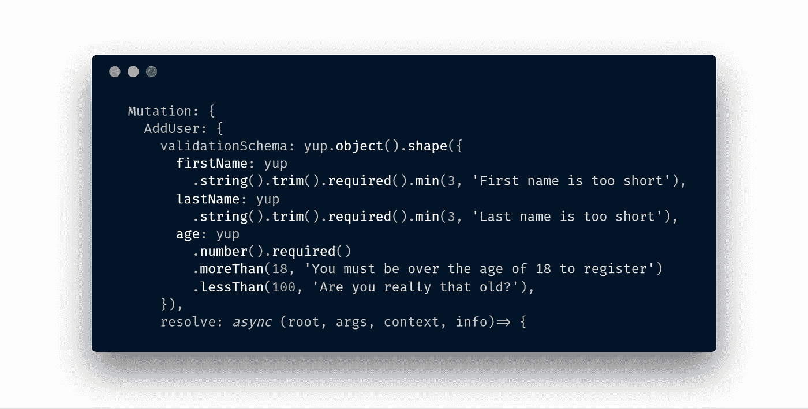
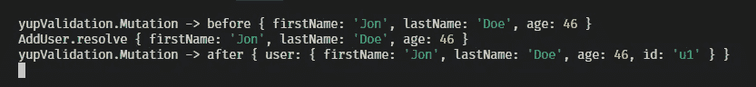
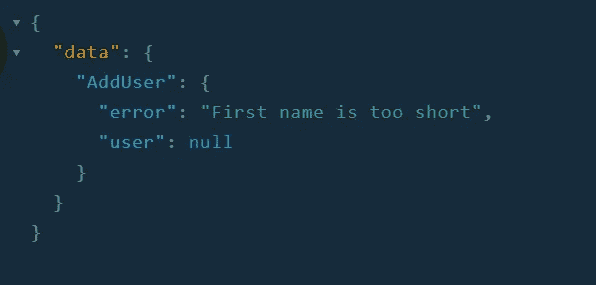

# 使用 GraphQL 中间件使用 Yup 进行 graphql 变异参数验证

> 原文：<https://itnext.io/graphql-mutation-arguments-validation-with-yup-using-graphql-middleware-645822fb748?source=collection_archive---------1----------------------->



> 这个故事被移到:[https://jonathancardoso . com/en/blog/graph QL-mutation-arguments-validation-with-yup-using-graph QL-middleware/](https://jonathancardoso.com/en/blog/graphql-mutation-arguments-validation-with-yup-using-graphql-middleware/)

最近我发现了 Prisma 开发的名为`[graphql-middleware](https://github.com/prisma/graphql-middleware)`的令人敬畏的库，它允许在调用 GraphQL 解析器之前/之后运行任意代码。

在这篇文章中，我将展示如何使用[yes](https://github.com/jquense/yup)创建一个中间件来验证任何 GraphQL 变体的输入参数。

## 初始代码

对于这个例子，我们将创建一个简单的`graphql-yoga`服务器，初始代码如下:

## 步骤 1:添加中间件

让我们把我们的中间件命名为`yupValidation`:

根据文档，中间件可以是一个对象，其键与它们应该执行的类型/字段相匹配。在我们的例子中，我们说我们想要在每一个突变上运行我们的中间件。

将其添加到`GraphQLServer`实例中:

```
const server = new GraphQLServer({
  typeDefs,
  resolvers,
  middlewares: [yupMutationMiddleware()],
});
```

它目前没有做任何有趣的事情，我们只是调用变异解析器并返回它。但是看到那些`console.log`了吗？他们可以向我们展示一些有趣的东西，如果我们现在向这个端点提交一个突变，让我们这样做，将这个突变发送到端点(您可以使用在与服务器相同的端口自动运行的 playground):

控制台中将记录以下内容:



这里的顺序很重要，您的中间件在调用字段`resolve`的之前执行**，您可以在您的中间件函数中随时调用`resolve`函数。**

## 步骤 2:添加验证模式

让我们改变定义`AddUser`变异的方式，而不是直接放置 resolve，让我们使用一个对象。在该对象中，我们还要声明一个`validationSchema`属性，它将告诉我们如何验证变异的参数，这将是一个 Yup 模式:

不要忘记从文件顶部的“是”开始导入*

## 第三步。实现中间件

太好了！我们已经做好了一切准备，现在我们需要让它真正发挥作用。😅

基本思想是确定被调用的变异是否是用一个`validationSchema`属性定义的，如果是，用它来验证`args`，如果发现任何错误，就返回错误。

> 但是，等等，我该如何在中间件中获得这个`validationSchema`属性呢？！？

我们将使用明显被遗忘但仍然重要的`info`属性。如果你从未使用过它或者不知道它是什么，Prisma 有一个很棒的帖子[揭开了 info 参数](https://www.prisma.io/blog/graphql-server-basics-demystifying-the-info-argument-in-graphql-resolvers-6f26249f613a/)的神秘面纱。

总体思路是使用 graphql-js 的一个隐藏特性，即如果您在 graphql 模式的类型定义上传递额外的属性，它们将在解析器的`info`参数上可用。

> **我个人认为，这是非常安全的使用。**

下面的代码将像定义并传递给 graphql-js 一样检索突变字段:

```
const mutationField = info.schema.getMutationType().getFields()[info.fieldName];
```

`info.schema.getMutationType()`是不言自明的，它返回根类型`Mutation`，然后我们用他们的`getFields()`方法来检索他们所有的字段，基本上就是一个散列，里面有所有定义的突变，每个突变名称都是关键字。

`info.fieldName`具有当前字段解析器的名称，因为我们的中间件将只针对突变运行，所以我们可以 100%确定之前调用的`getFields()`将具有带有那个`fieldName`的键。

现在一切都很简单了，我们只需要验证是否有一个`validationSchema`，如果有，根据它验证`args`。如果发现任何错误，我们将返回 yup 的验证消息作为变异调用结果中的错误字段，而不是调用变异`resolve`。

> 说多了，给我看看代码。

这是这样的:

简单吧？现在，如果你用一个不符合你声明的有效性的`firstName`来调用突变:



万一您想要开箱即用的东西，我已经用这个中间件创建了一个包，但是经过一些改进和测试，请检查一下:

[](https://github.com/JCMais/graphql-yup-middleware) [## jcm ais/graph QL-yup-中间件

### 使用 yup 为您的突变参数添加验证！-jcm ais/graph QL-是的-中间件

github.com](https://github.com/JCMais/graphql-yup-middleware) 

GraphQL 本身就非常强大，添加中间件会让它更加强大。您可以创建简单的验证中间件，比如上面的那个，也可以创建最复杂的验证中间件，比如授权/认证检查，并让您的变体接收已经从数据库中获取的对象作为参数，而不仅仅是 ID！

让我知道你要用这个创造什么！

你也可以在推特上找到我:@_jonathancardos

[](https://twitter.com/_jonathancardos) [## 乔纳森·卡多佐(@_jonathancardos) |推特

### 乔纳森·卡多佐的最新推文(@_jonathancardos)。全栈开发人员，大部分时间使用…

twitter.com](https://twitter.com/_jonathancardos) 

## 参考

[](https://www.prisma.io/blog/graphql-middleware-zie3iphithxy/) [## 开源 GraphQL 中间件-简化解析器的库| Prisma

### 一个组织良好的代码库是维护和轻松引入应用程序变化的关键。弄清楚…

www.prisma.io](https://www.prisma.io/blog/graphql-middleware-zie3iphithxy/)