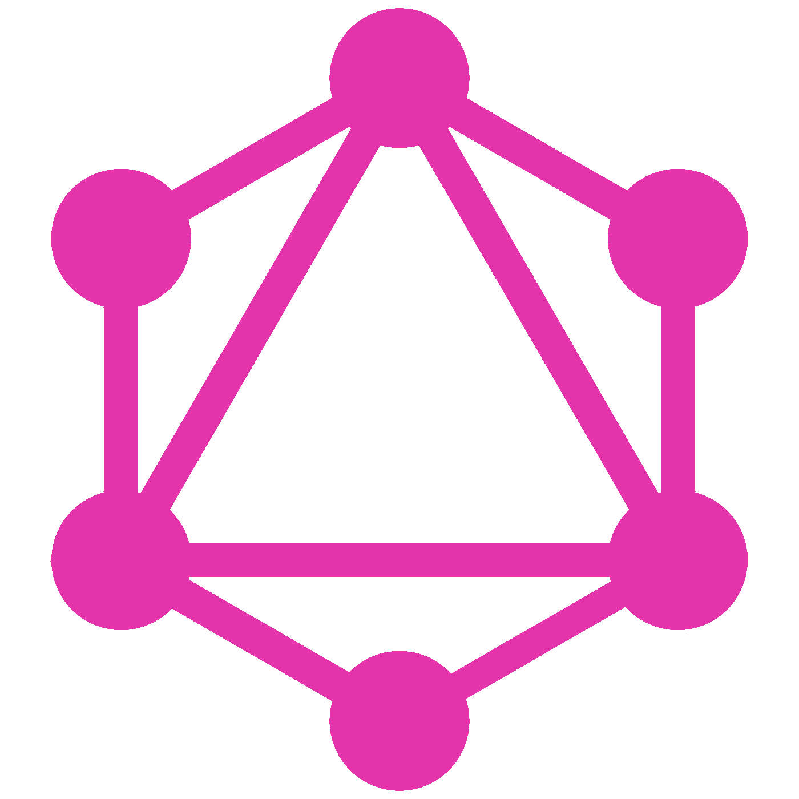

# GraphQL 部分更新

> 原文：<https://itnext.io/graphql-partial-update-783bf533a7fc?source=collection_archive---------1----------------------->



最近，我们决定将 [AWS Amplify](https://aws.amazon.com/amplify/) 用于我们目前正在开发的一款产品。

[AWS Amplify](https://aws.amazon.com/amplify/) 可以让你通过使用 [REST](https://en.wikipedia.org/wiki/Representational_state_transfer) 或 [GraphQL](https://graphql.org/) 相对快速地原型化你的后端 API。我们决定使用 [GraphQL](https://graphql.org/) ，因为在最后的迭代中，产品应该有不同的前端，并且理论上，由于 [GraphQL](https://graphql.org/) 的灵活性，只获取您需要的数据应该更容易。

因此，如果你使用过 [AWS Amplify](https://aws.amazon.com/amplify/) 和 [GraphQL](https://graphql.org/) ，你就会知道它不支持部分更新，这对我们来说是一个障碍，因为我们有多个流，我们必须将部分数据推送到后端。

在网上做了简短的调查后，我在这里找到了 Arnaud Bezan 的一篇非常酷的文章

虽然我真的很喜欢他做事的方式，但是我懒惰的天性想要一个更通用的(不一定是更好的)解决方案。所以，我的想法是:因为我只发送部分数据到后端，但是它期望从我这里得到整个`{ input }`对象，我将把现有的数据和新的数据合并，并把它推到后端。

不过，您必须考虑的另一件事是删除模式中任何自动生成/更新的字段——在我的例子中是`createdAt/updatedAt`

所以，下面你会看到一种快速而肮脏的方法。

请注意，我使用`email`作为我们`user`模型的`key`。除此之外，您必须总是将整个带有所有字段的`user`对象发送给更新变异——这意味着当您调用`getUser`时，它应该获取带有所有字段的`user`对象。

由于`email`被用作`user`模型的`key`，它必须作为`{ input }`对象的一部分传递给`createOrUpdate`函数。每当我必须创建或更新用户时，我们必须将`email`添加到`input`中，然后调用`createOrUpdate(input);`

```
const { email } = user;
const input = { email, …payload };try {
  ...
  await createOrUpdate(input);
  ...
} catch (error) {
  throw new Error(error);
}
```

这不是一种有效的方式，因为它会在更新之前从你的后端获取数据，但这样你就不必手动操作或考虑你想要更新的值。

这是所有的乡亲。