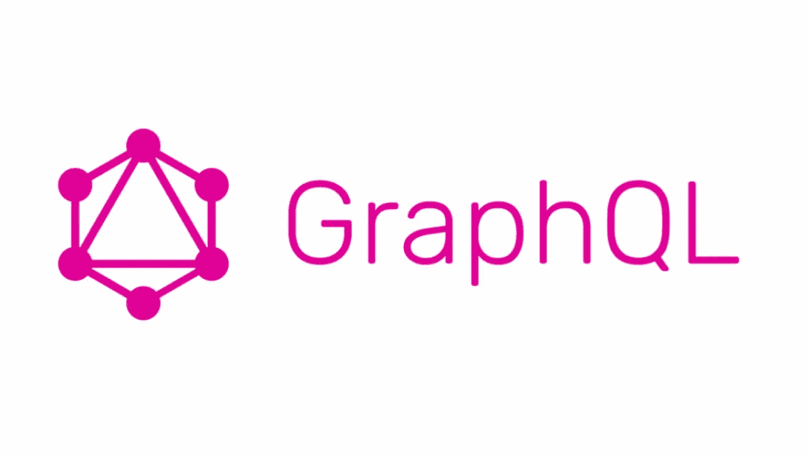

# GraphQL 性能提示:从数据库的所有请求中选择字段

> 原文：<https://itnext.io/graphql-performance-tip-database-projection-82795e434b44?source=collection_archive---------1----------------------->

GraphQL 的真正力量..指定从客户端请求一直到数据库的请求字段。



## 问题是

GraphQL 最强大的特性之一是客户端能够指定从响应返回的字段，从而减少通过网络传输的数据，从而避免数据溢出。

然而，我们真的在做更少的工作吗？后端服务器和数据库仍然必须完成查询数据库的所有工作，获取所请求对象的所有字段，然后只通过 graph QL/网络层返回所请求的字段。

所以我们只是通过发送较小的响应来节省网络时间，但是我们的后端服务器和数据库仍然在做额外的不必要的工作来获取所请求对象的所有字段。这实际上是浪费了大量时间，而我们有可能优化这些时间。

## 解决办法

如果有一种方法可以确定客户机请求了哪些字段，并从数据库层只返回这些字段，那会怎么样？

大多数现代数据库提供“投影”或“选择”特征，其中数据库驱动程序允许消费者指定应该从匹配数据库查询的文档中返回哪些字段，以避免返回所有不必要的字段，并加快对数据库的查询。

这对数据库查询性能有相当大的影响，因为它避免了不必要的工作，如果你想知道潜在的节省可能是什么样子，看看我之前写的[这篇文章](https://medium.com/faun/performance-tips-for-mongodb-mongoose-190732a5d382)，它展示了 MongoDB 中有/没有投影的一些性能指标。

[](https://medium.com/faun/performance-tips-for-mongodb-mongoose-190732a5d382) [## 如何优化 MongoDB & Mongoose 的性能

### 提高 API 和数据库响应时间和性能的技巧

medium.com](https://medium.com/faun/performance-tips-for-mongodb-mongoose-190732a5d382) 

## 阿波罗-服务器的解析功能

因此，我们有可能从网络层以及数据库层做到这一点，唯一缺少的是在我们的服务器/解析器中找出它。

用 [apollo-server](https://github.com/apollographql/apollo-server) 编写的 graphQL 解析器函数通常有四个输入参数。`root`、`args`、`context`和`info`。例如，如果我们要编写一个从数据库返回所有用户的解析器，它看起来会像这样:

```
resolvers = { getUsers: function (root, args, context, info) {
    const User = mongoose.model('User') return User.find({}) }}
```

`root`对象通常是模式中该请求操作/字段的父对象。`args`是传递给该操作的任何参数，`context`包括传递给上下文对象的任何参数(通常用于认证)。然而，`info`物体呢？它似乎包含了一些关于传入请求的信息。

所以我在 apollographql.com 查阅了它的文档，这就是我所发现的

> Info:这个参数应该只在高级情况下使用，但是它包含关于查询的执行状态的信息，包括字段名、从根到字段的路径等等。它只记录在 GraphQL.js 源代码中。

不是很有帮助，但是我认为它可能包括关于传入请求和被请求字段的所需信息，在查看在线库之后，我发现了 graphql-fields。

## 图表 QL-字段

我遇到了 [graphql-fields](https://github.com/robrichard/graphql-fields) ，它可以根据`info`参数返回请求的字段，它还可以处理高级情况，如联合类型、片段、子字段等..

对于这样一个返回所有用户姓名和电子邮件的查询，它能做的如下

```
{ users { name email }}
```

这将是结果:['姓名'，'电子邮件']

**用法:**

```
const graphqlFields = require(‘graphql-fields’);
function userResolver(root, args, context, info) { const topLevelFields = Object.keys(graphqlFields(info));
  console.log(topLevelFields)
  // prints [‘name’, ‘email’]
}
```

很好，现在我们可以使用这个结果从数据库中只选择这些字段，而不是从数据库中为每个用户请求整个用户文档。

## 使用结果

在我的例子中，我使用 MongoDB 和[mongose](https://github.com/Automattic/mongoose)作为数据库驱动程序，因此 mongose 投影所需的语法看起来与我从`graphql-fields`得到的结果略有不同。

我想要实现的等价查询如下所示:`User.find({}).select({name: 1, email: 1}).lean()`

可以将来自`graphql-fields`的结果转换为 mongoose 所需的选择对象的辅助函数可以编写如下:

```
export function getMongooseSelectionFromSelectedFields (info, fieldPath = null) { const selections = graphqlFields(info) const mongooseSelection = Object
  .keys(fieldPath ? selections[fieldPath] : selections)
  .reduce((a, b) => ({ …a, [b]: 1   }), {}) return mongooseSelection}
```

瞧，现在客户端请求的字段就是数据库请求并返回的字段，这使得我们的解析器速度大大加快！

这与[自动持久化查询(APQ)](https://www.apollographql.com/docs/apollo-server/performance/apq/) 和[缓存](https://www.apollographql.com/docs/apollo-server/performance/caching/)完美配合。另外两场表演轻松获胜。

我添加了一个 fieldPath 参数来支持响应中的一级嵌套，以防从数据库请求数据的操作不是顶级操作。

这是新解析器的外观:

```
resolvers = { getUsers: function (root, args, context, info) {
    const mongooseSelection = getMongooseSelectionFromRequest(info) return User.find({}).select(mongooseSelection).lean() }}
```

## 结论

GraphQL 非常强大，它不仅可以优化客户端应用程序的性能，还可以用来优化后端性能，毕竟我们可以免费获得解析器中特别请求的字段。