# GraphQL 微服务— C#

> 原文：<https://itnext.io/graphql-schema-stitching-c-2ccfd209d3ce?source=collection_archive---------2----------------------->

Nathana rebou as 在 [Unsplash](https://unsplash.com/s/photos/stitching?utm_source=unsplash&utm_medium=referral&utm_content=creditCopyText) 上的照片

在[我的上一篇文章](/no-more-rest-long-live-graphql-apis-with-c-55962ba8f942?source=friends_link&sk=48049f8e2b81b446de3c0cabf813f684)中，我解释了为什么你可以考虑使用 GraphQL API 来代替 REST。我使用了一个订单汇总页面的例子，其中一个移动应用程序可能需要发出多个 HTTP 请求来获取所有数据。这些都是个别电话，因为这是一个微服务架构:

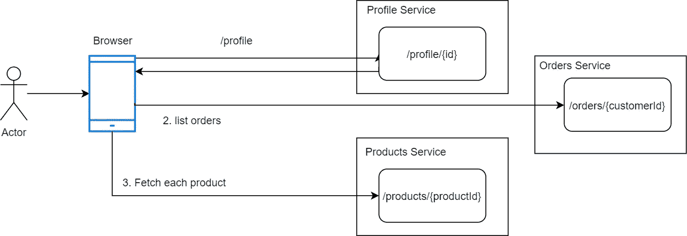

然后我展示了一个整体图表的例子，这并不是一个公平的比较:

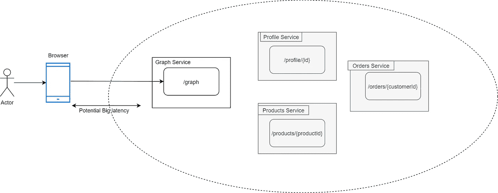

monolith Graph 服务使我们能够展示移动应用程序的单一模式:

## 我们如何在微服务架构中拥有这种模式？

> **模式拼接。**

我们可以将模式划分为多个服务，如下所示:

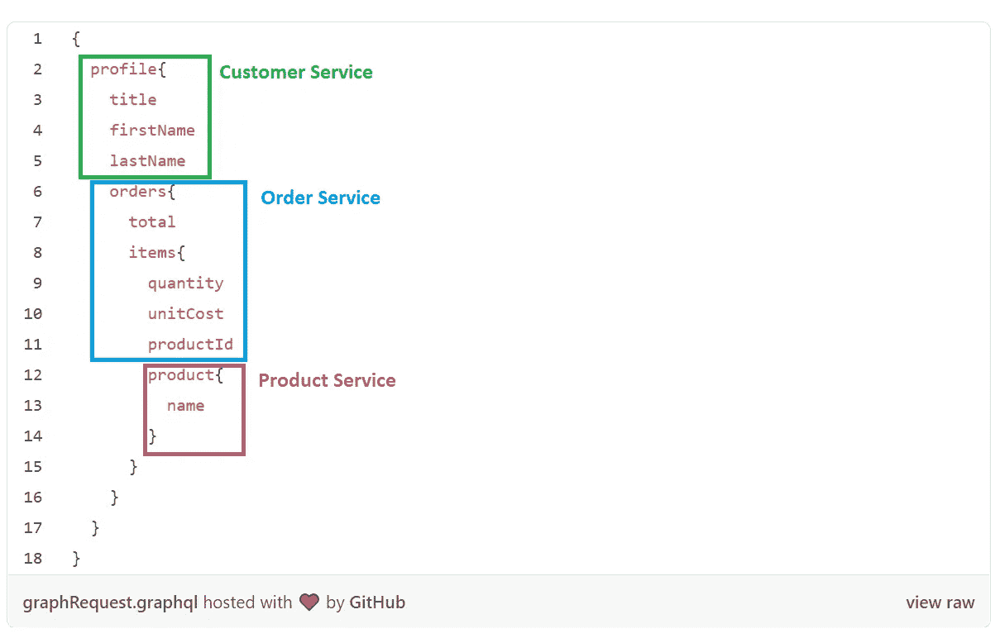

按服务划分的订单汇总

为了进行这种划分，我们需要一个入口点来协调服务之间的调用，我们称之为 Graph Stitcher。

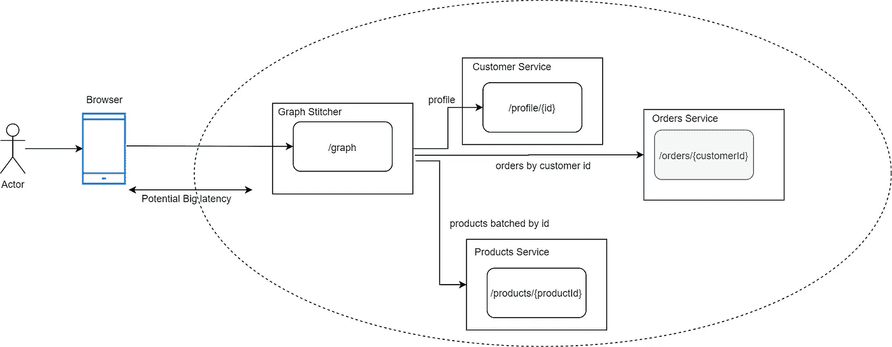

几个要点:

*   GraphStitcher 定义了一个“缝合模式”，它是其他服务模式的组合。
*   订单、配置文件和产品是产品/图形端点，图形网关只是委托。
*   GraphStitcher 不仅仅是一个聚合器，它还可以覆盖/扩展模式。

# C# —热巧克力演示

这是一个很长的设置，所以如果你想跟着做，这里是[源代码](https://github.com/RaphaelYoshiga/GraphStitchingDemo)。

在我们开始设置图形拼接器之前，让我们确保我们正在运行客户服务。所以在[http://localhost:5000/playground](http://localhost:5000/playground)，我们应该会收到:

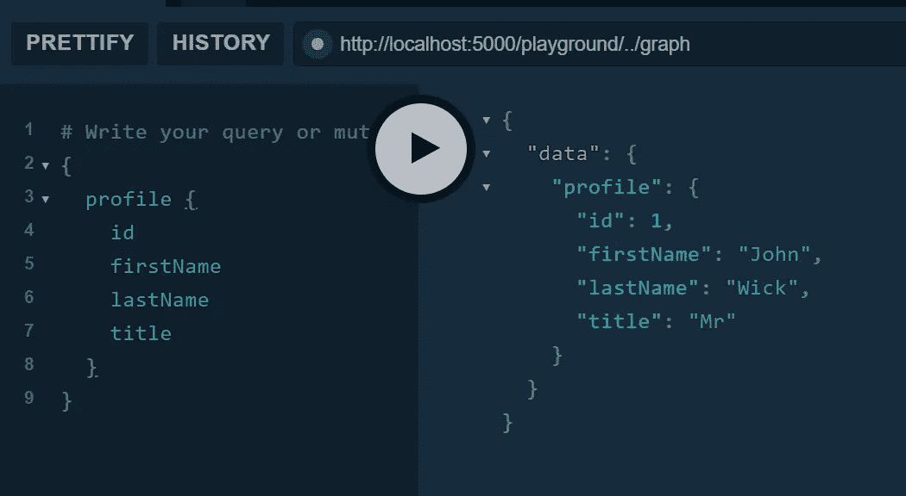

客户服务模式示例

## 设置装订机

将它添加到空的。net core web 应用程序:

重要的是:

*   AddStitchedSchema——这就是我们判断我们的模式来自远程服务的方式。
*   用来自 AddStiched 模式的构建器，我们做"*构建器。AddSchemaFromHttp(图形。SchemaName)* “告诉 HotChocolate 框架将调用委派到哪里。
*   服务。AddHttpClient——我们添加一个命名的 HTTP 客户端，**,它与模式具有相同的名称**

一个简单的非动态版本:

这样，我们应该能够将来自图形拼接器的请求代理到客户服务中

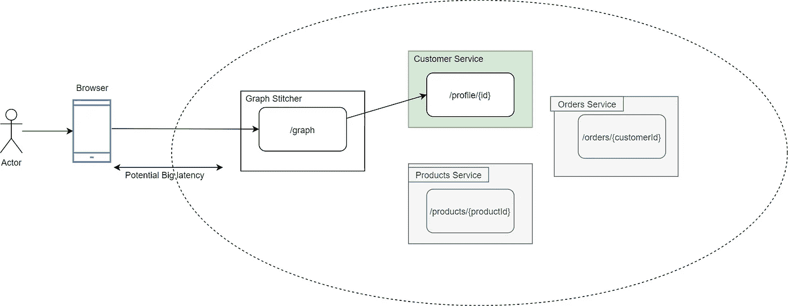

制图师游乐场:

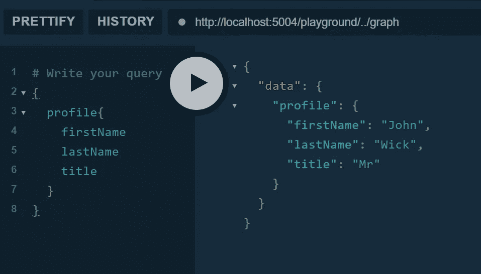

图形装订机将呼叫委托给客户服务

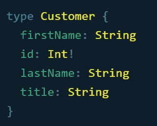

带有名字、id、姓氏和头衔的客户模式

它可以工作，但是正如您所看到的，Customer 没有原始模式中的“orders”字段。

## 添加另一个模式:

根据 GraphSticher 的 Startup.cs，我们有一个“graphProviders”列表，所以如果我们将它添加到列表中，GraphSticher 现在应该支持订单查询。

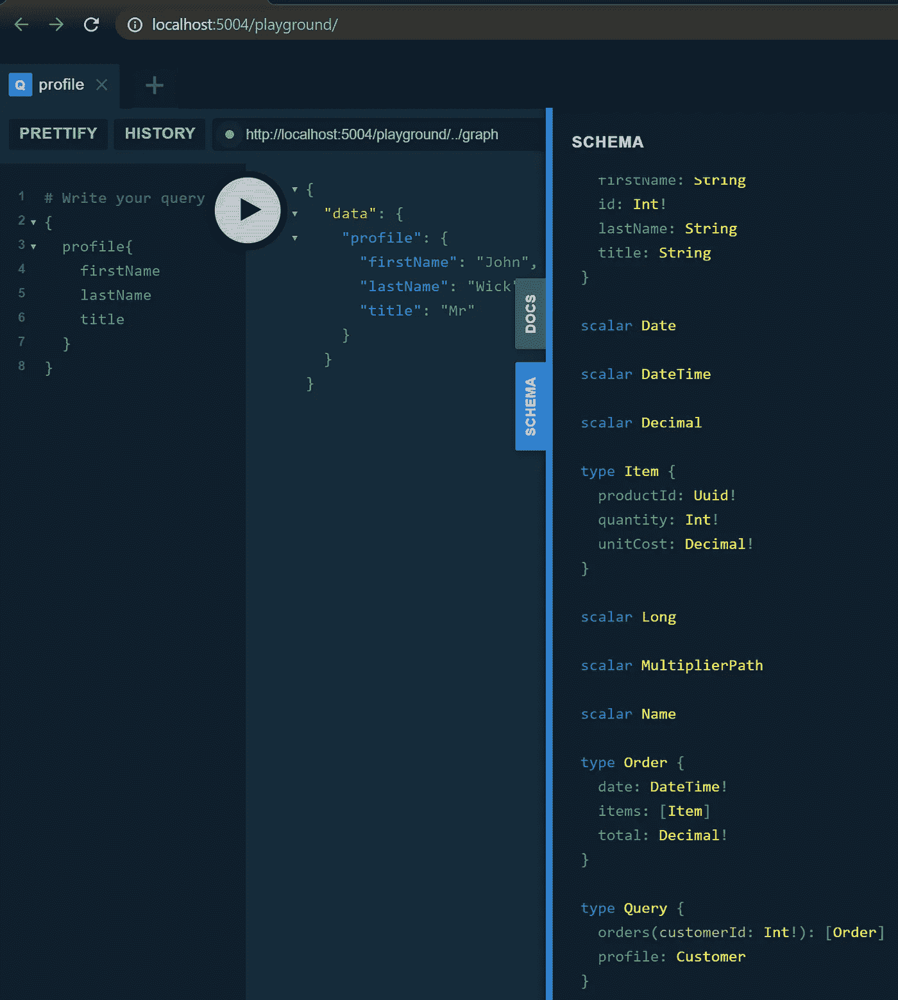

具有客户服务和订单服务模式的图形拼接器

尽管如此，我们可以按 customerId 查询订单，但不能直接从 customer 对象访问订单。

## 扩展客户对象

为了向客户对象添加订单，我们需要扩展客户类型以添加“订单”属性，并告诉 HotChocolate 如何解决这个问题:

我们只需要用“AddExtensionsFromFile”注册模式的扩展，如下所示:

瞧啊。客户现在有一个链接到“订单”的属性:

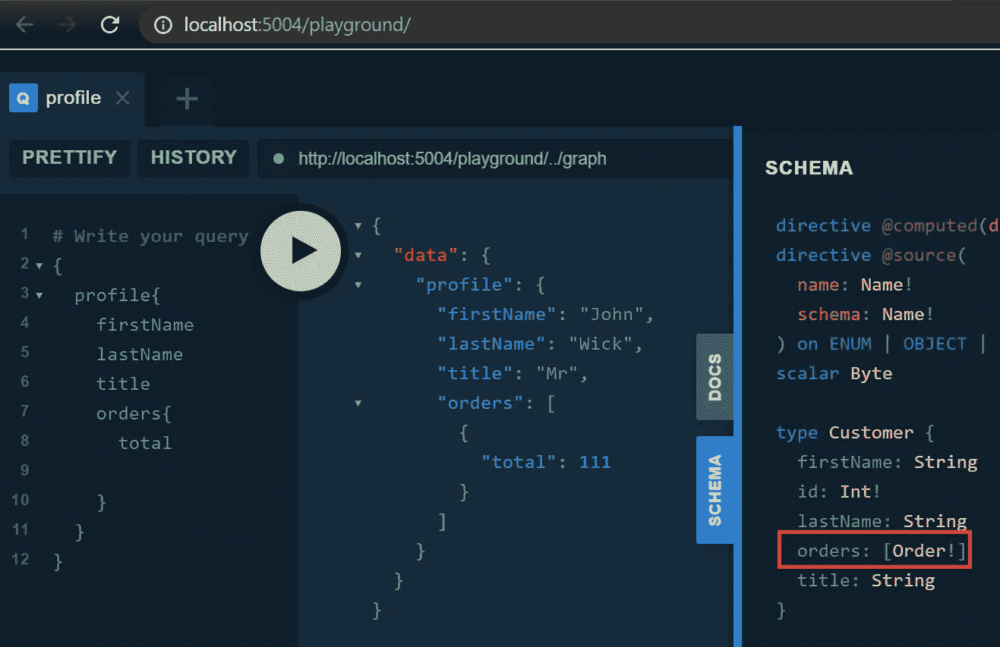

Stitcher 现在在客户类型中有“订单”

只是提醒你我们的模式:

## 将产品链接至订单:项目:

将产品添加到“graphProviders”中后，我们必须将扩展添加到项目类型中:

但这不就意味着每种产品都有单独的需求吗？

*   产品(标识号:1)
*   产品(标识号:2)

乍一看，是的，但不是， [HotChocolate 将通过使用别名出色地批量处理](https://chillicream.com/docs/hotchocolate/v10/stitching/#batching)对产品(id: {productId})的请求。假设我们要求两种产品:

## 在产品服务中批处理数据库查询

因为产品服务现在接收带有别名的查询，所以我们可以利用[数据加载器](https://chillicream.com/docs/hotchocolate/v10/data-fetching/)来确保我们批处理请求并进行单个数据库调用:

## 最后的结果是:

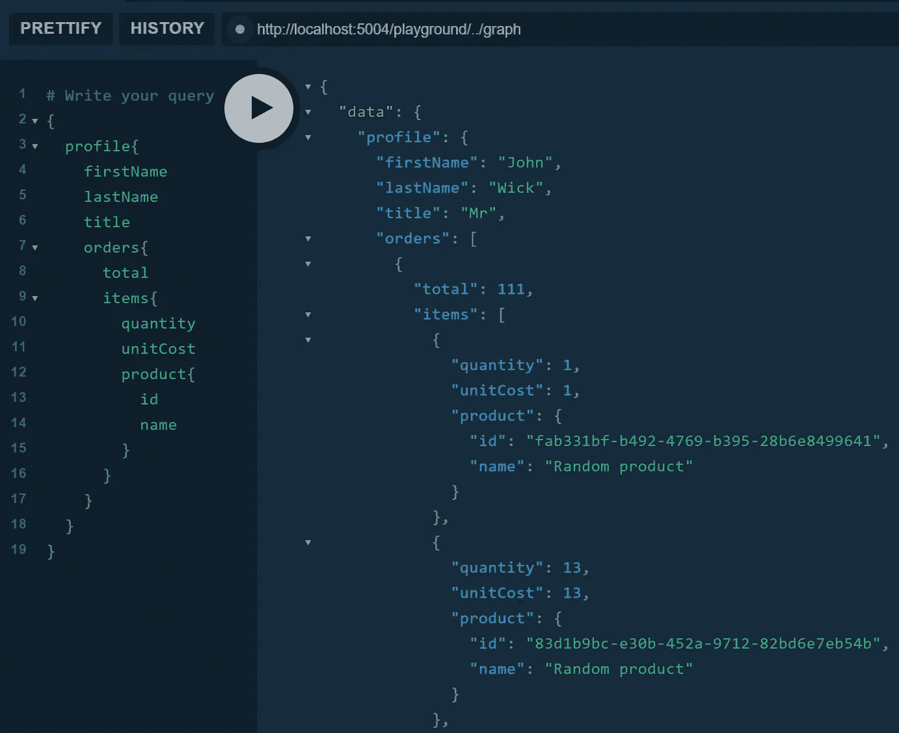

GraphQL 游乐场从 Stitcher 与所有相关的服务工作

# 参考资料:

*   [热巧克力文档](https://chillicream.com/docs/hotchocolate/v10/stitching/)

# 设计考虑

我采用了微服务在查询时彼此不了解的方法，但是作为替代，服务可以像 GraphStitcher 那样直接查询它们的依赖关系。

例如，配置文件服务可能在客户中有属性“orders ”,但是突然客户服务提供了订单的模式。然后，如果我们将客户服务和订单服务添加到缝合器中，模式将被复制，它可能会中断，也可能不会。

还要考虑到，如果服务相互了解，它们就是必须在 CI/CD 管道中配置的依赖关系。

因此，我决定缝合的方式是一种更好的前进方式。

# 结论

乔·凯恩在 [Unsplash](https://unsplash.com/s/photos/happy?utm_source=unsplash&utm_medium=referral&utm_content=creditCopyText) 上的照片

如果你打算使用 GraphQL API，你很可能会想在微服务架构中使用它，为此你需要一个**图形拼接器来组合多个模式**。

现在有了更多的 GraphQL 经验，这个东西是强大的，它允许消费者有很大的灵活性，可以使应用程序更有效。但是这种灵活性来自良好的工程实践，比如字典、批处理等的使用，这些实践是中级到高级的，所以你需要记住学习曲线和潜在的不良实现。