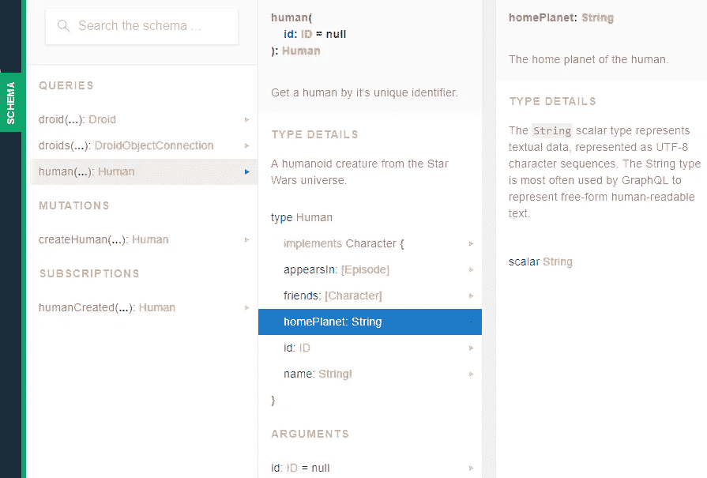

# 使用 GraphQL。NET Boxed:查询

> 原文：<https://itnext.io/graphql-using-net-boxed-queries-e4dff929bb35?source=collection_archive---------6----------------------->

这篇文章将继续我使用[对](https://github.com/Dotnet-Boxed/Templates) [GraphQL](https://graphql.org/) 的探索。NET Boxed 模板作为跳开点。我开始写的代码可以在[这里](https://github.com/elanderson/ASP.NET-Core-GraphQl/tree/f8a353800ab5006c78b5445cc0204cb66f367147)找到。如果您想从获取。NET 盒装模板安装，检查出我的[ASP.NET 核心与 GraphQL 使用。网框](https://elanderson.net/2018/07/asp-net-core-with-graphql-using-net-boxed/)帖。

## 寻找线索

如上一篇文章所述，该项目的支持数据位于 **Repositories/Database.cs** 文件中的一个静态类中。这些数据以星球大战为主题，由两个角色列表组成，一个是机器人的，另一个是人类的，这两个列表合并成一个角色列表。

我将从应用程序处理请求的角度来处理这个问题，而不是从数据开始并找出它在哪里被使用。对于 ASP.NET 核心应用程序，这意味着查看启动类的 Configure 函数，这是配置 HTTP 管道的地方。

在 Configure 函数中，我们发现以下两个调用与 GraphQL 相关。我在两次调用中都删除了选项的实际设置。

```
.UseGraphQLWebSocket<MainSchema>(new GraphQLWebSocketsOptions())
.UseGraphQLHttp<MainSchema>(new GraphQLHttpOptions())
```

看来 MainSchema 是我们需要跟进的线索。

## 主模式

MainSchema 类中没有很多代码。下面是模板生成的完整类。

```
public class MainSchema : Schema
{
    public MainSchema(
        QueryObject query,
        MutationObject mutation,
        SubscriptionObject subscription,
        IDependencyResolver resolver)
        : base(resolver)
    {
        this.Query = resolver.Resolve<QueryObject>();
        this.Mutation = mutation;
        this.Subscription = subscription;
    }
}
```

作为基类的模式类是由。NET 库。就像 GraphQL 中的任何其他模式一样，它用于定义客户端可用的数据以及可以使用的查询类型。现在，我们将继续遵循查询类型，将变异和订阅留给以后的帖子。

## 查询对象

对于模板，我们使用位于 QueryObject 类中的查询模式。下面是这个类，但是被简化为只包含一个实体的设置。对于我们的星球大战样本数据，我使用了人类的比特并丢弃了机器人。

```
public class QueryObject : ObjectGraphType<object>
{
    public QueryObject(IHumanRepository humanRepository)
    {
        this.Name = "Query";
        this.Description = "The query type, represents all of the entry points into our object graph.";

        this.FieldAsync<HumanObject, Human>(
            "human",
            "Get a human by it's unique identifier.",
            arguments: new QueryArguments(
                new QueryArgument<IdGraphType>()
                {
                    Name = "id",
                    Description = "The unique identifier of the human.",
                }),
            resolve: context => humanRepository.GetHuman(
                context.GetArgument("id", 
                                    defaultValue: new Guid("94fbd693-2027-4804-bf40-ed427fe76fda")),
                context.CancellationToken));
    }
}
```

类构造函数需要一个类的实例，该实例用于访问为其定义查询的实体的数据，在本例中为 IHumanRepository。

这个类的关键是 FieldAsync <humanobject human="">调用。这是允许获取单个人的查询的定义。第一个参数是查询的名称，第二个是查询的描述。</humanobject>

接下来，是查询需要执行的参数。

```
arguments: new QueryArguments(
                new QueryArgument<IdGraphType>()
                {
                    Name = "id",
                    Description = "The unique identifier of the human.",
                })
```

在这个例子中，查询可以接受一个参数作为要返回的人的 ID。最后一点是如何将这个查询解析为实际的后台数据。

```
resolve: context => humanRepository.GetHuman(
            context.GetArgument("id", 
                                defaultValue: new Guid("94fbd693-2027-4804-bf40-ed427fe76fda")),
            context.CancellationToken))
```

这里，上下文允许我们使用上下文提取客户端传递的参数。获取名为的参数函数调用，如参数部分中所定义，并在对 humanRepository 的调用中使用它们。

## 对象图形类型

我想谈的最后一点是 FieldAsync <humanobject human="">调用中两种类型的区别。Human 是数据访问所使用的实体类型。HumanObject 是包装在 ObjectGraphType 中的人。下面是完整的 HumanObject 类。</humanobject>

```
public HumanObject(IHumanRepository humanRepository)
{
    this.Name = "Human";
    this.Description = "A humanoid creature from the Star Wars universe.";
    this.Field(x => x.Id, 
                    type: typeof(IdGraphType))
              .Description("The unique identifier of the human.");
    this.Field(x => x.Name)
              .Description("The name of the human.");
    this.Field(x => x.HomePlanet, nullable: true)
              .Description("The home planet of the human.");
    this.Field<ListGraphType<EpisodeEnumeration>>
              (nameof(Character.AppearsIn), 
               "Which movie they appear in.");

    this.FieldAsync<ListGraphType<CharacterInterface>, 
                    List<Character>>(
        nameof(Human.Friends),
        "The friends of the character, or an empty list if they have none.",
        resolve: context => 
                 humanRepository.GetFriends(context.Source,
                                            context.CancellationToken));
    this.Interface<CharacterInterface>();
}
```

这种模式允许将额外的元数据添加到被包装的类型中。您可以在示例应用程序在开发模式下启动的模式区域 playground 中看到这项工作。



## 包扎

我在 GraphQL 上的上一篇文章让我觉得它非常神奇。从客户端的角度来看确实如此。从服务器端来看，这种魔力伴随着一些复杂性。不要认为这是对 GraphQL 的判断，这只是在选择技术之前必须考虑的一个方面。随着我对 GraphQL 的服务器端越来越熟悉，我确信我刚刚学习时看到的一些复杂性将变得清晰。

相关的示例代码可以在这里找到[。](https://github.com/elanderson/ASP.NET-Core-GraphQl/tree/59792e870382dba7c6c40d444cfe573577b2569b)

*原载于* [*安德森*](https://elanderson.net/2018/07/graphql-using-net-boxed-queries/) *。*