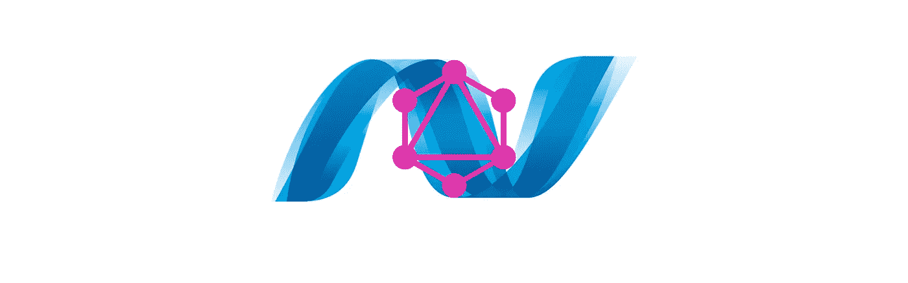

# 使用 GraphQL。网络盒装:订阅

> 原文：<https://itnext.io/graphql-using-net-boxed-subscriptions-eac6a9dabcdd?source=collection_archive---------4----------------------->



这篇文章将继续我使用[对](https://github.com/Dotnet-Boxed/Templates) [GraphQL](https://graphql.org/) 的探索。NET Boxed 模板作为跳开点。我开始写的代码可以在[这里](https://github.com/elanderson/ASP.NET-Core-GraphQl/tree/f8a353800ab5006c78b5445cc0204cb66f367147)找到。使用查看 [GraphQL。NET Boxed: Mutations](https://elanderson.net/2018/07/graphql-using-net-boxed-mutations/) 从上周开始探索突变。

订阅是 GraphQL 允许客户端请求数据更改通知的方式。

## 出发点

正如几周前发现的，MainSchema 是发现 GraphQL 如何在这个模板中设置的中心点。作为参考，这里是完整的类。

```
public class MainSchema : Schema
{
    public MainSchema(
        QueryObject query,
        MutationObject mutation,
        SubscriptionObject subscription,
        IDependencyResolver resolver)
        : base(resolver)
    {
        this.Query = resolver.Resolve<QueryObject>();
        this.Mutation = mutation;
        this.Subscription = subscription;
    }
}
```

今天，我们对被分配了 SubscriptionObject 的 Subscription 属性感兴趣。

## 订阅对象

以下是完整的 SubscriptionObject，供参考。我会在代码后指出几个细节。

```
public class SubscriptionObject : ObjectGraphType<object>
{
    public SubscriptionObject(IHumanRepository humanRepository)
    {
        this.Name = "Subscription";
        this.Description = "The subscription type, represents all updates can be pushed to the client in real time over web sockets.";

        this.AddField(
            new EventStreamFieldType()
            {
                Name = "humanCreated",
                Description = "Subscribe to human created events.",
                Arguments = new QueryArguments(
                    new QueryArgument<ListGraphType<StringGraphType>>()
                    {
                        Name = "homePlanets",
                    }),
                Type = typeof(HumanCreatedEvent),
                Resolver = new FuncFieldResolver<Human>(context => 
                                  context.Source as Human),
                Subscriber = new EventStreamResolver<Human>(context =>
                {
                    var homePlanets = 
                           context.GetArgument<List<string>>("homePlanets");
                    return humanRepository
                        .WhenHumanCreated
                        .Where(x => homePlanets == null || 
                                    homePlanets.Contains(x.HomePlanet));
                }),
            });
    }
}
```

很多这种类型看起来与我们已经讨论过的其他类型的查询和变异非常相似。例如，类型是 HumanCreatedEvent，它派生自 HumanObject，后者是 Human 类周围的 ObjectGraphType。

```
Type = typeof(HumanCreatedEvent)
```

探索 GraphQL 最困难的事情之一是很好地处理对象图。我强烈建议你花一些时间在这些课程上，让这种联系在你的脑海中变得牢固。

另一个看起来和我们在另一篇文章中提到的非常相似的例子是解析器，它处理基本的人类类型。

```
Resolver = new FuncFieldResolver<Human>(context => context.Source as Human)
```

下一位是新的，它处理当 HumanRepository 创建一个新的人时 GraphQL 的实际通知。为了清楚起见，下面的代码删除了与地球相关的内容。

```
Subscriber = new EventStreamResolver<Human>(context =>
{
    return humanRepository
        .WhenHumanCreated;
})
```

什么是人类创造的时间？看起来它是由人类博物馆提供的一个可观测的。

```
public IObservable<Human> WhenHumanCreated => 
                          this.whenHumanCreated.AsObservable();
```

查看 AddHuman 函数，您会看到每次创建一个人时，这个可观察对象都会被提供一个新值，这反过来会通知我们的 GraphQL 设置，以通知任何订阅的客户端添加了一个新的人。

```
public Task<Human> AddHuman(Human human, CancellationToken cancellationToken)
{
    human.Id = Guid.NewGuid();
    Database.Humans.Add(human);
    this.whenHumanCreated.OnNext(human);
    return Task.FromResult(human);
}
```

## 包扎

这涵盖了我对订阅的探索。对我来说，这是我在 GraphQL 中见过的最酷的部分。

我知道这是一个有点奇怪的系列，因为我们只是看了由模板生成的代码。希望你觉得有用。我知道它帮助我更好地理解 GraphQL 背后的思想，以及如何在。网芯。

相关的示例代码可以在[这里](https://github.com/elanderson/ASP.NET-Core-GraphQl/tree/59792e870382dba7c6c40d444cfe573577b2569b)找到。

*原载于*[](https://elanderson.net/2018/08/graphql-using-net-boxed-subscriptions/)**。**