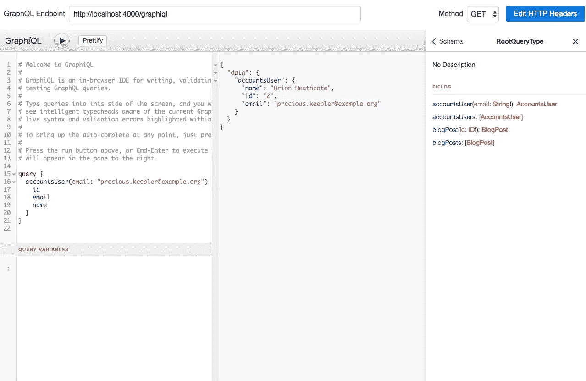
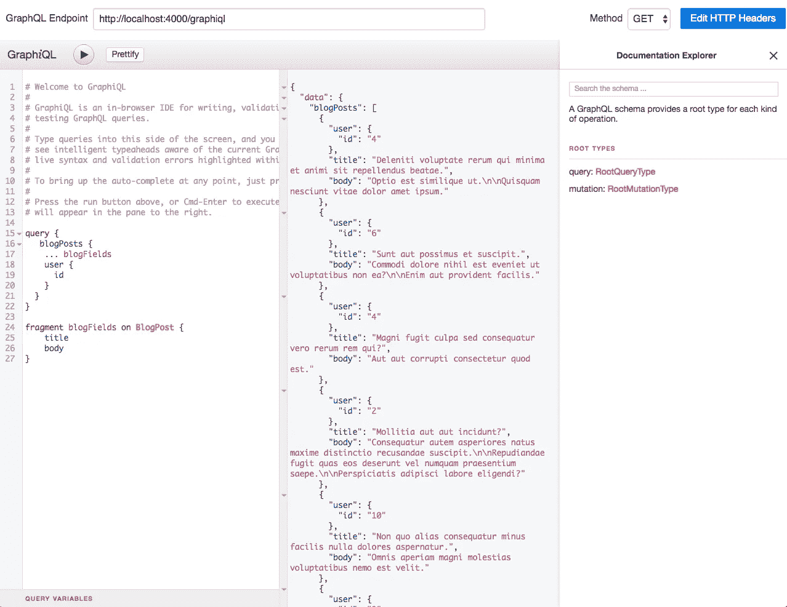
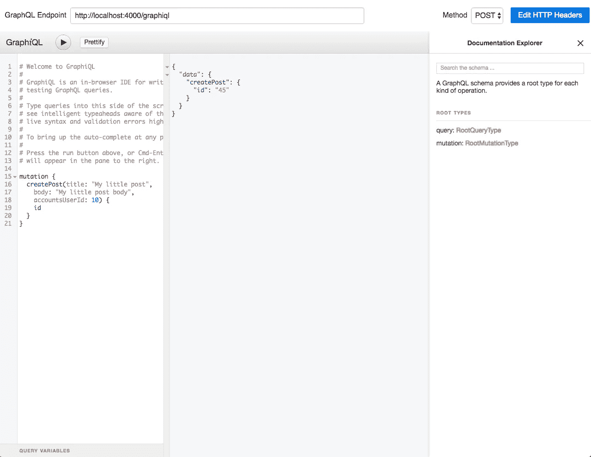
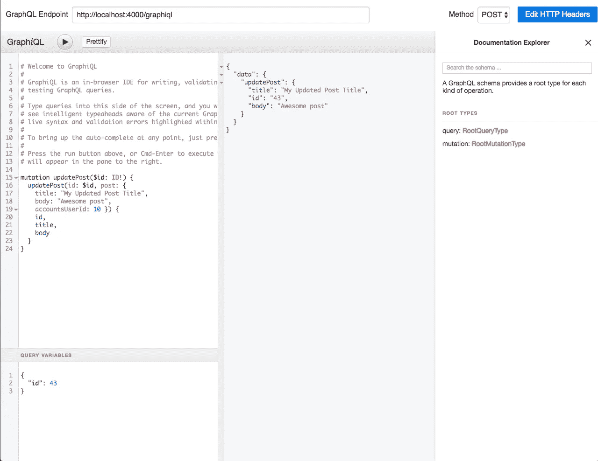

# GraphQL 配灵药/凤凰和苦艾酒

> 原文：<https://itnext.io/graphql-with-elixir-phoenix-and-absinthe-6b0ffd260094?source=collection_archive---------2----------------------->

来自脸书的 **GraphQL** 凭借其所有的优点成为 REST ( **代表性状态转移)**的有力竞争者。在本文中，我们将重点关注使用苦艾酒库为 Phoenix Web 应用程序编写查询和变异。假设读者已经熟悉 GraphQL 的概念以及与 REST 相比的相对优势。如果没有，我建议先在这里复习一下概念[。此外，Arnaud Lauret 有一篇关于 GraphQL 与 REST 比较的优秀文章](http://graphql.org)[这里](https://apihandyman.io/and-graphql-for-all-a-few-things-to-think-about-before-blindly-dumping-rest-for-graphql/)我认为这是每个人的必读之作。

我有意省略了认证部分。但是大多数 web 应用程序都有一些身份验证机制来保护查询和突变免受未授权用户的攻击。这可能是未来文章的一部分。但是对于本文，范围是集中在使用苦艾酒编写查询(GET 等价于 REST)和突变(POST 等价于 REST)。

# **我们需要什么**

我们需要的是—

1.  [Phoenix Web 框架](http://phoenixframework.org) —用于编写 Web 应用
2.  [苦艾酒](http://absinthe-graphql.org) — GraphQL 编写查询/突变的灵丹妙药工具包
3.  [GraphQL](https://github.com/graphql/graphiql)—一个用于探索 graph QL 的浏览器内集成开发环境。你可以把它想象成休息的邮递员。我们将在这里使用来自[的 mac 应用](https://github.com/skevy/graphiql-app)，它是 GraphiQL 的一个包装器。

# **应用概述:**

我们将使用的 Phoenix 应用程序是一个简单的博客应用程序，Phoenix 1.3 有两个模式，分别在帐户和博客上下文中定义用户和帖子。完整的代码可以在 github [这里](https://github.com/imeraj/Phoenix_Playground/tree/master/1.3/blog_app_gql)找到。

# **添加依赖关系**

首先，我们需要在 **mix.exs** 中添加一些依赖项，使 GraphQL 在 Phoenix app 中可用—

```
defp deps **do** [
   {:absinthe, "~> 1.3.1"},
   {:absinthe_plug, "~> 1.3.0"},
   {:absinthe_ecto, "~> 0.1.3"}
  ]
**end**
```

# 为 GraphQL 构建应用程序

我们需要一些东西来构建应用程序的 GraphQL 部分，它们是—

i. GraphQL 模式—放在 **web/schema/schema.ex** 文件夹中

二。自定义类型—我们已经定义了一些自定义类型，用于放置在 **web/schema/types.ex** 中的模式

三。解析器—模式将每个查询或变异映射到一个解析器函数，以处理业务逻辑。解析器放在它们自己的文件中——在我们的简单例子中，放在**accounts/user _ resolver . ex**和 **blog/post_resolver.ex** 中。

此外，我们需要修改路由器，以便能够在 **router.ex** 中使用 GraphQL 客户端进行查询

```
forward("/graphql",  Absinthe.Plug,          schema: BlogAppGql.Web.Schema)
forward("/graphiql", Absinthe.Plug.GraphiQL, schema: BlogAppGql.Web.Schema)
```

# **编写 GraphQL 查询**

我们现在已经准备好编写我们的查询了，我们可以认为它等同于 REST 中的 GET 请求。

首先，我们将 GraphQL 模式和解析器映射定义如下—

```
defmodule BlogAppGql.Web.Schema **do** use Absinthe.Schema
  import_types(BlogAppGql.Web.Schema.Types)

  query **do** field :blog_posts, list_of(:blog_post) **do** resolve(&BlogAppGql.Web.Blog.PostResolver.all/2)
    **end** field :blog_post, type: :blog_post **do** arg(:id, non_null(:id))
      resolve(&BlogAppGql.Web.Blog.PostResolver.find/2)
    **end** field :accounts_users, list_of(:accounts_user) **do** resolve(&BlogAppGql.Web.Accounts.UserResolver.all/2)
    **end** field :accounts_user, :accounts_user **do** arg(:email, non_null(:string))
      resolve(&BlogAppGql.Web.Accounts.UserResolver.find/2)
    **end

    mutation do
      field :create_post, type: :blog_post do
        arg(:title, non_null(:string))
        arg(:body, non_null(:string))
        arg(:accounts_user_id, non_null(:id))

        resolve(&BlogAppGql.Web.Blog.PostResolver.create/2)
      end

      field :update_post, type: :blog_post do
        arg(:id, non_null(:id))
        arg(:post, :update_post_params)

        resolve(&BlogAppGql.Web.Blog.PostResolver.update/2)
      end

      field :delete_post, type: :blog_post do
        arg(:id, non_null(:id))
        resolve(&BlogAppGql.Web.Blog.PostResolver.delete/2)
      end
    end

  end
end**
```

我们将在后面的部分讨论粗体部分(“突变”)。

对于查询部分，我们定义了四个查询。让我们选择一个查询并分析各个部分——

```
field :accounts_user, **:accounts_user** **do** arg(:email, non_null(:string))
      resolve(&BlogAppGql.Web.Accounts.UserResolver.find/2)
**end**
```

这里，我们定义了一个查询来检索使用电子邮件地址的特定用户。

*   arg —是传入的参数，它是非空字符串
*   BlogAppGql。Web.Accounts.UserResolver.find/2——是解析器函数，它将处理检索用户的 BI 部分。
*   accounts_user(上面的粗体字)—是我们自定义的解析类型。如前所述，在 **types.ex** 中定义如下—

```
object :accounts_user **do** field(:id, :id)
  field(:name, :string)
  field(:email, :string)
  field(:posts, list_of(:blog_post), resolve: assoc(:blog_posts))
**end**
```

让我们回顾一下上面定义的另一个查询—

```
field :blog_posts, list_of(:blog_post) **do** resolve(&BlogAppGql.Web.Blog.PostResolver.all/2)
**end**
```

这里，resolved type 是在 **types.ex** 中定义的 blog_post 类型列表

```
object :blog_post **do** field(:id, :id)
  field(:title, :string)
  field(:body, :string)
  field(:user, :accounts_user, resolve: assoc(:accounts_user))
**end**
```

一旦定义了查询，我们需要编写解析器函数。我将在这里展示一个用于**帐户 _ 用户**的帐户。其他的可以在 github 代码库中找到。

```
defmodule BlogAppGql.Web.Accounts.UserResolver **do** alias BlogAppGql.Accounts

  def all(_args, _info) **do** {:ok, Accounts.list_users()}
  **end** def find(%{email: email}, _info) **do** case Accounts.get_user_by_email(email) **do
      nil** -> {:error, "User email #{email} not found!"}
      user -> {:ok, user}
    **end
  end
end**
```

这部分是 stragihtforward——列出所有用户或使用电子邮件地址检索特定用途。

现在让我们使用 GraphiQL 浏览器来运行它。您需要在端口 4000 上运行服务器。

让我们运行一个查询来检索使用电子邮件地址的用户—



使用电子邮件地址检索用户

这里，我们使用电子邮件地址运行 accountsUser query 来检索 id、email 和 name 字段。请注意，客户端中的查询名称是**驼峰式大小写**。在最右边的部分，你可以看到 GraphQL 自动生成的文档，这使得编写查询和变异变得很容易。GraphQL 还支持定义变量，我们将在稍后编写突变时展示这些变量。

让我们运行另一个查询来列出所有的博客帖子—



列出所有博客文章

# 编写 GraphQL 突变

一旦理解了如何编写查询，编写突变就很容易了。这里，我们定义了三种突变—

1.  创建帖子—创建博客帖子
2.  update_post —更新博客文章
3.  delete_post —删除博客文章

为了简洁起见，我将只解释 update_post。

```
field :update_post, type: :blog_post do
        arg(:id, non_null(:id))
        arg(:post, :update_post_params)

        resolve(&BlogAppGql.Web.Blog.PostResolver.update/2)
end
```

这里，update post 接受两个参数作为输入——一个非 null id 和一个 update_post_params 类型的 post 参数，它保存要更新的输入参数值。它是在类型中定义的。例如—

```
input_object :update_post_params **do** field(:title, :string)
 field(:body, :string)
 field(:accounts_user_id, :id)
**end**
```

与以前的类型定义不同的是，它被定义为 input_object 而不是 object。

相应的解析器功能定义如下—

```
def update(%{id: id, post: post_params}, _info) **do** case find(%{id: id}, _info) **do** {:ok, post} -> post |> Blog.update_post(post_params)
    {:error, _} -> {:error, "Post id #{id} not found"}
  **end
end**
```

让我们用 GraphiQL 来运行一些突变—



创建一篇博客文章

注意，方法现在从 GET 改为 POST。



更新博客文章

注意，我们已经定义了一个查询参数来指定要更新的博客文章的 id。

当然，您可以使用其他客户端，特别是如果您正在开发与 GraphQL 服务器交互的移动应用程序， [Apollo GraphQL 客户端](https://www.apollographql.com)非常好。

希望这篇文章能够提供一个坚实的概述，介绍如何使用苦艾酒为 Phoenix Web 应用程序编写 GraphQL 服务器。

*更多详细和深入的未来技术帖子请关注我这里或点击* [*twitter*](https://twitter.com/meraj_enigma) *。*