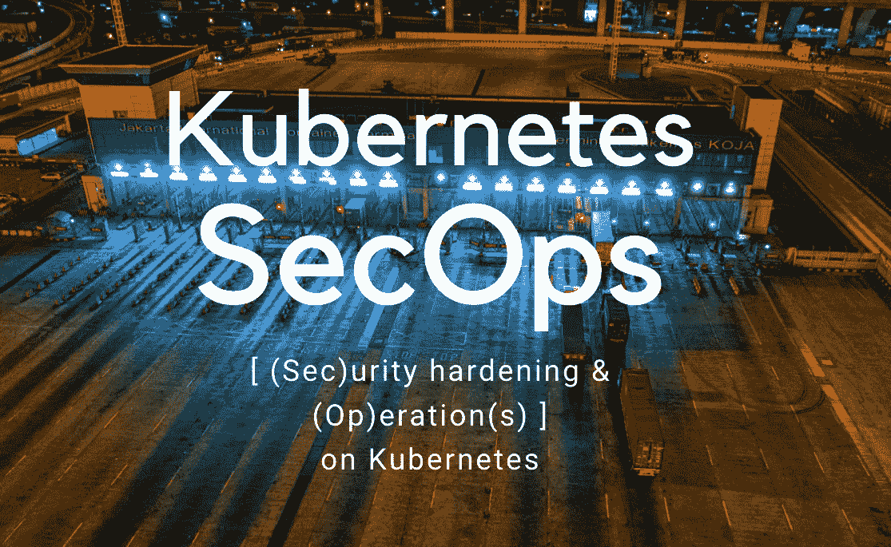
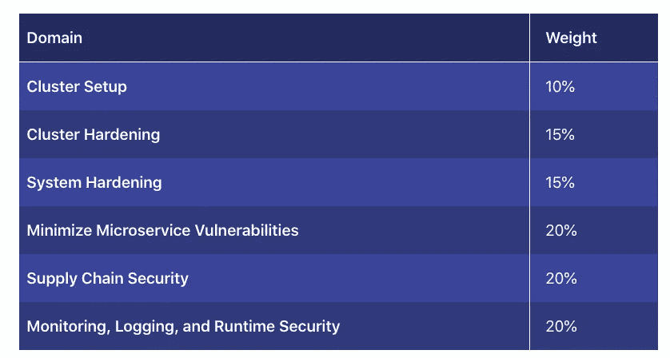
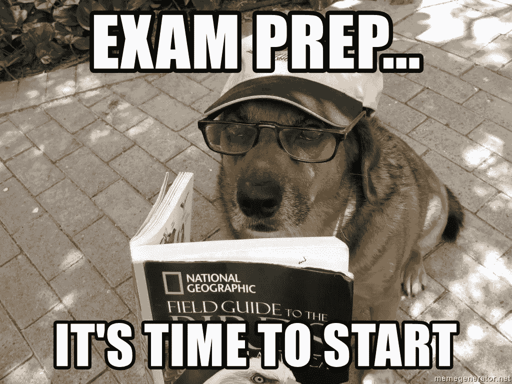
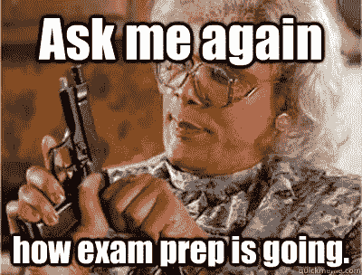
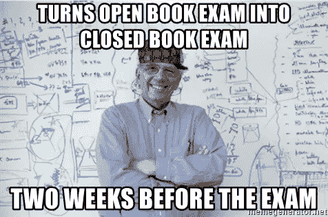

# 一个伟大的 CKS Kubernetes 安全考试准备指南，以帮助您通过

> 原文：<https://itnext.io/great-cks-kubernetes-security-exam-preparation-guide-to-help-you-pass-14fe5ab30ce1?source=collection_archive---------0----------------------->

概括一下我的考试怎么样，以及我的学习过程，这样它也能帮助你通过考试

> 如果一开始你没有成功，就继续尝试。

我希望分享我的考试经验，提供一些学习技巧和资源，以及对你自己的考试`ReadinessProbe` *(你看到我在那里做了什么吗？)*

## 什么是认证 Kubernetes 安全专家考试？

根据 CNFC 的说法，CKS 考试“保证了 CKS 在构建、部署和运行时保护基于容器的应用程序和 Kubernetes 平台的广泛最佳实践方面拥有技能、知识和能力。”

与托管服务产品相比，普通独立 Kubernetes 提供了大量功能，无论使用何种云平台，您都可以通过掌握 Kubernetes 集群的安全状况来获得大量 SecOps 印象分。

认证 Kubernetes 管理员认证是认证 Kubernetes 安全认证的先决条件。正如您可能已经在 Kubernetes 文档中看到的，在准入控制、高级策略和永无止境的自定义资源定义的每个方面都有大量的实现细节，这些都可以由第三方创建和管理

该认证是验证您的技能和知识的又一次绝佳机会，现在安全性已成为 Kubernetes 重点认证课程不可或缺的一部分。

[报名考试](https://training.linuxfoundation.org/certification/certified-kubernetes-security-specialist/)

> *完成 CNCF·库伯内特认证课程(CKA、CKAD 和现在的 CKS)是一项个人挑战。集装箱运输和服务网是我一直感兴趣的领域。*

# 考试经历

在我看来，这是一个艰难但公平的认证成就。

我在 Kubernetes 和 containerisation 工作了大约三年，最近的工作是服务网格实现。作为 CKS 考试的先决条件，CKA 提供了一个很好的基础框架。

该认证不仅涵盖了一般的 kubernetes 集群管理知识，还包括一定程度的深度，尤其是您应该非常熟悉的自我管理的主 api 服务器配置。

考试材料汇集了`Dockerfile`清单管理以及静态([**【SAST】**](https://www.gartner.com/en/information-technology/glossary/static-application-security-testing-sast))和运行时([**【DAST】**](https://en.wikipedia.org/wiki/Dynamic_application_security_testing))漏洞评估和预防的安全最佳实践。有趣的是，其中一些工具是由 kubernetes 配置生态系统之外的团队和供应商开发的。这就是为什么这是一个伟大的全能认证，应该认真考虑在这个领域工作的高级专业人员。

我过去写过一些博客文章，涉及一些 CKS 测试过的元素，比如 [**污点&容忍**](https://medium.com/contino-engineering/why-separate-your-kubernetes-workload-with-nodepool-segregation-and-affinity-rules-cb5225953788)***为什么要用节点池隔离和关联选项来分离 Kubernetes 工作负载*和 [**集群网络安全**](/how-to-kubernetes-cluster-network-security-f19bc99161f5) 文章。最后，从[服务网的角度来看](https://medium.com/contino-engineering/planning-for-istio-a-hard-look-at-the-requirements-the-want-for-service-mesh-solution-smaas-454d44793961)——稍微高级一点，但是如果你想更深入地研究这个主题，这是很好的。
如果你想深入了解 [KubeCon](/my-key-takeaways-on-cloud-native-kubecon-conference-cncf-2020-thusfar-cb1dfae85a4e) 和 ServiceMeshCon，我最近在这里介绍了最好的**关键** c [会议要点，在这里还有 GitOps 上更深入的](https://medium.com/faun/the-key-takeaways-of-cloud-native-compute-foundation-survey-of-2020-40fdc77acdcd)[。](/my-notes-on-kubernetes-and-gitops-from-kubecon-servicemeshcon-sessions-2020-cncf-c06893643bb5)**

# **考试准备**

**考试准备是对现有知识的一个很好的验证，并突出了虽然不经常使用，但被发现对澄清和了解差距最有帮助的领域，如 Pod 安全策略。**

**考试知识的深度和广度在很大程度上涵盖了以下领域:**

*   **Docker 形象开发最佳实践和 [Docker 框架模型](https://docs.docker.com/get-started/overview/)**
*   **了解以下特定工具(如 CIS Kube-bench、Trivy、Sysdig/Falco、AppArmor、Seccomp、OPA/Gatekeeper)**
*   **广泛熟悉 API 服务器，包括扩展和调优(准入控制、审计)方面的问题调试**
*   **[希望了解 linux 基础知识，尤其是 cGroup 映射的安全性——更多详细信息，请访问精彩的博客链接](https://www.linuxjournal.com/content/everything-you-need-know-about-linux-containers-part-i-linux-control-groups-and-process)**
*   **全面了解 Kubernetes 架构和组件交互 (RBAC、网络策略、PSP 等)。)**

# **学习资源**

**我发现以下资源对准备 CKS 考试非常有帮助。从周末的视频开始，更容易进入学习模式。阅读材料的后续。你可以混合搭配，这样效果会更好。**

## ****视频**消费，进入`study zone`:**

*   **[Kubernetes 安全最佳实践](https://www.youtube.com/watch?v=wqsUfvRyYpw) 101 — Youtube 视频**
*   **[保护你的集装箱](https://www.youtube.com/watch?v=iXz4i2EbB4M) — Youtube 视频**
*   **[与库伯内特斯 Grips 打成一片](https://www.youtube.com/watch?v=4HMRFcg6nEY) — Youtube 视频**
*   **[使用有效的 RBAC](https://www.youtube.com/watch?v=Nw1ymxcLIDI) — Youtube 视频**
*   **[了解 Pod 安全策略](https://www.youtube.com/watch?v=LYwD2MVyaIw) — Youtube 视频**
*   **[法尔科简介](https://www.youtube.com/watch?v=zgRFN3o7nJE) — Youtube 视频**
*   **[Secomp 简介](https://www.youtube.com/watch?v=Ro4QRx7VPsY) — Youtube 视频**

## **补充**阅读**材料:**

*   **Cillium Networks 的[网络策略编辑器](https://cilium.io/blog/2021/02/10/network-policy-editor)——在这个工具上，网络策略的可视化表现和创建令人惊叹！​**
*   **[Kubernetes Pentest 方法论](https://securityboulevard.com/2019/08/kubernetes-pentest-methodology-part-1/) 2019 —但仍然相关，值得一读**
*   **[保护 Kubernetes 集群](https://www.cyberark.com/resources/threat-research-blog/securing-kubernetes-clusters-by-eliminating-risky-permissions) —消除风险许可**
*   **全 CKS 的 Udemy 课程**
*   **[集群安全最佳实践](/cks-exam-series-1-create-cluster-security-best-practices-50e35aaa67ae) —中等职位**
*   **[斯塔克罗斯 CKS 学习指南](https://security.stackrox.com/rs/219-UEH-533/images/StackRox_CKS_K8s_Study_Guide.pdf)**
*   **令人敬畏的 CKS 笔记**

## ****模拟考试**同 CKS 考试 Sim:**

*   **[CKS 考试模拟器](https://killer.sh/) — Killer.sh**

****

# **主要考试技巧**

*   **注意保持时间 **考试没有倒数计时器，这非常有用。有一个时间栏，但很难评估它在哪里，毕竟我们习惯于看到实际的剩余时间。****
*   ****小心问题/考试 ***环境错误***
    我希望我能说这是直截了当的问题，但要做好考试窗口崩溃、考试重新开始的准备，更糟糕的是，一些问题将引用错误命名的问题组件。即“允许”对“盟友”，如果有疑问，我用两个名字保存。****

# ****kubernetes-本地考试材料****

*   ****准入控制器
    确保您熟悉不同类型，如`PodSecurityPolicy`和`ImagePolicyWebhook`。实现并理解它们如何与 API 服务器协同工作，以及它们如何为集群提供额外的安全性。[https://kubernetes . io/docs/reference/access-authn-authz/admission-controllers/](https://kubernetes.io/docs/reference/access-authn-authz/admission-controllers/)****
*   ****不可变的**容器** 使用`securitycontext`找到使容器不可变的方法，并避免可变的配置，比如允许 shell 访问容器。不可变容器很好，因为我们总是知道状态！****
*   ****`NetworkPolicies` [为了获得额外的安全性和对 pod 之间流量的更多控制，请使用网络策略。默认情况下，集群中的所有单元都可以相互通信，获得更精细的信息，并创建特定的规则来定义流量。](https://kubernetes.io/docs/concepts/services-networking/network-policies/​)****
*   ****`PodSecurityPolicies*`
    这可以实现微调的资源授权。这可能是安全工作负载运行时的最大资产之一。(这是被**弃用的*** 很快赞成 OPA，一些[的博文在这上面读到了](https://blog.paloaltonetworks.com/prisma-cloud/kubernetes-psp-deprecation/#:~:text=Back%20in%20December%2C%20the%20Kubernetes,being%20exposed%20to%20various%20exploits.))
    [https://kubernetes . io/docs/concepts/policy/pod-security-policy/](https://kubernetes.io/docs/concepts/policy/pod-security-policy/)****
*   ****`gVisor` — [内核沙箱](https://github.com/google/gvisor)
    这是一个内核沙箱和抽象实现，有助于防止恶意应用程序和映像使底层主机内核过载。**** 

********

# ****第三方工具考试材料****

****CKS 标准中充分提到了以下内容。****

****这些是一些开源工具和项目的例子，在 kubernetes 生态系统之外，为了成功通过考试，建议**实践一下。******

*   ****[**AquaSec 开源 Kube-Bench**](https://github.com/aquasecurity/kube-bench)
    轻松针对你的集群执行。在 worker(和 master)节点上下载二进制文件，并运行二进制文件`kube-bench` worker|master 以获得集群检查报告。这将是一个很好的起点。****
*   ****[**Aquasec/trivy**](https://github.com/aquasecurity/trivy)图像扫描工具——是一款非常简单的图像扫描工具。****
*   ****[**AppArmor**](https://gitlab.com/apparmor/apparmor/-/wikis/Documentation)练习加载新的配置文件，然后与您的 pod 一起使用。AppArmor 是预装的。****
*   ****[**法尔科**](https://falco.org/docs/rules/supported-fields/)练习寻找所有的`falco`规则并搜索特定的规则并改变它们的输出和捕捉特定的输出。****

# ****从预约考试开始****

****如果你和我一样，你可能会通过先预约考试来组织你的时间表，以确保你能参加考试。请记住，先决条件是 CKA 认证。****

****需要记住的最后一个提示是——这是一个**开卷考试。但是你没有时间开始“寻找”答案。你需要知道去哪里得到它们。练习搜索，你会没事的。******

********

****别担心，这不太可能发生。你只需要做好准备。:)****

****已经通过考试了？进展如何，请在下面的评论区分享你的经历。事实上，[联系一下，你可能想马上开始在云原生的 Kubernetes 工作流上工作。我们一直在招人！](https://www.linkedin.com/in/johas/)****