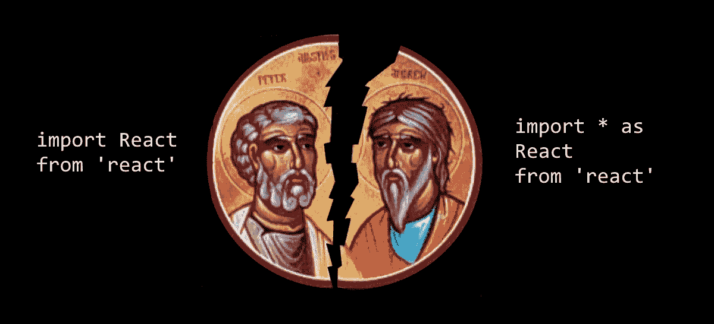

# 大进口分裂:解释围绕进口的打字稿混乱

> 原文：<https://itnext.io/great-import-schism-typescript-confusion-around-imports-explained-d512fc6769c2?source=collection_archive---------0----------------------->



我使用 typescript 已经有一段时间了，在理解它的模块和相应的设置方面有相当多的问题，我不得不说围绕它有很多困惑。命名空间，`import * as React from 'react'`，`esModuleInterop`等等。所以让我试着解释一下这到底是怎么回事。

我不会把名称空间作为 typescript 中的一个模块系统来讨论，因为这个想法并不太好(至少考虑到当前的发展方向)，而且目前没有人使用它们。

那么，在 `esModuleInterop`之前我们有什么*选项呢？我们有几乎与 babel 或 browsers 相同的模块，特别是考虑到命名的导入/导出。但是关于默认的导出和导入，typescript 有它自己的处理方式，我们不得不写`import * as React from 'react'`(而不是`import React from 'react'`)，当然，我不只是在说 react，而是关于所有来自 commonjs 库的默认导入，为什么呢？*

为了解决这个问题，让我们看看 commonjs 和 es6 模块中的一些模式之间的互操作性是如何工作的。例如，我们有一个模块将`foo`和`bar`导出为键控对象:

```
module.exports = { foo, bar }
```

我们可以使用 require 和 destructuring 来导入它:

```
const { foo, bar } = require('my-module')
```

并使用命名导入应用相同的原则(尽管公平地说它不是析构的):

```
import { foo, bar } from 'my-module'
```

但是在 commonjs 代码中更常见的模式是`const myModule = require('my-module')`(因为我们还没有析构)那么在 es6 中我们如何做呢？

当开发 es6 导入的规范时，一个重要的问题是与 commonjs 的互操作性，因为 commonjs 中已经有很多代码了。这就是违约进出口的由来。是的。他们唯一的目的是用 commonjs 提供一个互操作，所以我们可以写`import myModule from 'my-module'`并得到同样的东西。但是从规范中并不清楚，另外，互操作的实现是 transpiler 开发者的特权。于是这里发生了大分裂:`import React from 'react'` vs `import * as React from 'react'`。

typescript 为什么挑了后者？想象自己是一名 transpiler 开发人员，问自己，*将 es6 导入文件转换到 commonjs 的最简单方法是什么？*。假设我们有以下一组导出和导入:

```
export const foo = 1
export const bar = 2
export default () => {}import { foo } from 'module'
import func from 'module'`
```

因此，让我们使用带有`default`键的 js 对象进行默认导出！

```
module.exports = {
  foo: 1,
  bar: 2,
  default: () => {}
}const module = require('module')
const foo = module.foo
const func = module.default
```

好吧，酷，但是互操作呢？如果默认导入意味着接受名为`default`的字段，那么当我们写`import React from 'react'`时，它的意思是`const { default: React } = require('react')`，但这是行不通的！让我们使用 *star imports* 来代替，这样用户将不得不编写`import * as React from 'react'`来获取`module.exports`中的内容。

但是这里有一个语义上的区别。Commonjs 就像普通的 javascript，仅此而已。只有函数和对象，js 规范中没有`require`。另一方面，ES6 import 现在是规范的一部分，所以在这种情况下,`myModule`不仅仅是一个普通的 javascript 对象，而是一个名为名称空间(而不是 typescript 名称空间)的东西，因此具有特定的属性。其中之一是名称空间是不可调用的。有人可能会问，这算什么问题？

让我们尝试另一个 commonjs 模式，用一个函数作为导出:

```
module.exports = function() { // do something }
```

我们可以要求并执行它:

```
const foo = require('my-module')
foo()
```

尽管如果在符合规范的环境中使用 ES6 模块尝试这样做，您会得到错误消息:

```
import * as foo from 'my-module'
foo() // Error
```

因为名称空间不仅仅是 javascript 对象，而是包含每个 es6 导出的特定内容。

但是 Babel 做对了，并且提出了某种互操作，所以我们可以写`import React from 'react'`并且它会工作。它所做的是在传输时，在`module.exports`中用一个特殊的标志来标记每个 es6 模块，这样我们就可以看到这个标志是真的并返回`module.exports`还是假的(很明显，如果库是 commonjs 并且没有被传输)，然后我们将在`{ default: export }`中包装当前的导出，这样我们每次都可以使用`default`([见这个](https://babeljs.io/repl#?babili=false&browsers=&build=&builtIns=false&spec=false&loose=false&code_lz=JYWwDg9gTgLgBAJQKYEMDG8BmUIjgcilQ3wChTl0YA6NIlGJAUQBskQkA7GACgEogA&debug=false&forceAllTransforms=false&shippedProposals=false&circleciRepo=&evaluate=false&fileSize=false&timeTravel=false&sourceType=module&lineWrap=true&presets=es2015%2Creact%2Cstage-2&prettier=false&targets=&version=6.26.0&envVersion=))。

Typescript 与 star imports 进行了斗争，但最终放弃并引入了`esModuleInterop`编译器选项。这个选项基本上和 babel 做同样的事情，如果你启用它，你可以写普通的`import React from 'react'`，typescript 会做这个工作。

问题是，尽管它默认为新项目启用(当你运行`tsc --init`时)，但它不适用于现有项目(即使你更新到 TS 3)，因为它不是向后兼容的，所以你必须重写不需要的 star 导入以支持默认导入。React 很好，因为它有一堆命名的导出，但是带有可调用名称空间的例子就不行了。但是不要担心，如果关于导出的类型是正确的(而且它们大部分是正确的，因为它们自动地修复了很多导出类型。)

所以我真的提倡使用`esModuleInterop`选项，因为它不仅允许您编写更少的代码，更容易阅读和规范兼容的代码(而且它不仅仅是咆哮，例如 rollup 不允许您以这种方式使用 star imports)，而且还减轻了 typescript 和 babel 社区之间的一些摩擦。
需要注意的是，只有当 target 是< = ES5 时，`esModuleInterop`才会自动启用合成默认导入。所以如果你启用了这个选项，但是编译器仍然会抱怨`import React`，检查你的目标，也许会启用合成默认导入(或者重启你的 vs 代码/webstorm，你永远不知道:)。

我希望这个解释对你来说已经很清楚了，但是如果你有任何问题，请在评论或者推特上提问！