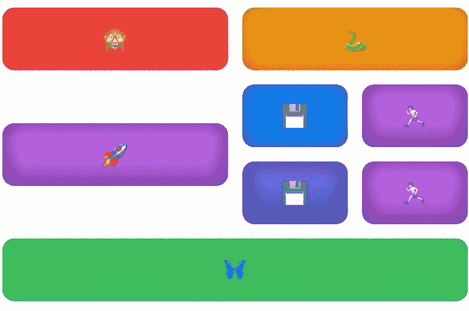
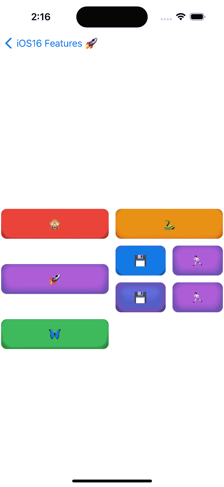
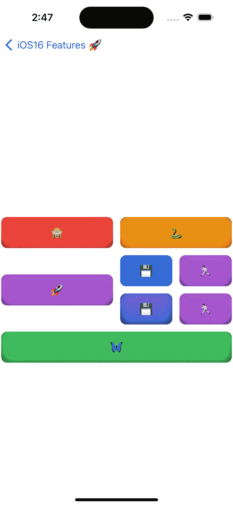

# SwiftUI 网格布局，还是只是一堆 HStacks？

> 原文：<https://itnext.io/grid-layout-or-is-it-just-a-banch-of-hstack-whats-new-in-swiftui4-f536acdb8fc2?source=collection_archive---------4----------------------->

## 三年后，我们终于在 SwiftUI 中实现了原生网格！


凯莉·西克玛在 [Unsplash](https://unsplash.com?utm_source=medium&utm_medium=referral) 上的照片

> 本文是 iOS 16 和 Mac OS 13 中 SwiftUI4 新功能系列文章的一部分。如果你愿意看以前的文章，这里有第一篇文章的链接:[swift ui navigation stack——如何去深度链接和新功能](https://medium.com/better-programming/swiftui-navigation-stack-how-to-deeplink-and-whats-new-64b1401cb9af)。其余的你可以直接在我的个人资料页面找到。现在，让我们继续阅读。

很久以前(或者说毕竟不是很久以前)在 Apple API 的《很远很远》中，在 SwiftUI 中实现网格可能会有点痛苦，至少可以这么说。主要是从代码的角度来看。

但在 iOS 16 中，我们将获得一个新的网格布局，以及一个名为 Layout 的自定义布局的实现协议。第二个很快会有一篇单独的文章，但是今天，让我们来关注这篇文章的主角:网格。

对于今天的文章，我将使用本系列以前的部分，例如我创建的摊牌库:

[](https://github.com/LSWarss/iOS-16-MacOS-13-SwiftUI-Showdown) [## GitHub—lsw arss/iOS-16-MAC OS-13-swift ui-摊牌:新的 SwiftUI 4 为 iOS16+提供了示例应用

### 你正面临着 iOS16 和 MacOS13 带来的所有新功能。下面你会看到…

github.com](https://github.com/LSWarss/iOS-16-MacOS-13-SwiftUI-Showdown) 

# 先决条件

首先，让我们讨论一下我们将使用什么以及如何使用:

## 一个简单的`view`

这代表一个字符，可以是表情符号或文本；没关系。有彩色背景。并且嵌入字符的视图可以缩放到容器的整个宽度。

它看起来像这样:


字符视图

## 新的`GridLayout`

我们将使用它来创建一个复杂的布局，它将包含以下内容:

*   第一行将有两个角色视图
*   第二行，有一个角色视图和四个角色视图的集合
*   第三行横跨整个屏幕宽度，只有一个字符视图

最终效果将如下所示:



角色视图网格

## 履行

新`GridLayout`的实现过程非常简单。您用单词`Grid`指定它，用`GridRow`指定行。之后，我们将需要的每个视图传递到呈现的网格中。代码如下:

```
struct GridScreen: View {
    var feature: Feature

    var body: some View {
        VStack {
            Text(feature.description)
                .font(.footnote)
                .padding()

            Spacer()

            Grid {
                GridRow {
                    getCharacterView(character: "🙈", .red)
                    getCharacterView(character: "🐍", .orange)
                }

                GridRow {
                    getCharacterView(character: "🚀")

                    Grid {
                        GridRow {
                            getCharacterView(character: "💾", .blue)
                            getCharacterView(character: "🏃🏻")
                        }

                        GridRow {
                            getCharacterView(character: "💾", .indigo)
                            getCharacterView(character: "🏃🏻")
                        }
                    }
                }

                GridRow {
                    getCharacterView(character: "🦋", .green)
                        .gridCellColumns(2)
                }
            }
        }
    }

    @ViewBuilder func getCharacterView(character: String, _ color: Color = .purple) -> some View {
        Text(character)
            .frame(maxWidth: .infinity)
            .padding()
            .background(color.gradient.shadow(.inner(radius: 10)))
            .cornerRadius(10)
            .padding(2)
    }
}
```

视图将会是这样的:



这几乎是我们想要的，但是最后一个单元格没有跨越两行。这是为什么呢？这是因为布局是根据每行的元素数量来设置的。因此，如果前两行或后两行的元素比最后一行多，每行的元素数就会增加。

现在该怎么办呢？我们只需将这一行添加到最后一行:

```
.gridCellColumns(2)
```


代码中最后一个 GridRow 的网格布局

用户界面看起来就像我们希望的那样。您还可以删除最后一个元素的`GridRow` ，它将跨越所有单元格。它的代码应该是这样的:

```
 GridRow {
                    getCharacterView(character: "🦋", .green)
                        .gridCellColumns(2)
                }
```

结果是一样的:



代码中没有最后一个 GridRow 的网格布局

正如您在上面的代码中看到的，如果您要将更多的行传递到其中一个`Grid` 行中，UI 将相应地扩展，这使得它非常容易以一种非常快捷的 UI 方式使用。

*感谢阅读！敬请关注更多内容。*