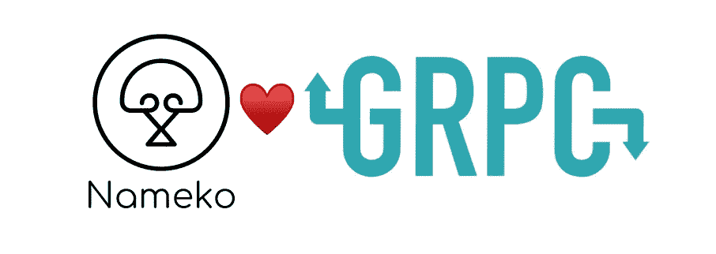
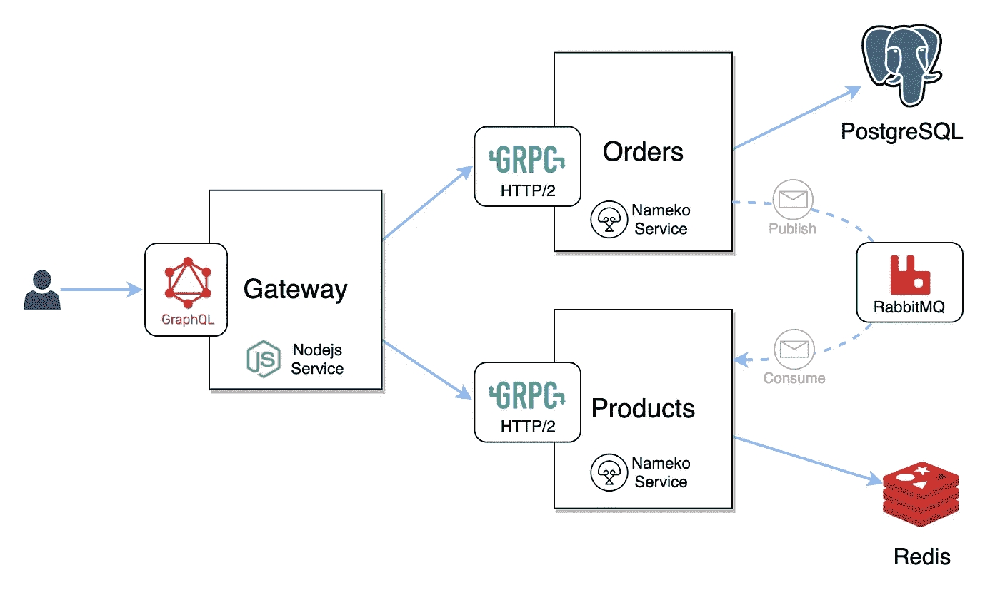
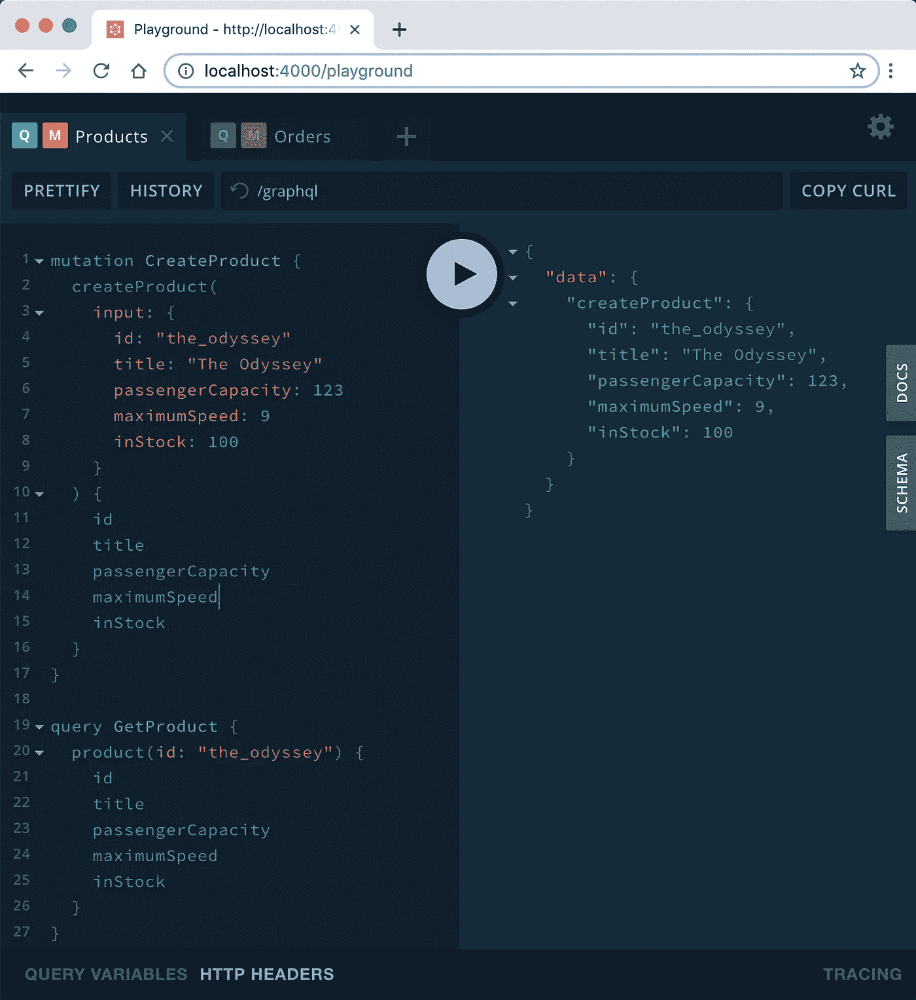

# 带 Nameko 的 gRPC APIs

> 原文：<https://itnext.io/grpc-apis-with-nameko-11bbd9492225?source=collection_archive---------4----------------------->

Nameko 已经准备好和院子里的孩子们一起玩了。

gRPC 是快速跨平台 RPC 通信的伟大工具。由于支持多种语言，它降低了不同服务实现之间的障碍。

Nameko 是一个用于构建 Python 微服务的健壮框架。Nameko-gRPC 扩展库刚刚登陆，在本文中，我将向您展示如何通过 Nameko 轻松利用 gRPC 的强大功能。

> **https://github.com/nameko/nameko-examples-grpc**:此处直接进入 Nameko gRPC 的实现示例:[这里是](https://github.com/kooba/nameko-examples-grpc)

传统上，要与 Nameko 服务通信，您可以选择使用 HTTP REST APIs 或实现 Nameko 自己的 RPC over AMQP 协议。Nameko 的 RPC 虽然相当简单并且独立于语言，但它不是一个标准，必须为每种语言/平台独立实现。

新的 gRPC 扩展为 Nameko 带来了许多新的机会，其中包括:

*   公开和使用堆栈中其他服务的 API 的直接方法。
*   很好地处理了 [Istio](https://istio.io/) 类型的服务网格部署。
*   能够为您的服务编排金丝雀部署。

## 使用 Nameko-gRPC

与其他 Nameko 扩展一样，Nameko-gRPC 库为我们提供了入口点和客户端代理实现。

让我们从定义我们的 [**Protobuf**](https://developers.google.com/protocol-buffers/docs/proto3) 服务定义开始:

要公开上面定义的 gRPC 入口点，只需在方法实现中添加`@grpc` decorator:

您的方法名对应于 protobuf 定义中描述的服务方法名，在我们的例子中是`get_product`。它接受两个参数:

*   `request`在我们的例子中是 gRPC 请求消息类型的一个实例`GetProduct`
*   `context`允许您访问 gRPC 和 Nameko 请求元数据

要使用 gRPC 服务，您可以使用 **GrpcProxy** :

## 跨平台示例

对于这些概念的端到端说明，您可以看看示例存储库【https://github.com/nameko/nameko-examples-grpc[，它展示了公开 GraphQL API 的 NodeJS 网关服务和公开 gRPC APIs 的 Nameko 服务之间的跨平台集成。](https://github.com/kooba/nameko-examples-grpc)

示例的高级架构:

NodeJS 服务使用 Nameko gRPC API

主要组件有:

*   **网关:**带有 GraphQL API 的 NodeJS 服务。
*   **订单:**使用 gRPC API 和 PostgreSQL 作为数据存储的 Python Nameko 服务。该服务还将发布`order_created`事件。
*   **产品:**以 gRPC API 和 Redis 为数据存储的 Python Nameko 服务。该服务也将消耗`order_created`事件。

网关节点服务为我们的 API 公开了简单的 GraphQL 模式:

网关的 GraphQL 模式

要使用这些示例，请遵循存储库的自述文件中描述的步骤，并启动 GraphQL Playground。在那里你可以运行我们可用的查询和突变。

GraphQL 游乐场

我们示例中的 GraphQL 模式解析器使用 NodeJS gRPC 客户端，这些客户端配置了与 Nameko 服务本身使用的相同的产品和订单 Protobuf 服务定义。

## 结论

将 Nameko 引入您现有的微服务平台从未如此简单。如果您已经在使用 gRPC 进行服务对服务的通信，Nameko 将非常适合。有了 Nameko，您的开发人员可以专注于实现应用程序逻辑，同时利用丰富的 Python 生态系统。

头来举例:
https://github.com/nameko/nameko-examples-grpc

Checkout Nameko-gRPC 实现:
[https://github.com/nameko/nameko-grpc](https://github.com/nameko/nameko-grpc)

访问 Nameko:
网站:[https://www . Nameko . io](https://www.nameko.io/)论坛:[https://discourse . Nameko . io](https://discourse.nameko.io/)推特:[https://twitter.com/nameko_python](https://twitter.com/nameko_python)