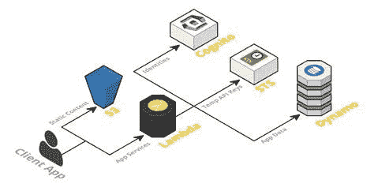
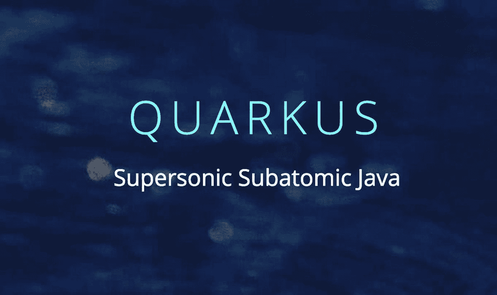
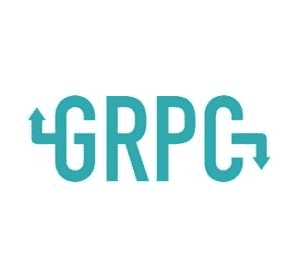

# Kubernetes 上的 gRPC GO 微服务

> 原文：<https://itnext.io/grpc-go-microservices-on-kubernetes-bcb6267e9f53?source=collection_archive---------2----------------------->

# 介绍

最近，我正在研究在云上运行[](https://en.wikipedia.org/wiki/Microservices)**微服务的**最具成本效益的方式**。两个流行的选项是 [**无服务器**](https://en.wikipedia.org/wiki/Serverless_computing) 云函数和 [**Kubernetes**](https://kubernetes.io/) 上的容器。我计划将来写一篇关于无服务器与 Kubernetes 的文章，但简单地说，与非常复杂的 **Kubernetes** 相比，像 [**AWS Lambda**](https://aws.amazon.com/lambda/) 这样的无服务器功能运行起来非常**便宜**并且**容易**上手。无服务器的一个问题是，这些功能与许多其他云服务集成，并以这种方式工作，随着应用程序的扩展，其中一些服务可能会变得非常昂贵。这就是为什么一些公司从无服务器转向 Kubernetes，以更好地控制成本和减少开支。**

****

**我已经谈到了 Quarkus，这是一个很好的框架，可以用来编写在 Kubernetes 上非常高效运行的云原生 Java 应用程序。Quarkus 的内存占用更少，因此您可以以更低的成本获得更多的计算能力，也就是说，在集群中运行更多的容器。**

****

**但是，我们能做得更好吗？有两个方面需要考虑:一个是通信协议，另一个是编程语言。**

# **gRPC**

**我已经在[之前的一篇文章](https://medium.com/@javier.ramos1/service-mesh-vs-kafka-f60c00044f20)中谈到过**休息**vs**卡夫卡**。我知道比较这两种技术听起来有点疏远，但是有两种流行的通信方式。 **Kafka** 用于**事件驱动的**微服务和异步处理，特别是流处理。REST 或 HTTP 服务主要用于同步通信。为了更容易部署、运行和维护您的服务，创建了[服务网格](https://en.wikipedia.org/wiki/Service_mesh)。**

****

****Google** 提出了另一个解决方案，即 [**gRPC**](https://grpc.io/) ，现在由云原生基金会维护。这个想法并不新鲜，它类似于 CORBA 或 Java[**EJB**](https://en.wikipedia.org/wiki/Enterprise_JavaBeans)，它们是[远程过程调用](https://en.wikipedia.org/wiki/Remote_procedure_call)。但在相当多的方面是独一无二的。**主要部件**有:**

*   **[**Protobuf**](https://en.wikipedia.org/wiki/Protocol_Buffers) (协议缓冲区):gRPC 使用该协议进行通信，这是 Google 为了克服 REST 架构中使用 JSON 的局限性而创建的二进制通信协议。它是二进制的，这意味着它需要更少的 CPU 和内存，因此性能更好。它还具有语义意义，因此模式在定义中允许我们有更多的灵活性。**
*   **[**HTTP/2**](https://en.wikipedia.org/wiki/HTTP/2) : gRPC 采用新的 HTTP 规范，支持双向通信、服务器数据推送、压缩和复用。这使我们能够使用 HTTP 协议以更有效的方式实时传输数据。**

**gRPC 可以跨多种编程语言工作，非常高效。从 REST 迁移到 gRPC 可以减少所需的资源量，并允许我们在集群中运行更多的容器，从而消耗更少的资源。这是提高性能和降低成本的好方法。请注意，HTTP/2 仍然没有得到广泛的支持，特别是在 web 浏览器中，尽管已经开发了 [**gRPC Web**](https://github.com/grpc/grpc-web) 来解决这个问题。 [**gRPC Gateway**](https://github.com/grpc-ecosystem/grpc-gateway) 是一个工具，它允许我们生成具有相同定义的 REST 和 gRPC 服务，允许我们支持旧客户端。gRPC 还支持使用反射的服务发现，您可以使用 *cli* 交互地查询您的服务。一般来说，建议开始将内部服务迁移到 gRPC，并使用 REST 提供面向外部的 API，因为 REST 提供了更多工具，如服务网格和 API 管理。**

**它的工作方式是:你创建一个*。proto* 文件，然后使用 protobuf 编译器为给定的语言生成存根文件(调用服务的代码)。您可以为多种语言创建存根，它们都可以相互通信。**

# **去**

**[**Go**](https://en.wikipedia.org/wiki/Go_(programming_language)) 是谷歌出于并发和并行的考虑而创造的一种编程语言。它是一种强类型语言，使得并发微服务的开发变得非常容易和高效。它还被编译成高效的二进制代码，这使得它成为在容器中运行的最佳选择。随意尝试他们网站上的 [**教程**](https://golang.org/) 来熟悉这门语言。事实证明，Go 可能是继 C++之后更高效的语言，但它使用起来要简单得多。**

****

**我相信 gRPC 和 Go 的**组合是在 Kubernetes 上运行应用程序的一个非常好的工具包，非常高效和便宜**。与使用常规的 Spring Boot 容器或 node.js 相比，您可以在相同的硬件上运行更多的服务**

# **把手举起来。**

**那么，我如何使用 gRPC 构建 Go 微服务呢？这很简单。首先，您需要使用协议缓冲区来定义对象和服务。这是一个简单的服务定义:**

**gRPC 服务**

**您需要定义一个包，在 Go 中生成服务存根时将使用这个包。然后定义 protobuf 消息，它有一个类型和名称，然后是一个序列号。然后定义一个简单的服务。**

**然后需要安装 [**编译器**](https://github.com/golang/protobuf) 并运行:**

```
protoc grpcapi.proto --go_out=plugins=grpc:.
```

**要为 Go 服务生成代码，您也可以为其他语言生成存根。这将生成一个 *grpcapi.pb.go* 文件，其中包含与服务交互所需的 go 代码，服务器和客户端都需要这个文件。你可以在这里找到 API [的源代码](https://github.com/javiramos1/grpcapi)。**

**一旦你有了服务，你需要做的就是编写服务器和客户端。我不会深入代码的细节，因为它实际上很容易理解。我们所做的就是实现在 *grpcapi.pb.go* 文件中定义的接口。**

**Go 服务器**

**我们所做的就是实现 GrpcService 方法，然后启动服务器。我们使用一个通道来检测服务何时存在，以关闭连接。我们还使用了环境变量，因此我们可以从 Kubernetes 设置主机和端口，尽管为了简单起见我跳过了这一步。你可以在这里找到服务器代码[。](https://github.com/javiramos1/grpc_server)**

****客户端**也很简单:**

**转到客户端**

**客户端还导入 API 并进行 RPC 调用。如果我们愿意，我们还可以通过保持连接开放来实时传输数据。你可以在这里找到源代码。**

**要测试服务器运行:**

```
go run server.go
```

**要测试在另一个终端上运行的客户端:**

```
go run client.go
```

# **库伯内特斯**

**在 Kubernetes 中运行服务器非常简单。首先，我们需要构建源代码来创建二进制文件:**

```
CGO_ENABLED=0 GOOS=linux go build -o grpc_server -ldflags "-s -w -a -installsuffix cgo server.go
```

**这将为 Linux 创建一个没有依赖关系的二进制文件。**

**然后创建并推送映像:**

```
docker build -t javierramos1/grpc_server .                       docker push javierramos1/grpc_server
```

**现在我们已经有了存储库中的图像，我们可以将它部署到 Kubernetes。可以用 [**MicroK8s**](https://microk8s.io/) 来测试一下。您可以首先在 Docker 中运行以下命令来测试它:**

```
docker run --rm -p 50051:50051 javierramos1/grpc_server
```

**使用客户端再次测试。**

**一旦你安装了 MicroK8s。您可以运行以下命令将它部署到 Kubernetes:**

```
kubectl run grpcserver --image=javierramos1/grpc_server --port=50051 --expose
```

**这将创建一个部署和一个服务。使用:**

```
kubectl get services
```

**获取部署的 IP 地址并相应地更改客户端来测试服务。**

**这就是你在 Kubernetes 上运行的微服务。您可以将其扩展到数千个单元，以检查 gRPC 和 Go 的效率和速度。**

**如果您有任何问题，请告诉我，并随时在 Twitter 上关注我。**

**我希望你喜欢这篇文章。欢迎发表评论或分享这篇文章。跟随[***me***](https://twitter.com/JavierRamosRod7)*进行未来的帖子。***