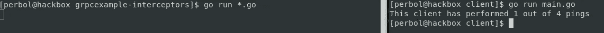
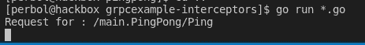

# gRPC 中的拦截器

> 原文：<https://itnext.io/grpc-interceptors-e221aa4cc49?source=collection_archive---------0----------------------->

## 它们是什么，我们如何使用它们？


由 [Thom](https://unsplash.com/@thomweerd?utm_source=unsplash&utm_medium=referral&utm_content=creditCopyText) 在 [Unsplash](https://unsplash.com/s/photos/technology?utm_source=unsplash&utm_medium=referral&utm_content=creditCopyText) 上拍摄的照片

我交谈过的许多人都非常清楚什么是中间件。然而，拦截器似乎不太为人所知。让我们剖析拦截器，学习如何使用和编写它们，以及为什么我们应该这样做。

gRPC 是一项伟大的技术，我已经用它替换了我的许多 API。我发现编写 gRPC 比常规的基于 HTTP 的 API 更容易。我建议你投入时间学习它。

这是一个系列的第二部分，然而，你**不需要先验知识**，没有第一部分和 1.1 部分也可以继续，**但是我建议阅读它们**。

*   [【第 1 部分】—使用 gRPC 和 TLS、Golang、React，无需特使](https://programmingpercy.tech/blog/using-grpc-tls-go-react-no-reverse-proxy/)
*   [[第 1.1 部分] —在 Golang 二进制文件中嵌入 React 应用程序](https://programmingpercy.tech/blog/embedd-web-application-golang/)
*   [̵p̵a̵r̵t̵̵2̵]̵̵-̵̵y̵o̵u̵'̵r̵e̵̵h̵e̵r̵e̵
*   [【第 3 部分】—使用 gRPC 传输数据](/streaming-data-with-grpc-2eb983fdee11)

在常规的 HTTP 服务器中，我们会有一个中间件来包装服务器上的处理程序。在实际提供正确的内容之前，这个中间件可以用来执行服务器想要做的任何事情，它可以是认证或日志或任何事情。

gRPC 是不同的，它允许**拦截器**在服务器和**客户端都使用**。这非常好，因为它允许 API 的用户或消费者添加任何想要的拦截器，比如定制日志。****

在我们深入挖掘拦截器之前，我相信 gRPC 本身有一些东西我们需要理解。这是 gRPC 服务的核心理念。

## gRPC 核心概念

我们必须理解 gRPC 服务中使用的两个词。我们大多数人也在使用一元词。您发送一个请求，得到一个响应。
**Stream** 是你改为发送或接收 protobuf 消息的数据管道。这意味着，如果 gRPC 服务用一个流来响应，那么消费者可以在这个流中得到不止一个响应。流是由关键字流引起的，很简单吧？

简而言之，gRPC 允许四个不同的 RPC 调用。

*   **一元 RPC** 一元 RPC 是指一个客户端可以发送一个请求，并得到一个响应。
*   **服务器流 RPC** 服务器流 RPC 是客户端发送一元请求，但返回一个流
*   **客户端流 RPC** 客户端流 RPC 是当客户端发送流请求时，返回一元响应。当使用完所有消息时，将发送服务器响应。
*   **双向流 RPC** 双向流是指客户端发送流请求，返回流响应。

那么我们怎么知道这些电话看起来像什么呢？
下面是一些虚构用户 RPC 服务的例子。

```
// Unary example, One request, One Response
rpc GetUser(UserRequest) returns (UserResponse);
// Server streaming example, Unary request, Stream response
rpc GetNewUsers(EmptyRequest) returns (stream UserResponse);
// Client streaming example, Stream request, Unary Response
rpc RegisterUsers(stream UserRequest) returns (StatusResponse);
// Bidirectional example, Stream request, Stream response
rpc FindUser(stream UserRequest) returns (stream UserResponse);
```

既然我们理解了 gRPC 支持的消息，那么学习拦截器就更容易了。让我们从什么是拦截器以及存在的不同种类开始。

拦截器就像它听起来的那样，它在 API 请求被执行之前拦截它们。这可以用来记录日志、认证或在处理 API 请求之前发生的任何事情。使用 HTTP APIs，这在 Golang 中很容易，您可以用中间件包装您的 HTTP 处理程序。对于 gRPC，它需要更多的知识，因此之前解释了一元和流。

有两种**拦截器**和**通信双方**。

## **两种截击机**

*   **unary interceptors**—用于 API 调用，即一个客户端请求和一个服务器响应。
*   **StreamInterceptors —** 在 API 调用中使用，在这种调用中，客户端发送请求，但接收返回的数据流，允许服务器随着时间的推移响应多个项目。实际上，因为 gRPC 是双向的，所以它也可以用于客户端发送数据。

## **双方的截击机**

*   **客户端** —客户端触发的拦截器
*   **服务器** —在服务器端触发的拦截器

还记得我说过 gRPC 拦截器比 HTTP 中的中间件更难理解吗？正因为如此，我们实际上也知道我们想要拦截哪种 gRPC 呼叫。

## 2 + 2 = 4

因为 gRPC 允许在客户机和服务器以及一元和流调用中使用拦截器。我们有 4 种不同的拦截器。

如果我们去 [go-grpc](https://godoc.org/google.golang.org/grpc) 库看看他们是如何处理的，我们可以看到四种不同的用例。这两种拦截器类型对服务器和客户机都可用。

*   这些拦截器在创建客户端流时被触发。
*   [streamservericeptor](https://github.com/grpc/grpc-go/tree/master/interceptor.go#L101)—这些拦截器在服务器上执行流之前被触发。
*   [unarcyclientinterceptor](https://github.com/grpc/grpc-go/tree/master/interceptor.go#L43)—拦截客户端的所有一元 gRPC 调用。
*   [UnaryServerInterceptor](https://github.com/grpc/grpc-go/tree/master/interceptor.go#L84) —在服务器端拦截一元 gRPC 调用。

下面的要点显示了四种的定义。

所有可用的 gRPC 拦截器类型

## [计]元数据

所以我们现在知道拦截器是什么了。是时候讨论一下我喜欢用它们做什么，为什么。gRPC 允许发送[自定义元数据](https://github.com/grpc/grpc/blob/master/doc/PROTOCOL-HTTP2.md)。元数据是**键值的一个非常简单的概念。**

如果我们查看 [golang 元数据规范](https://godoc.org/google.golang.org/grpc/metadata#MD)，我们可以看到它是一个**map[string][]字符串。**

元数据可以作为报头或报尾发送。

*   **报头**应该在数据之前**发送。**
*   **拖车**应在加工完成后发送

**元数据允许我们在不改变 protobuf 消息的情况下向请求添加数据。这通常用于添加与请求相关但不是请求一部分的数据。例如，我们可以在请求的元数据中添加 JWT 令牌作为身份验证。这允许我们用逻辑扩展 API 端点，而不改变实际的服务器逻辑。这对于**认证、速率限制或日志记录非常有用。****

## **我们走吧！**

**理论够了！我相信我们已经准备好开始测试了。如果你还没有，我建议你读一读。**

**[](https://programmingpercy.tech/blog/using-grpc-tls-go-react-no-reverse-proxy/) [## 将 gRPC 与 TLS、Golang、React 一起使用，无需反向代理(Envoy)

### 一篇关于如何在 Go 后端服务器和 React 客户端之间实现 gRPC 而不使用反向代理的文章…

编程 percy.tech](https://programmingpercy.tech/blog/using-grpc-tls-go-react-no-reverse-proxy/) 

如果你不想太——这里是我们将用作基础的[库](https://github.com/percybolmer/grpcexample)。

它是一个运行 Ping gRPC API 的简单服务器。我们将用一些拦截器来更新这个 Ping API，以了解如何去做。

首先获取存储库，构建 web 应用程序，并通过运行以下命令生成有效的 TLS 密钥

```
mkdir grpcexample-interceptors
git init
git pull [https://github.com/percybolmer/grpcexample](https://github.com/percybolmer/grpcexample)
cd cert && sudo bash certgen.sh
cd ../ui/pingpongapp && npm install && npm run build && cd ../../
```

运行程序，然后访问 [localhost](https://localhost:8080/) ，确保一切正常。

```
go run * .go
```

我们要做的第一件事是向我们的 API 添加一个 PingCounter。让我们假设这个神奇的 Ping 应用程序是卖给客户的。我们为许多客户使用相同的 gRPC 服务器和客户端。但是，我们今天为之工作的这位客户想要统计已经执行的 Pings 操作。这太棒了，我们可以用一个新奇的拦截器包装我们的**一元** Ping 函数，而不会增加我们服务器的代码。

计票将在**服务器**中完成。这意味着我们将创建的第一个拦截器是一个 **UnaryServerInterceptor。如果你不记得那是什么意思，请随意重读。**

一个 **UnaryServerInterceptor** 在 go-grpc 库中被定义为:

```
type UnaryServerInterceptor func(ctx context.Context, req interface{},  info *UnaryServerInfo, handler UnaryHandler) (resp interface{}, err  error) 
```

让我们首先创建一个名为 interceptors 的新文件夹，其中有一个名为 pingCounter.go 的文件。

```
mkdir interceptors
touch pingCounter.go
```

打开 *pingCounter.go* ，这是我们编写拦截器的地方，这个包将被称为**拦截器**。现在我们要创建一个结构体，它保存一个整数来计算 Ping 请求的数量。我喜欢使用带有拦截器的**结构作为方法**，这样很容易访问需要的数据。它还允许访问数据库，因为您的结构可以包含这一点，这在身份验证拦截器中很有用。你可以用一个全局变量来代替，但是我倾向于避免使用它们。我知道开发人员在方法中返回 gRPC 拦截器也很常见。这是另一种方式，看起来像下面的要点，来自 [go-grpc-middleware](https://github.com/grpc-ecosystem/go-grpc-middleware/blob/master/logging/zap/client_interceptors.go) 的代码。

代码来自 go-grpc-middleware 存储库，展示了它们如何返回一个函数。

我们的拦截器非常简单，它会计算自启动 API 以来 Ping 请求的数量，并将其附加到响应的**元数据**中。

该代码显示了一个超级简单的 UnaryServerInterceptor

实际上，一旦我们进入 *pingCounter.go，*之后，我们就可以花时间创建一个 **UnaryClientInterceptor。**它们被定义为

```
type UnaryClientInterceptor func(ctx context.Context, method string, req, reply interface{}, cc *ClientConn, invoker UnaryInvoker, opts ...CallOption) error
```

UnaryClientInterceptor 的示例。

现在我的 *pingCounter.go* 看起来是下面这个主旨。

pingCounter.go 外观的完整示例

我们现在需要将这个拦截器应用到服务器和客户端。打开 *main.go* 并向下滚动到第 68 行，在那里你会找到**generate lsapi。**该函数返回一个 grpc。服务器，让我们对它应用拦截器。添加拦截器是通过将它作为一个参数添加到 grpc 中来完成的。新服务器()。稍后我们将会看到链式拦截器。正如您所看到的，我们实际上并没有改变 grpc 服务的任何逻辑，只是改变了它的初始化。如果我们的服务器是某种超级高级的授权服务，那就太好了。我们轻松地添加了功能，而没有触及*服务器中的任何逻辑*

我们已经向服务器添加了一个 PingCounter 拦截器

让我们也打开*client/main . go。*我们将使用客户端来确保一切正常，然后再继续向 react 应用程序添加新功能。我们希望用 ClientPingCounter 包装 gRPC 连接，以查看客户端执行了多少次 pings。

如何给客户端添加一个拦截器的例子。

现在运行服务器，同时运行客户端进行测试。您应该看到一条消息，显示您的客户机负责多少次 pings(总是 1 次)。



运行服务器和测试客户端的示例

让我们也更新我们的 web 应用程序，以便我们可以使用附加到标题的元数据。打开*ui/pingpongapp/src/app . js*我要做的第一件事就是添加服务器发给我们的元数据。这可以通过监听“元数据”事件来完成。gRPC-web 有两个与元数据相关的事件。**头**元数据可以在**元数据**事件中找到。**预告片**元数据可以在**状态**事件中找到。我希望得到与 golang 客户机相同的输出，所以让我们添加一个元数据监听器。

如何监听携带 ping 计数的元数据事件的示例

很好，让我们也更新一下我们的 web 应用程序，以统计它发出的请求数。首先我们需要弄清楚一些事情。gRPC 拦截器正在拦截离开的实际请求/响应。我们将在 react 应用程序中做的实际上不是拦截器，而是提供相同的功能。通常你想在拦截器中做的是像令牌一样获取/添加授权数据。如果你想在 grpc-web 中向服务器发送元数据，我强烈建议在客户端方法调用中完成。javascript 客户机中的 gRPC 调用类似于下面的代码片段。包装它并给元数据对象添加一个认证令牌是非常容易的。

```
client.functionname(request, metadata,callback)
// An example what we use
client.ping(pingRequest, metadata,function(err,response){
    var pong = response.toObject();
    setStatus(pong.ok);});
```

我这么说的原因是因为向客户端调用添加元数据比拦截它并在那里添加元数据要容易得多。
在本教程中，我将按照我认为更简单的方式来做，如果你想做一个合适的 gRPC-web 拦截器，这里有一些例子。

这里是一个真实拦截器的[示例，也是 web 客户端的](https://github.com/grpc/grpc-web/blob/master/net/grpc/gateway/examples/echo/commonjs-example/client.js#L36)[示例](https://github.com/grpc/grpc-web/issues/766)，这里是关于为什么一元拦截器在 gRPC-web 中被称为 Stream 的讨论[。](https://github.com/grpc/grpc-web/issues/942)

基于上面的链接，您可以随意实现 gRPC-web 拦截器。我将使用我自己的方法，下面的要点展示了一个例子，在发送请求之前，我在元数据中添加了一个 JWT 令牌。

在发送 gRPC 请求之前，我在元数据中添加了一个 JWT 令牌。

在这个 PingPong 应用程序中，我们只想计算客户端 pings 数。因此，我将添加一个新的状态来对它们进行计数，并在发送请求时增加计数。这是我后来的全部 App.js。

显示来自服务器和客户端计数的元数据的应用程序

是时候确保一切正常工作了，所以让我们在修改 *App.js.* 之后重新构建 react 应用程序，然后重启服务器，然后让我们访问[应用程序](https://localhost:8080/)。我还会在访问网站后尝试使用 golang 客户端，以确保**服务器拦截器**正常工作。


这就是网站给我的感觉。

因此，我们可以从我们的待办事项列表中检查出**unaryclienterceptor**和 **UnaryServerInterceptor** 。

在我们结束这一部分之前，让我们尝试一下**链接拦截器。我在拦截器文件夹中创建了一个名为 *logger.go* 的文件。这是一个超级简单的记录器，它向 stdout 输出已经发出的请求，以及针对哪个 gRPC 端点。**

这个拦截器将记录 paint /main。乒乓/Ping 到标准输出

我们还需要更新 *main.go* 来使用这个新的记录器。我们将再次修改**generate lsapi**。我们将增加 grpc。ChainUnaryInterceptor，它接受数量可变的拦截器，并按顺序执行它们。

具有链接的新一代 SApi

最后的主线。开始

在运行服务器然后使用 golang 客户端之后，我们应该在终端中看到如下输出



我们可以看到记录器正在工作

这很好，我们现在有了一个带有一元拦截器的 gRPC API，并且正在使用元数据。我推荐去看看 gRPC 生态系统。他们试图创建任何人都可以使用即插即用的拦截器。

完整的代码可以在 [github](https://github.com/percybolmer/grpcexample/tree/interceptors) 找到

本系列的下一部分可以在[这里找到，在这里我们将讨论流数据。](/streaming-data-with-grpc-2eb983fdee11)**