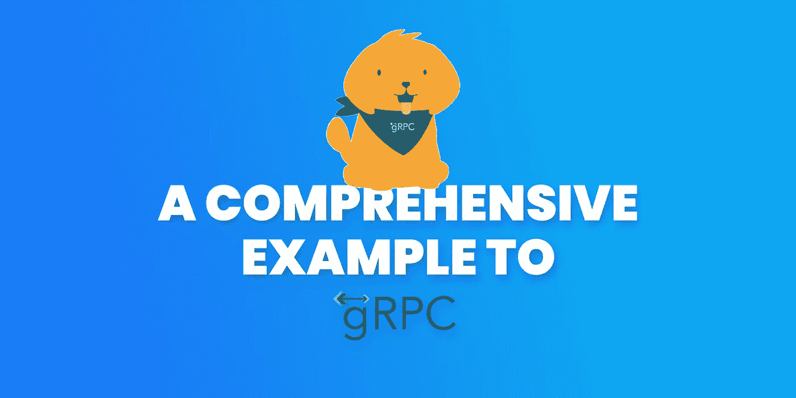
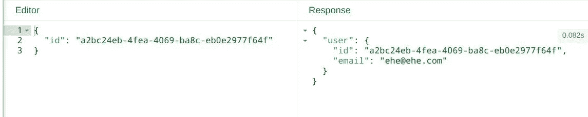
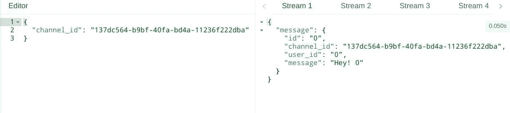
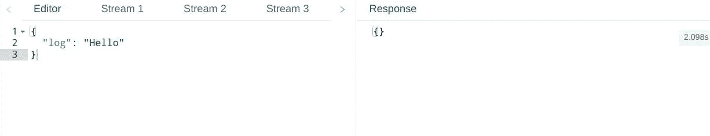
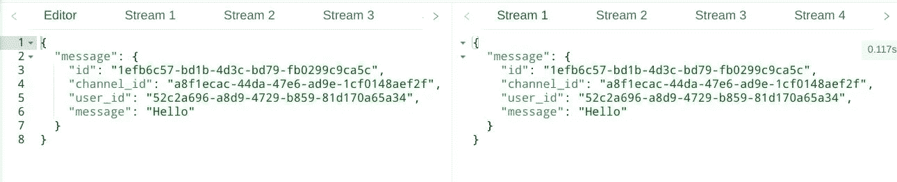

# gRPC 简化版

> 原文：<https://itnext.io/grpc-simplified-aa20609e4416?source=collection_archive---------1----------------------->

## gRPC 的综合示例

大家好，我正在学习 gRPC 世界，并尽可能简单地撰写关于它的文章。这是第三部分。这次我试着用最简单的例子(客户端/服务器都有)给自己解释学习 gRPC。希望你喜欢！

# 以前的零件

## 第一部分

对 ProtoBuf 的全面介绍

 [## ProtoBuf 简明指南

### 有没有听说过协议缓冲区，想尽快学习的？

itnext.io](/a-minimalist-guide-to-protobuf-1f24fbca0e2d) 

## 第二部分

gRPC 的全面介绍

 [## gRPC 简明指南

### REST API 很好，但是它真的是我们最好的选择吗？

itnext.io](/a-minimalist-guide-to-grpc-e4d556293422) 

我试图让 gRPC 服务尽可能简单，并且最适合现实生活

我会一部分一部分地给你代码，但你可以从 GitHub 获得整个工作项目，我会把它放在文章的最后

# 原型文件

# 初始设置

## 客户端

## 服务器端

# 一元的

## 方案

(只是一个类似 REST 的 API 调用)

`client:`发送用户标识

`server:`发送回具有该 id 的用户

## 客户端

## 服务器端

## 结果

# 服务器流

## 方案

(向服务器发送用户使用信息，就像脸书/谷歌那样)

`client:`将用户日志传输到服务器

`server:`什么都不做，只打印日志

## 客户端

## 服务器端

## 结果

# 客户端流

## 方案

(如用户只能收听的电报/不和谐频道)

`client:`发送一个想要监听服务器的 channelId

`server:`流频道的消息

## 客户端

## 服务器端

## 结果

# 双向流

## 方案

(Whatsapp/Telegram 之类的聊天应用)

`client:`定期每秒发送一条消息

`server:`发回消息

## 客户端

## 服务器端

## 结果

# 示例项目

从这里可以得到整个项目！

 [## iisprey/grpc_example

### 此时您不能执行该操作。您已使用另一个标签页或窗口登录。您已在另一个选项卡中注销，或者…

github.com](https://github.com/iisprey/grpc_example) 

# 在你走之前！

这是本系列文章的第 3 部分。

我将在下一篇文章中解释如何使用 gogo/protobuf 获得更快的 gRPC

所以请订阅，敬请关注！

# 感谢您的阅读！

如果我做了任何错误或误解，请通知我。

如果你喜欢这篇文章，请点击👏按钮(你知道你可以升到 50 吗？)