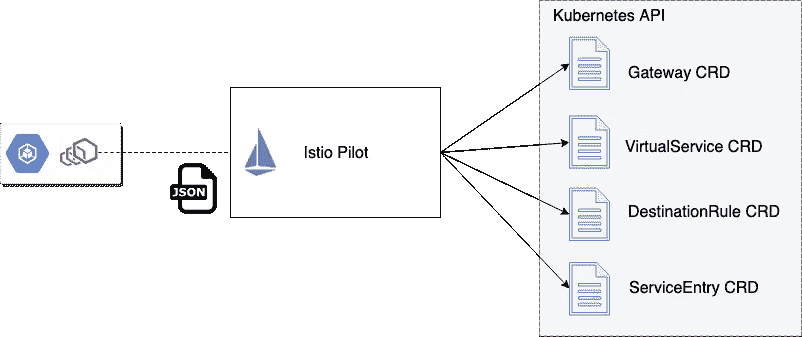
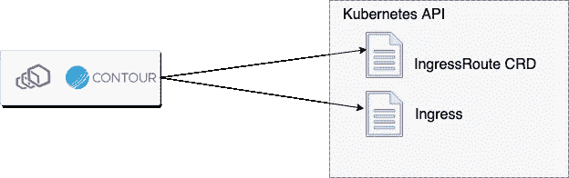

# 为 Envoy 构建控制平面的指南第 3 部分:域特定配置

> 原文：<https://itnext.io/guidance-for-building-a-control-plane-for-envoy-part-3-domain-specific-configuration-f7b5cb339bb3?source=collection_archive---------7----------------------->

这是[系列](https://medium.com/solo-io/guidance-for-building-a-control-plane-to-manage-envoy-proxy-at-the-edge-as-a-gateway-or-in-a-mesh-badb6c36a2af)的第 3 部分，探索为特使代理构建控制平面。

在这个博客系列中，我们将看看以下几个方面:

*   [采用动态更新特使路由、服务发现等配置的机制](https://medium.com/solo-io/guidance-for-building-a-control-plane-to-manage-envoy-proxy-at-the-edge-as-a-gateway-or-in-a-mesh-badb6c36a2af)
*   [确定控制平面由哪些组件组成，包括后备存储器、服务发现 API、安全组件等。艾尔。](https://medium.com/solo-io/guidance-for-building-a-control-plane-for-envoy-proxy-part-2-identify-components-2d0731b0d8a4)
*   建立最适合您的用例及组织的任何特定于领域的配置对象和 APIs】(此条目)
*   思考如何最好地让您的控制面板可插入到您需要的地方
*   部署各种控制面板组件的选项
*   仔细考虑你的控制平面的测试装具

在[之前的条目](https://medium.com/solo-io/guidance-for-building-a-control-plane-for-envoy-proxy-part-2-identify-components-2d0731b0d8a4)中，我们评估了您的控制面板可能需要的组件。在这一节中，我们将探索特定于领域的 API 对于您的控制平面可能是什么样子。

一旦你想通了什么组件可以构成你的控制平面架构(见前面)，你会想要考虑你的用户将如何与控制平面交互，甚至更重要的是，*谁将是你的用户？*要回答这个问题，您必须决定基于特使的基础设施将扮演什么角色，以及流量将如何通过您的架构。它可能是以下因素的组合

*   API 管理网关(北/南)
*   简单 Kubernetes 边缘负载平衡器/反向代理/入口控制(北/南)
*   共享服务代理(东/西)
*   每个服务的边车(东/西)

例如，Istio 项目旨在成为一个平台服务网，平台运营商可以在此基础上构建工具来控制您的服务和应用之间的网络。Istio 用于配置 Envoy 的特定于域的配置对象以下列对象为中心:

*   [网关](https://istio.io/docs/reference/config/istio.networking.v1alpha3/#Gateway) —定义一个共享代理组件(能够进入集群),指定可用于负载平衡和路由流量的协议、TLS、端口和主机/授权
*   [虚拟服务](https://istio.io/docs/reference/config/istio.networking.v1alpha3/#VirtualService) —如何与特定服务交互的规则；可以指定路由匹配行为、超时、重试等
*   [DestinationRule](https://istio.io/docs/reference/config/istio.networking.v1alpha3/#DestinationRule) —关于如何在电路中断、负载平衡、mTLS 策略、服务子集定义等方面与特定服务交互的规则
*   [ServiceEntry](https://istio.io/docs/reference/config/istio.networking.v1alpha3/#ServiceEntry) —显式地将服务添加到 Istio 的服务注册中心

运行在 Kubernetes 中，所有这些配置对象都被实现为[CustomResourceDefinitions](https://kubernetes.io/docs/concepts/extend-kubernetes/api-extension/custom-resources/)。

[Heptio/VMWare Contour](https://github.com/heptio/contour) 旨在作为 Kubernetes 入口网关，并具有简化的特定于域的配置模型，具有 customresourcediation(CRD)风格以及 [Kubernetes 入口资源](https://kubernetes.io/docs/concepts/services-networking/ingress/)

*   [Ingres route](https://github.com/heptio/contour/blob/master/docs/ingressroute.md)这是一个 Kubernetes CRD，它提供了一个单一位置来指定轮廓代理的配置
*   [Ingress 资源支持](https://github.com/heptio/contour/blob/master/docs/annotations.md)，如果你喜欢这种东西，它允许你在你的 Kubernetes Ingress 资源上指定注释

在 [Gloo 项目](https://gloo.solo.io/)中，我们决定将可用的配置对象分为两个级别:

*   面向用户的最佳人机工程学配置*用户*用例，并留有可扩展性选项(下一节将详细介绍)
*   抽象特使的低级配置，但不明确用于直接用户操作。较高级别的对象被转换成这种较低级别的表示，最终用于翻译成 Envoy xDS APIs。这样做的原因将在下一节中阐明。

对于用户来说，Gloo 专注于拥有路由配置的团队，因为路由的语义(以及可用的转换/聚合功能)受到 API 和微服务开发人员的严重影响。对于面向用户的 API 对象，我们使用:

*   [网关](https://gloo.solo.io/v1/github.com/solo-io/gloo/projects/gateway/api/v1/gateway.proto.sk/) —指定特定监听器端口上可用的路由和 API 端点，以及每个 API 附带的安全性
*   [VirtualService](https://gloo.solo.io/v1/github.com/solo-io/gloo/projects/gateway/api/v1/virtual_service.proto.sk/) —将 API 路由分组为一组“虚拟 API”，这些 API 可以路由到后台函数(gRPC、http/1、http/2、lambda 等)；让开发人员控制一条路线如何进行不同的转换，试图将前端 API 从后端中分离出来(以及后端可能引入的任何重大变化)

请注意，这些与这些对象的 Istio 变体不同。

Gloo 中面向用户的 API 对象驱动较低级别的对象，这些对象随后被用于最终导出 Envoy xDS 配置。例如，Gloo 的底层核心 API 对象有:

*   [Upstream](https://gloo.solo.io/v1/github.com/solo-io/gloo/projects/gloo/api/v1/upstream.proto.sk/) —捕获关于后端集群的详细信息以及在其上公开的功能。您可以松散地将 Gloo Upstream 与 [Envoy 集群](https://www.envoyproxy.io/docs/envoy/latest/api-v2/api/v2/cds.proto)联系起来，两者有一个很大的区别:Upstream 可以理解特定端点上可用的实际服务功能(换句话说，知道`/foo/bar`和`/bar/wine`，包括它们的预期参数和参数结构，而不仅仅是`hostname:port`)。一会儿会有更多的内容。
*   [代理](https://gloo.solo.io/v1/github.com/solo-io/gloo/projects/gloo/api/v1/proxy.proto.sk/) —代理是主要对象，它抽象了我们可以应用于 Envoy 的所有配置。这包括侦听器、虚拟主机、路由和上游。较高级别的对象(虚拟服务、网关等)用于驱动这个较低级别的代理对象。

Gloo 控制的两个配置级别之间的分离允许我们扩展 Gloo 控制平面功能，同时保持配置 Envoy 的简单抽象。这在本系列的第 4 部分中有更详细的解释。

在前面的三个示例(Istio、Contour、Gloo)中，每个相应的控制平面展示一组特定于域的配置对象，这些对象是用户关注的，但最终被转换为特使配置并通过 xDS 数据平面 API 展示。这提供了 Envoy 和用户预设的工作方式及其工作流之间的解耦。尽管我们已经看到了一些为抽象 Envoy 而创建更侧重于用户和工作流的特定领域配置的例子，但这并不是构建 Envoy 控制平面的唯一方式。[Booking.com 做了一个很棒的演示](https://www.slideshare.net/IvanKruglov/ivan-kruglov-introducing-envoybased-service-mesh-at-bookingcom-version-7),讲述了他们如何更接近特使配置，并使用一个引擎将所有不同团队的配置片段合并成实际的特使配置。

除了考虑特定领域的配置，您还应该考虑 API/对象模型的具体接触点。例如，Kubernetes 非常关注 YAML 和资源文件。你可以构建一个更加特定领域的 CLI 工具(就像 [OpenShift 用 oc CLI](https://docs.openshift.com/enterprise/3.2/dev_guide/new_app.html#dev-guide-new-app) 做的那样，就像 Istio [用 istioctl](https://istio.io/docs/reference/commands/istioctl/) 做的那样，就像 Gloo [用 glooctl](https://gloo.solo.io/cli/glooctl/) 做的那样)

当您构建一个特使控制平面时，您是带着特定的意图或一组架构/用户进行的。您应该考虑到这一点，并构建正确的符合人体工程学的、自以为是的特定于领域的 API，以适合您的用户并改进您操作 Envoy 的工作流程。[Gloo 团队](https://github.com/solo-io/gloo/graphs/contributors)建议探索*现有的* Envoy 控制平面实现，如果没有其他合适的，只构建自己的控制平面。Gloo 的控制平面为扩展和定制奠定了基础。正如我们将在下一篇文章中看到的，可以构建一个完全可扩展的控制平面，以适应许多不同的用户、工作流和操作约束。

*原载于 2019 年 3 月 26 日*[*medium.com*](https://medium.com/solo-io/guidance-for-building-a-control-plane-for-envoy-part-3-domain-specific-configuration-c97e8124b9d1)*。*