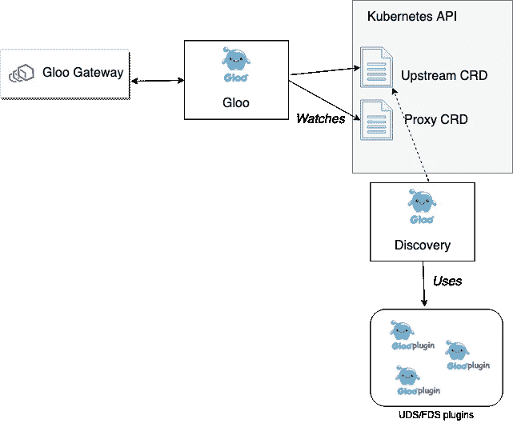
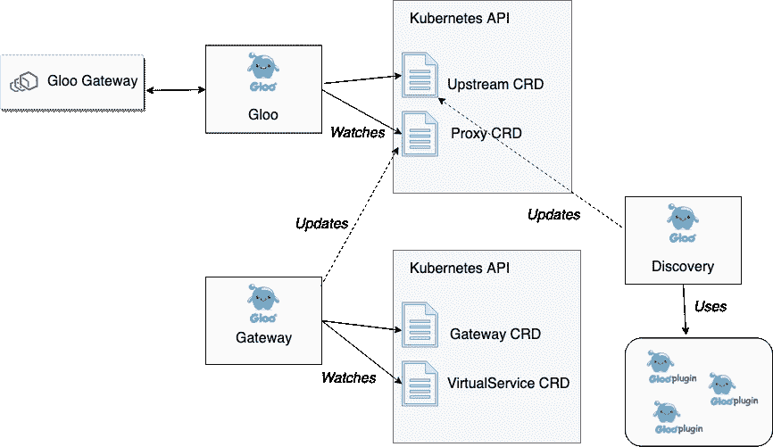
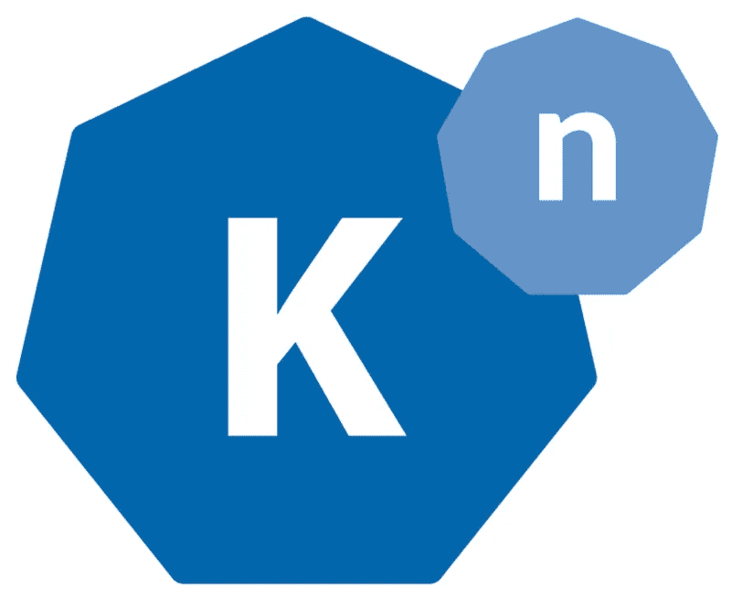

# 为 Envoy 构建控制平面指南第 4 部分:可扩展性构建

> 原文：<https://itnext.io/guidance-for-building-a-control-plane-for-envoy-part-4-build-for-extensibility-80313ce93ade?source=collection_archive---------8----------------------->

这是[系列](https://medium.com/solo-io/guidance-for-building-a-control-plane-to-manage-envoy-proxy-at-the-edge-as-a-gateway-or-in-a-mesh-badb6c36a2af)的第 4 部分，探索为特使代理构建控制平面。跟随 [@christianposta](https://twitter.com/christianposta) 和[@ solio _ Inc](https://twitter.com/soloio_inc)一周之后的下一部。

在这个博客系列中，我们将看看以下几个方面:

*   [采用动态更新特使路由、服务发现和其他配置的机制](https://medium.com/solo-io/guidance-for-building-a-control-plane-to-manage-envoy-proxy-at-the-edge-as-a-gateway-or-in-a-mesh-badb6c36a2af)
*   [确定控制平面由哪些组件组成，包括后备存储器、服务发现 API、安全组件等。艾尔。](https://medium.com/solo-io/guidance-for-building-a-control-plane-for-envoy-proxy-part-2-identify-components-2d0731b0d8a4)
*   [建立最适合您的用例及组织的任何特定于领域的配置对象和 API](https://medium.com/solo-io/guidance-for-building-a-control-plane-for-envoy-part-3-domain-specific-configuration-c97e8124b9d1)
*   思考如何最好地让您的控制面板可插入到您需要的地方(*此条目*)
*   部署各种控制面板组件的选项
*   仔细考虑你的控制平面的测试装具

在前面的[条目](https://medium.com/solo-io/guidance-for-building-a-control-plane-for-envoy-part-3-domain-specific-configuration-c97e8124b9d1)中，我们探索了为您的控制平面构建一个特定于领域的 API，它最适合您的组织和工作流偏好/约束。

Envoy 是一款非常强大的软件，每天都有新的用例以及新的贡献被提交给社区。虽然 Envoy 的核心非常稳定，但它建立在一个[可插拔过滤器架构](https://github.com/envoyproxy/envoy-filter-example)上，因此人们可以为不同的 L7 协议编写新的编解码器或添加新的功能。目前，Envoy 过滤器是用 C++编写的，并且有一个选项可以用 [Lua](https://www.envoyproxy.io/docs/envoy/latest/configuration/http_filters/lua_filter) 扩展 Envoy，但是也有[讨论支持 Web 组装](https://github.com/envoyproxy/envoy/issues/4272)的可扩展性。同样值得注意的是，Cilium[的优秀人员正在为特使](https://cilium.io/)围绕[基于 Go 的扩展机制所做的工作。除了快速发展的 Envoy 社区和配置这些新功能的需求之外，还需要包含新的特定于领域的对象模型，以支持希望利用 Envoy 的新平台。在本节中，我们将探索沿着这两个维度扩展特使控制平面。](https://cilium.io/blog/2018/10/23/cilium-13-envoy-go/)

通过编写 C++过滤器来扩展 Envoy 相当简单。我们在 [Gloo 项目](https://github.com/solo-io/envoy-gloo)中创建的特使过滤器包括:

*   [Squash](https://github.com/solo-io/squash) 调试器([https://github . com/envoy proxy/envoy/tree/master/API/envoy/config/filter/http/Squash](https://github.com/envoyproxy/envoy/tree/master/api/envoy/config/filter/http/squash))
*   缓存(目前关闭源码；应该会在不久的将来开放源代码)
*   请求/响应转换([https://github . com/solo-io/envoy-gloo/tree/master/source/extensions/filters/http/Transformation](https://github.com/solo-io/envoy-gloo/tree/master/source/extensions/filters/http/transformation))
*   AWS lambda([https://github . com/solo-io/envoy-gloo/tree/master/source/extensions/filters/http/AWS _ lambda](https://github.com/solo-io/envoy-gloo/tree/master/source/extensions/filters/http/aws_lambda)
*   NATS 流媒体([https://github.com/solo-io/envoy-nats-streaming](https://github.com/solo-io/envoy-nats-streaming)，[https://github . com/solo-io/envoy-gloo/tree/master/source/extensions/filters/http/NATs/streaming](https://github.com/solo-io/envoy-gloo/tree/master/source/extensions/filters/http/nats/streaming))
*   谷歌云功能(【https://github.com/solo-io/envoy-google-function】T4)
*   天蓝色函数([https://github.com/solo-io/envoy-azure-functions](https://github.com/solo-io/envoy-azure-functions))


在上图中，我们可以看到一个请求如何流经 Envoy，并通过许多过滤器，这些过滤器具有适用于请求和响应的专门任务。你可以在由 Solo.io 首席执行官/创始人和 Solo.io 首席架构师撰写的博客文章中了解更多关于特使的力量和我们在建造 Gloo 的控制平面时所做的权衡。

由于 Envoy 功能多样，而且新功能一直在增加，因此值得花些时间考虑是否要构建可扩展的控制平面，以便能够使用这些新功能。在 Gloo 项目中，我们选择在以下几个层面进行:

*   在一个*核心* Gloo 配置对象之上构建更多自以为是的特定领域配置对象
*   控制平面*插件*增加控制平面的现有行为
*   创建工具来加速前面两点

让我们来看看每一个级别，以及它们如何构成一个可扩展且灵活的控制平面。

在上一节中，我们重点讨论了用于配置控制平面的特定于域的配置对象。在 Gloo 中，我们有称为[代理](https://gloo.solo.io/v1/github.com/solo-io/gloo/projects/gloo/api/v1/proxy.proto.sk/)和[上游](https://gloo.solo.io/v1/github.com/solo-io/gloo/projects/gloo/api/v1/upstream.proto.sk/)的[最低级别配置对象](https://gloo.solo.io/v1/github.com/solo-io/gloo/projects/gloo/api/v1/proxy.proto.sk/)。`Proxy`定义了我们可以在底层代理(在本例中是特使)上进行的最低级别配置。通过`Proxy`对象，我们定义了请求如何被路由到`Upstreams`。

下面是代理对象的一个例子(在这个例子中是 Kubernetes 中的一个 CRD):

```
apiVersion: [gloo.solo.io/v1](http://gloo.solo.io/v1)
kind: Proxy
metadata:
 clusterName: ""
 creationTimestamp: "2019-02-15T13:27:39Z"
 generation: 1
 labels:
 created_by: gateway
 name: gateway-proxy
 namespace: gloo-system
 resourceVersion: "5209108"
 selfLink: /apis/gloo.solo.io/v1/namespaces/gloo-system/proxies/gateway-proxy
 uid: 771377f2-3125-11e9-8523-42010aa800e0
spec:
 listeners:
 - bindAddress: '::'
 bindPort: 8080
 httpListener:
 virtualHosts:
 - domains:
 - '*'
 name: gloo-system.default
 routes:
 - matcher:
 exact: /petstore/findPet
 routeAction:
 single:
 destinationSpec:
 rest:
 functionName: findPetById
 parameters: {}
 upstream:
 name: default-petstore-8080
 namespace: gloo-system
 - matcher:
 exact: /sample-route-1
 routeAction:
 single:
 upstream:
 name: default-petstore-8080
 namespace: gloo-system
 routePlugins:
 prefixRewrite:
 prefixRewrite: /api/pets
 name: gateway
status:
 reported_by: gloo
 state: 1
```

您可以看到`Proxy`对象指定了监听器、它们的类型以及路由信息。如果你仔细观察，你会发现它在一定程度上遵循了 Envoy 的配置*但又支持额外的功能。在路由中，您可以看到请求被发送到“上游”。Gloo 知道如何路由到[上游](https://gloo.solo.io/v1/github.com/solo-io/gloo/projects/gloo/api/v1/upstream.proto.sk/)，你可以在上面的`Proxy`对象中看到这些定义。`Proxy`对象是由 Gloo 的控制平面转换为 Envoy xDS API 的对象。如果我们看一下组成 Gloo 的组件，我们会看到以下内容:*

```
NAME READY STATUS RESTARTS AGE
discovery-676bcc49f8-n55jt 1/1 Running 0 8m
gateway-d8598c78c-425hz 1/1 Running 0 8m
gateway-proxy-6b4b86b4fb-cm2cr 1/1 Running 0 8m
gloo-565659747c-x7lvf 1/1 Running 0 8m
```

`gateway-proxy`组件是特使代理。控制平面由以下组件组成:

负责此`Proxy` - > Envoy xDS 转换的组件是`gloo`，它是一个事件驱动的组件，通过将`Proxy`对象转换为 Envoy 的 LDS/RDS/CDS/EDS API 来负责核心 xDS 服务和自定义 Envoy 过滤器的配置


Gloo 知道如何路由到存在于`Upstreams`上的`Upstream`和功能。[上游](https://gloo.solo.io/v1/github.com/solo-io/gloo/projects/gloo/api/v1/upstream.proto.sk/)也是 Gloo 的一个核心配置对象。我们需要这个上游对象的原因是为了封装更多关于上游集群能力的保真度，而不是 Envoy 所知道的现成内容。Envoy 知道“集群”，但是 Gloo(在 Envoy 之上)知道函数。这些知识使得[功能级路由](https://medium.com/solo-io/announcing-gloo-the-function-gateway-3f0860ef6600)成为可能，这是一个更强大的路由构造，用于组合新的应用程序和 API。Envoy 从“host:port”端点的角度了解集群，但是使用 Gloo，我们可以为这些集群附加额外的上下文，以便它们理解“函数”,这些函数可以是 REST 方法/路径、gRPC 操作或 Lambda 之类的云函数。例如，这里有一个 Gloo 上游名为`default-petstore-8080`:

```
---
discoveryMetadata: {}
metadata:
 labels:
 discovered_by: kubernetesplugin
 service: petstore
 sevice: petstore
 name: default-petstore-8080
 namespace: gloo-system
status:
 reportedBy: gloo
 state: Accepted
upstreamSpec:
 kube:
 selector:
 app: petstore
 serviceName: petstore
 serviceNamespace: default
 servicePort: 8080
 serviceSpec:
 rest:
 swaggerInfo:
 url: [http://petstore.default.svc.cluster.local:8080/swagger.json](http://petstore.default.svc.cluster.local:8080/swagger.json)
 transformations:
 addPet:
 body:
 text: '{"id": {{ default(id, "") }},"name": "{{ default(name, "")}}","tag":
 "{{ default(tag, "")}}"}'
 headers:
 :method:
 text: POST
 :path:
 text: /api/pets
 content-type:
 text: application/json
 deletePet:
 headers:
 :method:
 text: DELETE
 :path:
 text: /api/pets/{{ default(id, "") }}
 content-type:
 text: application/json
 findPetById:
 body: {}
 headers:
 :method:
 text: GET
 :path:
 text: /api/pets/{{ default(id, "") }}
 content-length:
 text: "0"
 content-type: {}
 transfer-encoding: {}
 findPets:
 body: {}
 headers:
 :method:
 text: GET
 :path:
 text: /api/pets?tags={{default(tags, "")}}&limit={{default(limit,
 "")}}
 content-length:
 text: "0"
 content-type: {}
 transfer-encoding: {}
```

注意，我们在这个上游暴露什么功能方面有更多的保真度。在这种情况下，上游恰好是一个 REST 服务，公开了一个 [Open API Spec/Swagger](https://github.com/OAI/OpenAPI-Specification) 文档。Gloo 自动发现了这些信息，并用这些信息丰富了上游对象，然后可以在代理对象中使用这些信息。



如果你回头参考 Gloo 控制平面中的组件，你会看到一个`discovery`组件，它通过添加“上游发现服务”(UDS)和“功能发现服务”(FDS)来增强 Envoy 的发现 API。UDS 使用一组插件(见下一节)从各自的运行时目录中自动发现`Upstream`。最简单的例子是在 Kubernetes 中运行时，我们可以自动发现 [Kubernetes 服务](https://kubernetes.io/docs/concepts/services-networking/service/)。Gloo 还可以从 Consul、AWS [等](https://gloo.solo.io/v1/github.com/solo-io/gloo/projects/gloo/api/v1/plugins.proto.sk/#a-name-upstreamspec-upstreamspec-a)中发现`Upstreams`。函数发现服务(FDS)评估每个已经被发现的`Upstreams`，并试图发现它们的类型(REST、gRPC、GraphQL、AWS Lambda 等)。如果 FDS 可以发现这些关于上游的附加属性，它就可以用这些“功能”来丰富上游元数据。

Gloo 控制平面中的`discovery`组件仅使用其 UDS 和 FDS 服务来发现`Upstream`对象并将其写入 Kuberentes CRDs。从那里，用户可以创建从特使代理上的特定 API 路径到`Upstream`上的特定函数的路由规则。特使代理不直接与这个控制平面组件交互(回想一下，特使只使用由`gloo`组件公开的 xDS API)。相反，`discovery`组件*有助于*创建`Upstream`然后被`Proxy`对象使用。这是一个使用支持微服务(本例中的`discovery`服务)为控制平面的整体功能做出贡献的好例子。

`Proxy`和`Upstream`是上一节提到的较低级别的特定于域的配置对象。更有趣的是，我们如何在此基础上分层一组配置对象，以满足具有更自以为是的工作流的用户特定的用例。

在 Gloo 的控制平面中，还有另一个组件叫做`gateway`组件。该组件实现了更高级别的特定于域的配置，用户将最终与之交互(直接通过 YAML 文件或间接通过`glooctl` CLI 工具)。`gateway`组件知道两个领域特定的对象:

*   [网关](https://gloo.solo.io/v1/github.com/solo-io/gloo/projects/gateway/api/v1/gateway.proto.sk/) —指定特定监听器端口上可用的路由和 API 端点，以及每个 API 附带的安全性
*   [VirtualService](https://gloo.solo.io/v1/github.com/solo-io/gloo/projects/gateway/api/v1/virtual_service.proto.sk/) —将 API 路由分组为一组“虚拟 API”，这些 API 可以路由到后台函数(gRPC、http/1、http/2、lambda 等)；让开发人员控制一条路线如何进行不同的转换，试图将前端 API 从后端中分离出来(以及后端可能引入的任何重大变化)



这些对象允许从`Proxy`对象解耦。当用户使用更符合人体工程学的或自以为是的 API 创建新的`Gateway`或`VirtualService`对象时，Gloo 的`gateway`组件获取这些对象(Kubernetes 中的 CRD，Consul 中的配置条目)并更新底层的`Proxy`对象。这是扩展 Gloo 的一种常见模式:偏好控制平面组件的可组合性。这允许我们为更具观点的特定于域的对象构建更专用的控制器，以支持不同的用途。例如， [Solo.io](https://solo.io/) 团队还为 Gloo 构建了一个名为 [Sqoop](https://sqoop.solo.io/) 的开源控制器，它遵循相同的模式，并扩展了 Gloo API，用于声明基于具有 GraphQL 模式的 [GraphQL 引擎](https://graphql.org/)的路由规则。在 Sqoop 中，我们引入了[模式和 ResolverMaps](https://sqoop.solo.io/introduction/concepts/api_objects/) 对象，它们最终构成了代理对象，然后被转换为 Envoy xDS。



构建在基本 Gloo 对象上的特定领域配置分层的另一个例子是我们最近在 [Knative 中使用 Gloo 代理作为 Istio](https://medium.com/solo-io/gloo-by-solo-io-is-the-first-alternative-to-istio-on-knative-324753586f3a) 的替代。Knative 有一个用于声明集群入口资源的特定对象，称为 [ClusterIngress](https://github.com/knative/serving/blob/master/pkg/client/clientset/versioned/typed/networking/v1alpha1/clusteringress.go) 对象，如下所示:

```
apiVersion: [networking.internal.knative.dev/v1alpha1](http://networking.internal.knative.dev/v1alpha1)
kind: ClusterIngress
metadata:
 labels:
 [serving.knative.dev/route](http://serving.knative.dev/route): helloworld-go
 [serving.knative.dev/routeNamespace](http://serving.knative.dev/routeNamespace): default
 name: helloworld-go-txrqt
spec:
 generation: 2
 rules:
 - hosts:
 - [helloworld-go.default.example.com](http://helloworld-go.default.example.com/)
 - helloworld-go.default.svc.cluster.local
 - helloworld-go.default.svc
 - helloworld-go.default
 http:
 paths:
 - appendHeaders:
 knative-serving-namespace: default
 knative-serving-revision: helloworld-go-00001
 retries:
 attempts: 3
 perTryTimeout: 10m0s
 splits:
 - percent: 100
 serviceName: activator-service
 serviceNamespace: knative-serving
 servicePort: 80
 timeout: 10m0s
 visibility: ExternalIP
```

为了在 Gloo 中支持这个用例，我们所做的就是[构建一个新的控制器，它监视](https://github.com/solo-io/gloo/blob/ac3bddf202423b297fb909eb6eff498745a8c015/projects/clusteringress/pkg/translator/translate.go#L19)并将 [ClusterIngress](https://github.com/knative/serving/blob/master/pkg/client/clientset/versioned/typed/networking/v1alpha1/clusteringress.go) 对象转换成 Gloo 的[代理](https://gloo.solo.io/v1/github.com/solo-io/gloo/projects/gloo/api/v1/proxy.proto.sk/)。有关在 Knative 中使用 Gloo 来简化 [Knative Serving](https://github.com/knative/serving) 安装以使用 Gloo 作为集群入口的更多信息，请参见[这篇博客。](https://blog.christianposta.com/guidance-for-building-a-control-plane-for-envoy-build-for-pluggability/MISSING)

在上一节中，我们看到了通过在核心对象之上分层特定于域的配置对象来扩展控制平面的功能。另一个扩展点直接位于控制面板核心对象本身。在 Istio 中是`VirtualService`和`DestinationRule`，在 Contour 中是`IngressRoute`，在 Gloo 中是`Proxy`和`Upstream`对象。例如，Gloo 的[代理对象](https://github.com/solo-io/gloo/blob/7a5c3a9a7a060841a7047efce79e5b7b3ed981be/projects/gloo/api/v1/proxy.proto#L30)包含了[监听器](https://github.com/solo-io/gloo/blob/7a5c3a9a7a060841a7047efce79e5b7b3ed981be/projects/gloo/api/v1/proxy.proto#L90)、[虚拟主机](https://github.com/solo-io/gloo/blob/7a5c3a9a7a060841a7047efce79e5b7b3ed981be/projects/gloo/api/v1/proxy.proto#L124)和[路由](https://github.com/solo-io/gloo/blob/7a5c3a9a7a060841a7047efce79e5b7b3ed981be/projects/gloo/api/v1/proxy.proto#L154)的扩展点。这意味着在代理配置中有明确定义的点，我们可以在配置中引入新的功能(例如，如果我们希望公开新的 Envoy 功能，或者如果我们为我们希望公开配置的 Envoy 编写新的过滤器，等等)。尽量不大惊小怪。例如，我们编写了一些[插件，丰富了 Envoy 的路由和转换功能](https://github.com/solo-io/gloo/blob/a27e1018640c46f7a25e4c1a0dc1f4cadf1773f5/projects/gloo/api/v1/plugins.proto#L44)。例如，要转换进入 Envoy 并被指定给名为`foo-service`的服务的请求，我们可以使用 [Inja 模板](https://github.com/pantor/inja)来管理消息头或消息体。更多信息参见 Gloo 文档中的[功能路由指南。](https://gloo.solo.io/user_guides/function_routing/)

```
routes:
- matcher:
 prefix: /
 routeAction:
 single:
 upstream:
 name: foo-service
 namespace: default
 routePlugins:
 transformations:
 requestTransformation:
 transformationTemplate:
 headers:
 x-canary-foo
 text: foo-bar-v2
 :path:
 text: /v2/canary/feature
 passthrough: {}
```

要查看 Gloo [代理](https://gloo.solo.io/v1/github.com/solo-io/gloo/projects/gloo/api/v1/proxy.proto.sk/)和[上游](https://gloo.solo.io/v1/github.com/solo-io/gloo/projects/gloo/api/v1/upstream.proto.sk/)对象上可用插件的完整列表，请参见[这里的文档](https://gloo.solo.io/v1/github.com/solo-io/gloo/projects/gloo/api/v1/plugins.proto.sk/)

一旦您向控制平面添加了新插件，您就可以扩展面向用户的特定于域的配置对象，以利用这些新功能。您可以扩充现有的控制器来实现这一点，或者添加新的控制器(遵循微服务相互松散协调的原则)。我们已经编写了[大量的例子来帮助你编写控制器](https://gloo.solo.io/dev/example-proxy-controller/)来增强你的控制平面功能，或者在 [Slack](https://slack.solo.io/) 上寻找更多关于这方面的指导。

在前面的章节中，我们看到了如何考虑控制平面的可扩展性和灵活性。我们看到了使用多层特定于域的配置对象如何通过添加新的对象和控制器来实现可扩展性。在 [Solo.io](https://solo.io/) 中，我们创建了一个名为 [solo-kit](https://github.com/solo-io/solo-kit) 的开源项目，通过从 [protobuf](https://developers.google.com/protocol-buffers/) 对象开始，并代码生成正确的类型安全客户端，以便在您的平台上与这些对象进行交互，从而加速为您的控制平面构建新的、声明性的、自以为是的 API 对象。例如，在 Kubernetes 上， [solo-kit](https://github.com/solo-io/solo-kit) 将这些原型转化为[customresourcediefinitions](https://kubernetes.io/docs/concepts/extend-kubernetes/api-extension/custom-resources/)并生成 Golang Kubernetes 客户端来观看这些资源并与之交互。如果你不在 Kubernetes 上，你也可以使用 Consul、Vault 和许多其他东西作为后端存储。

一旦创建了资源并生成了类型安全的客户端，您将希望检测用户何时创建新资源或对现有资源进行更改。使用 [solo-kit](https://github.com/solo-io/solo-kit) 你只需指定你希望观看的资源，或者称为“快照”的资源组合，客户端运行一个事件循环来处理任何通知。在您的事件循环中，您可以更新协作对象或核心对象。事实上，这就是 Gloo 的分层领域特定配置对象的工作方式。更多信息参见 [Gloo 声明性模型文档](https://gloo.solo.io/operator_guide/gloo_declarative_model/)。

控制平面可以根据您的需要简单或复杂。Gloo 团队建议将重点放在控制平面的简单核心上，然后通过插件和微服务控制器通过可组合性来扩展它。Gloo 的架构就是这样构建的，并使[Gloo 团队](https://github.com/solo-io/gloo/graphs/contributors)能够快速添加任何新功能，以支持任何平台、配置、过滤器等。这就是为什么，虽然 Gloo 是非常 Kubernetes-native 的，但它是为在任何云上的任何平台上运行而构建的。核心控制平面设计允许这一点。

在本系列的下一部分中，我们将看看部署控制平面组件在可伸缩性、容错性、独立性和安全性等方面的利弊。[敬请期待](https://twitter.com/soloio_inc)！

*原载于 2019 年 4 月 2 日*[*medium.com*](https://medium.com/solo-io/guidance-for-building-a-control-plane-for-envoy-part-4-build-for-extensibility-40f8ac8e48e)*。*