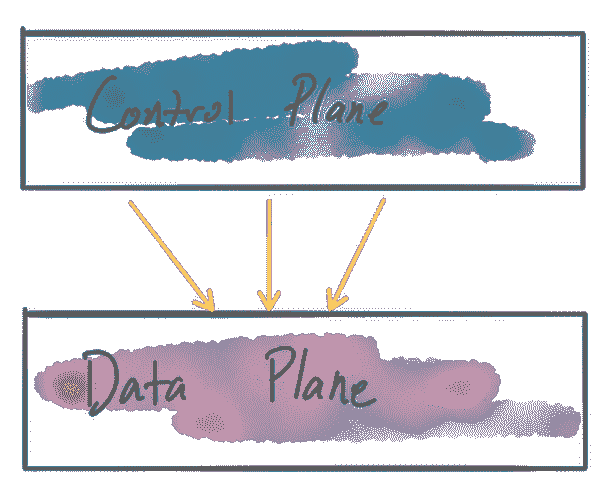
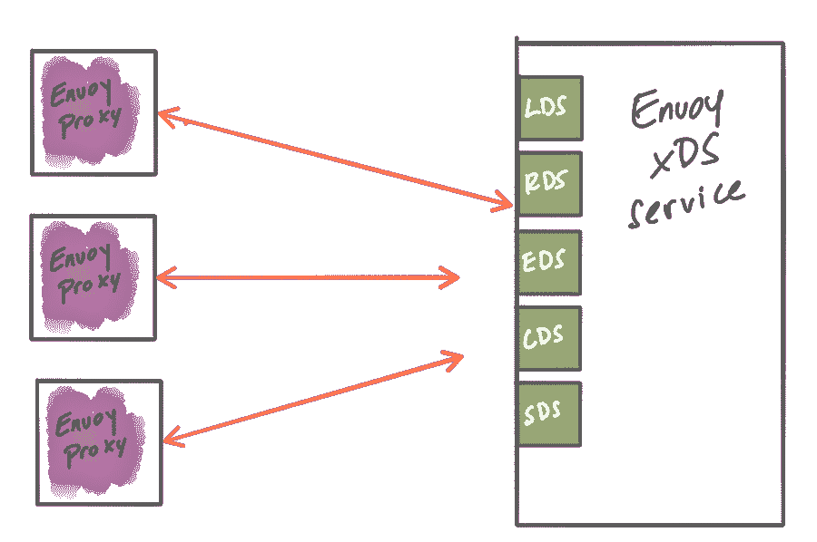

# 构建控制平面以管理边缘、网关或网格中的特使代理的指南

> 原文：<https://itnext.io/guidance-for-building-a-control-plane-to-manage-envoy-proxy-at-the-edge-as-a-gateway-or-in-a-mesh-7c8c671e6e33?source=collection_archive---------9----------------------->

最近，特使已经成为一个流行的网络组件。马特·克莱因[几年前写了一篇博客](https://blog.envoyproxy.io/the-universal-data-plane-api-d15cec7a)谈论 Envoy 的动态配置 API，以及它如何成为 Envoy 的采用曲线向右上方上升的部分原因。他称这个博客为“通用数据平面 API”。随着[如此多的其他项目采用 Envoy](https://www.envoyproxy.io/community) 作为其产品的核心组件，对于应用/L7 网络解决方案来说，说“Envoy 已经成为云原生架构中的通用数据平面”并不夸张，而不仅仅是建立了一个标准化的 API。

尽管如此，因为有了 [Envoy 的通用数据平面 API](https://blog.envoyproxy.io/the-universal-data-plane-api-d15cec7a) ，我们已经看到了大量*管理层*的实现来配置和驱动基于 Envoy 的基础设施。我们将深入探讨为 Envoy 构建控制平面需要什么，以便您可以使用这些信息来评估哪种类型的基础架构最适合您的组织和用例。因为这是一个广泛的主题，我们将在接下来的几周内发布的多部分系列文章中解决它。跟着( [@christianposta](https://twitter.com/christianposta) ，[@ solio _ Inc](https://twitter.com/soloio_inc))看接下来的条目。

在 EnvoyCon/KubeCon 上有一些很棒的演讲，一些组织分享了他们采用 Envoy 的经验，包括他们如何构建自己的控制平面。人们选择建造自己的控制平面的一些原因:

*   现有解决方案构建在不同的数据平面上，并带有预先存在的控制平面，需要在中改造 Envoy
*   构建没有任何现有开源或其他 Envoy 控制平面(例如，虚拟机、AWS ECS 等)的基础架构
*   不需要使用特使的所有功能；只是一个子集
*   对于 Envoy 配置，更喜欢特定于领域的 API/对象模型，以更好地适应他们的工作流/世界观
*   当他们各自的组织准备部署时，其他控制平面还没有处于成熟状态

然而，仅仅因为一些早期采用者建造了他们自己的定制控制平面并不意味着你现在应该做同样的事情。首先，为 Envoy 构建控制平面的项目在去年已经相当成熟，您应该在决定重新创建另一个控制平面之前探索使用这些项目。第二，正如 Datawire 的人所发现的，丹尼尔·布莱恩特(Daniel Bryant)最近所阐明的，T2 为特使建造控制飞机并不适合胆小的人。

[我在](https://www.solo.io/)[做](https://github.com/istio/istio)几个 [开源项目](https://github.com/solo-io/gloo)为特使建造了一个控制平面。例如， [Gloo](https://gloo.solo.io/) 是[一个功能网关](https://medium.com/solo-io/announcing-gloo-the-function-gateway-3f0860ef6600)，它可以充当一个非常强大的 Kubernetes 入口、API 网关或功能网关，以简化从单片到微服务的过渡。Gloo [为 Envoy](https://gloo.solo.io/introduction/architecture/) 提供了一个控制平面，我们可以在这一系列的文章中参考这个控制平面，作为如何构建一个简单的抽象的例子，它允许在您需要的控制点上实现可插拔性和可扩展性。您可以参考的其他可靠的控制平面实现有 [Istio](https://istio.io/) 和 [Heptio Contour](https://github.com/heptio/contour) ，我们将在整个博客系列中使用它们作为很好的例子。如果没有别的，您可以了解 Envoy 控制平面有哪些选项，如果您必须走这条路，可以用它来指导您的实现。

在这个博客系列中，我们将看看以下几个方面:

*   采用一种机制来动态更新 Envoy 的路由、服务发现和其他配置
*   确定控制平面由哪些组件组成，包括后备存储器、服务发现 API、安全组件等。艾尔。
*   建立最适合您的用例及组织的任何特定于领域的配置对象和 API
*   提前思考如何最好地让您的控制面板可插入到您需要的地方
*   部署各种控制面板组件的选项
*   仔细考虑你的控制平面的测试装具

作为本系列的开始，让我们看看如何使用 Envoy 的动态配置 API 在运行时更新 Envoy，以处理拓扑和部署中的变化。

在 Envoy 之上构建的主要优势之一是它的数据平面 API。有了数据平面 API，我们可以[动态配置 Envoy 的大部分重要运行时设置](https://www.envoyproxy.io/docs/envoy/v1.9.0/intro/arch_overview/dynamic_configuration)。Envoy 通过其 xDS APIs 的配置是[最终设计一致的](https://blog.envoyproxy.io/embracing-eventual-consistency-in-soa-networking-32a5ee5d443d)——也就是说，没有办法影响集群中所有代理的“原子更新”。当控制平面有配置更新时，它通过 xDS APIs 使它们对数据平面代理可用，并且每个代理将彼此独立地应用这些更新。

以下是我们可以通过 xDS 动态配置的 Envoy 运行时模型的部分:

*   [监听器发现服务 API — LDS](https://www.envoyproxy.io/docs/envoy/v1.9.0/configuration/listeners/lds#config-listeners-lds) 发布监听流量的端口
*   [端点发现服务 API- EDS](https://www.envoyproxy.io/docs/envoy/v1.9.0/api-v2/api/v2/eds.proto#envoy-api-file-envoy-api-v2-eds-proto) 用于服务发现，
*   [用于流量路由决策的路由发现服务 API- RDS](https://www.envoyproxy.io/docs/envoy/v1.9.0/configuration/http_conn_man/rds#config-http-conn-man-rds)
*   [集群发现服务- CDS](https://www.envoyproxy.io/docs/envoy/v1.9.0/configuration/cluster_manager/cds#config-cluster-manager-cds) 用于我们可以将流量路由到的后端服务
*   [秘密发现服务—用于分发秘密(证书和密钥)的 SDS](https://www.envoyproxy.io/docs/envoy/v1.9.0/configuration/secret)

API 是用 [proto3 协议缓冲区](https://www.envoyproxy.io/docs/envoy/v1.9.0/configuration/overview/v2_overview#config-overview-v2)定义的，甚至有几个参考实现，您可以使用它们来引导您自己的控制平面:

*   [go-control-plane](https://github.com/envoyproxy/go-control-plane)
*   [java 控制平面](https://github.com/envoyproxy/java-control-plane)

尽管这些区域(LDS/EDS/RDS/CDS/SDS，统称为“xDS”)都是可动态配置的，但这并不意味着您必须动态配置所有内容。您可以组合静态定义的部分和动态更新的部分。例如，要实现一种类型的服务发现，其中`endpoints`应该是动态的，但是`clusters`在部署时是已知的，您可以静态定义`clusters`并使用来自 Envoy 的[端点发现服务](https://www.envoyproxy.io/docs/envoy/v1.9.0/api-v2/api/v2/eds.proto#envoy-api-file-envoy-api-v2-eds-proto)。如果您不确定在部署时将使用哪个[上游集群](https://www.envoyproxy.io/docs/envoy/v1.9.0/intro/arch_overview/terminology)，您可以使用[集群发现服务](https://www.envoyproxy.io/docs/envoy/v1.9.0/configuration/cluster_manager/cds#config-cluster-manager-cds)来动态地找到它们。关键是，您可以构建一个工作流和流程，静态配置您需要的部分，同时使用动态 xDS 服务在运行时发现您需要的部分。您看到不同控制平面实现的原因之一是，并不是每个人都有一个完全动态和可替换的环境，其中所有部分都应该是动态的。在给定现有约束和可用工作流的情况下，采用最适合您的系统的动态级别。

在 Gloo 的情况下，我们使用基于 go-control-plane 的控制平面[来实现 xDS APIs，以服务于 Envoy 的动态配置。Istio 和 Heptio Contour 一样也使用这种实现。这个控制平面 API 利用了](https://github.com/solo-io/gloo/blob/ac3bddf202423b297fb909eb6eff498745a8c015/projects/gloo/pkg/xds/envoy.go#L76) [gRPC 流](https://grpc.io/docs/guides/concepts.html#server-streaming-rpc)调用，并去掉了 API，因此您可以用一个实现来填充它。另一个项目是 [Turbine Labs 的转子项目](https://github.com/turbinelabs/rotor)，不幸被弃用，但可以用来学习很多东西。这是将 Envoy 的数据平面 API 与控制平面集成的高效方式。

gRPC 流不是更新 Envoy 配置的唯一方式。在[早期版本的 Envoy xDS API](https://www.envoyproxy.io/docs/envoy/v1.5.0/api-v1/api) 中，轮询是确定新配置是否可用的唯一选项。尽管这是可以接受的，并且符合“最终一致”配置更新的标准，但在网络和计算使用方面效率较低。也很难适当地调整轮询配置以减少资源浪费。

最后，一些特使管理实现选择生成[静态特使配置文件](https://www.envoyproxy.io/docs/envoy/latest/configuration/overview/v2_overview#static)，并定期为特使替换磁盘上的配置文件，然后执行特使进程的[热重载。在高度动态的环境中(如 Kubernetes，但实际上是任何基于短期计算的平台),文件生成、交付、热重启等管理可能会变得难以处理。Envoy 最初是在这样一个执行更新的环境中运行的(Lyft，它就是在那里创建的)，但是现在有了 xDS 服务](https://blog.envoyproxy.io/envoy-hot-restart-1d16b14555b5)

Gloo 团队相信使用 gRPC 流和 xDS APIs 是为 Envoy 实现动态配置和控制的理想方式。同样，如果您不需要，并不是所有的 Envoy 配置都应该动态提供，但是如果您在一个高度动态的环境中操作(例如 Kubernetes)，动态配置 Envoy 的选项是非常关键的。其他环境可能没有这种需求。无论哪种方式，用于动态部分的 gRPC 流 API 都是理想的。这种方法的一些好处:

*   事件驱动的配置更新；当配置在控制平面中变得可用时，配置被推送到特使
*   不需要轮询更改
*   无需热重装特使
*   不中断交通

在第一部分中，我们通过介绍 xDS APIs 和为 Envoy 提供动态配置的不同选项，建立了一些关于如何为 Envoy 构建控制平面的基本背景。在几天后发布的下一部分中，将涉及将控制平面分解成可部署的组件，确定您需要哪些组件，特定于域的配置对象模型可能是什么样子，以及如何考虑控制平面的可插入性。在推特( [@christianposta](https://twitter.com/christianposta) ，[@ solio _ Inc](https://twitter.com/soloio_inc))或博客(【https://medium.com/solo-io】T4)上关注

*原载于 2019 年 2 月 18 日*[*medium.com*](https://medium.com/solo-io/guidance-for-building-a-control-plane-to-manage-envoy-proxy-at-the-edge-as-a-gateway-or-in-a-mesh-badb6c36a2af)*。*