# 指南——多 CRA 勒纳 Monorepo

> 原文：<https://itnext.io/guide-react-app-monorepo-with-lerna-d932afb2e875?source=collection_archive---------0----------------------->

> 在本指南中，您将通过一本故事书了解如何构建 Monorepo 来管理多个共享通用组件的 Create React 应用程序。

# 更新时间:2019/07/17

请使用 [*React Workspaces 游乐场*](https://github.com/react-workspaces/react-workspaces-playground) ，而不是本指南。**React work spaces Playground**是一个受支持的代码库，在这里您可以使用 React 和 Storybook 的最新版本来测试本指南中的所有内容。本指南演示了如何通过猴子补丁实现类似的效果——这是一种很难维持的糟糕做法。请查看我的 [*React Workspaces 幻灯片*](https://slides.com/alistairmacdonald-f1lt3r/react-workspaces/#/) 了解更多信息。


**特色:**

*   🎸[**Babel-Loader-Lerna-CRA**](https://www.npmjs.com/package/babel-loader-lerna-cra)—自动传输，热重装 Lerna 模块！
*   🐉 [**莱纳**](https://lernajs.io/)——单一回购经理人
*   ⚛️️ [**创建-反应-app-2**](https://github.com/facebook/create-react-app)-反应 16 App 脚手架(未注射)
*   📖 [**故事书-4-反应**](https://github.com/storybooks/storybook/tree/master/app/react) —组件故事书
*   🃏 [**Jest**](https://jestjs.io/) —单元/快照测试

# TL；博士-给我密码！

> 好…[f1lt3r/monorepo-react](https://github.com/F1LT3R/monorepo-react)。

> **⚠️的重要步骤**
> 
> 如果您在不使用本指南的情况下签出代码进行测试，请记住遵循以下重要步骤:
> 
> 1.`lerna booststrap`
> 2。`npx babel-loader-lerna-cra`

# Monorepos 的案例

想象一个场景，您正在构建一套三个 React 应用程序，它们共享相同的架构、设计模式、组件和风格。现在想象一下，对一个低级组件进行更新，比如一个在所有三个应用程序中使用的按钮，以及一个子组件。

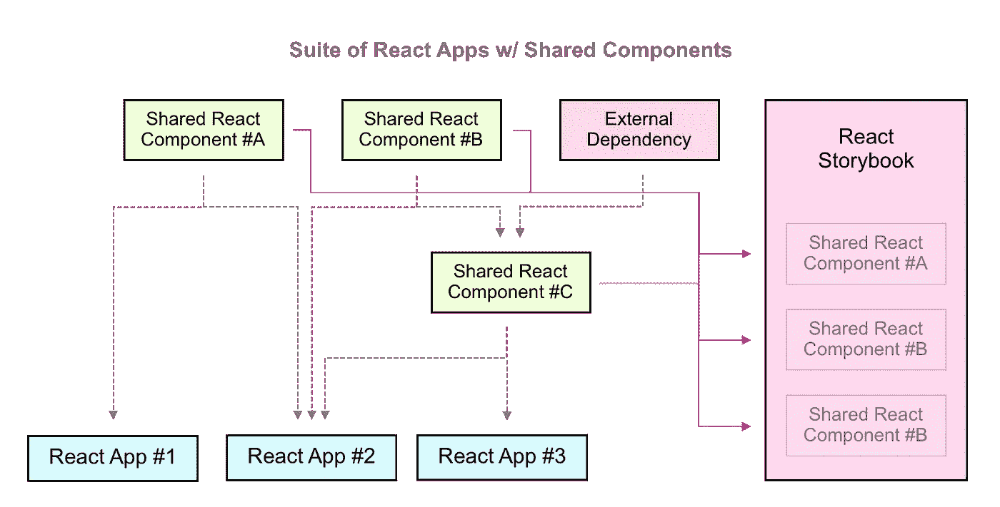

在这种情况下，您将被迫进入这样一个过程:

1.  更新按钮的 git 存储库中的按钮代码。
    *(上图中的组件 B)*
2.  在组件 B repo 中创建第一个拉式请求 *(#1)* ，并在 master 中检查新代码。
3.  在公共或私人 NPM 服务上发布组件 B 的按钮代码。
4.  进入使用按钮的 React repo 并更新 package.json 依赖项。
5.  在组件 C repo 中创建第二个 Pull 请求 *(#2)* ，并将新代码提交给 master。
6.  将组件发布到 NPM 仓库。

**进入**进入`**React App #1**`

1.  更新依赖关系。
2.  在 npm 服务上重新发布包。
3.  提交新的 PR。 *(#3)*
4.  部署

**进入**进入`**React App #2**`

1.  更新依赖关系。
2.  在 npm 服务上重新发布包。
3.  提交新的 PR。 *(#4)*
4.  部署

**走进**

1.  更新依赖关系。
2.  在 npm 服务上重新发布包。
3.  提交新的 PR。 *(#5)*
4.  部署

这是对一个按钮组件的变更的五个拉请求！

显然，这并不理想。

## 更简单的解决方案

现在，想象一下使用单个回购进行相同的更新。如果我们使用像 [Lerna](https://lernajs.io/) 这样的 Monorepo 工具，更新过程将看起来更像这样:

1.  更新按钮的 git 目录中的按钮代码。(`Component #B`如上图)
2.  运行`lerna bootstrap`将按钮`Component #B`链接到所有的子依赖项中。
3.  运行`lerna publish`更新你的私人 NPM 服务中的包。
4.  在`Monorepo` repo 中创建一个 Pull 请求，并将新代码放入`master`。
5.  使用更新的`package.json`版本号重新部署应用程序。

现在一切都在一个拉请求中完成。

这就是为什么像脸书和谷歌这样的大型组织会很好地利用 Monorepos。此流程可以简化为对所有依赖项和应用程序使用一个共享存储库。Monorepo 在不损失工程速度的情况下扩大规模，并减少因切换上下文焦点而造成的人为错误。

下面的指南将向您展示如何为 React 项目设置这样的 Monorepo。

# 先决条件

```
$ npm i -g lerna$ npm i -g create-react-app
```

为 Monorepo 项目创建一个目录。

```
$ cd ~/repos
$ mkdir monorepo-react
$ cd monorepo-react
```

# 设置 Lerna

创建并初始化您的 Lerna monorepo:

```
$ lerna init
```

您的`package.json`现在应该是这样的:

```
{
  "name": "root",
  "private": true,
  "devDependencies": {
    "lerna": "^3.4.3"
  }
}
```

# 安装通用依赖项

安装这些通用依赖项将允许您:

*   对项目的根目录运行 Storybook。
*   让 Storybook 为您的 React 项目自动安装正确的模块。
*   有巴别塔 transpile 正确的代码，测试和故事书。

```
$ npm i -D react react-dom @babel/core@^7.0.0-0 @babel/cli babel-plugin-transform-es2015-modules-commonjs babel-jest enzyme enzyme-adapter-react-16 jest react-test-renderer babel-core@7.0.0-bridge.0 @babel/preset-env @babel/preset-react
```

您的`package.json`现在应该是这样的:

```
{
  "name": "root",
  "private": true,
  "devDependencies": {
    "@babel/cli": "^7.1.2",
    "@babel/core": "^7.1.2",
    "@babel/preset-env": "^7.1.0",
    "@babel/preset-react": "^7.0.0",
    "babel-core": "^7.0.0-bridge.0",
    "babel-jest": "^23.6.0",
    "babel-plugin-transform-es2015-modules-commonjs": "^6.26.2",
    "enzyme": "^3.7.0",
    "enzyme-adapter-react-16": "^1.6.0",
    "jest": "^23.6.0",
    "lerna": "^3.4.3",
    "react": "^16.6.0",
    "react-dom": "^16.6.0",
    "react-test-renderer": "^16.6.0"
  }
}
```

# 安装故事书 React

现在我们将安装和初始化故事书版本 4。

```
$ npx -p @storybook/cli@alpha sb init
```

注意:安装`@alpha`版本(目前是`@4.0.0-rc.6`，将允许我们在`package.json`文件中设置我们的巴别塔配置，这将使配置子包更加容易。

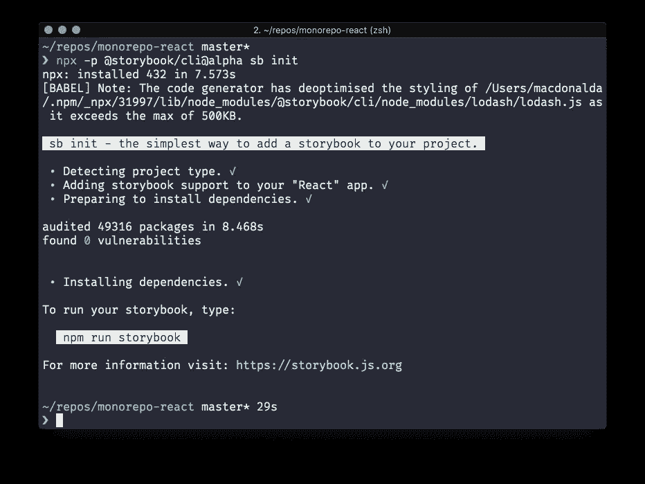

您的根`package.json`文件现在应该看起来像这样:

```
{
  "name": "root",
  "private": true,
  "devDependencies": {
    "@babel/cli": "^7.1.2",
    "@babel/core": "^7.1.2",
    "@babel/preset-env": "^7.1.0",
    "@babel/preset-react": "^7.0.0",
    "babel-core": "^7.0.0-bridge.0",
    "babel-jest": "^23.6.0",
    "babel-plugin-transform-es2015-modules-commonjs": "^6.26.2",
    "enzyme": "^3.7.0",
    "enzyme-adapter-react-16": "^1.6.0",
    "jest": "^23.6.0",
    "lerna": "^3.4.3",
    "react": "^16.6.0",
    "react-dom": "^16.6.0",
    "react-test-renderer": "^16.6.0",
    "@storybook/react": "^4.0.0-alpha.25",
    "@storybook/addon-actions": "^4.0.0-alpha.25",
    "@storybook/addon-links": "^4.0.0-alpha.25",
    "@storybook/addons": "^4.0.0-alpha.25",
    "babel-loader": "^8.0.4"
  },
  "dependencies": {},
  "scripts": {
    "storybook": "start-storybook -p 6006",
    "build-storybook": "build-storybook"
  }
}
```

现在你可以测试故事书在你的机器上运行了。

```
$ npm run storybook
```

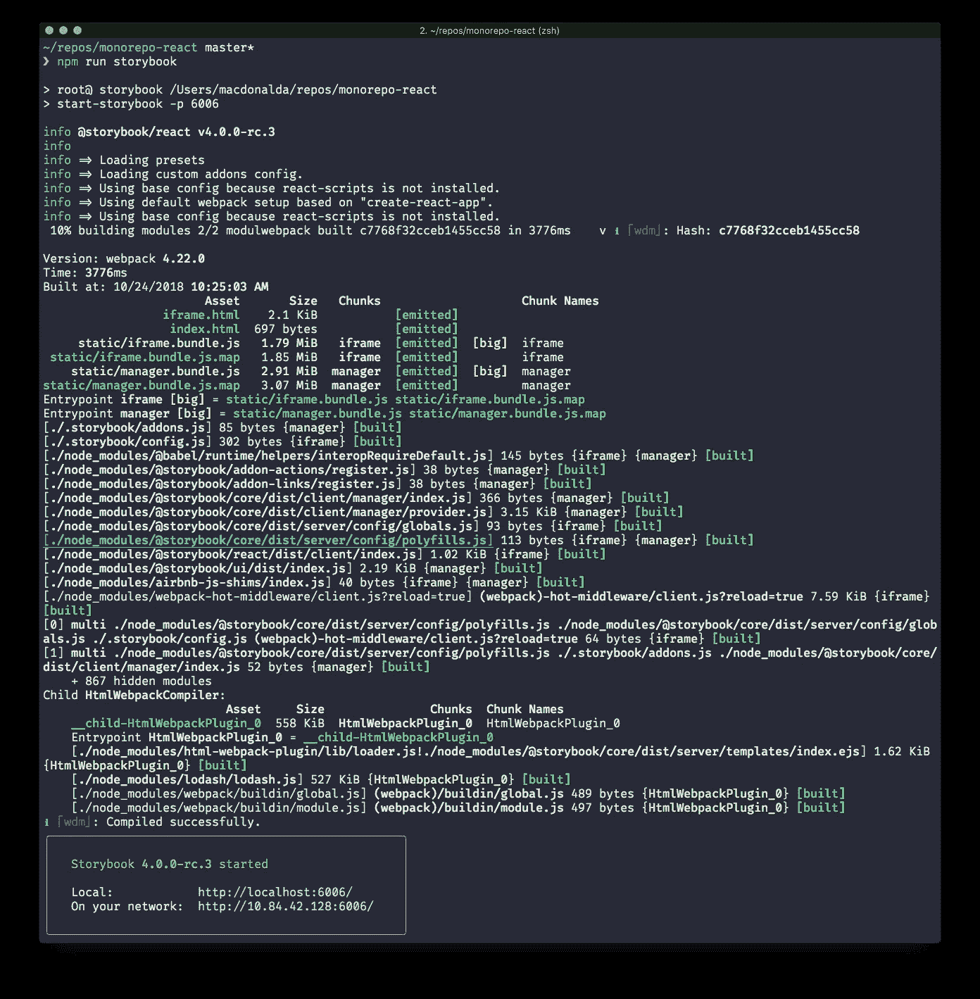

故事书现在应该会在你的浏览器中自动启动。

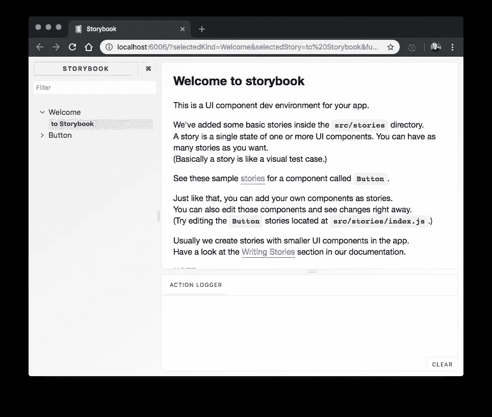

列出故事书文件:

```
$ tree -C .storybook stories
```

*   你的`.storybook/`目录包含你的故事书配置。
*   你的`stories/`目录是你的全球故事书故事生活的地方。

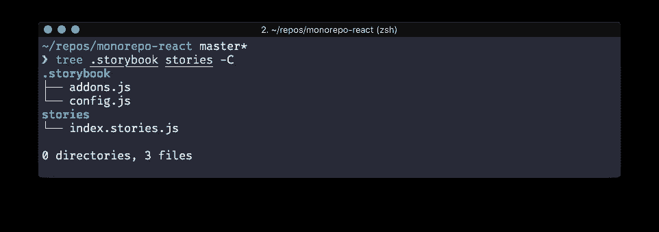

> 注意:安装树:[ `brew` / `apt-get` / `yum` / `pkg` ] `install tree`

# 创建您的 React 应用程序

在`packages/my-react-app`为你的 React 应用创建一个家。

```
$ cd ~/repos/monorepo-react/packages/
$ create-react-app my-react-app
```

运行您的 React 应用程序来测试工作情况。

```
$ cd my-react-app
$ npm run start
```

您现在应该会看到一条关于 Webpack 的错误消息，如下所示:

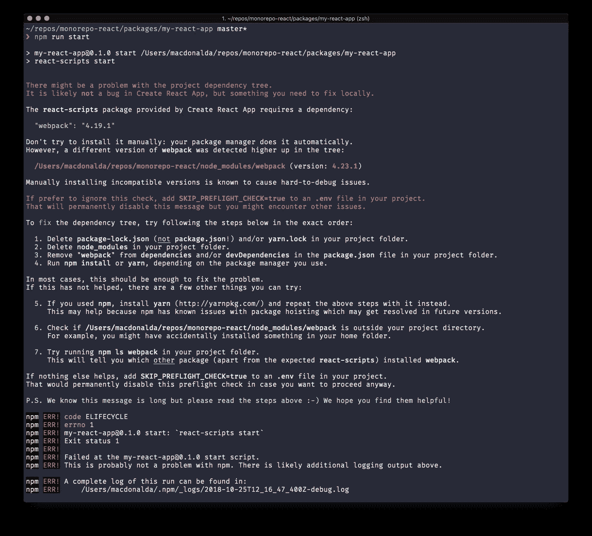

按照建议，我们将通过在`.env`文件中设置`SKIP_PREFLIGHT_CHECK=true`来解决这个问题。

```
echo "SKIP_PREFLIGHT_CHECK=true" > .env
```

现在，您应该能够运行 React 应用程序，并且您的浏览器应该会自动启动。

```
$ npm run start
```

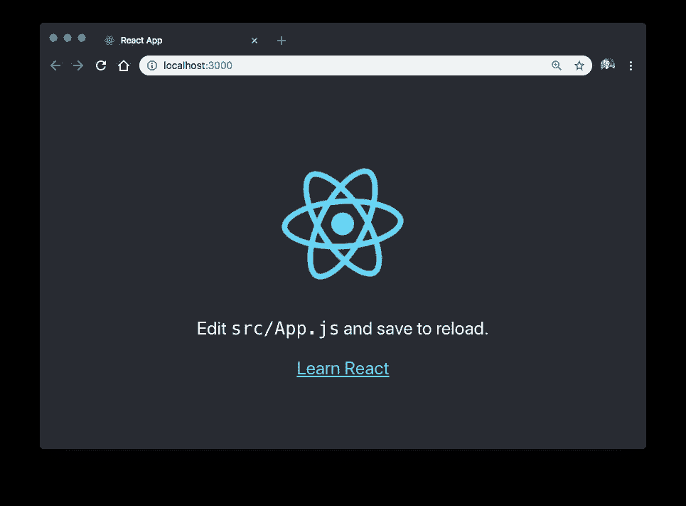

## 创建外部反应组件

让我们创建第一个外部 React 组件。我们将在 Lerna 提供的`./packages`目录中完成这项工作。

```
$ cd ~/repos/monorepo-react/packages/
$ mkdir comp-button
$ cd comp-button
```

像这样创建一个`packages/comp-button/package.json`文件:

```
{
  "name": "@project/comp-button",
  "version": "0.1.0",
  "description": "A simple button component",
  "main": "dist/index.js",
  "module": "src/index.js",
  "scripts": {
    "transpile": "babel src -d dist --ignore '**/*.spec.js,**/*.stories.js'",
    "jest": "jest --coverage --verbose --color"
  },
  "babel": {
    "presets": [
      "@babel/preset-env",
      "@babel/preset-react"
    ],
    "env": {
      "test": {
        "plugins": [
          "transform-es2015-modules-commonjs"
        ]
      }
    }
  }
}
```

`package.json`文件中发生了什么:

*   `name`:通过 NPM 或交叉链接 Lerna 安装时，组件的组织名称空间。
*   `main`:编译好的代码将会和你的 React 应用一起发布。
*   `module`:开发应用或运行测试时，将作为本地运行时依赖项导入的预编译代码。
*   一个 NPM 脚本用巴别塔开始你的代码的转换。**注意:**我们没有使用`build`，因为我们想保留这个词，以后用`lerna run build`来构建我们的 React 应用。
*   `babel`:这个设置将我们的组件配置为用 Babel 7 for React。

> 注意:因为我们在根目录`package.json`中安装了`react`、`react-dom`、`@babel/core@^7.0.0-0`这样的组件，所以我们不需要在这个包中再次安装它们。

为 React 组件创建一个源目录。

```
$ mkdir src
$ cd src
```

在`packages/comp-button/index.js`中创建 React 组件:

```
import React from 'react'

const Button = ({ type = 'button', children, onClick }) => (
    <div>
      <button type={type} className="button" onClick={onClick}>
        {children}
      </button>
  </div>
)

export default Button
```

## 传输您的组件

现在让我们尝试将您的 React 代码转换到 ECMAScript 2015(支持旧浏览器的 JavaScript)。

```
$ lerna run transpile
```

您应该会看到以下输出:

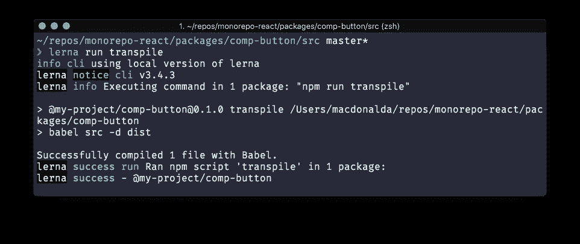

您的`./dist/`目录现在应该包含传输的`index.js`文件:

```
$ tree -C ../dist
```

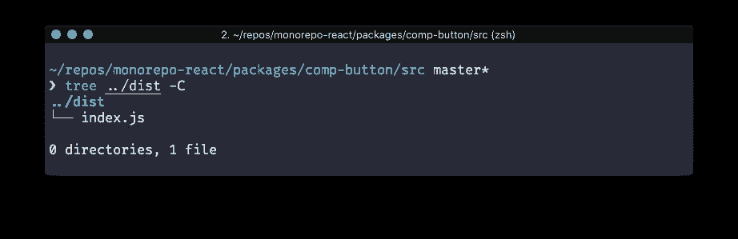

`./dist/index.js`文件应该包含你的编译代码，就像这样:

```
"use strict";

Object.defineProperty(exports, "__esModule", {
  value: true
});
exports.default = void 0;

var _react = _interopRequireDefault(require("react"));

function _interopRequireDefault(obj) { return obj && obj.__esModule ? obj : { default: obj }; }

var Button = function Button(_ref) {
  var _ref$type = _ref.type,
      type = _ref$type === void 0 ? 'button' : _ref$type,
      children = _ref.children,
      onClick = _ref.onClick;
  return _react.default.createElement("div", null, _react.default.createElement("button", {
    type: type,
    className: "button",
    onClick: onClick
  }, children));
};

var _default = Button;
exports.default = _default;
```

## 测试您的组件

现在，让我们在`packages/comp-button/src/index.spec.js`中为您的组件创建一个 Jest 规范:

```
import React from 'react';
import {mount} from 'enzyme';
import Button from '.';

describe('Button Component', function() {
  it('renders without props', function() {
    const wrapper = mount(<Button />);
    const button = wrapper.find('.button');
    expect(button.length).toBe(1);
  })

  it('renders without props', function() {
    const wrapper = mount(<Button />);
    const button = wrapper.find('.button');
    expect(button.length).toBe(1);
  })

  it('renders children when passed in', () => {
    const wrapper = mount(
      <Button>
        <p className="child">Some Child</p>
      </Button>
    );

    const child = wrapper.find('.child')
    expect(child.length).toBe(1)
  })

  it('handles onClick events', () => {
    const onClick = jest.fn()
    const wrapper = mount(
      <Button onClick={onClick} />
    )

    wrapper.find('button').simulate('click')

    expect(onClick.mock.calls.length).toBe(1)
  })
})
```

> 注:我们之前安装了`babel-core@7.0.0-bridge.0`和`babel-jest`是为了让 Babel 7 代码兼容 Jest。(请参见上面的“安装通用依赖项”)。)

将下面的“jest”部分添加到您的根目录`package.json`:

```
"jest": {
    "setupFiles": [
      "../../setupTests"
    ]
  }
```

您的`packages/comp-button/package.json`现在应该是这样的:

```
{
    "name": "@my-project/comp-button",
    "version": "0.1.0",
    "description": "A simple button component",
    "main": "dist/index.js",
    "module": "src/index.js",
    "scripts": {
    "transpile": "babel src -d dist --ignore '**/*.spec.js,**/*.stories.js'",
      "jest": "jest --coverage --verbose --color"
    },
    "babel": {
      "presets": [
        "@babel/preset-env",
        "@babel/preset-react"
      ],
      "env": {
        "test": {
          "plugins": [
            "transform-es2015-modules-commonjs"
          ]
        }
      }
    },
    "jest": {
      "setupFiles": [
        "../../setupTests"
      ]
    }
  }
```

当 Jest 运行时，`../../setupTests`文件将引用 Monorepo 根中的`setupTests.js`。

让我们用一些酶助手添加这个`setupTests.js`文件:

```
const enzyme = require('enzyme');
const Adapter = require('enzyme-adapter-react-16');
enzyme.configure({ adapter: new Adapter() });
```

> 注意:我们故意在这里使用旧的 require 语法，这样`setupTests.js`就可以加载，而不需要额外的 babel 配置。

现在让我们运行 Jest 来看看这个规范是如何工作的:

```
lerna run jest
```

> 注意:我们使用`jest`而不是`test`来保留“测试”一词用于运行所有测试，包括端到端、林挺等。

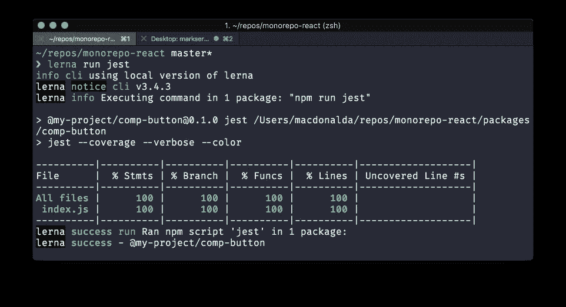

# 为 React 组件添加一个故事

现在让我们为新的按钮组件创建一个故事书故事:

将以下代码添加到`index.stories.js`:

```
import React from 'react'
import { storiesOf } from '@storybook/react'
import { action } from '@storybook/addon-actions'

import Button from '.'

storiesOf('Button', module)

  .add('with text', () => (
      <Button onClick={action('clicked')}>Button</Button>
  ))

  .add('with some emoji', () => (
      <Button onClick={action('clicked')}>😀 😎 👍 💯</Button>
  ))

  .add('with a theme provider', () => (
    <Button onClick={action('clicked')}>Button</Button>
  ))
```

**重新配置故事书**

我们现在需要配置 Storybook 从所有的`packages/**`目录加载故事，而不是从你的 Monorepo 根目录加载`stories/`目录。

在`~/repos/monorepo-react/.storybook/config.js`中编辑你故事书配置，看起来像这样:

```
import { configure } from '@storybook/react';

// automatically import all files ending in *.stories.js
const req = require.context('../packages', true, /.stories.js$/);
function loadStories() {
  req.keys().forEach(filename => req(filename));
}

configure(loadStories, module);
```

现在可以安全地删除 Monorepo 根目录下的`stories/`目录了。

```
$ cd ~/repos/monorepo-react/
$ sudo rm -r stories
```

让我们检查一下故事书是否仍然载入了你的`comp-button`故事:

```
$ npm run storybook
```

现在您应该能够看到您的按钮组件故事，它是从您的`packages/comp-button`目录构建的:

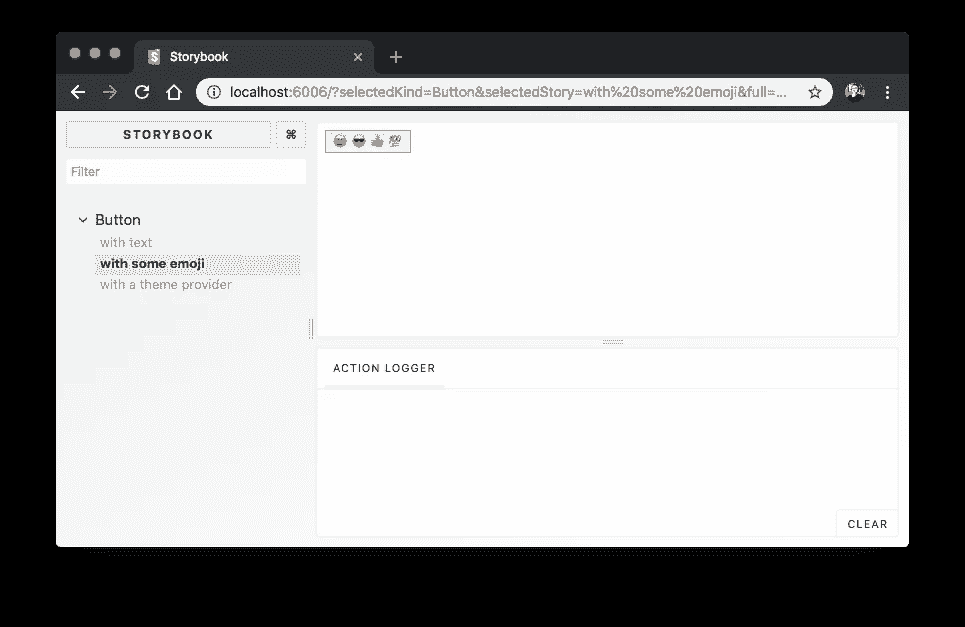

# 用 Lerna 交联你的依赖关系

将以下依赖项添加到您的`packages/my-react-app/package.json`:

```
{
  "dependencies": {
    "@my-project/comp-button": "*"
  }
}
```

你的`packages/my-react-app/package.json`现在应该是这样的:

```
{
  "name": "@my-project/my-react-app",
  "version": "0.1.0",
  "private": true,
  "dependencies": {
    "react": "^16.6.0",
    "react-dom": "^16.6.0",
    "react-scripts": "2.0.5",
    "@my-project/comp-button": "*"
  },
  "scripts": {
    "start": "react-scripts start",
    "build": "react-scripts build",
    "test": "react-scripts test",
    "eject": "react-scripts eject"
  },
  "eslintConfig": {
    "extends": "react-app"
  },
  "browserslist": [
    ">0.2%",
    "not dead",
    "not ie <= 11",
    "not op_mini all"
  ]
}
```

我们现在可以使用`lerna bootstrap`来交联我们的包。

```
$ lerna bootstrap
```

您应该会看到以下成功消息:

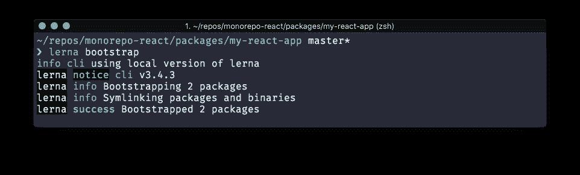

# 在 React 应用中使用您的组件

在`packages/my-react-app/src/App.js`中增加以下几行:

```
import CompButton from '@my-project/comp-button';
<CompButton>Foobar!</CompButton>
```

您的文件现在将如下所示:

```
import React, { Component } from 'react';
import logo from './logo.svg';
import './App.css';
import CompButton from '@my-project/comp-button';

class App extends Component {
  render() {
    return (
      <div className="App">
        <header className="App-header">
          
          <p>
            Edit <code>src/App.js</code> and save to reload.
          </p>
          <a
            className="App-link"
            href="https://reactjs.org"
            target="_blank"
            rel="noopener noreferrer"
          >
            Learn React
          </a>
          <CompButton>Foobar!</CompButton>
        </header>
      </div>
    );
  }
}

export default App;
```

现在启动你的应用程序:

```
$ npm run start
```

您应该会看到以下错误:

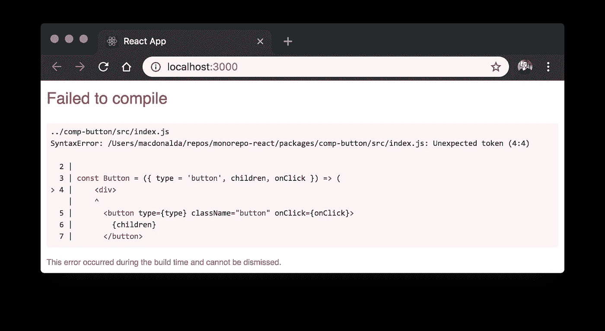

React 应用程序无法编译，因为 Create-React-App 的 Webpack 配置不知道任何外部模块。这意味着 Webpack 不能告诉 Babel-Loader 你的组件目录，所以源代码不能被传输。

看起来这个问题可能会随着 Create-React-App 的未来版本而消失，尽管这可能需要 Yarn 工作空间。因此，在使用以下解决方法之前，请确保检查 GitHub 问题[Create-React-App-Lerna-Support](https://github.com/facebook/create-react-app/issues/1333)以查看该功能是否已登陆。

# 为 Lerna 重新编写 React 应用程序

我创建了一个小的工作区节点模块来覆盖 Lerna 项目中的 Create-React-App Webpack 配置，称为 [Babel-Loader-Lerna-CRA](https://www.npmjs.com/package/babel-loader-lerna-cra) 。这很简单。它只是更新了 Babel-Loader 的 Webpack 路径。

您可以使用 NPM 安装此软件包:

```
npm i -D babel-loader-lerna-cra
```

现在让我们用描述组件和应用程序之间关系的 glob 模式来更新 Lerna 根中的`package.json`。

```
"babel-loader-lerna-cra": {
  "imports": "packages/comp-*/src",
  "apps":  "packages/*react-app*"
}
```

您的`package.json`现在应该是这样的:

```
{
  "name": "root",
  "private": true,
  "devDependencies": {
    "@babel/cli": "^7.1.2",
    "@babel/core": "^7.1.2",
    "@babel/preset-env": "^7.1.0",
    "@babel/preset-react": "^7.0.0",
    "@storybook/addon-actions": "^4.0.0-alpha.25",
    "@storybook/addon-links": "^4.0.0-alpha.25",
    "@storybook/addons": "^4.0.0-alpha.25",
    "@storybook/react": "^4.0.0-alpha.25",
    "babel-core": "^7.0.0-bridge.0",
    "babel-jest": "^23.6.0",
    "babel-loader": "^8.0.4",
    "babel-loader-lerna-cra": "^0.1.2",
    "babel-plugin-transform-es2015-modules-commonjs": "^6.26.2",
    "enzyme": "^3.7.0",
    "enzyme-adapter-react-16": "^1.6.0",
    "jest": "^23.6.0",
    "lerna": "^3.4.3",
    "react": "^16.6.0",
    "react-dom": "^16.6.0",
    "react-test-renderer": "^16.6.0"
  },
  "dependencies": {},
  "scripts": {
    "storybook": "start-storybook -p 6006",
    "build-storybook": "build-storybook"
  },
  "babel-loader-lerna-cra": {
    "imports": "packages/comp-*/src",
    "apps":  "packages/*react-app*"
  }
}
```

*   `**imports**`指的是 React 应用程序需要传输的组件。
*   `**apps**`通知`babel-loader-lerna-cra`网络包覆盖需要发生的位置。

现在让我们用`babel-loader-lerna-cra`引导 React 应用程序中的 Webpack 配置:

```
$ npx babel-loader-lerna-cra
```

您应该会看到以下输出:

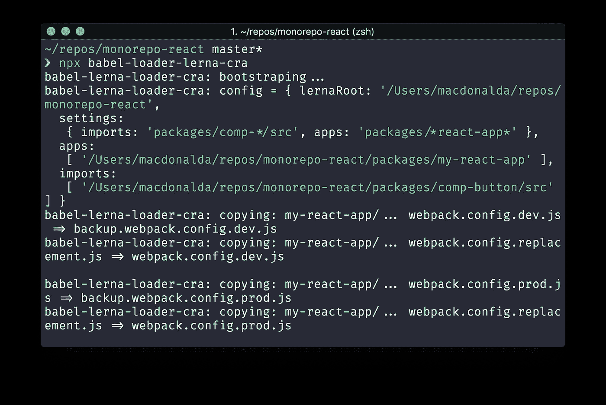

现在让我们再次尝试运行 React 应用程序:

```
$ cd ~/repos/monorepo-react/packages/my-react-app
$ npm run start
```

现在，您应该看到 React 应用程序在浏览器中启动，您的`CompButton`组件呈现为文本“Foorbar！”

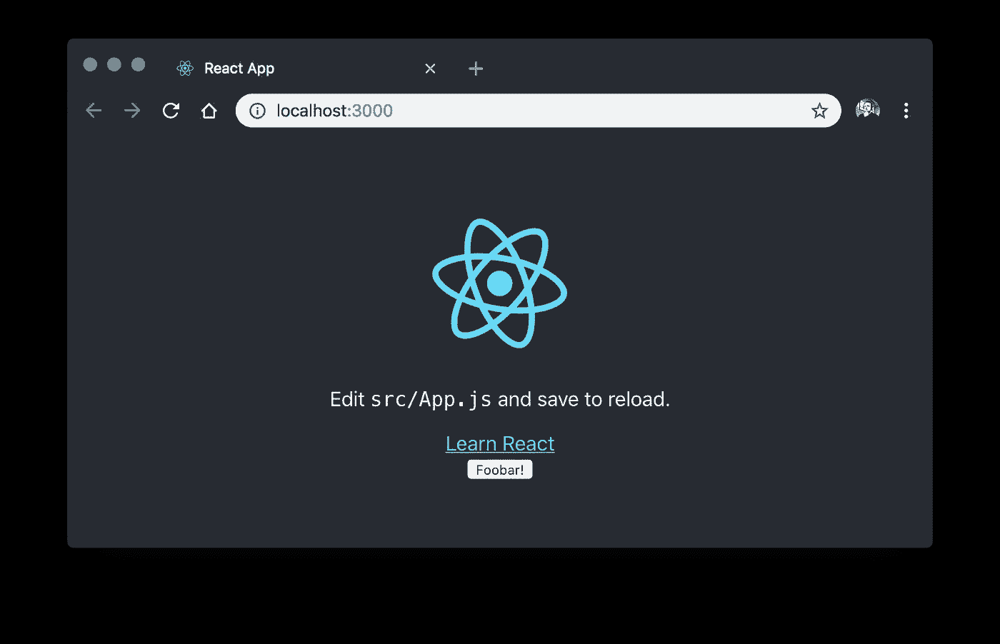

# 那么，我们从这个变通办法中得到了什么呢？

**Lerna 兄弟的自动传输**

*   我们的 React 应用程序现在可以在需要时导入兄弟 Lerna 依赖项和 transpile。

**React App 热重装**

*   当我们更改 React 组件文件时，将热更新应用程序，而不必向 Lerna 项目添加任何全局观察器来启动 transpile。
*   这是我们的`CompButton`组件在更新时被热重装:

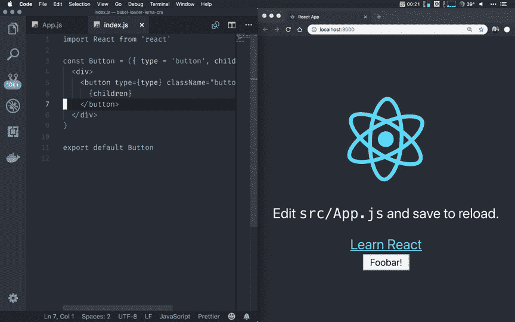

**故事书热重装**

*   这里没什么特别的，但是值得注意的是我们的故事书也可以热加载:


# 结论

我想这是我在一篇文章中所能谈到的。我希望其他人会觉得这个设置有用。如果人们感兴趣，我将在第 2 部分继续讨论如何设置 CI，以便从这个 Monorepo 设置中发布多个 React 应用程序。

欢迎评论、反馈、建议。

阿利斯泰尔·麦克唐纳

# 关于这个话题的有趣文章:

*   [https://medium . com/@ luisvieira _ GMR/building-large-scale-react-applications-in-a-monorepo-91cd 4637 c131](https://medium.com/@luisvieira_gmr/building-large-scale-react-applications-in-a-monorepo-91cd4637c131)
*   [https://cacm . ACM . org/magazines/2016/7/204032-why-Google-stores-billion-of-line-of-code-in-a-single-repository/full text](https://cacm.acm.org/magazines/2016/7/204032-why-google-stores-billions-of-lines-of-code-in-a-single-repository/fulltext)
*   [https://github.com/facebook/create-react-app/issues/1333](https://github.com/facebook/create-react-app/issues/1333)
*   [https://github.com/facebook/create-react-app/pull/3741](https://github.com/facebook/create-react-app/pull/3741)
*   [https://github.com/jamiebuilds/react-loadable](https://github.com/jamiebuilds/react-loadable)
*   [https://Dave ceddia . com/customize-create-react-app-web pack-without-ejecting/](https://daveceddia.com/customize-create-react-app-webpack-without-ejecting/)