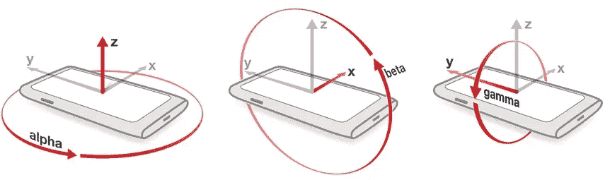
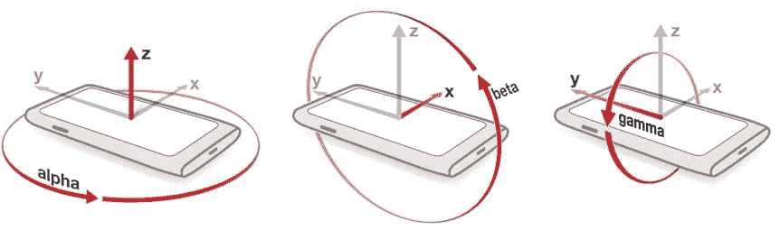
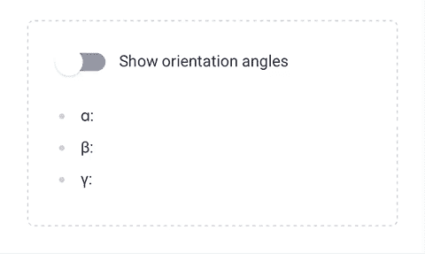
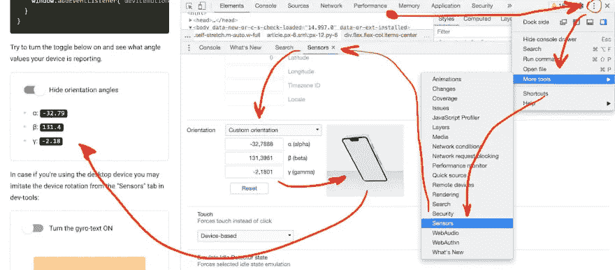
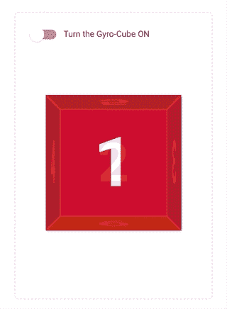

# GYRO-WEB:在 JAVASCRIPT 中访问设备方向

> 原文：<https://itnext.io/gyro-web-accessing-the-device-orientation-in-javascript-387da43eeb84?source=collection_archive---------1----------------------->



图片来源:【https://newnow.co/me-myself-and-i/ 

> *本文有* [*互动版*](https://trekhleb.dev/blog/2021/gyro-web/) *。您可以打开它，从您的移动设备上调整设备方向。*

# 在纯 JavaScript 中访问设备定向

在 Javascript 中，您可以通过监听 [deviceorientation](https://developer.mozilla.org/en-US/docs/Web/API/Detecting_device_orientation) 事件来访问您的设备方位数据。就像下面这样简单:

```
window.addEventListener('deviceorientation', handleOrientation);

function handleOrientation(event) {
  const alpha = event.alpha;
  const beta = event.beta;
  const gamma = event.gamma;
  // Do stuff...
}
```

下面是`alpha`、`beta`和`gama`角度的含义:



*图片来源:*[*newnow.co*](https://newnow.co/me-myself-and-i/)

**但是！**不是每个浏览器都允许你在没有用户许可的情况下访问方位数据。例如，在 iOS 13 中，苹果引入了 [requestPermission](https://www.w3.org/TR/orientation-event/#dom-deviceorientationevent-requestpermission) 方法。它必须在用户操作(点击、轻敲或等效操作)时触发。

访问设备方向的示例变得有点复杂:

```
function onClick() {
  if (typeof DeviceMotionEvent.requestPermission === 'function') {
    // Handle iOS 13+ devices.
    DeviceMotionEvent.requestPermission()
      .then((state) => {
        if (state === 'granted') {
          window.addEventListener('devicemotion', handleOrientation);
        } else {
          console.error('Request to access the orientation was rejected');
        }
      })
      .catch(console.error);
  } else {
    // Handle regular non iOS 13+ devices.
    window.addEventListener('devicemotion', handleOrientation);
  }
}
```

如果你在本帖的[互动版中打开设备方向开关，你应该会看到你的设备报告的角度。](https://trekhleb.dev/blog/2021/gyro-web/)



# 调试浏览器中的方向访问

如果您使用的是桌面设备，您可以在开发工具的“传感器”选项卡中模仿设备旋转:



酷！现在，我们可以访问设备方向，甚至可以在浏览器中测试它！

# 用于访问设备方向的反应挂钩

我想采取的最后一步是拿出 [React 钩子](https://reactjs.org/docs/hooks-intro.html)，它将为我封装方向抓取，并使它更容易在 React 组件中使用(就像上面向您显示角度的那个)。

下面是一个用 TypeScript 编写的`useDeviceOrientation.ts`钩子的例子:

```
import { useCallback, useEffect, useState } from 'react';

type DeviceOrientation = {
  alpha: number | null,
  beta: number | null,
  gamma: number | null,
}

type UseDeviceOrientationData = {
  orientation: DeviceOrientation | null,
  error: Error | null,
  requestAccess: () => Promise<boolean>,
  revokeAccess: () => Promise<void>,
};

export const useDeviceOrientation = (): UseDeviceOrientationData => {
  const [error, setError] = useState<Error | null>(null);
  const [orientation, setOrientation] = useState<DeviceOrientation | null>(null);

  const onDeviceOrientation = (event: DeviceOrientationEvent): void => {
    setOrientation({
      alpha: event.alpha,
      beta: event.beta,
      gamma: event.gamma,
    });
  };

  const revokeAccessAsync = async (): Promise<void> => {
    window.removeEventListener('deviceorientation', onDeviceOrientation);
    setOrientation(null);
  };

  const requestAccessAsync = async (): Promise<boolean> => {
    if (!DeviceOrientationEvent) {
      setError(new Error('Device orientation event is not supported by your browser'));
      return false;
    }

    if (
      DeviceOrientationEvent.requestPermission
      && typeof DeviceMotionEvent.requestPermission === 'function'
    ) {
      let permission: PermissionState;
      try {
        permission = await DeviceOrientationEvent.requestPermission();
      } catch (err) {
        setError(err);
        return false;
      }
      if (permission !== 'granted') {
        setError(new Error('Request to access the device orientation was rejected'));
        return false;
      }
    }

    window.addEventListener('deviceorientation', onDeviceOrientation);

    return true;
  };

  const requestAccess = useCallback(requestAccessAsync, []);
  const revokeAccess = useCallback(revokeAccessAsync, []);

  useEffect(() => {
    return (): void => {
      revokeAccess();
    };
  }, [revokeAccess]);

  return {
    orientation,
    error,
    requestAccess,
    revokeAccess,
  };
};
```

挂钩的使用方法如下:

```
import React from 'react';
import Toggle  from './Toggle';
import { useDeviceOrientation } from './useDeviceOrientation';

const OrientationInfo = (): React.ReactElement => {
  const { orientation, requestAccess, revokeAccess, error } = useDeviceOrientation();

  const onToggle = (toggleState: boolean): void => {
    const result = toggleState ? requestAccess() : revokeAccess();
  };

  const orientationInfo = orientation && (
    <ul>
      <li>ɑ: <code>{orientation.alpha}</code></li>
      <li>β: <code>{orientation.beta}</code></li>
      <li>γ: <code>{orientation.gamma}</code></li>
    </ul>
  );

  const errorElement = error ? (
    <div className="error">{error.message}</div>
  ) : null;

  return (
    <>
      <Toggle onToggle={onToggle} />
      {orientationInfo}
      {errorElement}
    </>
  );
};

export default OrientationInfo;
```

# 演示

最后，有了对设备方向的访问，让我们模拟一个 3D 空间，并有可能通过旋转您的移动设备从 3D 视角观看对象。想象一下，你有一个虚拟的购物物品，你想从不同的角度和侧面看到它，然后再把它放进你的篮子里。

我们将使用一个简单的 3D 立方体，它是由纯 CSS 通过使用[透视](https://css-tricks.com/almanac/properties/p/perspective/)、[透视-原点](https://css-tricks.com/almanac/properties/p/perspective-origin/)和[变换](https://css-tricks.com/almanac/properties/t/transform/)属性制作的(你可以在 css-tricks.com 上找到样式[的完整示例)。](https://css-tricks.com/how-css-perspective-works/)

我们开始吧，这是我们的陀螺立方体，根据你的设备方向，你应该能够从不同的角度看到它！

如果你在笔记本电脑上阅读这篇文章，如果你启动这篇文章的[互动版本](https://trekhleb.dev/blog/2021/gyro-web/)，下面是演示如何在移动设备上运行:



你可以在[trek Hleb . github . io](https://github.com/trekhleb/trekhleb.github.io/tree/master/src/posts/2021/gyro-web/components/)repo 中找到本文中的所有代码示例(包括陀螺立方体样式)。

我希望这个例子对你有用！我还希望你能想出一个比上面的陀螺立方体更有趣、更现实的设备定向用例😄编码快乐！