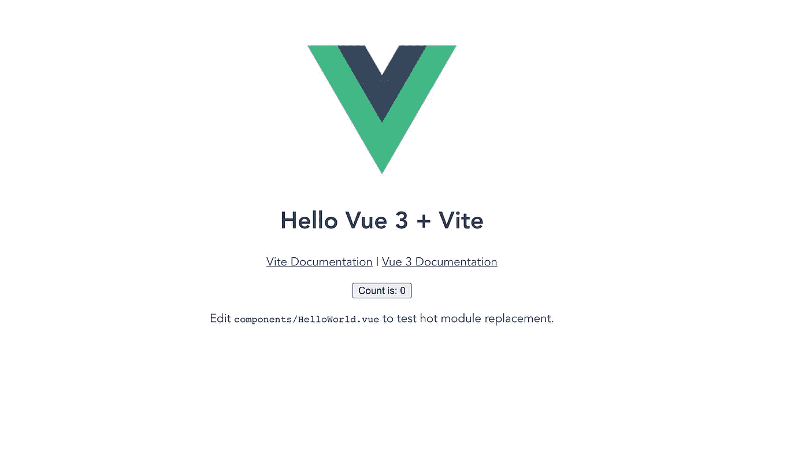
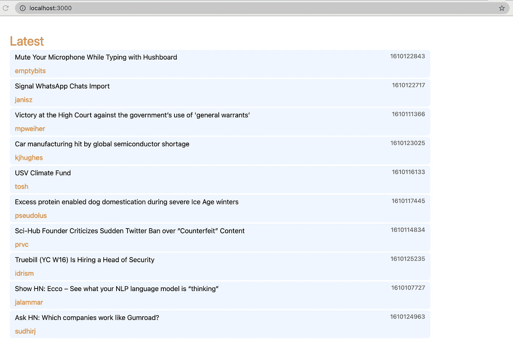
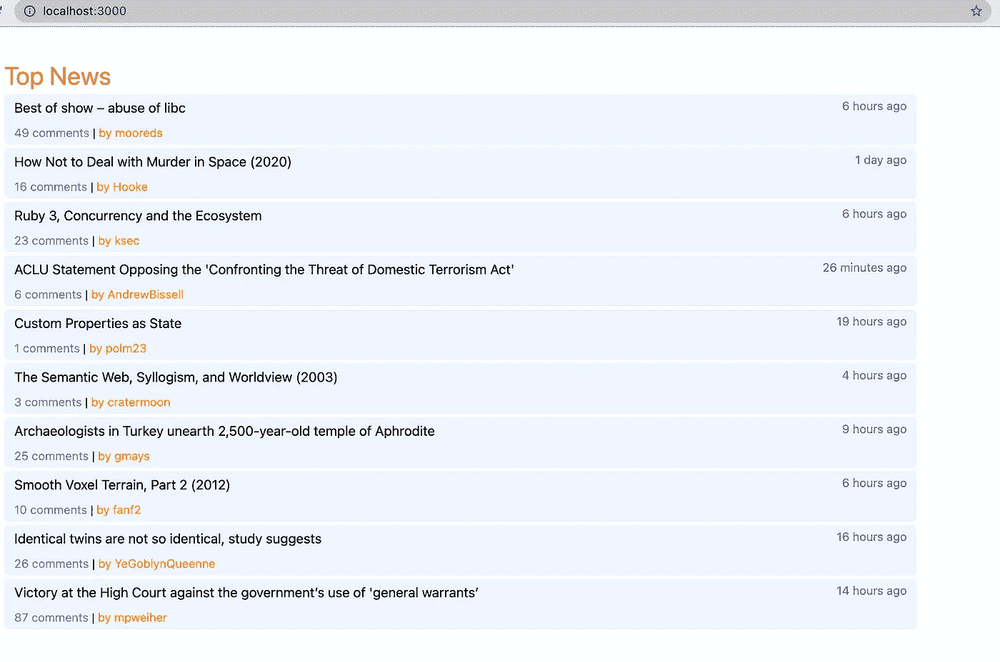

# 带有 Vue 3、Vite 2、VueX 4 和 Tailwind 的 HackerNews 阅读器—第 1 部分

> 原文：<https://itnext.io/hackernews-reader-with-vue-3-vite-2-and-vuex-4-part-1-247315ceb06a?source=collection_archive---------0----------------------->


劳伦·曼克在 Unsplash[上的照片](https://unsplash.com?utm_source=medium&utm_medium=referral)

与 React(由脸书支持)和 Angular(来自谷歌)相比，VueJS 正在成为最受欢迎的前端框架之一。最近，它已经更新到第 3 版，有许多令人兴奋的新功能。在本帖中，我们将探索与 VueX(状态管理)的结合来处理第三方 API。为了便于学习，我们的目标只是从 Hacker News 接收热门文章，并从客户端加载。

> 你可以试试这里的在线演示[https://hnews.techika.com](https://hnews.techika.com/)(更新到最新版本)

首先，我们使用 [Vite](https://vitejs.dev/) 来搭建项目。你可能会奇怪为什么我不用官方的 [Vue CLI](https://cli.vuejs.org/) 工具。原因是 Vite 真的很快，在这种情况下我只想快速演示一下。另一方面，Vue CLI 建立在强大而流行的 [Webpack](https://webpack.js.org/) 之上，将给你带来一个令人惊叹的插件生态系统(并且它与 Vue 2 兼容)。所以，现在我们用 [*纱*](https://yarnpkg.com/) (你可以用 npm 代替，只是个人喜好，虽然我更喜欢纱的速度)来创建我们新的 web app(需要 Node.js 版本> =12.0.0。)

```
yarn create @vitejs/app
```

输入命令后，会提示您选择一些选项。然后我们 *cd* 到你的工作目录，运行以下命令来安装一些工具:VueX(4 . x 版)，eslint 以及它的 Vue 和 axios 插件。

```
yarn
yarn add axios vuex@next --save
yarn add -D eslint eslint-plugin-vue
yarn eslint --init
yarn dev
```

现在，您可以打开浏览器并转到地址`[http://localhost:3000](http://localhost:3000)` 来查看 dev 服务器是否正在运行。



dev 服务器运行在 localhost:3000 上

对于界面，我将使用 Tailwind，并且“ *Vue 3 和 Vite 还不支持 PostCSS 8，所以你需要安装 Tailwind CSS v2.0 PostCSS 7”。*

```
yarn add -D tailwindcss@npm:@tailwindcss/postcss7-compat @tailwindcss/postcss7-compat postcss@^7 autoprefixer@^9
```

接下来，要生成 *tailwind.config.js* 和 *postcss.config.js* 文件，运行:

```
npx tailwindcss init -p
```

来自官方指南:*“在你的* `*tailwind.config.js*` *文件中，用所有页面和组件的路径配置* `*purge*` *选项，这样 Tailwind 就可以在产品构建中对未使用的样式进行树抖动。”*

```
module.exports = {
    purge: ['./index.html', './src/**/*.{vue,js,ts,jsx,tsx}'],
    darkMode: false, // or 'media' or 'class'
    theme: {
      extend: {},
    },
    variants: {
      extend: {},
    },
    plugins: [],
}
```

然后在`src/assets/css`中创建一个新文件`main.css`:

```
/* ./src/assets/css/main.css */

/*! @import */
@tailwind base;
@tailwind components;
@tailwind utilities;
```

然后，我们需要首先从 HackerNews 获取数据到 VueX store。在下面的代码片段中，我还设置了 axios 实例，以便我们以后可以重用它。HackerNews 的 API 获取头条新闻只返回 id，因此我们需要在收到数组后获取每个单独的条目。

接下来，我们在`components/Stories.vue`创建一个新组件，如下所示:

然后将 VueX 添加到`main.js`

```
import { createApp } from "vue";
import App from "./App.vue";
import store from "./store";
import "./assets/css/main.css";const app = createApp(App);
app.use(store);
app.mount("#app");
```

最后，我们编辑`App.vue`

打开`[http://localhost:300](http://localhost:300)0`和中提琴



黑客新闻头条

嗯，我忘了时间，我们需要让它更易读，而不是一串数字。我将使用`timeago.js`包来操纵。

```
yarn add timeago.js
```

然后，我们在`Stories.vue`中添加一个新方法

```
methods: {
  parseTime(t) {
    return timeago.format(t * 1000);
  }
},
```

并在模板部分实现它:

```
<div class="text-sm text-gray-500">{{ parseTime(item.time) }}</div>
```

重新加载页面。



最终的源代码在 [Github repo](https://github.com/infantiablue/vhnews) 上。

在下一篇文章中，我们将实现 Vue 组件的高级特性来动态呈现它们。如果能收到你们的任何反馈，我将不胜感激。您可能想继续阅读第 2 部分，该部分将实现黑暗模式，并通过使用 HackerNews API 从其他主题中获取故事。

*本帖原帖来自* [*我的博客*](https://techika.com/2021/01/09/build-hackernews-reader-vuejs-tailwind-p1/) *。*

资源:

*   [维特。JS](https://vitejs.dev/)
*   [Vuex@Next](https://next.vuex.vuejs.org/)
*   [官方黑客新闻 API](https://github.com/HackerNews/API)
*   [顺风 CSS](https://tailwindcss.com/)