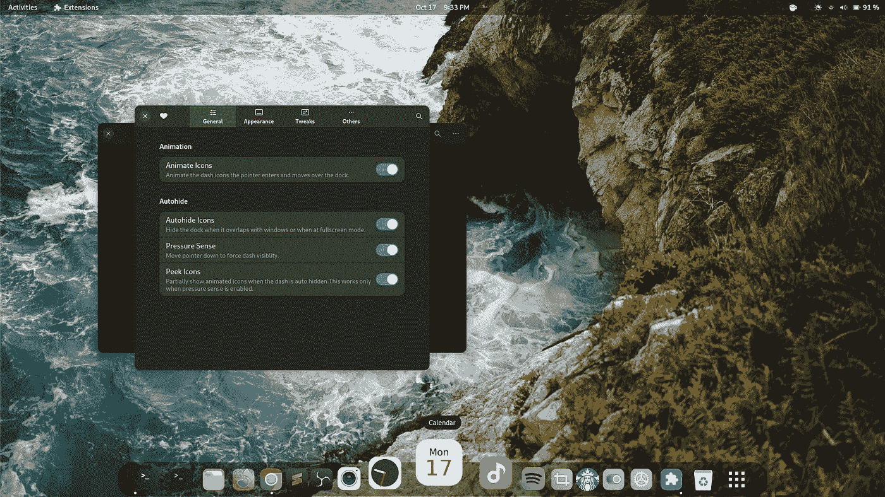

# 破解 GNOME Shell——创建扩展

> 原文：<https://itnext.io/hacking-the-gnome-shell-create-extensions-ef3e4ecac325?source=collection_archive---------5----------------------->

创建自己的 GNOME Shell 扩展( *GSE* )非常简单。只需按照官方的 [**指南**](https://wiki.gnome.org/Projects/GnomeShell/Extensions) 去做，你就会有一个大约 50 行代码的工作 *GSE* 。有许多视频、教程和文章可以进一步帮助您入门。本文希望您已经阅读了这些指南。

开发一个 *GSE，*不是典型的编码体验。如果您真的想修改 Shell，特别是在行为方面，通常有必要将您自己的代码注入到 Shell 本身中。然后就变成了软件黑客的练习。

# 为什么我创建我的第一个扩展——MAC OS 和 GNOME 40

我成为 macOS 的用户已经有一段时间了。我喜欢它的桌面，干净简约的主题，整洁的外观。在应用和窗口中导航，尤其是使用触控板手势，感觉非常自然。

当我永久地切换到使用 Gnome 的 Linux 时，我发现 Gnome 桌面可能是最接近 T21 体验的东西。Gnome 40 在性能和功能上是如此的飞跃，以至于它可以吸引那些愿意尝试的新用户。

然而，Gnome 40 版本也对桌面应该是什么样子非常固执己见。它将 dash、应用列表、应用搜索、工作区切换器合并成一个大的*概览*。在 macOS 上，它们分别作为 dock、launch pad、workspaces 和 Spotlight 存在。每一个都有相似但仍可区分的功能。Windows 11 遵循类似的模式。

*概述*对*我*来说，是我个人更喜欢的干净、简约和整洁的反义词。更糟糕的是，每次首次登录时都会显示*概览*。我个人希望迎接我的是漂亮的壁纸。就像我希望我的眼睛糖果 dash 图标总是在桌面上可见，而不是隐藏在*概览*中。

我说*非常固执己见*，因为没有简单的方法通过设置应用程序来改变这些。另一个不可更改的设置是三指滑动手势。虽然以前 4 个手指滑动可以切换工作空间，3 个手指滑动可以映射到四处移动的窗口，但现在不再是这样了。

谢天谢地，Gnome 外壳仍然很容易修改。这就是我的 Gnome shell 黑客行为开始的地方——让它适合我的个人品味。

# 我的第一个模型

我的第一个 Gnome shell 修改不是一个扩展，而是一个黑客。制作黑客遵循与制作扩展相同的第一步。

# 第一步

指南没有告诉你的是，生成扩展后最重要的步骤是[下载整个 *Gnome shell* source](https://github.com/gnome/gnome-shell) 。

在我们试图改变任何事情之前，我们必须知道我们在处理什么。因此，浏览一下 *Gnome shell* 代码。从指南中我们已经知道扩展是用 JavaScript 编码的。现在，我们将发现外壳本身也几乎完全是用 JavaScript 编写的，或者至少可以从 JavaScript 访问。而且源代码组织得非常好。而明智的文件命名如 *dash.js、panel.js、appFavorites.js* 会很快带领我们走向正确的方向。

# 四指滑动

第一个也是最容易修改的行为是手势——将 3 个手指变成 4 个手指来切换工作空间。SwipeTracker.js 似乎是非常明显的候选文件。我们将立即找到下面的行:

```
**const** GESTURE_FINGER_COUNT = 3
```

*常量*？不仅没有 Gnome 设置来将 3 改为 4——这在以前是可用的— *Gnome 40* 现在也很难通过硬编码手指数设置的扩展来修改它。

# 黑客

在以前的 Gnome 版本*中，swipeTracker.js* 可以从系统文件中获得，你只需编辑代码就可以了。

然而，目前, *Gnome shell* 的 JavaScript 代码是作为资源嵌入到系统库 *libgnome-shell.so* 中的。

第一黑:用十六进制编辑器编辑库，找到文本*“const GESTURE _ FINGER _ COUNT = 3*”，将 3 改为 4。重启 linux 就大功告成了。通过改变外壳库中的单个字符，我们现在有了一个 4 指手势工作区切换器。

我写了一个简单的 [python 脚本](https://github.com/icedman/gnome-shell-hammer/blob/master/shell/swipe3to4.py)来简化这个过程。

虽然这种方法对于个人消费来说已经足够好了，但它显然不是扩展外壳的推荐方式。手动编辑系统文件是一场迟早会发生的灾难。此外，每当我们更新操作系统和 Gnome 时，我们必须不断地修补库。

使用常规扩展可以实现同样的行为吗？

# 猴子补丁

Monkey patching 是在 ***运行时*** 修改一段代码行为的术语。用 JavaScript 很容易做到。

## 变量

想象一下，如果手势 _ 手指 _ 计数不是一个*常量*声明。而是 *SwipeTracker* 类的成员变量。编辑变量如下:

```
class MyExtension {
  enable() {
     SwipeTracker.gesture_finger_count = 4;
  } disable () {
     SwipeTracker.gesture_finger_count = 3;
  }
}
```

这个简单的扩展就可以达到我们的目的。然而，事实并非如此。GESTURE_FINGER_COUNT 不是成员变量，它被设置为不可访问和不可编辑。

我们将不得不研究使用手势 _ 手指 _ 计数变量的修补函数。

## 功能

修补功能可以用类似的方式完成。例如:

*Main.overview.setMessage* 是 Shell 中弹出通知消息的函数。我们可以通过将 *setMessage* 指向我们自己的空函数来修改这种行为，如下所示:

```
Main.overview.setMessage = () => {}
```

这有效地使所有通知消息静音。

猴子补丁函数和变量是修改 *Gnome 外壳*的简单方法。

# 信号

修改 Shell 行为的另一种流行方式是监听和响应系统事件。

几个外壳组件*发出*事件。例如，每当触摸板被访问时， *global.stage* 对象发出一个*capture-event::touchpad*事件。想要被通知该事件的其他组件将订阅或*连接*与*全局阶段*

```
global.stage.connectObject('capture-event::touchpad', MyFunction, MyObject);
```

我们可以通过在特定事件被触发或发出时调用我们的代码来添加新的功能和效果。我发现很难找到 Gnome shell 的所有对象和事件的文档。但是在源代码中快速搜索 *emit* 调用会让我们知道可以订阅什么。我用过的一些事件:

```
'notify::focus-window'
'in-fullscreen-changed'
'icon-theme-changed'
```

我们调用 *disconnectObject* 来取消订阅。

# 扩展

*SwipeTracker* 订阅 *global.stage* 对象的功能，特别是通过监听 *capture-event::touchpad。*

我们将猴子补丁 *SwipeTracker* 或者更准确地说是使用 *SwipeTracker* 的 Shell 组件。以下这些物体是值得注意的。

```
Main.overview._swipeTracker._touchpadGesture;
Main.wm._workspaceAnimation._swipeTracker._touchpadGesture;
Main.overview._overview._controls._workspacesDisplay._swipeTracker._touchpadGesture;
```

其中每一个都有一个 *_handleEvent* ，每当触摸板事件被触发时都会被调用。

首先，我们从 *global.stage* 中取消订阅对象，以便不再调用 *_handleEvent* 。

```
global.stage.disconnectObject(Main.overview._swipeTracker._touchpadGesture);global.stage.connectObject('capture-event::touchpad', MY_OWN_HANDLE_EVENT, Main.overview._swipeTracker._touchpadGesture);
```

然后我们重新订阅，这次传递我们自己的事件处理程序 MY_OWN_HANDLE_EVENT。我们自己的代码将调用并返回原始 *_handleEvent 的结果。*通过这种方式，外壳的行为尽可能接近以前。

```
function MY_OWN_HANDLE_EVENT(actor, event) { // do our magic here before passing through
  // perhaps we want to modify the event object // Call the original handler
  return _handleEvent(actor, event);
}
```

## 我们的魔法

*_handleEvent* 函数将接收一个*事件*对象作为其参数之一。这个事件对象包含触摸板事件的细节，并有一个名副其实的函数*get _ touchpad _ gesture _ finger _ count。*

我们将猴子补丁*事件*对象因此:

```
(actor, event) => {// save the original function
event._original_get_touchpad_gesture_finger_count = event.get_touchpad_gesture_finger_count;event.get_touchpad_gesture_finger_count *= () => {
  if (event.*_original_get_touchpad_gesture_finger_count() == 4) {
     return 3;
  }
  return 0;
*}*// call the original handler with a modified event
return _handleEvent(actor, event);
```

上面的代码只是在事件对象被传递给订阅者之前对其进行了修改。当检测到 4 个手指触摸时，*事件*对象的函数*get _ touchpad _ gesture _ finger _ count*将返回 3 而不是 4。随后的代码将收到 3 个手指计数，并相应地采取行动。一个非常简单的技巧。

当猴子修补函数时，通常会保存原始函数。以便在必要时仍然可以调用它。当我们的扩展被禁用时，这也给了我们恢复修补函数的能力。

我们现在有了第一个有用的 GSE。

# 你脑海中的问题

*我是如何了解 Main、Main.overview、global、global.stage 所有这些类和对象的？*

—通过阅读 *Gnome shell* 源代码。这一点怎么强调都不为过。你现在是黑客了。Gnome 让你不必对任何东西进行逆向工程。从源代码中发现你的入口点，然后开始破解。

此外，如果你彻底通读了指南，你会了解到*窥镜*。这是一个不可或缺的工具。这是一个 JavaScript 控制台。请阅读官方指南。目前只有这个— *Alt-Fn-F2，*并在运行命令框上键入 ***lg*** 。

# 启动动画概述

我之前提到过，我个人希望看到我的桌面和漂亮的壁纸，而不是登录时看到的*概览*。一个简单的猴子补丁可以处理这种情况。

*Overview* 对象在 *overview.js.* 中定义，它具有函数 *runStartupAnimation。我们这样修补它:*

```
Main.overview.runStartupAnimation = (callback) => {
  // execute the callback immediately and return
  callback();
}
```

# 回顾

所以我们有两个示例扩展，安抚我个人对 Gnome 的两个默认行为的厌恶， [**4 手指工作区切换器**](https://github.com/icedman/swap-finger-gestures-3-4) 和 [**抑制启动概览动画**](https://github.com/icedman/suppress-startup-animation) **。**

总之，要创建自己的 Gnome Shell 扩展:

1.  遵循指南并根据模板生成
2.  下载 Gnome Shell 源代码并研究它
3.  学习猴子补丁
4.  学习信号

# 接下来是什么— Dash2Dock Lite

我也提到我个人希望我的 Dash 或 Dock 应用程序图标总是显示在桌面上。这不仅是一个眼睛糖果，它也是功能提供快速访问我最喜欢的应用程序。

一个叫做 Dash-to-Dock 的扩展为我们做了这件事。它将仪表板从*概览*中取出，并将其停靠在桌面上。 *Gnome 40 的发布，*却打破了延续。在那段时间里，有人怀疑开发人员是否愿意更新和继续维护这个扩展。

为了填补空白，我创建了自己的扩展，名为[**dash 2 dock Lite**](http://github.com/icedman/dash2dock-lite)**。它的功能远少于成熟但已损坏的 Dash to Dock。但是它有一些让它更有趣的功能。—它有像 macOS dock 一样的动画。**



动画码头！

[**dash 2 dock Lite**](http://github.com/icedman/dash2dock-lite)**扩展最初是个人使用。自从我发表以来，我收到了许多功能请求。我注意到他们中的一些人认为这个扩展可能已经超过了“Lite”这个词。**

**它有一个动画模拟时钟，动态日历，垃圾桶，智能隐藏等——大部分前 macOS 用户希望从 Dock 得到的功能。你应该尝试一下。尽管这个扩展仍然需要大量的测试——并且我会感谢 bug 报告。**

**我的下一篇文章将记录我从制作 D2DL 扩展中学到的东西:动画、性能、调试、样式表、自定义绘图、现代偏好窗口。**