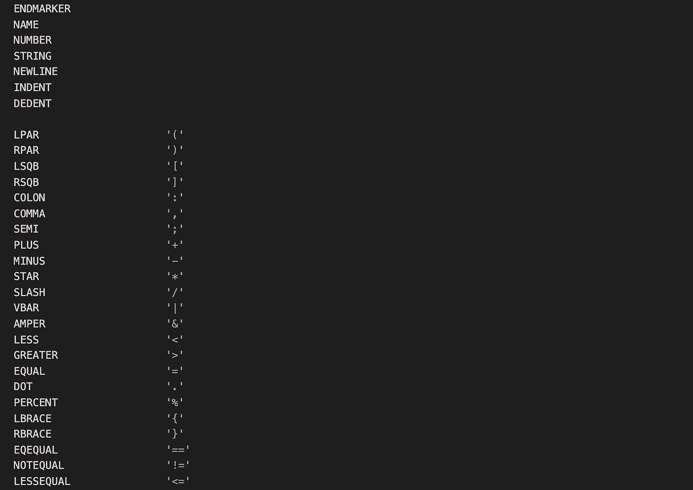
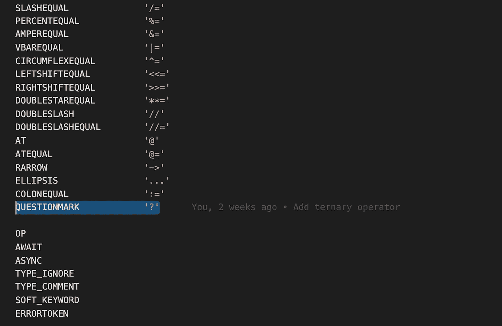
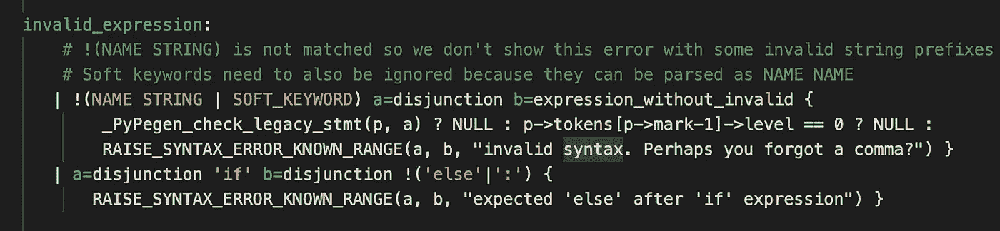

# 破解 Python 语法:三元运算符

> 原文：<https://itnext.io/hacking-the-python-syntax-part-1-ternary-operator-bbcb04aa6ecb?source=collection_archive---------1----------------------->


在 [Unsplash](https://unsplash.com/s/photos/jenga?utm_source=unsplash&utm_medium=referral&utm_content=creditCopyText) 上[用像素拍摄的](https://unsplash.com/@ourlifeinpixels?utm_source=unsplash&utm_medium=referral&utm_content=creditCopyText)我们的生活

## 在 5 行代码中

[简介](https://remykarem.medium.com/hacking-the-python-syntax-part-0-introduction-9a1c054ec1e6) | **三元运算符** | [交替 lambda 语法](https://remykarem.medium.com/hacking-the-python-syntax-alternate-lambda-syntax-c87c383dd1a3) |函数中无返回关键字(即将推出)|列表理解++(即将推出)

*变更日志:
2022 年 12 月 31 日—使用 Medium 的新代码块突出显示语法
2022 年 1 月 5 日—修复错别字并提高清晰度*

## 目录

1.  [三元运算符](#f4de)
2.  [当前语法](#3961)
3.  [目标语法](#f48a)
4.  [添加令牌](#ad57)
5.  [改变语法](#a7ee)
6.  [例题](#fd1c)

对于环境设置，请阅读*第 0 部分—简介*。完整的代码，看我的分叉[这里](https://github.com/remykarem/cpython/tree/ternary-operator)。

# 1.三元运算符

[**三元运算符**](https://en.wikipedia.org/wiki/%3F:) 在很多语言中都很常见。它用于简洁地表达一个简单的条件表达式，通常在一行中。

# 2.当前语法

在 Python 中，我们已经有了**条件表达式**:

```
"good" if x==100 else "bad"
```

这符合规则

```
<consequent> if <test> else <alternative>
```

我不喜欢以这种方式阅读条件表达式。

我更喜欢先阅读条件/测试，然后一起阅读 2 个结果。(我是在了解了 JavaScript 的三元运算符后才意识到这一点的。)

# 3.目标语法

因此，条件表达式中的三元运算符如下所示:

```
score>=50 ? "pass" : "fail"
```

现在规则变成了

```
<test> ? <consequent> : <alternative>
```

这是一个很好的语法，因为我认为它更具可读性——首先，提出一个是-否问题，其次，用`?`(在大多数自然语言中，这在语义上意味着一个问题)表示它，最后给出两种不同的结果，用冒号`:`分隔。

实现这种三元运算符语法的一些语言包括 C、Java、JavaScript 和 Swift。

# 4.添加令牌

从 Python v3.11.0a2 开始，`?`不是现有的*令牌*。


布雷特·乔丹在 [Unsplash](https://unsplash.com/s/photos/letters?utm_source=unsplash&utm_medium=referral&utm_content=creditCopyText) 上的照片

> *📜* ***源代码编译:生成令牌***
> 
> *在* [*词法分析*](https://en.wikipedia.org/wiki/Lexical_analysis) *中，一个* ***记号*** *是一个字符序列(* ***记号值*** *))归于一个赋值的意义(* ***记号名*** *)。*
> 
> ***记号化*** *是从一串输入字符中识别记号的过程。它是编译我们 Python 源代码的第一步(见* [*此处*](https://devguide.python.org/compiler/) *)。*



令牌文件的代码片段，其中包括令牌名称，如数字、字符串、LPAR 和 RPAR

`Grammar/Tokens`文件定义了 Python 中允许的所有标记。以下是一些令牌示例:

*   令牌名称:`NUMBER`；令牌值是数字文字，如`123`和`0xff`
*   令牌名称:`STRING`；令牌值是字符串文字，如`"hello!"`和`'hello!'`
*   令牌名:`LPAR`；令牌值:`'('`
*   令牌名称:`RPAR`；令牌值:`')'`

三元运算符有两个符号:`?`和`:`。`:`是`COLON`的标记值，但是问号`?`不是 Python 中的现有标记，所以让我们将它添加到现有标记列表的下面

```
QUESTIONMARK            '?'
```



然后运行`make regen-token`重新生成令牌。

> **💡** `**make regen-token**` ***是干什么的？***
> 
> *这个命令运行一个 Python 脚本(是的，一个 Python 脚本！)读取* `Grammar/Tokens` *文件并生成几个文件，包括* `token.c` *文件。C 文件稍后会被编译并在标记化过程中使用。*
> 
> *要了解更多，先从* `./Makefile` *文件中的* `regen-token` *目标开始。*
> 
> *要了解更多的 Makefiles，* [*这里的*](https://opensource.com/article/18/8/what-how-makefile) *就是一个很好的介绍。*

# 5.改变语法

*在这一部分，我们将介绍以下内容:*

*5.1 增加一个替代方案*

*5.2 更新变量和语法动作*

*5.3(可选)条件表达式 AST 节点*

*5.4 如何引发错误*

*5.5 改进错误信息*

现在我们已经添加了令牌，让我们更改 Python 的语法，以包含用于条件表达式的三元运算符语法。

等等…什么是*语法*？


照片由[布雷特·乔丹](https://unsplash.com/@brett_jordan?utm_source=unsplash&utm_medium=referral&utm_content=creditCopyText)在 [Unsplash](https://unsplash.com/s/photos/grammar?utm_source=unsplash&utm_medium=referral&utm_content=creditCopyText) 上拍摄

[**语法**](https://en.wikipedia.org/wiki/Formal_grammar) 是一组规则，定义了在语言中被认为是正确的记号的组合。

我们想定义在现有的规则集中编写正确的三元运算符语法意味着什么。

让我们来看看语法文件`Grammar/python.gram`。在这个文件中，您看到的是大量的规则、一些看起来很有趣的语法和一些熟悉的关键字，如`'return'`。

因为我们正在处理具有`if`和`else`关键字的条件表达式，所以让我们使用 regex: `'if'.*'else'`来找到它(因为这样做很酷，否则你可以对`'if'`使用 Cmd+F)。

在`python.gram`文件中:

```
expression[expr_ty] (memo):

    | invalid_expression

    | a=disjunction 'if' b=disjunction 'else' c=expression { 
        _PyAST_IfExp(b, a, c, EXTRA) }

    | disjunction

    | lambdef
```

我们发现 if-else 规则停在`expression`下面。

一个`expression`被定义为以下五种情况之一(**选择**):

1.  `invalid_expression`(暂时忽略这一点)
2.  `invalid_legacy_expression`(暂时忽略这一点)
3.  `a=disjunction 'if' b=disjunction 'else' c=expression ...`(我们要从什么开始！)
4.  `disjunction`(暂时忽略这个)
5.  `lambdef`(暂时忽略这个)

其中`|`表示“或”

## 5.1 添加替代方案

要为三元运算符添加一个条件表达式，让我们匆忙复制当前的条件表达式，只需将`'if'`替换为`'?'`，将`'else'`替换为`':'`。那我们就看看会怎样。

添加以下规则

```
a=disjunction '?' b=disjunction ':' c=expression {
  _PyAST_IfExp(b, a, c, EXTRA) }
```

在`expression[expr_ty]`中:

```
expression[expr_ty] (memo):

    | invalid_expression

    | a=disjunction 'if' b=disjunction 'else' c=expression { 
        _PyAST_IfExp(b, a, c, EXTRA) }

    | a=disjunction '?' b=disjunction ':' c=expression { 
        _PyAST_IfExp(b, a, c, EXTRA) }

    | disjunction

    | lambdef
```

使用`make regen-pegen && make -j4`重新运行。

> *💡**`**make regen-pegen**`***是干什么的？*** *该命令重新生成解析器源代码，即* `parser.c` *文件，该文件稍后将被编译并用于解析我们的 Python 代码。**
> 
> **`parser.c`*是如何生成的？* *有一个 Python 模块* `Tools/peg_generator/pegen` *读取* `python.gram` *文件，最后生成* `parser.c` *。***
> 
> ***要了解更多，从看* `./Makefile` *中的 regen-pegen 目标开始。***

**让我们通过运行`./python.exe`可执行文件在 REPL 中尝试一些东西，并使用三元运算符测试我们的条件表达式:**

```
**>>> x = 100
>>> x>=50 ? "pass" : "fail"
"fail"**
```

**它工作了🎉！**

**只是…我们期待的是`"pass"`而不是`"fail"`😞。这就把我们带到了下一节。**

## **5.2 更新变量和语法动作**

**回想一下，之前的条件表达式和我们的版本唯一的区别就是`<consequent>`和`<test>`的位置。**

**当前条件表达式:**

```
**a=<consequent> if b=<test> else c=<alternative>**
```

**使用三元运算符的条件表达式:**

```
**a=<test> ? b=<consequent> : c=<alternative>**
```

**在我们添加的替代方案中，让我们将“函数参数”中的`b`和`a`的位置从**

```
**_PyAST_IfExp(b, a, EXTRA)**
```

**到**

```
**_PyAST_IfExp(a, b, EXTRA)**
```

**最终的`expression[expr_ty]`应该是这样的:**

```
**expression[expr_ty] (memo):

    | invalid_expression

    | a=disjunction 'if' b=disjunction 'else' c=expression { 
        _PyAST_IfExp(b, a, c, EXTRA) }

    | a=disjunction '?' b=disjunction ':' c=expression { 
        _PyAST_IfExp(a, b, c, EXTRA) }

    | disjunction

    | lambdef**
```

**并重新运行`make -j4 && ./python.exe`。**

**在蟒蛇 REPL:**

```
**>>> x = 100
>>> x==100 ? "good" : "bad"
"good"**
```

**咻，成功了🎉🎉！但是为什么会起作用呢？**

**让我们先从高层次上理解*语法变量*和*语法动作*，然后看看它们与 *AST* 和`_PyAST_IfExp`的关系。**

```
**expression[expr_ty] (memo):

    | invalid_expression

    | invalid_legacy_expression

    | a=disjunction 'if' b=disjunction 'else' c=expression {
        _PyAST_IfExp(b, a, c, EXTRA) }

    | disjunction

    | lambdef**
```

**在我们添加的替代方案中，我们有**

*   **`a=`、`b=`和`c=`，以及**
*   **花括号`{ ... }`包含某种带有参数`a`、`b`和`c`的函数`_PyAST_IfExp`。**

**该规则中的`a`、`b`和`c`是 [**变量**](https://devguide.python.org/parser/#variables-in-the-grammar) ，用于捕捉(通过`=`分配的)内容。这些变量用于语法动作*。***

**一个 [**语法动作**](https://devguide.python.org/parser/#grammar-actions) 告诉解析器，如果替换被成功解析，将生成什么 *AST* *节点*。**

> ***📜* ***源代码编译:生成 ASTs*****
> 
> **[***AST***](https://en.wikipedia.org/wiki/Abstract_syntax_tree)*代表抽象语法树，是你的源代码在树形数据结构中的高级表示。***
> 
> **生成 ASTs 是源代码编译的第二步。**
> 
> ***生成的 AST 节点的例子有 _PyAST_IfExp 等。***
> 
> ***📜* ***源代码编译:超越 ASTs*****
> 
> ***AST 生成后会发生什么？它被转换成表示程序流程的图形数据结构。基于这个图数据结构，发出字节码指令。***

**总而言之，一旦我们成功地解析了三元运算符替代项，我们将为条件表达式生成一个 AST 节点，通过语法动作称为`_PyAST_IfExp`。**

## **5.3(可选)条件表达式 AST 节点**

**我们说过`_PyAST_IfExp`是“某种功能”嗯，确实是 C 函数！**

**在头文件`Include/internal/pycore_ast.h`中，我们看到了它的函数声明:**

```
**expr_ty _PyAST_IfExp(expr_ty test, expr_ty body, expr_ty orelse, 
                     int lineno, int col_offset, int end_lineno, 
                     int end_col_offset, PyArena *arena);**
```

> ***💡* ***C 头文件*** *在 C 和 C++中，有一个* ***头文件*** *是定义函数签名的地方，不用它们的体。***

**在函数声明中，前 3 个参数按以下顺序表示我们在语法文件中所写的内容:**

1.  **`test` —病情，**
2.  **`body` —条件为真时的结果，以及**
3.  **`orelse` —条件为假时的结果。**

**其余的参数由`EXTRA`宏注入。这些就是作者所说的 [**自动变量**](https://devguide.python.org/parser/#automatic-variables) 。变量 _start_line_no 等。是由解析器自动注入的。**

```
**#define EXTRA _start_lineno, _start_col_offset, \
              _end_lineno, _end_col_offset, p->arena**
```

> ***💡* ***C 宏*** *在 C 和 C++中，一个* ***宏*** *被松散地定义为“搜索和替换”这里，每次在 C 源代码中遇到* `EXTRA` *，都会展开为* `*_*start_lineno, _start_col_offset*, _end_lineno, _end_col_offset, p->arena*` *。***

## **5.4 如何引发错误**

**现在让我们通过编写一个不完整的条件表达式来测试我们在 REPL 中的语法:**

```
**>>> x = 100
>>> x==100 ? "good"
SyntaxError: invalid syntax**
```

**太好了！它像预期的那样抛出了一个`SyntaxError`，但是错误信息只是说… `invalid syntax`？那是…不是一个有用的错误信息。给出更多有用的消息来帮助程序员调试总是一个好主意。**

> ***💡****Python 3.10 中更好的错误消息*** *Python 3.10 版本的一个特点就是针对语法、缩进、属性、变量名相关的错误，为用户提供更有用的错误消息(甚至给出可能的建议！).参见* [*此处*](https://docs.python.org/3/whatsnew/3.10.html#better-error-messages) *的发布说明。***

**所以现在的问题是…我们可以在解析时提出错误吗？是的，我们可以！这是通过`invalid_expression`替代的。**

**但是你可能会想，等等…这是什么规则？**

**还记得我们之前说过语法动作在成功解析后会生成 AST 节点吗？嗯……还有一点。**

****

**python.gram:无效的表达式规则**

**看一下`invalid_expression`规则。注意，每个选项中的语法动作都是`RAISE_SYNTAX_ERROR_KNOWN_RANGE`。如果你查看所有其他以`invalid_`开头的规则，你会发现它们的语法行为是`RAISE_*_ERROR_*`。**

**因此，为了引发语法错误，我们定义了一个替代方法，它将引发一个错误(而不是创建一个 AST 节点)。**

> ****💡语法错误是如何产生的** *阅读* [*此处*](https://devguide.python.org/parser/#how-syntax-errors-are-reported) *阅读更多关于语法错误是如何产生的。***

## **5.5 改进错误消息**

**因此，我们不只是告诉程序员他们的语法是错误的，而是让他们放心，嘿，没什么大不了的，你只是忘记了一个冒号。**

**让我们在`invalid_expression`规则下添加以下选项:**

```
**| a=disjunction '?' b=disjunction !':' {
  RAISE_SYNTAX_ERROR_KNOWN_RANGE(
  b, a, "expected ':' after '?' expression") }**
```

**`invalid_expression`应该是这样的:**

```
**invalid_expression:
    # !(NAME STRING) is not matched so we don't show this error with some invalid string prefixes like: kf"dsfsdf"
    # Soft keywords need to also be ignored because they can be parsed as NAME NAME
   | !(NAME STRING | SOFT_KEYWORD) a=disjunction b=expression_without_invalid {
        _PyPegen_check_legacy_stmt(p, a) ? NULL : p->tokens[p->mark-1]->level == 0 ? NULL :
        RAISE_SYNTAX_ERROR_KNOWN_RANGE(a, b, "invalid syntax. Perhaps you forgot a comma?") }
   | a=disjunction 'if' b=disjunction !('else'|':') { 
        RAISE_SYNTAX_ERROR_KNOWN_RANGE(a, b, "expected 'else' after 'if' expression") }
   | a=disjunction '?' b=disjunction !':' { 
        RAISE_SYNTAX_ERROR_KNOWN_RANGE(b, a, "expected ':' after '?' expression") }**
```

**让我们编译`make -j4 && ./python.exe`并在 REPL 中运行以下代码:**

```
**>>> 10>2 ? "correct"

  File "<stdin>", line 1
    10>2 ? "correct"
           ^
SyntaxError: expected ':' after '?' expression**
```

**瞧啊。我们得到一个更有意义的错误信息！**

# **6.例子**

**return 语句中的三元运算符:**

```
**>>> def evaluate(score):
...     return score >= 50 ? "pass" : "fail"
>>> evaluate(100)
"pass"**
```

**列表理解中的三元运算符**

```
**>>> [x%2 ? "odd" : "even" for x in range(5)]
['even', 'odd', 'even', 'odd', 'even']**
```

**不带括号的 f 字符串中的三元运算符**

```
**>>> score = 100
>>> f'{score >= 50 ? "pass" : "fail"}'
  File "sdin>, line 1
    (score >= 50 ? 'pass' )
                   ^
SyntaxError: f-string: expected ':' after '?' expression**
```

**带括号的 f 字符串中的三元运算符**

```
**>>> score = 100
>>> f'{(score >= 50 ? "pass" : "fail")}'
"pass"**
```

**伙计们，现在就到这里吧！请继续关注更多，如**替代 lambda 语法**、**函数中没有返回关键字**和**列表理解++** ！**

***我发表关于人工智能、机器学习、编程语言和生产力的文章。***

***如果你喜欢阅读更多关于编程语言的内容，你可以通过我的推荐链接* [*订阅*](https://remykarem.medium.com/subscribe) *随时接收更新或者* [*注册*](https://remykarem.medium.com/membership) *！请注意，您的会员费的一部分将作为介绍费分摊给我。***

# **参考**

*   **CPython 编译器的设计([devguide.python.org](https://devguide.python.org/compiler/))**
*   **改变 CPython 的语法([devguide.python.org](https://devguide.python.org/grammar/))**
*   **CPython 解析器指南([devguide.python.org](https://devguide.python.org/parser/))**
*   **CPython 内部([realpython.com](https://realpython.com/products/cpython-internals-book/)**

**[1][https://www.python.org/download/alternatives/](https://www.python.org/download/alternatives/)**

***大声喊出来，给本尼迪克特评这篇文章！***

**这篇文章并不完美(我花了几个星期才写完😮‍💨)所以如果你看到任何错误，请在下面留下评论！**