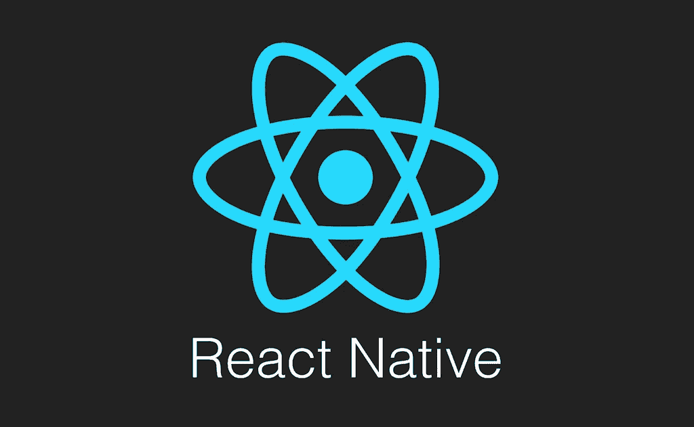

# 处理 React 导航中的选项卡更改

> 原文：<https://itnext.io/handle-tab-changes-in-react-navigation-3717180cddb?source=collection_archive---------2----------------------->



[*点击这里在 LinkedIn 上分享这篇文章*](https://www.linkedin.com/cws/share?url=https%3A%2F%2Fitnext.io%2Fhandle-tab-changes-in-react-navigation-3717180cddb)

> **注**:本文涵盖 react-navigation v1.x，关于 react-navigation v2.x，请参见[React Navigation v2 中的处理选项卡变化](/handle-tab-changes-in-react-navigation-v2-faeadc2f2ffe)。

最近我不得不在用户使用[**React Navigation v1**](https://v1.reactnavigation.org/)切换到**React Native***Tab navigator*中的特定选项卡时执行一些操作。

让我们考虑下面的 TabNavigator:

```
*import* { TabNavigator } *from* "react-navigation";*export* *default* TabNavigator({
  Home: { screen: HomeScreen },
  Settings: { screen: SettingsScreen }
}, {
  **lazy: false**
});
```

> **更新 9-Jun-2018:** 为了让这个工作，你需要把`lazy`配置选项设置为`false`。

现在，假设您想在用户聚焦 Home 选项卡时做一些事情。为此，您必须在`**navigationOptions**`属性上设置`[**tabBarOnPress**](https://reactnavigation.org/docs/tab-navigator.html#tabbaronpress)`回调:

```
class HomeScreen extends Component { static navigationOptions = () => {
    *return* {
      tabBarOnPress({ jumpToIndex, scene }) { // perform your logic here // this is mandatory to perform the actual switch
        // you can omit this if you want to prevent it
        jumpToIndex(scene.index);
      }
    };
  }; ...}
```

如果您的逻辑可以在回调中直接执行，那么您就可以开始了。

但是如果你需要在组件上执行一些**方法**，或者访问组件的**状态**或者**属性**，我们需要做一些额外的工作:

```
class HomeScreen extends Component { static navigationOptions = ({ navigation }) => { const { params } = navigation.state; *return* {
      tabBarOnPress({ jumpToIndex, scene }) { // now we have access to Component methods
        params.onTabFocus(); jumpToIndex(scene.index);
      }
    };
  }; componentDidMount() { // set a custom param on the navigation object *this*.props.navigation.setParams({
      onTabFocus: *this*.handleTabFocus
    });
  } handleTabFocus = () => {
    // perform your logic here
  } ...}
```

所以，我们不直接访问状态或道具。相反，我们:

*   使用`*this*.props.navigation.setParams({ *myParam*: this.*myHandler* })`在导航对象上设置自定义参数
*   因此可以使用`navigation.state.params.*myParam*`在导航选项中调用这个自定义参数

# 使用案例:

*   切换到选项卡时重置一些状态
*   当用户聚焦选项卡时，执行任何附加逻辑
*   防止用户聚焦特定选项卡