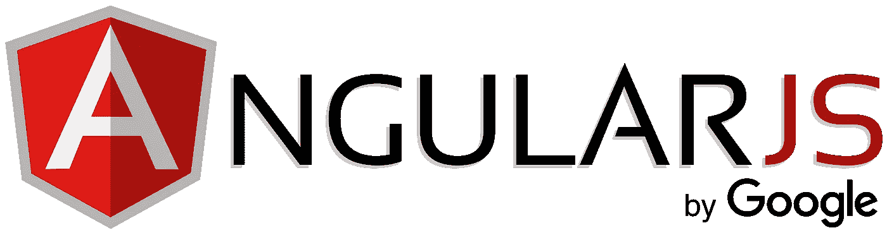

# 用 UI-Router 处理 AngularJS 布线

> 原文：<https://itnext.io/handling-angularjs-routing-with-ui-router-34010f4870a5?source=collection_archive---------1----------------------->



我是从 Angular 2+开始的，但是我现在的公司有一些项目需要 AngularJS 1x。所以，我们到了！

在这篇文章中，我将向你展示如何使用 [UI-Router](https://github.com/angular-ui/ui-router) 来处理 AngularJS 1x 路由。还有一个帖子，我将使用 [Angular-Route (ngRoute)](https://docs.angularjs.org/api/ngRoute) 来处理 AngularJS 路由。

> 两者的不同之处在于 UI-Router 是一个第三方模块，使用不同的方法来管理路由，UI-Router 具有额外的功能，适合更复杂的项目。

如果你想了解更多他们之间的不同，请查看[这篇来自 stackoverflow](https://github.com/angular-ui/ui-router) 的帖子。

我在这篇文章中使用的 AngularJS 版本是 *1.7.2* ，如果你使用旧版本，它可能会有所不同。

我在这篇文章中使用的 UI 路由器版本是 v1.0.19。

在开始之前，你可以从 [Plunker](https://next.plnkr.co/plunk/ylSeK9M5V7ugNDF6) 看一下这个项目。

 [## AngularJS-Routing-UI-Router

### 手柄-角度-布线

next.plnkr.co](https://next.plnkr.co/plunk/ylSeK9M5V7ugNDF6) 

**启动 AngularJS 项目**

很容易建立一个 AngularJS 项目，你只需要在头部嵌入 angular 文件。

```
// index.html<html **ng-app="angularRouting"**>
...<script src="https://cdnjs.cloudflare.com/ajax/libs/angular.js/1.7.2/angular.min.js"></script><script src="https://unpkg.com/@uirouter/angularjs@1.0.19/release/angular-ui-router.min.js"></script><script src="app.js"></script>...// Navigation Menu<ul class="uk-nav uk-nav-default">
 <li class="uk-active">
  <a ui-sref="home">Menu</a>
 </li>
 <li>
  **<a ui-sref="home" ui-sref-active="active">Home</a>**
 </li>
 <li>
  **<a ui-sref="about" ui-sref-active="active">About</a>**
 </li>
</ul>// Content will go here
**<ui-view></ui-view>**
```

你的主要逻辑会在 app.js 里面。

```
var app = angular.module('angularRouting', ['**ui.router**']);
```

**让我们开始路由工作**

为了管理路由，我们需要添加 **$stateProvider** 。下面的代码显示了主页和 about 页面的路由。您现在可以在浏览器中测试它。

带有 **$urlRouterProvider** 的**否则**会将所有其他路由重定向到主页。实际上，您将为此展示一个 404 模板。如果你想分离 HTML 模板，可以用 **tempateUrl** 代替**模板**。

```
// app.jsapp.config(function(**$stateProvider**, **$urlRouterProvider**){
  var states = [
    {
      name: 'home',
      url: '/',
      template: '<h1>This is home</h1>'
    },
    {
      name: 'about',
      url: '/about',
      template: '<h1>This is about</h1>'
    }
  ]; states.forEach((state) => $stateProvider.state(state));
  $urlRouterProvider.otherwise('/');
});
```

**从 URL 获取参数**

我创建了一个带参数的菜单。在您的应用程序中，该参数将通过 **{{ id }}** 动态填充。在这个例子中，我将使用数字 1 作为 params 路由的额外参数。

```
// index.html<ul class="uk-nav uk-nav-default">
 <li class="uk-active">
  <a ui-sref="home">Menu</a>
 </li>
 <li>
  <a ui-sref="home" ui-sref-active="active">Home</a>
 </li>
 <li>
  <a ui-sref="about" ui-sref-active="active">About</a>
 </li>
 <li>
  <a ui-sref="**params({id: 1})**" ui-sref-active="active">Params</a>
 </li>
</ul>
```

现在，我们需要在 app.js 中配置路由。我将使用 ParamsController 来获取参数并将其显示给模板。

```
// app.jsapp.config(function($stateProvider, $urlRouterProvider){
  var states = [
    {
      name: 'home',
      url: '/',
      template: '<h1>This is home</h1>'
    },
    {
      name: 'about',
      url: '/about',
      template: '<h1>This is about</h1>'
    },
    {
      name: 'params',
      url: '/params/**{id}**',
      template: '<h1>Param value: {{ **paramId** }}</h1>',
      controller: function($scope, **$stateParams**) {
        $scope.**paramId** = **$stateParams.id**;
      }
    }
  ]; states.forEach((state) => $stateProvider.state(state));
  $urlRouterProvider.otherwise('/');
});
```

**如何守护你的路线**

所以，有些页面是你不想给公众看的。用户必须登录才能查看它们。

```
// index.html<ul class="uk-nav uk-nav-default">
 <li class="uk-active">
  <a ui-sref="home">Menu</a>
 </li>
 <li>
  <a ui-sref="home" ui-sref-active="active">Home</a>
 </li>
 <li>
  <a ui-sref="about" ui-sref-active="active">About</a>
 </li>
 <li>
  <a ui-sref="params({id: 1})" ui-sref-active="active">Params</a>
 </li>
 <li>
  **<a ui-sref="auth" ui-sref-active="active">You shall not pass!</a>**
 </li>
</ul>**{{ message }} //**show authentication message
<main ng-view></main>
```

然后，您将在 app.js 中添加路由和身份验证服务。如果用户没有查看该页面的权限，他们将被重定向到主页。

我们将利用[转换挂钩](https://ui-router.github.io/guide/transitionhooks)来管理路由。

```
// app.js// Handle authentication error
app.run(['$rootScope', '$transitions', '$state', '$trace', function($rootScope, $transitions, $state, $trace){
  $transitions.**onError**({}, function(transition) {        
    if(transition.to().name === 'auth' && transition.error().detail === '**AUTH_REQUIRED**') {
      $rootScope.message = 'You need to login in order to view that page!';
        $state.go('home');
    }
  });
}]);app.config(function($stateProvider, $urlRouterProvider){
  var states = [
    {
      name: 'home',
      url: '/',
      template: '<h1>This is home</h1>'
    },
    {
      name: 'about',
      url: '/about',
      template: '<h1>This is about</h1>'
    },
    {
      name: 'params',
      url: '/params/{id}',
      template: '<h1>Param value: {{ paramId }}</h1>',
      controller: function($scope, $stateParams) {
        $scope.paramId = $stateParams.id;
      }
    },
    {
      name: 'auth',
      url: '/auth',
      template: '<h1>Success</h1>',
      **resolve: {
        auththenticate: ['$q', function($q) {
          if(true) { // user is not logged in
            return $q.reject("AUTH_REQUIRED");
          }
        }]
      }** 
    }
  ]; states.forEach((state) => $stateProvider.state(state));
  $urlRouterProvider.otherwise('/');
});
```

我假设用户没有权限查看页面，它将返回一个“AUTH_REQUIRED”错误。

从现在开始，你知道如何用 UI-Router 处理 AngularJS 路由。您还可以使用[角度路线(ngRoute)来管理您的路线](/handling-angularjs-routing-with-angular-route-ngroute-a8e6facaf3f9)。

希望这有所帮助:)