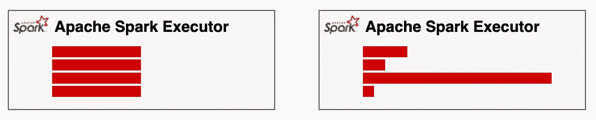
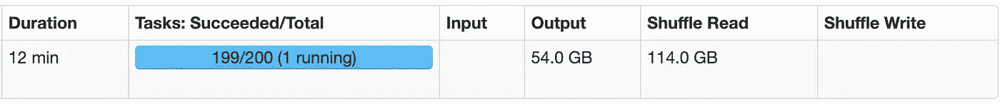
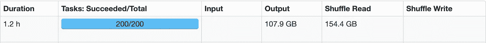
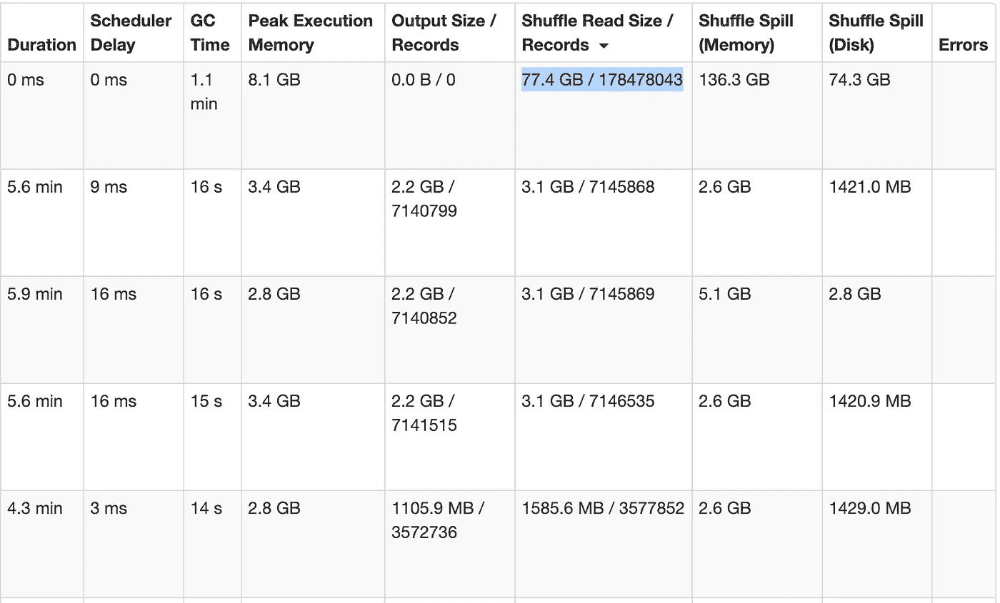
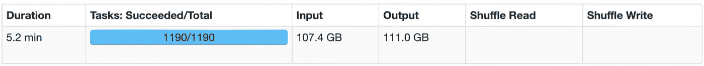
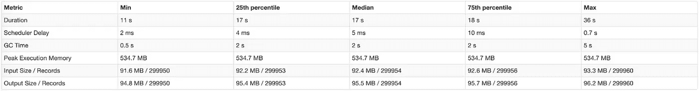
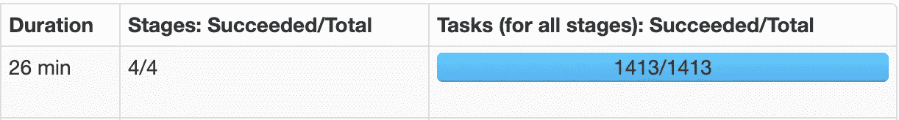
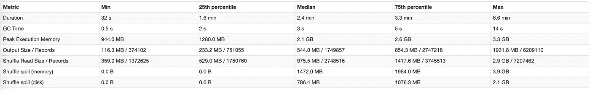

# 在 Apache Spark 中处理数据不对称

> 原文：<https://itnext.io/handling-data-skew-in-apache-spark-9f56343e58e8?source=collection_archive---------0----------------------->



均匀分布与偏斜分布

# 介绍

并行计算系统中一个众所周知的问题是**数据偏斜**。通常，在 Apache Spark 中，数据偏斜是由像 join、groupBy 和 orderBy 这样改变数据分区的转换引起的。例如，连接一个不均匀分布在集群中的键，导致一些分区非常大，并且不允许 Spark 并行处理数据。因为这是一个众所周知的问题，所以有很多可用的解决方案。在本文中，我将分享我在 Apache Spark 中处理数据偏斜的经验。

> 您可以在该资源库中找到所有相关的源代码示例:

[](https://github.com/dimastatz/video-streaming-analytics) [## GitHub-dimastatz/视频流-分析

### 考虑一场像 NBA 比赛这样的现场比赛。这个视频是由安装在篮球场上的摄像机拍摄的，它让…

github.com](https://github.com/dimastatz/video-streaming-analytics) 

> 使用 data-process/processing/flumenz SBT 项目并按照 readme.md 运行示例。如果你喜欢，给回购你的星星。

# 投入

在这个具体的例子中，我们将讨论 CDN 访问日志的每小时批处理。不同的 cdn 产生不同格式和大小的日志文件。为了简化处理，我们正在运行一个预处理器任务，创建大小相等的大约 30MB 的 parquet 格式的文件。所有文件都保存在 AWS S3。批量大小从 50GB 到 1.5TB 不等，具体取决于 cdn 上的流量。对于本文中的所有示例，我使用的事件批处理包含 3570 个文件(356945717 行)，总大小为 107.4GB。

# 目标

我们的数据管道中的一个步骤是数据丰富。这个想法是用不同类型的元数据充实每个日志行，比如地理数据、用户代理、所有者元数据等。例如，如果日志行有**的 owner_id** 字段，OwnerMetadata 有**的 owner_id，owner_name** ，我们将向日志行添加一个 **owner_name** 列。我猜数据丰富对于许多数据管道来说是很常见的。代码可能是这样的

```
val df = spark.read.parquet(“s3://…”)
val geoDataDf = spark.read.parquet(“s3://…”)
val userAgentDf = spark.read.parquet(“s3://…”)
val ownerMetadataDf = spark.read.parquet(“s3://…”)df
 .join(geoDataDf, exprGeo, “left”)
 .join(userAgentDf, exprUserAgent, “left”)
 .join(ownerMetadataDf, exprOwnerMetadata, “left”)
 .write
 .parquet(“s3://…”)
```

# 连接类型

Apache Spark 有 3 种不同的连接类型:广播连接、排序合并连接和混排连接。从 Apache Spark 2.3 开始，排序合并和广播连接是最常用的，因此我将重点介绍这两种。你可以在这里和这里找到更多关于洗牌加入[的信息。](https://databricks.com/session/optimizing-apache-spark-sql-joins)

**排序合并**算法的关键思想是首先通过连接键对关系进行排序，这样交错的线性扫描将同时遇到这些集合，然后合并，这样每个执行器将持有一组特定的连接键。可以想象，这种策略可能非常昂贵:节点需要使用网络来共享数据。
在**广播加入**中，Spark 向每个执行者发送一份完整的查找表副本。显然，在这种方法中，每个执行器在执行连接操作时都是自给自足的。该网络仅用于广播。

# 排序合并联接

因此，我们有一个通过读取 3570 AWS S3 对象创建的事件数据帧，总大小为 107GB。创建的数据框有 356945717 行。我们对有 1100000 行的元数据表执行连接操作，以便用附加信息丰富事件。运行作业并查看 Spark UI 后，我们可以看到下图:

作业开始 12 分钟后:



作业开始 21 分钟后:


最后，需要 1.2 小时才能完成



显然，我们可以看到一个长时间运行的任务有大量的无序读取。在仔细观察这个长时间运行的任务后，我们可以看到它处理了几乎 50%的输入(参见 Shuffle Read Records 专栏)。



问题是为什么给定作业的处理没有适当地并行化。在 Apache Spark 中，排序合并连接将所有具有相同连接键的记录发送到同一个分区，看起来几乎 50%的输入行在连接列中具有相同的值。通过在我的输入文件上运行下面的查询，我可以看到确实是这样，我们有一个典型的数据偏斜问题。

```
spark.read.parquet(“s3://…”)
 .select(“o_id”)
 .groupBy(“o_id”)
 .agg(count(“o_id”).as(“count_o_id”))
 .sort(desc(“count_o_id”))
```

# 广播加入

显然，广播连接看起来是解决数据偏斜问题的好方法。我们有一个几乎完美地分布在 Apache Spark 集群中的事件数据框架。我们的元数据数据框比事件数据框小得多。直觉上，我们希望避免移动大小高达 1.5TB 的事件数据帧，而是将元数据表的整个副本发送给每个 Spark 执行器。因此，我将代码改为

```
val df = spark.read.parquet(“s3://...”)
val geoDataDf = spark.read.parquet(“s3://...”)
val userAgentDf = spark.read.parquet(“s3://...”)
val ownerMetadataDf = spark.read.parquet(“s3://...”)df
 .join(**broadcast**(geoDataDf), exprGeo, “left”)
 .join(**broadcast**(userAgentDf), exprUserAgent, “left”)
 .join(**broadcast**(ownerMetadataDf), exprOwnerMetadata, “left”)
 .write
 .parquet(“s3://...”)
```

在这里，我使用 broadcast 关键字作为 Apache Spark 的提示，来广播 join 操作的右侧。请注意，当其中一个数据帧小于 Spark . SQL . autobroadcastjointhreshold .[的值时，Apache Spark 会自动将连接转换为广播连接，更多信息请参见](https://spark.apache.org/docs/latest/sql-performance-tuning.html) Apache Spark 文档。现在让我们运行代码，并使用 Spark UI 分析运行的作业。



这项工作只用了 5.2 分钟就完成了，与之前使用 Sort Merge join 运行相比，这是一个巨大的改进。让我们更深入地研究数据分布统计



正如您在所附的任务指标表中看到的，广播连接工作得非常好。我们从均匀分布的数据开始，进行广播不会改变分区。您可以看到，在第 25、中间和第 75 个百分位数中，数据保持均匀分布，并且没有发生洗牌。性能非常好，107GB 的 parquet 文件的数据丰富在 5.2 分钟内完成，包括写入 IO。将 tun 时间从 1.2 小时提高到 5.2 分钟，令人印象深刻。

唯一的问题是，这种方法是否也适用于 500GB、1TB 和 2TB 的输入数据。广播数据帧的大小有什么限制？不幸的是，广播连接存在以下问题，并且不能总是用作数据偏斜的解决方案:

1.  可扩展性。广播连接对广播表的大小有一个硬编码限制— 8GB 的表大小或 512000000 行，这使得该解决方案不可伸缩。这里看源代码[。](https://github.com/apache/spark/blob/79c66894296840cc4a5bf6c8718ecfd2b08bcca8/sql/core/src/main/scala/org/apache/spark/sql/execution/exchange/BroadcastExchangeExec.scala#L104)
2.  高内存占用。广播的数据应该完全适合驱动程序和执行器的内存。例如，当一个作业运行 100 个执行器并且广播的数据帧是 1GB 时，使用广播连接的价格是额外的 100 GB RAM。另外，如果你的广播表有增加的趋势，你会经常看到下面的异常，你需要经常调整 Spark Executor 和 Driver 的内存大小。

```
java.lang.OutOfMemoryError: Not enough memory to build and broadcast the table to all worker nodes. As a workaround, you can either disable broadcast by setting spark.sql.autoBroadcastJoinThreshold to -1 or increase the spark driver memory by setting spark.driver.memory to a higher value at org.apache.spark.sql.execution.exchange.BroadcastExchangeExec$$anonfun$relationFuture$1$$anonfun$apply$1.apply(BroadcastExchangeExec.scala:122)
```

3.性能。显然，广播操作是昂贵的，因为所有执行者都需要接收表的副本。因此，当输入大小很大，并且一个作业需要很多执行者时，广播时间会增加，并且可能会高于加入成本本身。

# 关键加盐

还有另一种众所周知的技术来克服这个问题—密钥加盐。这个想法是发明一个新的密钥，保证数据的均匀分布。下面，你可以看到可能的“密钥加盐”实现。这里，我们向大数据框添加一个具有均匀分布值的列。然后我们向小数据框添加一列，最后我们“分解”小数据框，这意味着我们为每个“旧 id”和[0，salt]范围内的每个 n 创建新行。

```
def saltedJoin(df: DataFrame, buildDf: DataFrame, joinExpression: Column, joinType: String, salt: Int): DataFrame = {**import** org.apache.spark.sql.functions._
 **val** tmpDf = buildDf.withColumn(“slt_range”, array(Range(0, salt).toList.map(lit): _*))

 **val** tableDf = tmpDf.withColumn(“slt_ratio_s”, **explode**(tmpDf(“slt_range”))).drop(“slt_range”)**val** streamDf = df.withColumn(“slt_ratio”, **monotonically_increasing_id** % salt)

 **val** saltedExpr = streamDf(“slt_ratio”) === tableDf(“slt_ratio_s”) 
&& joinExpressionstreamDf.join(tableDf, saltedExpr,     joinType).drop(“slt_ratio_s”).drop(“slt_ratio”)}
```

现在我们可以通过使用新的和旧的连接列来连接。通过利用 scala **隐式** [类](https://medium.com/@dima.statz_89242/scala-introduction-for-java-developers-ffd53ad4f10d)，我们可以如下重写我们的浓缩流程

```
val df = spark.read.parquet(“s3://...”)
val geoDataDf = spark.read.parquet(“s3://...”)
val userAgentDf = spark.read.parquet(“s3://...”)
val ownerMetadataDf = spark.read.parquet(“s3://...”)df
 .saltedJoin(geoDataDf, exprGeo, “left”, 200)
 .saltedJoin(userAgentDf, exprUserAgent, “left”, 200)
 .saltedJoin(ownerMetadataDf, exprOwnerMetadata, “left”, 200)
 .write
 .parquet(“s3://...”)
```

现在我们可以运行并查看结果



与之前使用 Sort Merge join 的运行相比，我们可以看到从 1.2 小时到 26 分钟的显著改进。这并不令人印象深刻，虽然在我们看到广播加入行动，5.2 分钟做完全相同的工作。让我们看看数据是如何分布的



分布在中间值周围相当对称。大概可以通过增加 salt 值和**spark . SQL . shuffle . partitions .**来改善

# 摘要

数据不对称的处理取决于许多参数，如数据量、数据种类、集群配置和处理目标。因此，没有简单的方法可以做到这一点。你必须检查你的数据，代码，并决定什么最适合你。但是这里有一些事实可以帮助你做决定。

*   **可扩展性-** 广播加入解决方案不可扩展。它对广播表的大小有硬编码限制。带键的排序合并连接可以缩放到任何大小。
*   **可靠性-** 当输入大小变化较大时，广播连接不可靠。每次当输入大小改变时，都需要仔细调整执行器和驱动程序设置，否则当输入大小增加时，您将会看到许多 OOM 异常，当输入大小减少时，您将会非常浪费集群资源。带有键加盐的排序合并连接更可靠。
*   **性能-** 如果配置得当，广播连接将优于排序合并连接。其主要原因是，它只移动连接的一端，通常是较小的一端，因此网络操作较少。排序合并连接，在连接之前对两个数据框进行排序。
*   **可维护性-** 广播加入更容易维护，因为不需要额外的代码。只需在 Apache Spark 的 join 操作中添加一个“broadcast”提示，就万事大吉了。