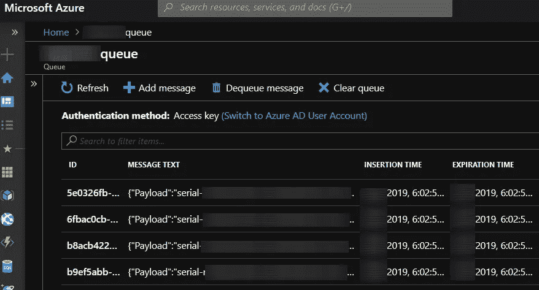
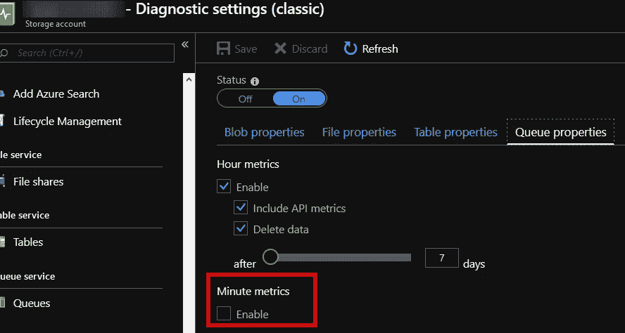
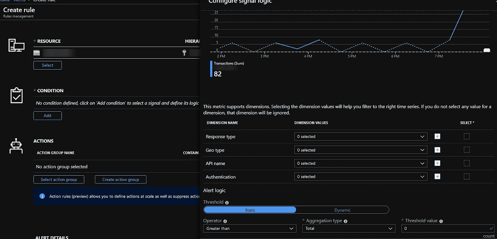
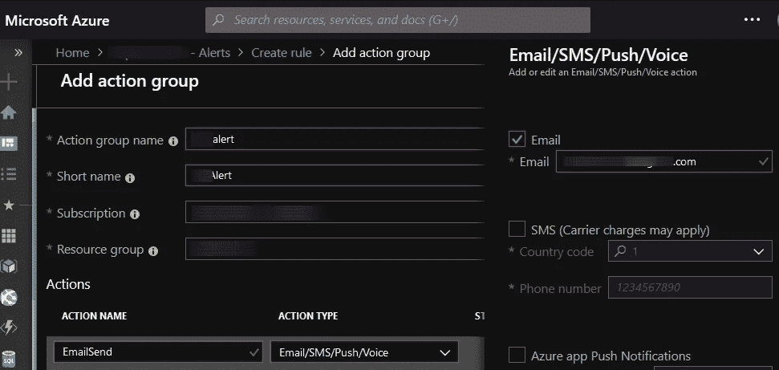
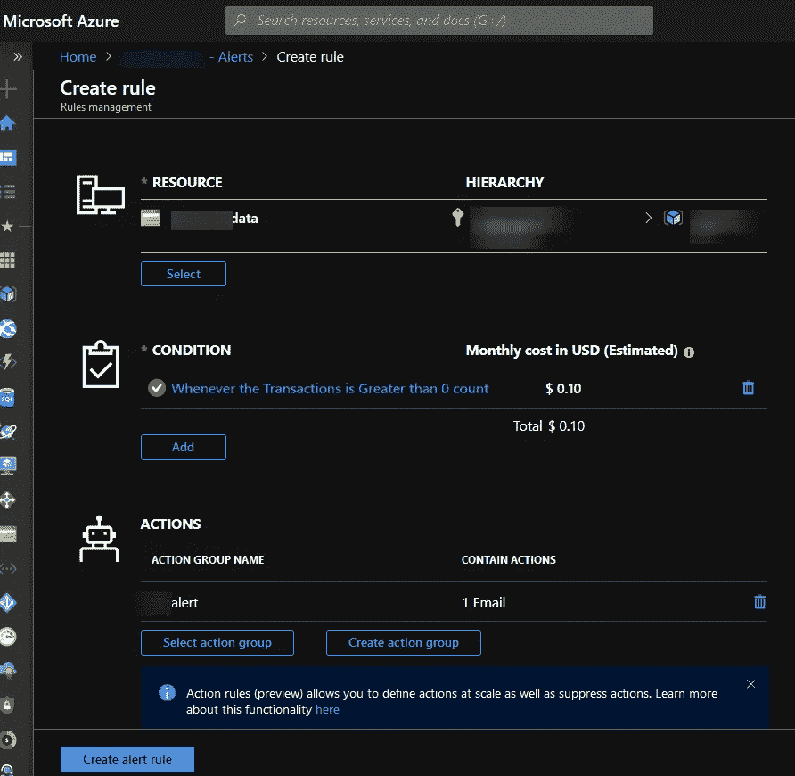

# 处理物联网中心触发的 Azure 功能中的“大规模故障”。

> 原文：<https://itnext.io/handling-failures-in-azure-functions-5ac6ef6e0e34?source=collection_archive---------2----------------------->

## 或者如何处理异常并重新运行失败的消息。

[https://twitter.com/SlonPics](https://twitter.com/SlonPics)

无服务器解决方案的优势之一是“规模化性能”因此，如果出现问题，你可能会得到“大规模失败”。因此，尽早为 Azure Functions 项目引入错误处理至关重要。

> *TL；DR；我将解释如何处理 Azure IoT Hub 触发的 Azure 函数中的异常和错误。以及如何设置适当的通知和重新运行失败的消息。*

## 问题是

有了无服务器，事情会变得非常混乱。在几分钟内，5k 消息可以触发相同数量的异常。在我的案例中，这是一个 PoC 项目，它具有来自物联网设备的意外消息格式。该项目的主要需求是以敏捷的方式进行开发，并即时引入变更。

除了基本的错误处理，我还需要得到通知，并且能够根据需要重新运行错误消息。

解决方案设置:

*   Azure 存储队列。
*   带有物联网中心(事件中心)消息端点输入触发器和存储队列输出触发器的 Azure 函数。
*   30 分钟内队列事务计数触发通知警报。
*   Azure 函数，用于重播存储在存储队列中的消息。

这个解决方案被证明对于生产使用来说足够健壮，所以我决定与在线社区分享它。

## 死信队列还是毒药队列？

术语是最基本的东西。那么“死信队列”和“有毒队列”有什么区别呢？让我们引用微软文档。

> 死信队列(DLQ)的目的是保存无法传递给任何接收者的消息，或者无法处理的消息。[链接](https://docs.microsoft.com/en-us/azure/service-bus-messaging/service-bus-dead-letter-queues)到 Azure 服务总线队列文档。

关于毒药队列。

> 一条*有害消息*是一条已经超过应用程序最大传递尝试次数的消息。当基于队列的应用程序由于错误而无法处理消息时，就会出现这种情况。为了满足可靠性要求，排队的应用程序在事务下接收消息。[将](https://docs.microsoft.com/en-us/azure/storage/queues/storage-queues-introduction)链接到 Azure 存储队列文档。

不幸的是，物联网中心和活动中心功能需要定制解决方案。

## 通过 Azure 存储队列处理错误。

Azure 中有两种竞争的队列解决方案——Azure 存储队列和服务总线队列。你可以通过[链接](https://docs.microsoft.com/en-us/azure/service-bus-messaging/service-bus-azure-and-service-bus-queues-compared-contrasted)阅读一篇深入的对比文章。

为了简单起见，我认为 Azure 存储队列是一个足够好的解决方案。这是一个轻量级的服务，用于存储大量的消息，易于通过 Azure Function 和 HTTPS 的输出绑定来使用。它还有一个额外的故障保护，通过嵌入式毒药队列。

> **请注意。存储队列消息不能超过 64 KB，而 Azure IoT hub 设备到云的消息最高可达 256 KB。
> 默认消息生存期为 7 天，但您可以更改此设置。**

以下是几个行动步骤。

*   通过 Azure CLI 创建 Azure 存储和队列。
*   为 IoT Hub Azure 函数添加输出绑定。
*   创建一个带有存储队列触发器的 Azure 函数并禁用它。
*   创建通知您存储队列中有新邮件的警报。

## Azure 基础设施和功能。

所以，让我们从通过 Azure CLI 设置的 Azure 存储队列开始。我选择了 Standard_LRS 的版本 2 热存储，因为死信队列在大多数时间应该是空的。

您可以通过门户查看存储队列中的消息。

下一步是调整 Azure 功能。这个输出触发器不同于 MS docs，因为里面有异步代码。因此，您需要向 *IAsyncCollector* 消息添加一条消息，以防出现错误事件。

具有物联网集线器触发器和输出绑定到存储队列的功能代码。

并使用 Azure 存储队列触发器重新运行函数。

带有 Azure 存储队列触发器的功能代码。

> 如果某个由`*QueueTrigger*`触发的函数失败，Azure Functions 运行时会自动为该特定队列消息重试该函数五次。如果消息继续失败，那么坏消息将被移动到“有毒”队列。队列的名称将基于原来的+ "-poison "。
> https:// <存储帐户>. queue . core . windows . net/<队列>

## 通知设置

存储警报设置与 Azure Monitor 中的功能和步骤相同。

*   打开存储帐户并检查诊断设置。如果需要更快的警报响应，请启用分钟度量。
*   选择警报部分并添加新警报。
*   为 30 分钟内大于零的事务计数创建一个条件。
*   使用电子邮件或任何其他通知类型添加操作组。

存储帐户的诊断设置。

具有所选事务处理度量的预警部分。

电子邮件订阅行动小组。

已配置警报的视图。

我们有每月警报执行的估计成本，这是 Azure 的一个小而简洁的细节，这很好。你可以使用这个设置来调试 Azure 函数的复杂问题。例如，从 Application Insights 获取失败的 POST 请求数据可能是一件棘手的事情。我希望您会发现这个解决方案很有用。

## 就这样，感谢阅读。干杯！

## 有用的链接。

*   Mikhail Shilkov 著 Azure 活动中心的可靠消费者。
*   [Azure Functions:在队列和活动中心之间选择。](https://hackernoon.com/azure-functions-choosing-between-queues-and-event-hubs-dac4157eee1c)
*   [Azure 函数错误处理指南](https://docs.microsoft.com/en-us/azure/azure-functions/functions-bindings-error-pages)。