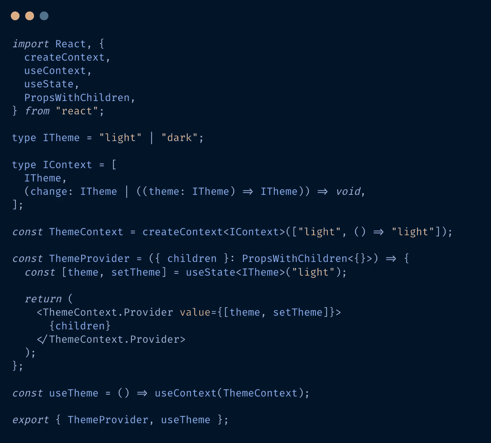
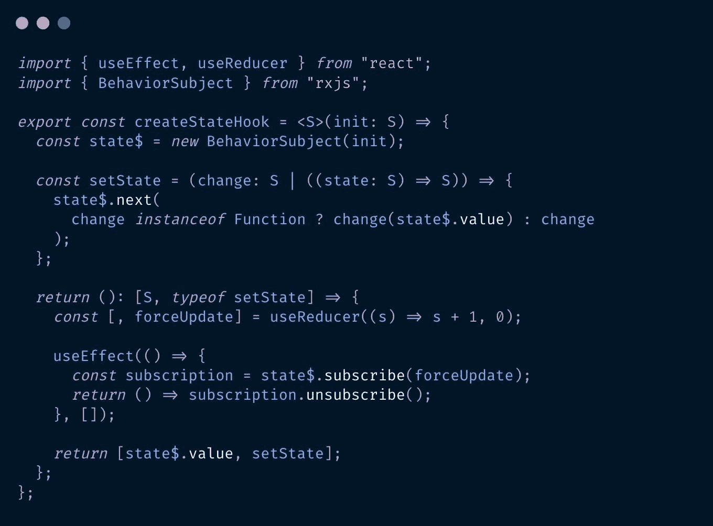
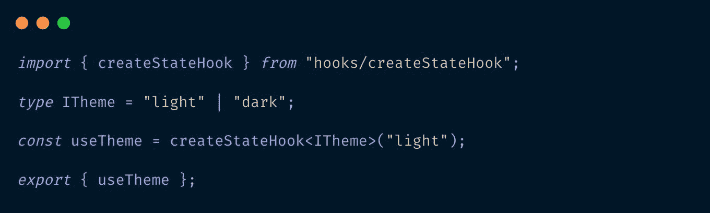

# 在 React 中处理全局状态，无需提供者和样板文件

> 原文：<https://itnext.io/handling-global-state-in-react-without-providers-and-boilerplate-61d9b371bc14?source=collection_archive---------3----------------------->

ReactJS 有一个内置的方法来处理“全局”状态——React 上下文。然而，在使用了许多上下文之后，我意识到我键入了许多样板代码，并且进入了“提供者地狱”。我必须在我的根应用程序组件中嵌套一个又一个提供程序，以确保所有的子组件都可以访问它。举个简单的例子——让我们构建一个可切换的主题上下文。首先，我们需要创建上下文的类型(本文假设使用 typescript)。让类型类似于 useState 的返回值—所以[theme，setTheme]。然后，我们需要创建上下文，并给它传递一个初始值。元组的第二个(setTheme)元素是不必要的，但我们还是要做。然后我们需要创建提供者，它将孩子作为道具并向下传递给树，同时创建主题并将其传递给 ThemeContext。提供者组件。该文件的全部代码如下所示。

使用上下文 API 实现主题

然后，我们必须转到靠近我们的树的根的一个组件，并在那里添加提供者，在许多其他提供者旁边(如果项目足够大)。

面对“类状态”上下文的需要，我决定给它一个不同的解决方案。我构建了一个 createStateHook 函数，它将状态保存在闭包中，并返回一个使用该状态的钩子，并在状态改变时重新呈现。为此，我使用了 rxjs 的“魔力”来使代码更短，但是不使用 rxjs 依赖也是完全可能的。

创建 StateHook 实现

现在我们可以用更简单的方式来创建主题。我们只需要主题的类型，并用初始值来调用 createStateHook 函数。

带有 createStateHook 的全局主题

不需要添加更高级别的提供者。useTheme hook 在任何地方都可以工作，当主题改变时——所有使用 useTheme 的组件都会被重新渲染。

对于类似于“国家”形状的全局值(有很多)，这种方法要简洁得多。我们将代码从根组件中的大约 20 行+一个提供者转换为没有提供者的 2 行。

你可以关注我在[blog.erikdavtyan.com](https://blog.erikdavtyan.com/)上发布的更多精彩提示