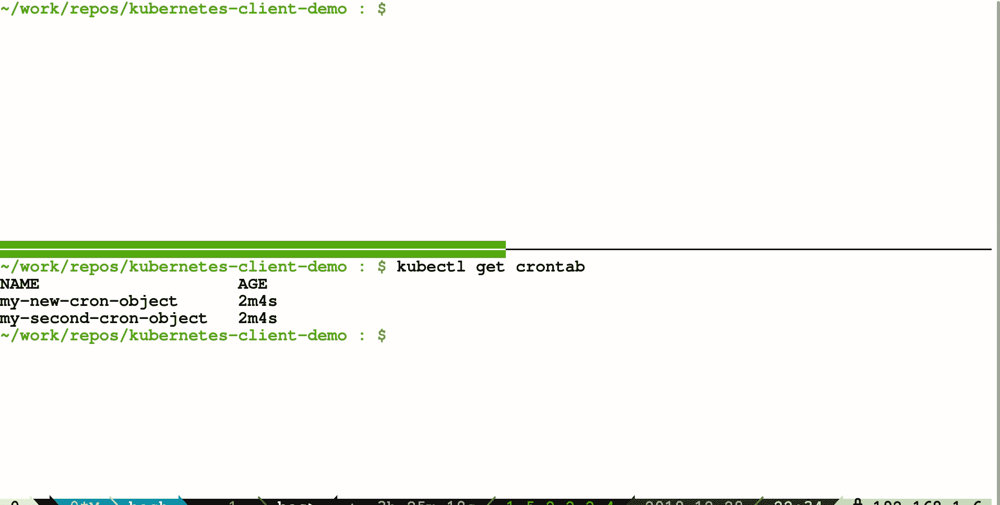

# 使用 Fabric8 Kubernetes 客户端在 Java 中处理 Kubernetes 定制资源(第 2 部分—类型化方法)

> 原文：<https://itnext.io/handling-kubernetes-custom-resources-in-java-using-fabric8-kubernetes-client-part-2-typed-cc0560d9af0d?source=collection_archive---------0----------------------->

[Fabric8 Kubernetes Java 客户端](https://github.com/fabric8io/kubernetes-client)

这篇博客是我之前关于使用 [Fabric8 Kubernetes 客户端 API](https://github.com/fabric8io/kubernetes-client) 在 Java 中处理 [CustomResources](https://kubernetes.io/docs/concepts/extend-kubernetes/api-extension/custom-resources/) 的博客的延续。你可以在这里找到这篇博客第一部分的链接。

在我之前的博客中，我谈到了以无类型的方式处理 [CustomResources](https://kubernetes.io/docs/concepts/extend-kubernetes/api-extension/custom-resources/) 。但是有些人可能不喜欢它，他们希望有自己的模型来序列化/反序列化他们的 [CustomResources](https://kubernetes.io/docs/concepts/extend-kubernetes/api-extension/custom-resources/) 。Fabric8 Kubernetes 客户端也允许您这样做。

举个例子，对于这个博客，我将使用 Kubernetes docs 网站上提到的一个自定义资源: [CronTab](https://kubernetes.io/docs/tasks/access-kubernetes-api/custom-resources/custom-resource-definitions/#create-a-customresourcedefinition) 。它的 CustomResourceDefinition 看起来是这样的:

克朗塔布·CRD 清单

用此 CRD 构造的 CustomResource 如下所示:

为了使用类型化 API，我们需要为这些定制资源提供 POJOs。当然，对于真实世界的场景，这些 POJO 可能会变得更加复杂。但是为了这个博客，这些主要是:

*   CronTab.java

[CronTab.java](https://github.com/rohanKanojia/kubernetes-client-demo/blob/master/src/main/java/io/fabric8/crd/CronTab.java)

*   CronTabSpec.java

[CronTabSpec.java](https://github.com/rohanKanojia/kubernetes-client-demo/blob/master/src/main/java/io/fabric8/crd/CronTabSpec.java)

*   CronTabStatus.java

[CronTabStatus.java](https://github.com/rohanKanojia/kubernetes-client-demo/blob/master/src/main/java/io/fabric8/crd/CronTabStatus.java)

现在我们有了所有的 POJOs 集，我们需要从当前的 KubernetesClient 实例中启动一个特殊的 KubernetesClient 对象实例。您不能使用提供的客户端实例来处理 CustomResources，因为它不知道您拥有的 CustomResource 模型。您可以为特定的 CustomResource 构建一个特定的客户端对象。在这种情况下，我们会这样做:

正在初始化 CronTab 客户端

**创建、更新、删除自定义资源:**

一旦我们有了一个特定于 CronTab 的客户端实例，我们就可以用它来完成 KubernetesClient 支持的所有操作，就好像它是一些 Kubernetes 资源一样。你可以看看下面的片段来获得更清晰的想法:

使用 CronTab 进行 CRUD 操作

**观看定制资源:**

观察 CustomResource 也类似于现有的操作，只需要将自定义种类注册到 KubernetesDeserializer，这样它就可以在反序列化观察事件时使用它。

用 CronTab 观察

当您运行它时，您将能够看到类似这样的事件:

Kubernetes 腕表在行动

这篇博客到此结束。希望您觉得这有用，如果您对我们的 [Gitter](https://gitter.im/fabric8io/kubernetes-client) 频道有疑问，请随时联系我们。

谢了。