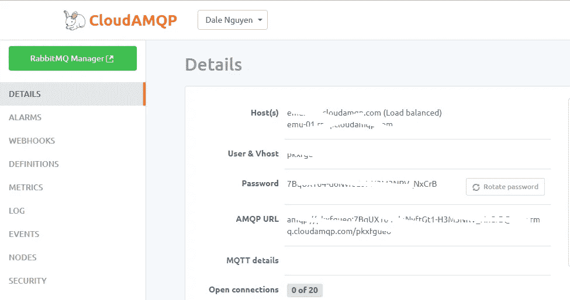
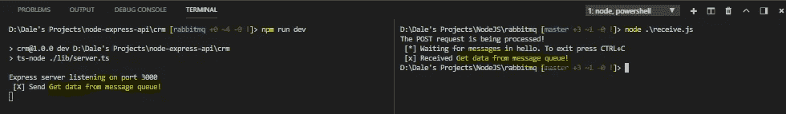

# 在 Nodejs 中处理长时间运行的 API 请求

> 原文：<https://itnext.io/handling-long-running-api-requests-in-nodejs-403bd566d47?source=collection_archive---------1----------------------->


我已经研究了[设计和部署 RESTful API 有一段时间了](/building-restful-web-apis-with-node-js-express-mongodb-and-typescript-part-1-2-195bdaf129cf)。并且处理和呈现来自客户端的请求的数据是有趣的。今天，我收到一个问题，关于我应该如何处理一个需要一定时间处理的请求。我们不能让客户等 10 分钟才能得到回复。此外，在数据处理过程中，任何其他请求都必须等待，这可能会导致瓶颈。必须有一些方法来处理长时间运行的任务。

在做了一些研究后，我发现在构建应用程序时，有两种交互模式可供我们使用:

*   **请求-响应(同步)**:响应返回一个答案。例如，在电子商务应用程序中，如果提交的订单已被处理或有任何问题，用户会立即得到通知。
*   **一劳永逸(异步)**:请求已被接收，并提供了获取响应的替代方法。例如，当用户导入大量需要处理的数据时，他们会收到数据已收到的确认，并被指示检查导入队列以查看状态。或者，在导入完成时发送一条消息。

这导致了**消息队列**的概念，它可以卸载处理并释放资源，以便应用程序可以处理其他请求。

在这个演示中，我将使用 RabbitMQ 来处理 API 请求。

**第一步:准备好 RabbitMQ】**

你既可以从 [CloudAMQP](https://www.cloudamqp.com) 注册一个账户，也可以从本地机器从 [RabbitMQ](https://www.rabbitmq.com/download.html) 安装服务。

在从 CloudAMQP 创建了一个帐户和一个实例之后，您可以点击该实例并查看云托管的 RabbitMQ 信息。



如果您在本地安装 RabbitMQ，安装完成后，RabbitMQ 服务将自动在您的机器上运行。您可以通过应用程序中的**“amqp://localhost”**URL 访问它。

**步骤 2:实现 RESTful API 的消息队列**

在这个例子中，我假设我们将有一个很长的处理 POST 请求，可能需要几分钟才能完成。

在做任何事情之前，我们需要安装 amqp.node 包

```
npm install amqplib
```

然后，在您的路线中，您需要导入包

```
// For TypeScript
import * as amqp from 'amqplib/callback_api';// For JavaScript 
var amqp = require('amqplib/callback_api');
```

然后编辑发布路线功能。例如:

```
app.route('/messages).post(req: Request, res: Response) { amqp.connect('amqp://localhost', (err, conn) => {
  conn.createChannel((err, ch) => {
   const q = 'hello';
   ch.assertQueue(q, {durable: false}); // I suppose the process will take about 5 seconds to finish
   setTimeout(() => {
    let msg = 'Get data from message queue!';
    ch.sendToQueue(q, new Buffer(msg));
    console.log(` [X] Send ${msg}`);
   }, 5000)                       
  }); // The connection will close in 10 seconds
  setTimeout(() => {
   conn.close();
  }, 10000);
 });
 res.send('The POST request is being processed!');
}
```

现在，我们的 API 将监听一个 POST 请求。例如来自:[https://localhost:3000/messages](https://localhost:3000/messages')

为了测试配置，我将使用[请求包](https://www.npmjs.com/package/request)从客户端发出 POST 请求。

```
// receive.js
var amqp = require('amqplib/callback_api');
var request = require('request');request.post('[https://localhost:3000/messages'](https://localhost:3000/messages'), function (error, response, body) { console.log(response.body); // Connect to the server and wait for the queue
    amqp.connect('amqp://localhost', (err, conn) => {
        conn.createChannel((err, ch) => {
            var q = 'hello';ch.assertQueue(q, {
                durable: false
            });
            console.log(' [*] Waiting for messages in %s. To exit press CTRL+C', q);
            ch.consume(q, msg => {
                console.log(' [x] Received %s', msg.content);  
                conn.close();            
            }, {
                noAck: true
            });
        });
    })

});
```

然后，我运行测试服务器并发出示例 POST 请求。



正如你所看到的，5s 后，API 会分解出文本**‘从消息队列获取数据！’**、**、**和 POST 请求也从控制台日志中获取消息并打印出来。

尽管这只是一个测试项目，但您现在已经知道了一种在调用 RESTful API 应用程序时处理长时间运行过程的方法。

**参考文献:**

*   [node . js 中 RabbitMQ 的消息传递](https://www.devbridge.com/articles/messaging-with-rabbitmq-in-node-js/)
*   [RabbitMQ 教程](https://www.rabbitmq.com/tutorials/tutorial-one-javascript.html)

[**在 Twitter 上关注我**](https://twitter.com/dale_nguyen) 了解 Angular、JavaScript & WebDevelopment 的最新内容👐