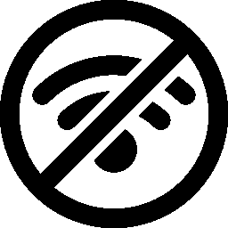
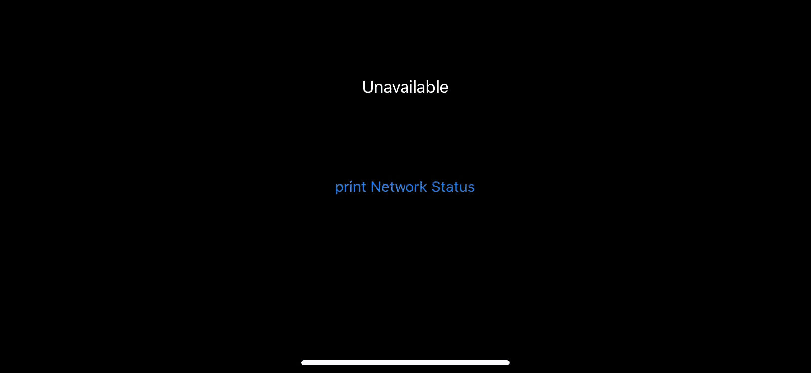
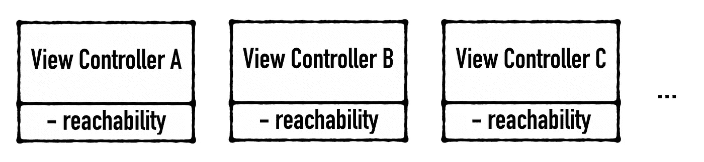
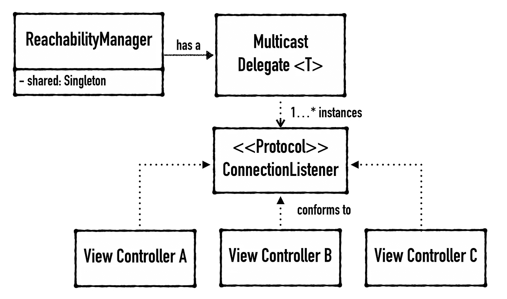

# 在 Swift 中处理可达性

> 原文：<https://itnext.io/handling-reachability-in-swift-d12dbd538df?source=collection_archive---------4----------------------->

作为一名 iOS 开发人员，有时我们需要处理没有互联网的情况。有一个很棒的第三方库， [ReachabilitySwift](https://github.com/ashleymills/Reachability.swift) ，它帮助我们完成所有的底层工作，并为我们提供易于使用的 API。

然而，每当我们有一个对象需要检测互联网状况时，实例化一个新的`Reachability`实例并调用`startNotifier()`来使用它是不符合逻辑的。

我们目前想要的是做一次设置，并允许多个实例有能力检查互联网连接。在这种情况下，通过结合单例模式和多播委托模式来解决这个问题是合适的。看看下面的插图，你很快就会明白。

你可以在这里看到完整的[源代码](https://github.com/ji3g4kami/ReachabilityManager)。或者，如果你想直接使用它，只需通过 Cocoapods 安装即可。

## 多播委托模式

这种模式适合创建一对多的代理关系。

这种模式的关键是如何:

*   使用泛型接受您的委托协议(`ConnectionListener`，并用`AnyObject`实例化 DelegateWrapper。
*   用身份(`===`)管理您的委托人:`addDelegate()`和`removeDelegate()`。
*   使用 for 循环通知您的委托人:`invokeDelegates()`。

## 从这里去哪里

现在您已经掌握了多播代理模式的概念。如果您想了解更多关于设计模式的知识，我建议您看一看:

*   [通过教程设计模式](https://store.raywenderlich.com/products/design-patterns-by-tutorials)
*   [重构大师](https://refactoring.guru/design-patterns)