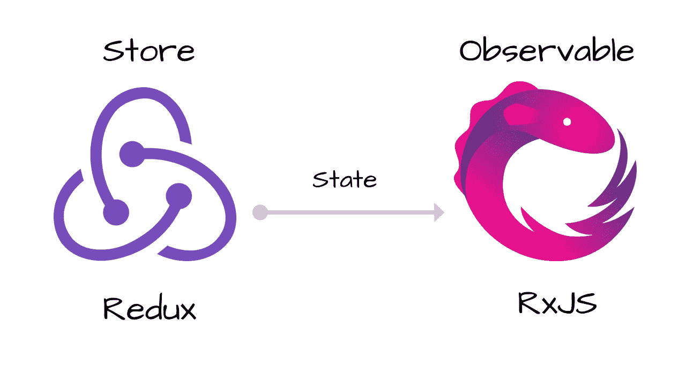

# 处理 Redux 副作用 RxJS 方法

> 原文：<https://itnext.io/handling-redux-side-effects-the-rxjs-way-59c057b12cd4?source=collection_archive---------2----------------------->

你好陌生人！如果你正在使用 Redux，你可能会遇到我们在 Orfium 前端团队遇到的同样的问题——Redux 副作用(也许这就是为什么你也在读这篇文章😎).如果没有，那就等着吧，很快就会发生的。让我引导你通过我们的故事和发现。

## 副作用以及我们为什么需要它们

常规操作正在被调度，因此某些状态正在被改变。

假设现在有一个列表，需要从服务器获取信息来填充它。在这种情况下，您需要调度一个操作—来自服务器的请求—响应(成功/错误)时，调度另一个操作来更新状态(加载、结果等)。这是一个副作用。

> 这是如此普遍和 2017 年的权利？

虽然现在你有一个你实际上不能处理的行动。如果用户点击那个按钮，并且有多个请求，最重要的是多个状态更新，这会破坏您完美的应用程序，那么您可以触发相同的操作。如果你可以取消，等待，去抖和一般处理这些行动。剧透预警，可以！

有两个主要选项可以处理具有上述优点的副作用操作(不包括 thunks)

*   redux observable —基于 RxJS，使用 observable 监听动作
*   redux saga——它使用新添加的 javascript 生成器来处理副作用

# RX 副作用

使用 redux observable 你可以改变你的操作方式。我不会详细说明你如何安装它，因为你可以很容易地阅读这个[这里](https://redux-observable.js.org/docs/basics/Epics.html)。我会更深入地研究它的复杂部分，比如

*   如何形成一部史诗
*   冗余表单(如何处理它们)
*   用状态测试
*   轻松测试操作

让我们想象一个简单的场景。对服务器的一个请求，如果成功或失败，我们将发送一些动作来更新我们的 reducer。

让我们看看这种情况在代码中是怎样的。

让我把它分解一下。

在上面的例子中，我们定义了一个新的史诗。然后使用类型的**，我们等待**类型的动作 _ 请求**被触发。当它被触发时，我们转到 **switchMap** ，在这里我们限制我们得到的请求。切换映射一次运行一个请求，因此其他任何请求都将被忽略，这样可以避免多个请求。然后通过**中的**，我们将承诺请求转换为可观察的请求。最后，我们使用 **mergeMap** 来获取响应(想象 a .then on a promise ),然后我们返回一组动作，并对错误进行同样的处理。**

如果您想首先显示一个加载来指示数据的加载/获取，该怎么办？

现在，您可以在请求数据之前轻松添加一个操作。

我们使用 **concat** 来按照定义的顺序运行其中的两个动作(loadingList 和 request)。变得容易了？

现在您已经做好了所有准备，并且正在使用 redux 表单来处理您的数据。你怎么知道当你在那个漂亮的表格中按下提交键时，它会得到提交状态来显示正在加载的动画呢？这个想法是一样的。让我们看看这样的事情是如何完成的。

这里我们稍微改变一下逻辑。同样，我们也在等待类型为的**部分的相同操作。在本例中，我们希望将 formName 传递给 Epic，以便执行上面显示的操作。在 **switchMap** 中，我们期待两件事，一个有效载荷和一个元！是的一个 meta。元持有有效负载不必知道的逻辑。你可以在这里看到[更多关于为什么以及何时使用它的细节。再次使用 concat 和 redux 表单动作 startSubmit，我们可以定义表单开始提交内容。不要忘记在成功和错误时都**停止提交**。就是这样！](https://medium.com/@jtbennett/standard-actions-in-redux-c6a415c8aea4)**

我建议你总是用那个名字调度一个请求动作，比如 **ACTION_REQUEST** 或者**FETCH _ BLAH _ LIST _ REQUEST**。这样你就会知道这是一个史诗般的副作用。

您现在可以使用 **takeUntil** 并在事件发生后停止监听任何成功事件。这有助于解决经典的网飞问题。当你导航到一个详细信息页面开始抓取时，你会返回到另一个详细信息页面，而第一页开始解析并弄乱你当前的页面。

这个问题在这里[得到了很好的解释](https://www.youtube.com/watch?v=AslncyG8whg)来自[杰伊菲尔普斯](https://medium.com/u/5b0111cff646?source=post_page-----59c057b12cd4--------------------------------)我推荐你去看一看。

现在我们有和以前一样的例子，但是我们只放了 **takeUntil** 操作符。现在，如果它监听 **PAGE_CHANGED** 动作，它不会取消请求，但会忽略当前请求的任何解析。耶！！现在，如果你愿意，你可以用 axios 实现一个可取消的请求。

# **轻松测试 RxJS**

我发现 redux-observable 教程在测试方面有点高级和混乱。我知道为什么，但在大多数情况下，你不需要这样的东西，所以我会提出一个简单的测试解决方案。

Redux observable 从模块中给了我们两个东西 ActionsObservable 和 StateObservable。您可以使用它们来创建用于测试的可观测量。我们之所以使用它们，是因为在库上，通过史诗的动作是用这些动作创建的，所以因为我们将尝试比较这两个动作，所以它们需要完全相同。

让我们试着测试我们的第一个例子。

在这里，我们定义了两件事:一个是触发史诗的可观察动作的**动作$** ，另一个是我们预期史诗将返回的动作数组的**预期变量**。此外，我们用模拟响应模拟 axios (fetch，axios，无论您对 http 请求有什么)解析。最后，有趣的是，我们将 action$传递给我们想要测试的 epic，我们将 epic 的结果转换成一个带有**的数组。pipe(toArray())** 然后我们用**做一个承诺。top promise()**所以我们可以用 async await 等待它结束。现在我们可以很容易地比较什么史诗返回到我们所期待的！

下面是对请求错误的测试

使用这种技术，你可以很容易地测试任何 epic，并确定每个 epic 的预期。

希望你喜欢我的例子，redux observables 对于日常使用这些例子更有意义。

> 如果你喜欢这篇文章，可以考虑点击 clap👏并且你可以随时访问[我的其他文章](https://medium.com/@panagiotisvrs)🔥

如果你有更多关于如何使用它的例子，请在下面的评论中分享。

 [## 冗余形式

### 在 Redux 中管理表单状态的最佳方式。

redux-form.com](https://redux-form.com/6.0.0-rc.4/docs/api/actioncreators.md/)  [## 介绍冗余-可观察

### 编辑描述

redux-observable.js.org](https://redux-observable.js.org/)