# 在外部系统中处理时区:案例研究

> 原文：<https://itnext.io/handling-time-zones-in-outsystems-a-case-study-4be0b1f8c02b?source=collection_archive---------2----------------------->

世界时区

反应式应用程序在平台保存和显示*日期时间*字段的方式上带来了一些新的更新。当用户保存一个*日期时间*字段时，平台会自动将该值从用户时区转换为服务器时区。然后，当获取属性时，平台会反其道而行之，确保用户总是看到他们所在时区的值。

这样做是为了确保所有的*日期时间*值都在同一个时区，并且您可以安全地比较这些属性。

很酷，对吧？这将为我们开发人员省去很多麻烦。但是有一个问题。如果用户为将在另一个时区发生的事件选择了一个*日期时间*会怎么样？

# 场景

为了更好地理解 OutSystems 平台如何处理时区，让我们想象以下场景。我们正在为一家航空公司构建一个后台办公室，其中有一个用户，让我们称她为 Mia，需要为她的公司将要乘坐的航班创建记录。

Mia 将打开应用程序，用下面的信息创建一个从洛杉矶到纽约的航班。

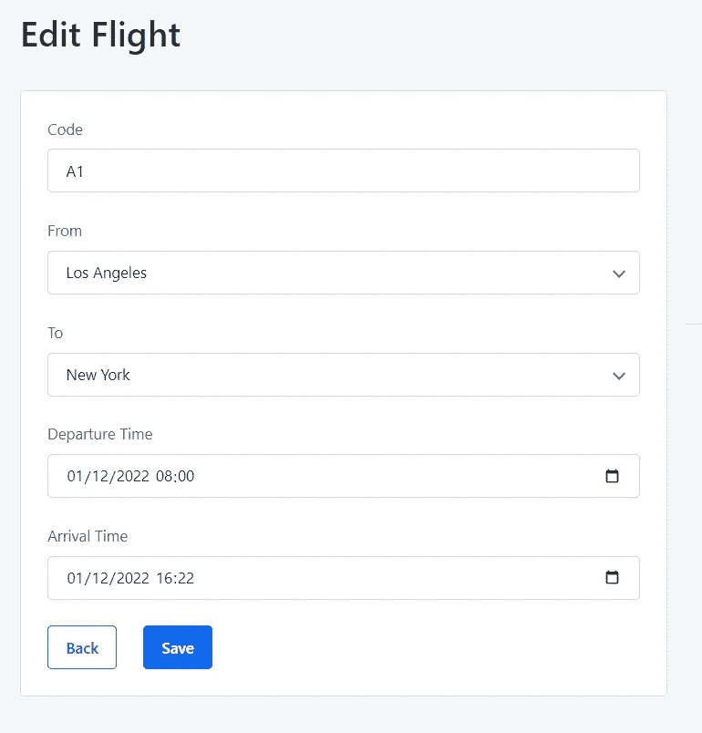

航班细节

您可能知道，出发和到达时间总是在城市时区，即出发时间在洛杉矶时区，到达时间在纽约时区。因此，如果我们想用 UTC(云的时区)保存这些值，我们应该有以下内容:

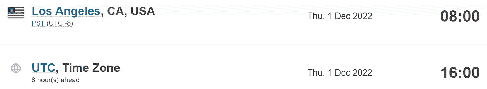

世界协调时出发时间

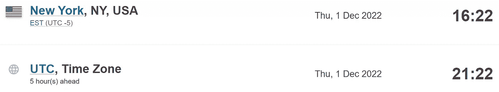

到达世界协调时的时间

然而，正如您已经预料到的，这些不是我们将在数据库中找到的值。

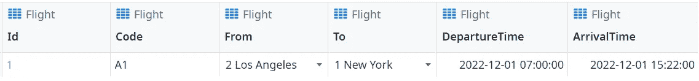

保存在数据库中的值

平台将表单中输入的值转换为 UTC，但假设 Mia 的时区(中欧时间)，这是完全不同的值。那么，如何避免这种情况呢？

通过将*日期时间*属性的数据类型更改为*文本，*平台将停止这些值的自动转换。尽管如此，这意味着我们需要在保存之前手动将 *datetime* 值转换为 UTC，然后在获取时从 UTC 转换。好玩吧。

但是在我们研究一些可能的方法之前，首先我们需要讨论时区类型。

## 首先:时区

每个人都知道什么是时区，时区是如何工作的。但是，对于本文来说，理解存在多种时区是很重要的。

如果您正在与微软合作，则有 [141 个时区可用](https://docs.microsoft.com/en-us/windows-hardware/manufacture/desktop/default-time-zones?view=windows-11)，如果您在微软数据库上执行以下查询，则可以获取这些时区。

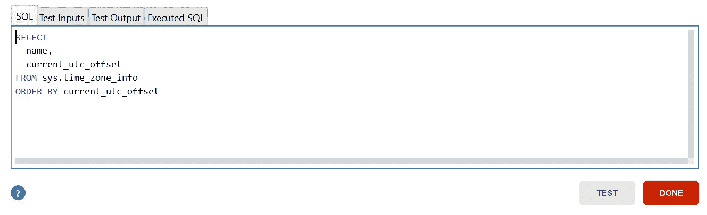

查询以返回所有系统时区

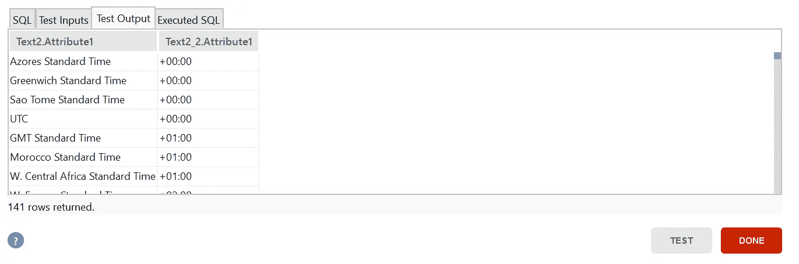

返回的时区

这些标识符用于 SQL Server 和使用的 forge 组件中。NET 来处理时区转换。

然而，JavaScript 使用一种不同的格式，叫做 IANA。

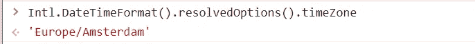

用 JavaScript 获取用户时区。

理解这一点很重要，因为用于转换这些值的工具将决定所需的时区类型，从而决定数据模型。

现在我们对时区有了更多的了解，让我们回到我们的问题上来:我们如何手动将城市时区转换为 UTC，反之亦然？

**1-**[时区](https://www.outsystems.com/forge/component-overview/500/time-zone) **分量**

我们可以利用该组件的动作将 *datetime* 值与 UTC 值相互转换。

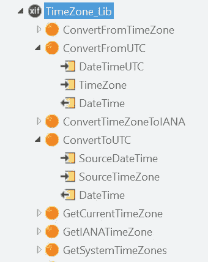

时区 _ 库操作

然而，如果我们想转换一个值，这是没问题的，但是如果我们想显示一个有多条记录的表，我们需要迭代每条记录，并在每次迭代中调用这个服务器动作，这在性能方面不是很好。

**2- SQL**

为了解决这个问题，我们可以利用我们的好朋友 SQL。使用下面的语法，我们可以将一个*日期时间*字段从一个时区转换到另一个时区。下面我们使用关键字[在时区](https://docs.microsoft.com/en-us/sql/t-sql/queries/at-time-zone-transact-sql?view=sql-server-ver15)将 *UTC* 当前时间转换为*CEST*。

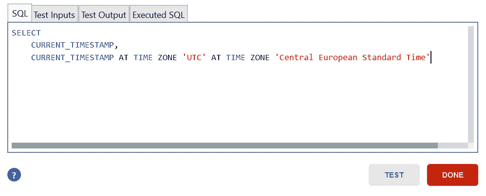

查询的输入

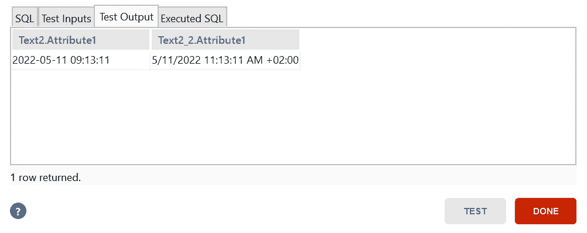

查询的输出

这个查询的输出(如上)将会是 *datetimeoffset* 格式*，*这意味着如果您希望它是 *datetime 格式，*您将需要转换它:

使用 CONVERT 输入查询

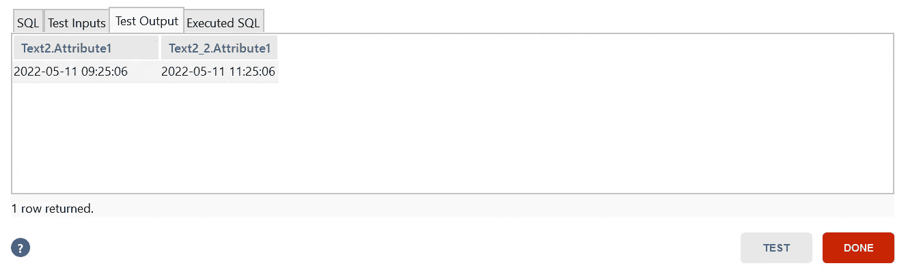

使用 CONVERT 的查询输出

时区中的命令和时区组件中的操作使用 Microsoft 时区标识符。

## 3- [时区反应实用程序](https://www.outsystems.com/forge/component-overview/2199/timezonereactiveutils)组件

最后提出的解决方案利用了一个名为 MomentJS 的 JavaScript 库来解决这个问题。

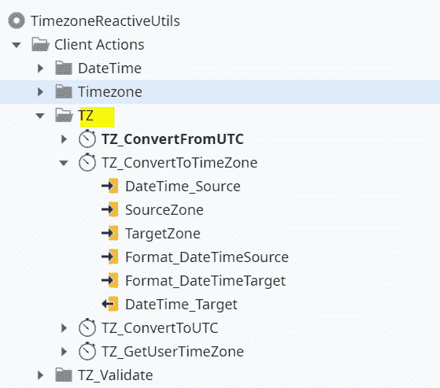

时区反应实用程序

该组件具有可以在时区之间转换日期时间值的客户端操作，这使得在客户端执行该操作成为可能，而不是在服务器中执行该逻辑。

这种解决方案有几个优点:

1.良好的性能，因为服务器上没有执行额外的时区转换逻辑。

2. *datetime* 值总是在客户端进行转换，因此在服务器端，这些值总是采用 UTC 格式，这样更易于维护。

这些操作将 IANA 格式的时区作为输入。

# 解决办法

那么，让我们的注意力回到 Mia 和我们的后台应用程序，我们如何确保所有的日期时间值都被正确保存并显示给用户呢？

1.  将*部门时间*和*到达时间*字段更改为*文本*以避免自动转换。
2.  以所需的格式保存相应城市的时区(这将取决于您选择的值转换方式)。在下面的例子中将使用 IANA 格式。

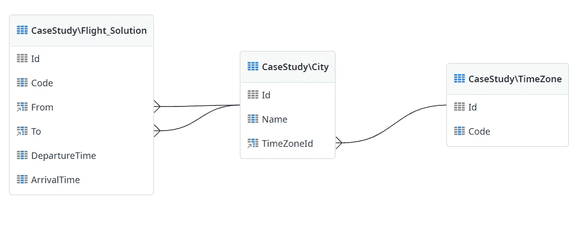

数据模型

3.在保存记录之前，请将值从城市时区转换为 UTC。

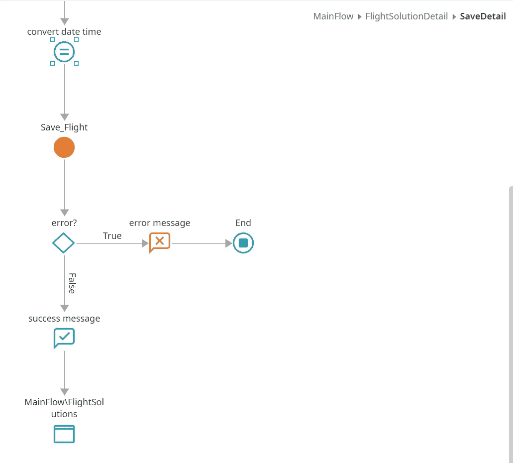

保存操作

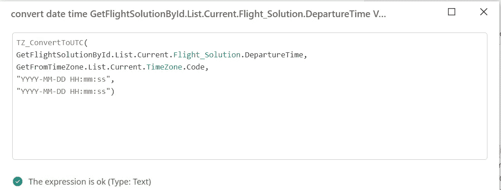

TZ_ConvertToUTC 操作的用法

4.显示记录时，将值从 UTC 转换为城市时区。

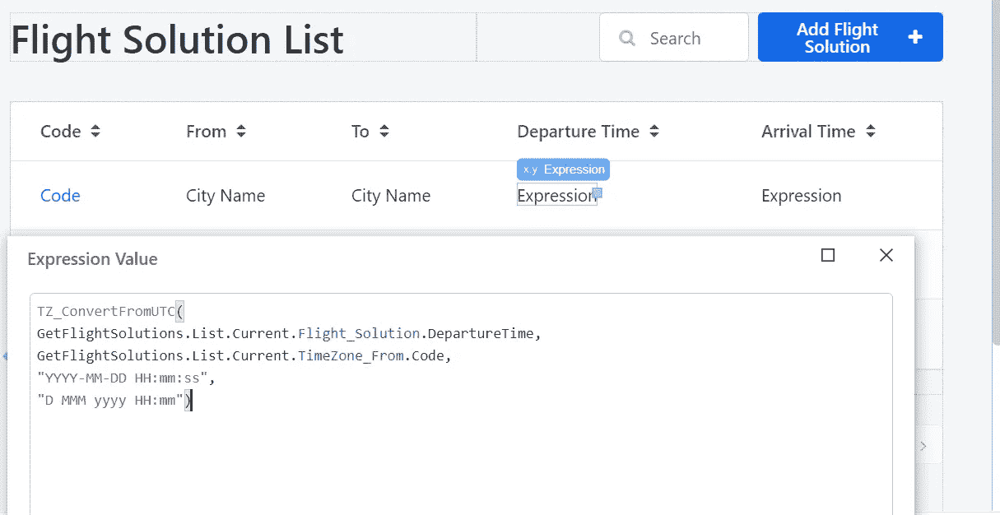

TZ _ convertfromuct 操作的用法

现在，让我们完全像以前一样创建另一个记录，但是在代码中做了这些更改。

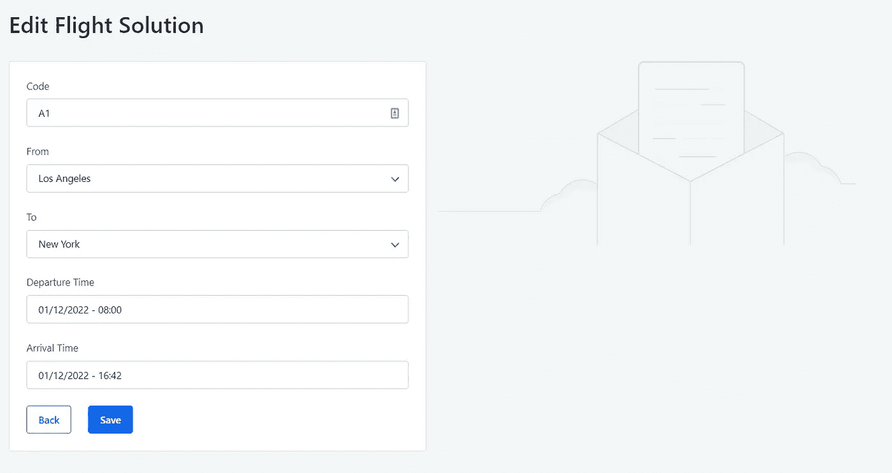

航班细节

并检查数据库…

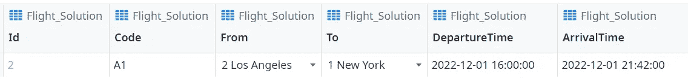

以 DepartureTime 和 ArrivalTime 为文本的实体的详细信息

正如我们所看到的，这些值被成功地转换为 UTC。

尽管如此，当 Mia 查看航班列表屏幕时，她会看到每个城市的时区时间。

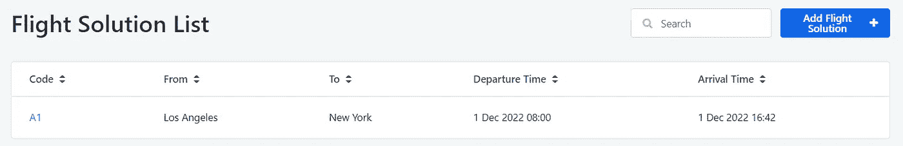

转换为城市时区的日期时间值

# 技巧

## 1-小心空值

在您的 *datetime* 属性不是强制的情况下，您不希望转换空值，所以确保在保存或获取值时考虑到这一点。

如果您正在使用来自[时区反应实用程序](https://www.outsystems.com/forge/component-overview/2199/timezonereactiveutils)的动作，这已经被自动处理了，但是如果您正在手动进行转换，请注意这一点。

## 双日期选择器

在将*日期时间*字段转换为文本字段后，您将不再能够简单地将变量置于*日期时间*输入中，并享受内置的日期选择器。

但是，您可以使用 OutSystemsUI 的 *DatePicker* 小部件来解决这个问题。好的一面是，您将有更多高级选项可以使用。

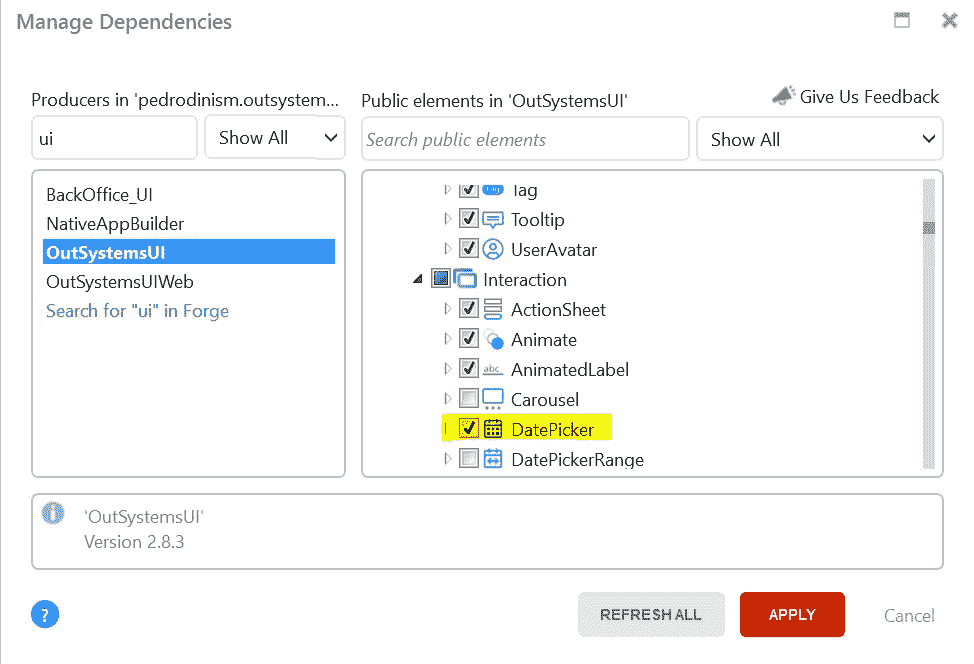

日期选择器小部件

## 3-获取用户时区

如果出于某种原因您正在使用这种方法，但是在其他场景中您仍然需要将 *datetime* 转换为用户时区，也有一种方法可以做到这一点！

组件 [Timezone Reactive Utils](https://www.outsystems.com/forge/component-overview/2199/timezonereactiveutils) 有一个以 IANA 格式返回用户时区的动作。

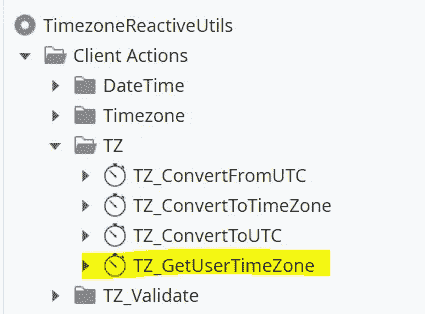

TZ _ 获取用户时区操作

# 结论

这里提出的解决方案只是解决自动转换*日期时间*的许多可能想法之一。已经有了一个[的想法](https://www.outsystems.com/ideas/10564/make-datetime-conversion-to-client-timezone-in-reactive-apps-optional/)让这个特性可选，但是同时你仍然需要一个变通方法。

你有其他方法做这件事吗？对提议的解决方案有任何问题吗？请在评论里告诉我:)

我希望你能从这篇文章中学到一些东西，感谢你的阅读！