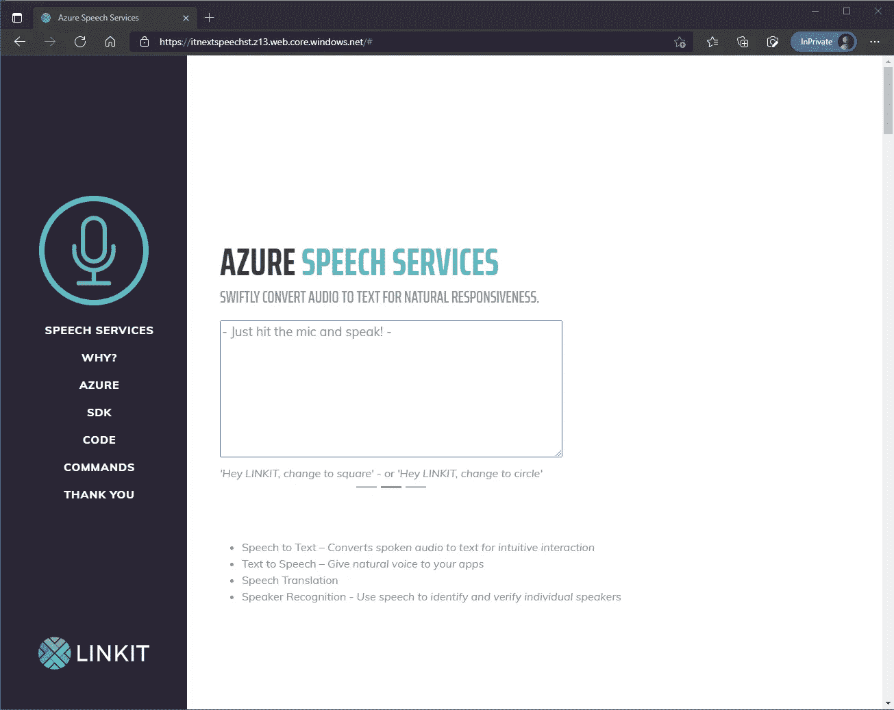
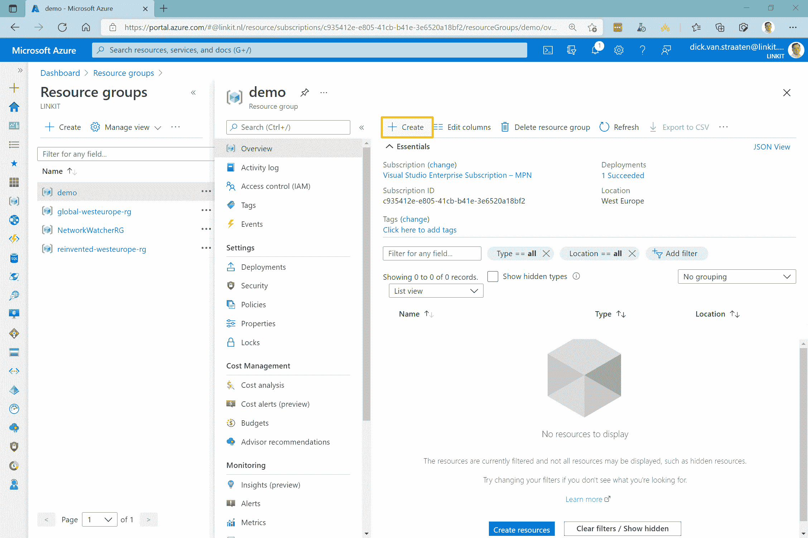
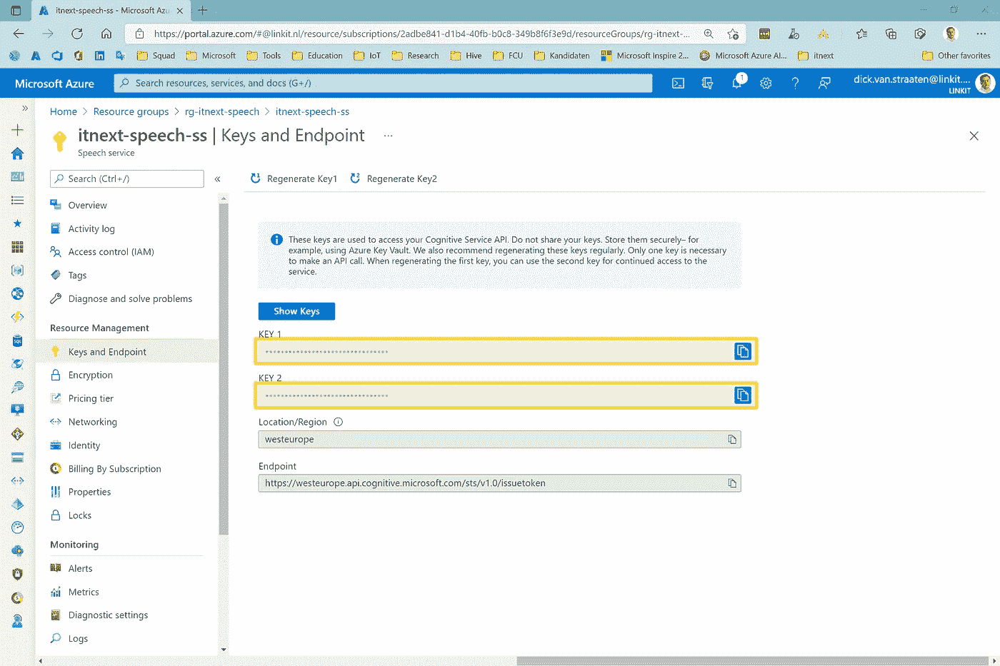
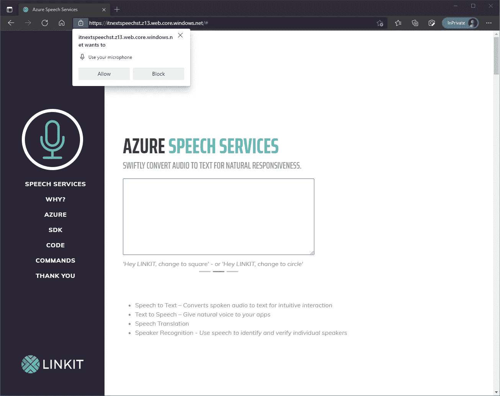

# 免提网站

> 原文：<https://itnext.io/handsfree-websites-10d03ffbe85d?source=collection_archive---------2----------------------->

现在很多设备都可以通过语音控制和/或查询，比如我的装有 Windows Cortana 的笔记本电脑，我的装有 Siri 的 iPhone，还有我车上的语音指令。其实语音识别技术并不新鲜。IBM 鞋盒在 1961 年就已经能够识别语音了。当然，随着云的出现，这项技术已经得到了很大的改进，并且更加可用。

我决定进行调查，并用 HTML5/JavaScript 创建了一个简单的单页网站，我可以通过语音进行控制。



【windows.net 蔚蓝语音服务公司(T2)】T3

**蔚蓝语音服务**

微软 Azure 云提供了几种认知服务。有了这个 API 集合，作为开发人员的您就拥有了现成的智能。对于我的项目，我使用语音到文本的 API。

要使用这个 API，你显然需要一个 Azure 订阅。

正如下面的动画所示，订阅 API 很容易。



Azure 门户

在 API 刀片中，导航到资源管理下的密钥和端点。在这里，您复制了一个可用的授权密钥，您需要使用 API 上的应用程序对其进行授权以交换数据。



Azure 门户

**Azure 认知服务 SDK**

使用语音到文本 API，您可以轻松地将语音识别添加到您的应用程序中，并将语音音频转换为文本。这个 API 的 SDK 可以从产品网站[https://aka.ms/csspeech](https://aka.ms/csspeech)下载或者通过 NuGet 包安装。

```
PM> Install-Package Microsoft.CognitiveServices.Speech -Version 1.18.0
```

一旦 SDK 被添加到您的项目中，您就可以在 HTML 页面的底部引用包含所有特性的 JavaScript 文件。

```
<!-- Speech SDK reference sdk. -->
<script src="js/microsoft.cognitiveservices.speech.sdk.bundle-min.js"></script>
```

**语音转文字**

在我的 HTML 项目中，我添加了一个带有 id 标签的(麦克风)图像按钮。此按钮的功能相当于录音按钮。

```

```

我为我的功能创建了一个新的 JavaScript 文件，并在 HTML 页面底部的 HTML 文件中创建了一个引用。

```
<!-- Custom scripts for this template -->
<script src="js/speech.js"></script>
```

首先，我在文件中声明必要的变量。

```
var subscriptionKey = "{your-api-key}";
var serviceRegion = "westeurope";
```

该 API 支持多种语言。我选择英语，因为荷兰语模型还没有得到足够的训练，因此不太可靠。

```
var speechRecognitionLanguage = "en-US";
```

在这个文件中，我向先前创建的 image 按钮添加了一个事件侦听器(在页面完全加载之后)。

```
document.addEventListener("DOMContentLoaded", function () { startRecognizeOnceAsyncButton = document
         .getElementById("startRecognizeOnceAsyncButton"); phraseDiv = document.getElementById("phraseDiv");

    startRecognizeOnceAsyncButton
         .addEventListener("click", function () {
```

然后我配置我的客户端。我请求一个授权令牌，并确定提供给 API 的语言。

```
startRecognizeOnceAsyncButton.disabled = true;
startRecognizeOnceAsyncButton.classList.add("record");
phraseDiv.innerHTML = "";

// if we got an authorization token, use the token. 
// Otherwise use the provided subscription keyvar speechConfig;
if (authorizationToken) {
    speechConfig = SpeechSDK.SpeechConfig
         .fromAuthorizationToken(authorizationToken, serviceRegion);
} else {
    speechConfig = SpeechSDK.SpeechConfig
         .fromSubscription(subscriptionKey, serviceRegion);
}

speechConfig.speechRecognitionLanguage = speechRecognitionLanguage;
```

您可以通过两种方式传递音频:通过文件或通过麦克风。我选择后者。

```
var audioConfig = SpeechSDK.AudioConfig
     .fromDefaultMicrophoneInput();
```

为了让网站知道何时发出语音命令，我选择了一个受其他语音助手启发的公告:*“嘿 LINKIT”*。在我的场景中，我的叙述作为音频发送给 API。API 返回一个文本作为响应。我检查命令是否是通过正则表达式模式给出的。

```
let commandReg = /^hey link it|hey link, it/i;recognizer = new SpeechSDK.SpeechRecognizer(speechConfig, audioConfig);

    recognizer.recognizeOnceAsync(
        function (result) {

            startRecognizeOnceAsyncButton.disabled = false;
            startRecognizeOnceAsyncButton
                 .classList.remove("record");
            startRecognizeOnceAsyncButton.classList.add("ready");

            if (commandReg.test(result.text)) {
                voiceCommand(result.text);
            }

            phraseDiv.innerHTML += result.text;
            console.log(result);

            recognizer.close();
            recognizer = undefined;

        },
        function (err) {
            recognizer.close();
            recognizer = undefined;
            startRecognizeOnceAsyncButton.disabled = false;
            startRecognizeOnceAsyncButton
                 .classList.remove("record");

            phraseDiv.innerHTML += err;
            console.log(err);
        });
});
```

当文本以*“嘿 LINKIT”*开头时，我的 JavaScript 函数 voiceCommand 被调用。

**语音命令**

我构建了两个不同的命令。因此，该函数首先确定意图:用户给出了哪个命令？

第一次意图导航:*滚动到*。第二个操纵布局:*改*。

*“Hey LINKIT”*公告删除后，意向确定。

之后，该命令被删除，留下意图参数。在下面的代码中，我操纵我的 DOM 来改变颜色:变成灰色或黑色——或者——我的按钮变成圆形或方形。

```
function voiceCommand(command) {
    command = command
        .replace(commandReg, "")
        .replace(",", "")
        .toLowerCase();
    console.log("command:" + command);

    if (command.includes("go to") || command.includes("goto")) {
        command = command.replace("go", "")
                         .replace("to", "")
                         .replace(".", "")
                         .replace(/ /g, '');

        var selector = "a[href='#" + command.toLowerCase() + "']";
        console.log("navigate to:" + selector);

        var hyperlink = document.querySelectorAll(selector)[0];

        if (!!hyperlink) {
            hyperlink.click();
            console.log("Click");
        }
    }

    if (command.includes("change to") ||
         command.includes("changeto") || 
         command.includes("changed to") || 
         command.includes("changedto")) { var commandOption = command.replace("changed", "")
                         .replace("change", "")
                         .replace("to", "")
                         .replace(".", "")
                         .replace(/ /g, '');

        console.log("change to:" + commandOption);

        switch (commandOption) {
            case "gray":
                document.getElementById("sideNav")
                     .classList.remove('bg-primary');
                document.getElementById("sideNav")
                     .classList.add('gray');
                break;
            case "black":
                document.getElementById("sideNav")
                     .classList.remove('gray');
                document.getElementById("sideNav")
                     .classList.add('bg-primary');
                break;
            case "square":
                document
                    .getElementById("startRecognizeOnceAsyncButton")
                    .classList.remove('rounded-circle');
                break;
            case "circle":
                document
                    .getElementById("startRecognizeOnceAsyncButton")
                    .classList.add('rounded-circle');
                break;
            default:
                console.log("command option unknown: " 
                     + commandOption);
                break;
        }
    }
}
```

出版后，我访问我的网站 [Azure 语音服务(windows.net)](https://itnextspeechst.z13.web.core.windows.net/)。使用我的麦克风时需要 SSL/https 连接。当我单击“录制”按钮时，我的浏览器会请求一次许可。然后我可以测试我的命令。而且很管用！

环境噪音、清晰度和糟糕的麦克风有时会影响工作，但在不久的将来肯定会变得更好。



[Azure 语音服务(windows.net)](https://itnextspeechst.z13.web.core.windows.net/)

结果奏效了。我按下麦克风。我的浏览器的录音功能启动。我的网站监听命令，例如:

*“嘿林吉特，换成灰色”*

*“嘿林吉特，换成方形”*

*《嘿林吉特，去蔚蓝吧》*

*“嘿 LINKIT，改黑了”*

*“嘿 LINKIT，改圈了”*

*“嗨林吉特去谢谢你”*

**代码**

你可以在 [Bengkel/Bengkel 下载代码。HandsfreeWebsite(github.com)](https://github.com/Bengkel/Bengkel.HandsfreeWebsite)。

**结论**

这项研究相当基础。实现很简单。但结果是有效的。我按下麦克风。我的浏览器的录音功能启动。在对着我的麦克风以正确的方式说话的一些实验之后，我的网站监听命令。

只要有点创意，你就可以轻松地为你的网站配备语音识别和语音助手。