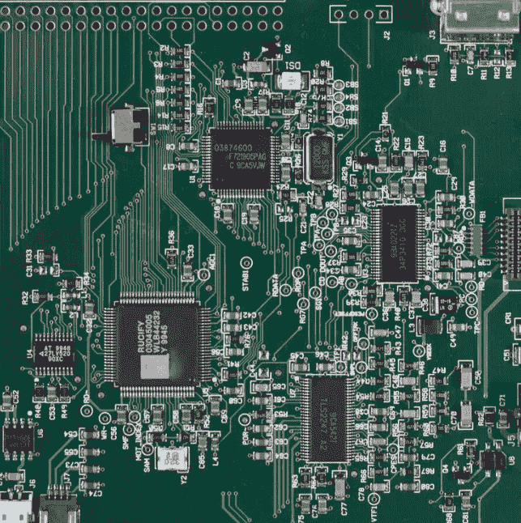
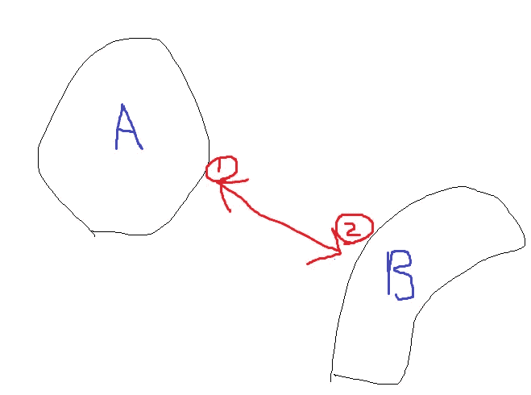
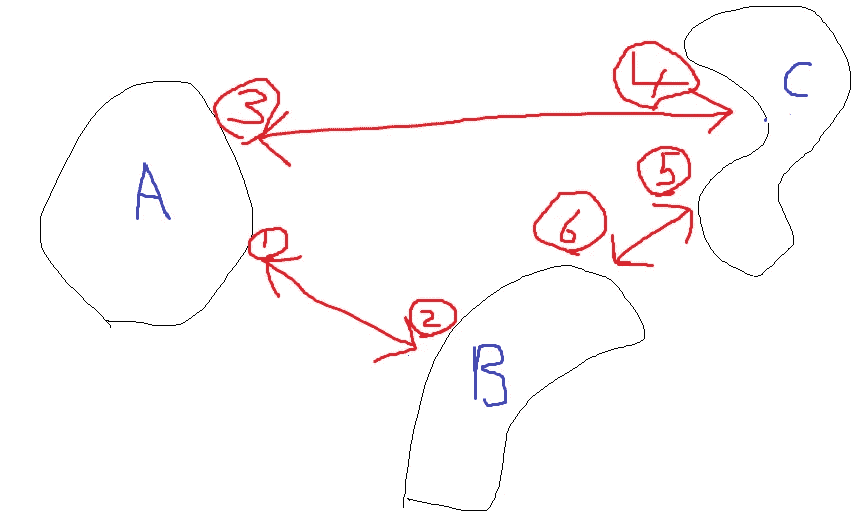
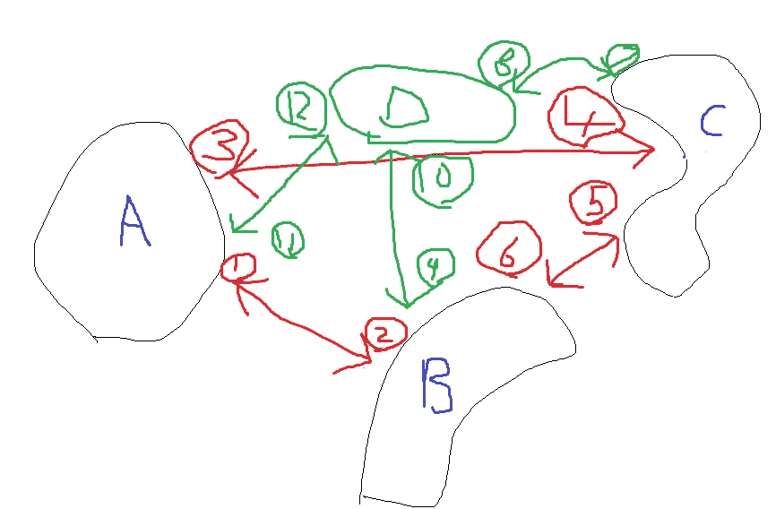
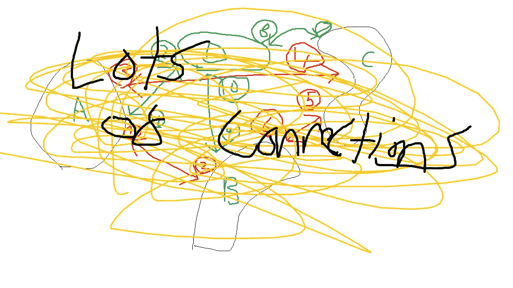
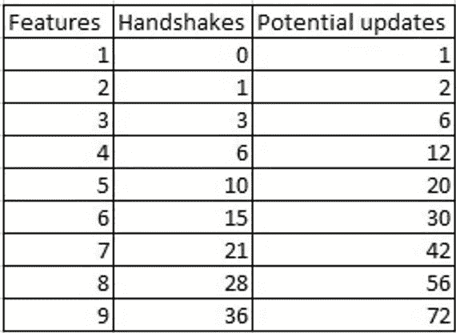

# 握手开销——软件开发中复杂性的增长之痛

> 原文：<https://itnext.io/handshake-overhead-growing-pains-of-complexity-in-software-development-d119c69bae9f?source=collection_archive---------1----------------------->

## 复杂化合物

米盖尔·Á。来自 Pexels 的 padrián

> 控制复杂性是计算机编程的本质。布赖恩·威尔逊·克尼根

控制复杂性和最小化由电荷引起的中断是设计和编写高质量代码的核心。复杂性使得代码更难理解和更改。

复杂就是代码做很多事情，有更多相互关联的代码和连接。

增加一个特性并不会使代码库变得更加复杂。它增加的复杂性是需要更新多少相关的特性。

Seth Godin 写了一篇文章[规模与速度:为什么组织变慢了](https://seths.blog/2022/06/scale-vs-speed-why-organizations-slow-down/)来解释为什么企业在扩大规模时变慢了。他提到了头顶上的握手。

> **握手开销**是更多人的简单法则的结果。n*(n — 1)/2。两个人需要一次握手来介绍。另一方面，9 个人需要 36 次握手。更多的人参与更多的会议，更多的批准，更多的协调。

这是对代码复杂性的一个很好的直观解释。向 5 个现有功能添加另一个功能意味着代码必须潜在地与 5 个功能交互。

# 复杂性

开发在开始时很容易，随着代码库的增长以及相关和依赖代码数量的增加，开发会变得越来越难。

虫子就是一个很好的例子。当一个开发人员修复一个 bug 时，他可能会无意中在不同的区域破坏一些东西。这是因为代码链接到代码的其他区域，例如依赖关系。

这是低估复杂性的一个来源。我们估算了特性 A、特性 B 和特性 C，但忘记估算和部分。

不断增长的代码库的复杂性在于，整个代码库很难单独理解，代码的每个部分如何相互作用或依赖于代码的其他部分。

这就像阅读维基百科的文章，你必须去阅读每一个超链接。

# 2 个相连的特征

下面我们看到的代码中有两个连接在一起的特性(蓝色)。有两个红色的连接。

这就是敏捷开发的用武之地。稍后当特性 A 发生变化时，我们可能需要改变特性 b 的代码。

好消息是只有两个特点。您有两个理由进行更改，并且只有两个特性需要测试。

红色的连接是潜在的变化。您可能需要用更改来更新特性 A，以便使用特性 B，反之亦然。并不总是这样，因为有时特性 A 不需要与特性 b 交互。

# 3 个相连的特征

随着您的敏捷开发的继续，您添加了另一个特性。对于非技术人员来说，这应该是增加一个功能的简单情况，您应该能够在创建功能 1 和 2 所需的一半时间内完成，例如，2 个功能需要 1 个月，1 个功能需要 2 周。

我们添加了一个新功能，但这可能需要与 2 个现有功能握手，并可能涉及 6 个代码更新。

更新特性时，需要了解 3 个特性，更新 3 个特性，测试 3 个特性。

这就是高质量的编码和良好的设计能有所帮助的地方。单元测试可以自动测试特性，看看你的改变是否破坏了什么。设计良好的代码将最小化依赖性，并使用接口等来减少变化的影响。

低质量将有做许多事情的大方法，并且随着代码库的增长，复杂性以更快的速度增长。如果上面的特性是用一种方法编写的，那么它将会非常庞大，会做很多事情，很难知道在哪里修改它。

如果将这三个特性分成单独的类，那么理解、更新和测试就更容易了。

# 4 个连接特征

在某种程度上，握手已经失去了控制

现在，我们添加了一个新的绿色功能，它需要与所有现有的功能进行交互。

对于与 3 个现有功能一起工作的新功能 green，它涉及 D 和 A、B、C 之间的 3 次额外握手以及潜在的 6 次代码更新。

# 5 个连接特征

我的绘画技巧不能处理这个

下表显示了握手和潜在更新的增长情况。

并不是所有的特性都是相互依赖或相互关联的，但是这个表格显示了复杂性是如何增长的，并且它不仅仅是您添加的一个新特性。

复杂性随着代码库的大小而增长；个人理解大型代码库的所有部分变得越来越困难。当代码库增长时，你会得到专攻某些领域的个体。

本文只关注代码。当您添加一个新功能时，还有其他依赖关系。

*   测试
*   证明文件
*   构建/发布
*   培养
*   数据迁移
*   从属或关联集成/其他软件

# 探究

代码有许多相互关联/依赖的代码，不仅仅是功能代码，还有许多安全、日志记录、异常处理和共享代码所需的管道代码。

DRY(不要重复自己)意味着不要重复代码，避免有大量相同或相似的代码。好处是如果代码发生变化，您只需要在一个地方更新它。消极的一面是你有很多人脉。

就像流量一样，你会得到一些流行的代码片段，其中大部分流量会下降，而某些代码片段看起来就像蜘蛛网的中心。

# 技术债务是不可能避免的

敏捷开发使得创建软件变得困难，技术债务不可避免。

您添加了新的特性，这些特性可以改变现有代码的设计，以完成最初设计中从未考虑过的事情。要在不重写和重新设计整个代码库的情况下进行这些更改，您可以将它们粘贴到现有设计的侧面。

这就是熵发挥作用的地方。对现有代码进行的更改和更新越多，它就越容易衰退。代码和设计会磨损。

# 盖房子

1.  你建一个一居室的平房。
2.  你扩建了第二间卧室。
3.  你向上建造并增加一层。再加一间卧室，卫生间。
4.  你需要更多的空间，所以你扩展了休息室。这些变化需要更新电力和供暖系统。
5.  现在你需要一个更大的厨房来容纳这些人。
6.  你延长了停车时间

当一个客户要求一个一居室的房子时，你建造了一个可爱的平房。当他们改变主意，想要 3 间卧室时，你不得不扩建平房，并在你最初的设计基础上不断增加房间。

延伸就是你如何到达那些你只能通过另一间卧室才能到达的卧室。没有人会从头开始这样设计它，但当你添加到一个现有的设计中时，你最终会得到它。