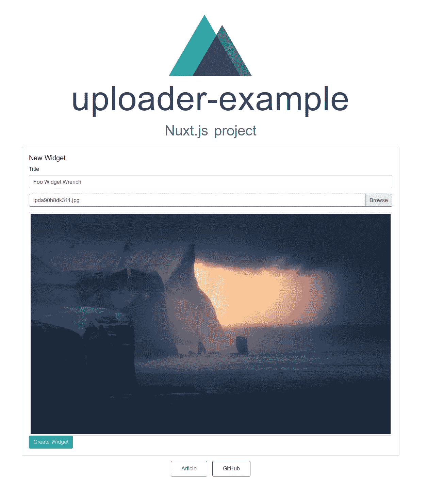

# 快乐的用户用 Rails 5、Shrine 和 Vue.js 上传文件

> 原文：<https://itnext.io/happy-users-uploading-files-with-rails-5-shrine-and-vue-js-bbcc470a327f?source=collection_archive---------0----------------------->

我花了很长时间才弄明白。我在这里的目标是通过告诉你我如何实现产品服务器就绪上传的故事来为你省下难以置信的痛苦。上传文件是会议中的一件小事，很快就会变成十六条腿的章鱼。一旦应用程序开始接受和操作文件，就会有许多实现细节发生变化并需要安全强化。

*   我是否从我的应用服务器上完全卸载上传/接收文件？(通常称为“直接上传”)
*   我需要为应用程序上传的内容创建几个版本吗？
*   我应该在哪里缓存文件，以便在保持性能的同时经济高效地存储它们？
*   我该如何处理现有的上传文件？
*   我需要允许哪些类型的文件，接受它们作为有效附件有什么限制？

这六个问题是与应用程序的利益相关者讨论了几天的结果。在会议和设计实现之间，有大量关于我们可以使用的工具的教程和讨论。没有人真正告诉任何人如何从头开始做这件事。

让我们忙起来吧！

## 堆栈里有什么？

*   API 模式下的 Rails 5
*   [用于图像处理的 libvips](https://jcupitt.github.io/libvips/)
*   [Sidekiq](https://github.com/mperham/sidekiq) 进行后台处理
*   [前端的 Nuxt](http://nuxtjs.org) /Vue
*   [Shrine.rb](http://shrinerb.com/) 上传与 Rails 的集成

## 项目设置

按照[说明](https://jcupitt.github.io/libvips/install.html)安装 libvps。制作两个名为`backend`和`frontend`的文件夹。

## 后端:

```
rails new --api --skip-active-storage --skip-action-cable -d postgresql .
```

打开 gem 文件并添加以下条目:

```
gem 'aws-sdk-s3' # for connecting to an S3 bucket
gem 'bcrypt', '~> 3.1.7' # use has_secure_password
gem 'fastimage' # *finds the size or type of an image given its uri.*
gem 'image_processing' # you guessed it
gem 'jb' # a faster json templating system than jbuilder
gem 'knock' # json web tokens (JWT) for authentication
gem 'rack-cors' # handling CORS requests
gem 'redis', '~> 4.0' # fast keystore perfect for offloading async job state
gem 'redis-rails' # connector and helpers for redis in rails
gem 'ruby-vips' # image manipulation bindings in Ruby
gem 'sidekiq' # background job framework
gem 'shrine' # our uploading toolkit
```

继续运行`bundle install`来安装这些依赖项。

让我们通过运行`rails g knock:install`来使用 Knock 进行一些认证。对于 Rails 5.2，您需要在初始化器中添加这一行:

```
*config*.token_secret_signature_key = -> { Rails.application.credentials.fetch(:secret_key_base) 
}
```

这是因为从 Rails 5.1 到 5.2，secrets.yml api 被迁移到了 credentials，而 Knock 中的缺省值仍然反映了 5.1 的实现。

接下来，我们希望我们的 API 处理 CORS 请求，所以打开`initializers/cors.rb`,取消那里的内部注释:

```
Rails.application.config.middleware.insert_before 0, Rack::Cors **do** allow **do** origins '*'

    *resource* '*',
             headers: :any,
             methods: [:get, :post, :put, :patch, :delete, :options, :head]
  **end
end**
```

现在请记住，这是一个非常通用的策略，因此您可能希望在部署时仅将它限制在前端域，而不是使用`*`。还在`Gemfile`中取消对`gem rack-cors`的注释。

接下来，我们要在初始化器中设置一个神龛。Shrine 是非常模块化的，很容易覆盖初始化器中的任何内容。您甚至可以选择根本没有，而是将所有内容放入我们接下来将创建的 uploader 类中。这取决于你。我试着在`initializers/shrine.rb`中保留全局使用的配置项，并保持上传类较小。

```
require 'shrine'
require 'shrine/plugins/activerecord'
require 'shrine/plugins/backgrounding'
require 'shrine/plugins/data_uri'
require 'shrine/plugins/delete_promoted'
require 'shrine/plugins/delete_raw'
require 'shrine/storage/s3'
require 'shrine/storage/file_system'
require 'shrine/plugins/logging'
require 'shrine/plugins/determine_mime_type'
require 'shrine/plugins/store_dimensions'
require 'shrine/plugins/cached_attachment_data'
require 'shrine/plugins/restore_cached_data'
require 'shrine/plugins/validation_helpers'
require 'shrine/plugins/pretty_location'
require 'shrine/plugins/processing'
require 'shrine/plugins/versions'

Shrine.plugin :activerecord
Shrine.plugin :backgrounding
Shrine.plugin :cached_attachment_data
Shrine.plugin :data_uri
Shrine.plugin :determine_mime_type
Shrine.plugin :logging
Shrine.plugin :restore_cached_data
Shrine.plugin :store_dimensions
Shrine.plugin :validation_helpers
Shrine.plugin :versions

**def** production_storages
  s3_options = {
    access_key_id: Rails.application.credentials.digitalocean_spaces_key,
    secret_access_key: Rails.application.credentials.digitalocean_spaces_secret,
    bucket: Rails.application.credentials.digitalocean_spaces_bucket,
    endpoint: 'https://nyc3.digitaloceanspaces.com',
    region: 'nyc3'
  }

  *# Your probably want the directory to be in a shared location so its persisted between deployments* {
    cache: Shrine::Storage::FileSystem.new('public/uploads', prefix: 'cache'), *# temporary* store: Shrine::Storage::S3.new(prefix: 'store', upload_options: { acl: 'public-read' }, **s3_options)
  }
**end

def** development_storages
  {
    cache: Shrine::Storage::FileSystem.new('public', prefix: 'uploads/cache'), *# temporary* store: Shrine::Storage::FileSystem.new('public', prefix: 'uploads'), *# permanent* }
**end** Shrine.storages = Rails.env.production? ? production_storages : development_storages
*# Shrine.storages = production_storages*
```

Shrine 使用两个地方来存储文件，一个缓存和一个永久存储。这是您将在那里找到的最常见的配置，但是可以通过向散列添加另一个键并调用正确的 Shrine::Storage 子类来添加额外的存储。我还添加了两种方法来返回本地开发配置散列的配置。

在我的例子中，我们使用了数字海洋的空间功能。从各方面来看，这都是一个 S3 桶，没有任何特殊的外部情况是`aws-sdk-s3`无法独立处理的。如果你是使用 Rails ' T5 '的新手，那么我建议你读一读这篇文章。

接下来，我们将搭建一个附有照片的小部件:

`cd backend && rails g scaffold widget title:string photo_data:string`

搭建中的关键是用后缀`_data`命名附件数据，其类型是 string。我起初错误地将其设置为 JSON，然后 Shrine 试图解析一个 hash 并抛出一个异常。

因为`photo_data`将作为一个 json 对象发送到控制器，我们需要改变接受参数的方式。打开`app/controllers/widgets_controller.rb`并将`widget_params`方法更改如下:

```
**def** widget_params
  params.require(:widget).permit(:title, photo_data: {})
**end**
```

现在我们有了一个小部件模型，我们可以给它附加一个照片上传器。模型`app/models/widget.rb`应该是这样的:

```
**class** *Widget* < ApplicationRecord
  include ImageUploader[:photo]
**end**
```

Shrine 将寻找一个`app/uploaders`文件夹，所以让我们来创建一个 ImageUploader 类:

```
# app/uploaders/image_uploader.rb**class** *ImageUploader* < Shrine
  include ImageProcessing::Vips
  plugin :backgrounding
  *# The determine_mime_type plugin allows you to determine and store the actual MIME type of the file analyzed from file content.* plugin :determine_mime_type
  *# The store_dimensions plugin extracts and stores dimensions of the uploaded image using the fastimage gem, which has built-in protection against image bombs.* plugin :store_dimensions
  *# The validation_helpers plugin provides helper methods for validating attached files.* plugin :validation_helpers
  *# The pretty_location plugin attempts to generate a nicer folder structure for uploaded files.* plugin :pretty_location
  *# Allows you to define processing performed for a specific action.* plugin :processing
  *# The versions plugin enables your uploader to deal with versions, by allowing you to return a Hash of files* ***when*** *processing.* plugin :versions
  *# The delete_promoted plugin deletes files that have been promoted, after the record is saved. This means that cached files handled by the attacher will automatically get deleted once they're uploaded to store. This also applies to any other uploaded file passed to* **Attacher***#***promote***.* plugin :delete_promoted
  *# The delete_raw plugin will automatically delete raw files that have been uploaded. This is especially useful* ***when*** *doing processing, to ensure that temporary files have been deleted after upload.* plugin :delete_raw
  *# The cached_attachment_data plugin adds the ability to retain the cached file across form redisplays, which means the file doesn't have to be reuploaded in* ***case*** *of validation errors.* plugin :cached_attachment_data
  plugin :logging
  plugin :recache

  *# Define validations
  # For a complete list of all validation helpers, see AttacherMethods.* ***http://shrinerb.com/rdoc/classes/Shrine/Plugins/ValidationHelpers/AttacherMethods.html*** Attacher.validate **do** validate_max_size 15.megabytes, message: 'is too large (max is 15 MB)'
    validate_mime_type_inclusion %w[image/jpeg image/jpg image/png image/gif]
  **end** *# Process additional versions in background.* process(:store) **do** |*io*|
    versions = {original: *io*}
    *io*.download **do** |*original*|
      pipeline = ImageProcessing::Vips.*source*(*original*)
      versions[:large] = pipeline.resize_to_limit!(1200, 1200)
      versions[:medium] = pipeline.resize_to_limit!(640,640)
      versions[:small] = pipeline.resize_to_limit!(320,320)
      versions[:lg_square] = pipeline.resize_to_fill!(1200, 1200)
      versions[:md_square] = pipeline.resize_to_fill!(640, 640)
      versions[:sm_square] = pipeline.resize_to_fill!(320, 320)
    **end** versions
  **end** Attacher.promote { |*data*| ShrineBackgrounding::PromoteJob.perform_async(*data*) }
  Attacher.delete { |*data*| ShrineBackgrounding::DeleteJob.perform_async(*data*) }
**end**
```

接下来，我们需要创建后台作业来处理图像。Shrine 将使它们在缓存中立即可用，并且一旦它们被处理，它将使用我们的 S3/空间桶的 URL 更新模型。

在`app/jobs/shrine_backgrounding`中，我们创建了一个`PromoteJob`和`DeleteJob`类:

```
**# app/jobs/shrine_backgrounding/promote_job.rb
module** *ShrineBackgrounding* **class** *PromoteJob* include Sidekiq::Worker

    **def** perform(*data*)
      Shrine::Attacher.promote(*data*)
    **end
  end
end****# app/jobs/shrine_backgrounding/delete_job.rb
module** *ShrineBackgrounding* **class** *DeleteJob* include Sidekiq::Worker

    **def** perform(*data*)
      Shrine::Attacher.delete(*data*)
    **end
  end
end**
```

现在要在后台执行这些作业，我们需要运行 Sidekiq。对于开发环境，只需使用`bundle exec sidekiq`，但对于生产环境，我们使用 systemd 脚本:

```
# /etc/systemd/system/sidekiq.service
# https://raw.githubusercontent.com/mperham/sidekiq/master/examples/systemd/sidekiq.service
# systemd unit file for CentOS 7, Ubuntu 15.04
#
# Customize this file based on your bundler location, app directory, etc.
# Put this in /usr/lib/systemd/system (CentOS) or /lib/systemd/system (Ubuntu).
# Run:
#   - systemctl enable sidekiq
#   - systemctl {start,stop,restart} sidekiq
#
# This file corresponds to a single Sidekiq process.  Add multiple copies
# to run multiple processes (sidekiq-1, sidekiq-2, etc).
#
# See Inspeqtor's Systemd wiki page for more detail about Systemd:
# https://github.com/mperham/inspeqtor/wiki/Systemd
#
[Unit]
Description=sidekiq
# start us only once the network and logging subsystems are available,
# consider adding redis-server.service if Redis is local and systemd-managed.
After=syslog.target network.target

# See these pages for lots of options:
# http://0pointer.de/public/systemd-man/systemd.service.html
# http://0pointer.de/public/systemd-man/systemd.exec.html
[Service]
Type=simple
WorkingDirectory=/home/deploy/apps/app/current/backend
# If you use rbenv:
ExecStart=/bin/bash -lc '/home/deploy/.rbenv/shims/bundle exec sidekiq -e production -q backend_production_mailers -q default -q mailers'
# If you use the system's ruby:
# ExecStart=/usr/local/bin/bundle exec sidekiq -e production
User=deploy
Group=deploy
UMask=0002

# Greatly reduce Ruby memory fragmentation and heap usage
# https://www.mikeperham.com/2018/04/25/taming-rails-memory-bloat/
Environment=MALLOC_ARENA_MAX=2
Environment=RAILS_ENV=production
Environment=RAILS_MASTER_KEY=[YOUR MASTER KEY]
Environment=APP_DATABASE=app_production
Environment=APP_DATABASE_HOST=127.0.0.1
Environment=APP_DATABASE_USERNAME=[YOUR DB]
Environment=APP_DATABASE_PASSWORD=[DB PW]

# if we crash, restart
RestartSec=1
Restart=on-failure

# output goes to /var/log/syslog
StandardOutput=syslog
StandardError=syslog

# This will default to "bundler" if we don't specify it
SyslogIdentifier=sidekiq

[Install]
WantedBy=multi-user.target
```

这个脚本中的关键是 sidekiq 需要处理的队列是在 ExecStart 命令中定义的。如果您通过`config/sidekiq.yml` 配置队列，那么相应地调整命令。还要注意需要设置的环境变量，以便 sidekiq 可以访问数据库并解密凭证。

我们希望后端的最后一部分是一个可以立即上传文件到缓存的地方。为了安全地做到这一点，不要遵循 Shrine 的建议，将他们的上传者端点安装为机架应用程序。这将不允许你认证上传，并有效地把你的 S3 桶变成公共存储。相反，我们想创造一个`UploadsController`。这里我将跳过认证部分，但是我强烈建议对基于 API 的 Rails 后端使用 [Knock](https://github.com/nsarno/knock) 。现在我显示注释掉的 before_action。

```
**class** *UploadsController* < ApplicationController
  *# before_action* :authenticate_admin

  **def** create
    uploader = ImageUploader.new(:cache)
    @file = uploader.upload(upload_params[:file])
    render json: @file
  **end** protected

  **def** upload_params
    params.require(:upload).permit(:file)
  **end
end**
```

向 UploadsController 添加路由:

```
post 'uploads' *=>* 'uploads#create', defaults: { format: :json }
```

这将我们的上传放到缓存中，使我们的 UI 不必在表单提交时上传文件，也不会阻塞用户交互。当我们完成上传后，我们将获取 photo_data 并在提交时将其添加到表单中。

大量代码进入我们的后端。我希望你还和我们在一起。现在是制作 UI 的时候了！

## 前端:

```
npm i -g [@vue/cli](http://twitter.com/vue/cli) [@vue/cli-init](http://twitter.com/vue/cli-init)
cd frontend && vue init nuxt-community/starter-template .
yarn install
```

这给了我们一个基本的基于 nuxtjs 的起点。继续，用`yarn run dev`启动它。

接下来，我在项目中添加了 [nuxt-axios](https://axios.nuxtjs.org/setup.html) 和 [bootstrap-vue](https://bootstrap-vue.js.org/docs) 。我还想在端口 3001 上运行 Rails，这样 Nuxt 就可以在端口 3000 上运行。nuxt.config.js 文件:

```
module.exports = {
  /*
  ** Headers of the page
  */
  head: {
    title: 'uploader-example',
    meta: [
      {charset: 'utf-8'},
      {name: 'viewport', content: 'width=device-width, initial-scale=1'},
      {hid: 'description', name: 'description', content: 'Nuxt.js project'}
    ],
    link: [
      {rel: 'icon', type: 'image/x-icon', href: '/favicon.ico'}
    ]
  },
  /*
  ** Customize the progress bar color
  */
  loading: {color: '#3B8070'},
  /*
  ** Build configuration
  */
  build: {
    /*
    ** Run ESLint on save
    */
    extend(config, {isDev, isClient}) {
      /* configure bootstrap-vue image paths */
      **const** vueLoader = config.module.rules.find((rule) => rule.loader === 'vue-loader');
      vueLoader.options.transformToRequire = {
        'img': 'src',
        'image': 'xlink:href',
        'b-img': 'src',
        'b-img-lazy': ['src', 'blank-src'],
        'b-card': 'img-src',
        'b-card-img': 'img-src',
        'b-carousel-slide': 'img-src',
        'b-embed': 'src'
      };

      **if** (isDev && isClient) {
        config.module.rules.push({
          enforce: 'pre',
          test: /\.(js|vue)$/,
          loader: 'eslint-loader',
          exclude: /(node_modules)/
        })
      }
    }
  },
  modules: [
    'bootstrap-vue/nuxt',
    '@nuxtjs/axios'
  ],
  axios: {
    /* set API_URL environment variable to configure access to the API
    */
    baseURL: process.env.API_URL || 'http://localhost:3001/',
    redirectError: {
      401: '/login',
      404: '/notfound'
    }
  }
}
```

在构建部分，我还添加了一个 webpack 规则来支持带有 bootstrap-vue 的 nuxt 映像路径。

接下来，我们将制作几个组件，并使用 Vuex 来处理它们之间的通信。我们的第一个组件是`components/uploader.vue`

```
<template>
  <b-form-group>
    <b-form-file ref="file"
                 v-model="file"
                 :state="Boolean(file)"
                 placeholder="Choose a file..."
                 @input="sendFile"
                 :accept="accept"></b-form-file>
    <b-progress v-show="uploadPercentage > 0 && uploadPercentage !== 100"
                striped
                animated
                :max="100"
                class="mt-3"
                :value="uploadPercentage"></b-progress>
  </b-form-group>
</template>
<script>
  **export default** {
    props: {
      accept: {
        type: String,
        **default**: 'image/*'
      },
      apiUrl: {
        type: String,
        **default**: '/uploads'
      }
    },
    data() {
      **return** {
        file: **null**,
        presigned: {},
        uploadPercentage: 0,
      }
    },
    methods: {
      sendFile() {
        **let** vm = **this**;
        **let** formData = **new** FormData;
        formData.append('upload[file]', vm.file);
        **this**.$axios.post(vm._props.apiUrl, formData, {
            onUploadProgress: **function** (progressEvent) {
              vm.$emit('uploading');
              vm.uploadPercentage = Math.round((progressEvent.loaded * 100) / progressEvent.total);
            }
          })
          .then(resp => vm.$emit('presigned', resp.data))
          .catch(**function** (errors) {
            console.log(errors)
          })
          .finally(resp => vm.$emit('done'));
        **this**.toDataUrl()
      },
      toDataUrl() {
        **let** vm = **this**;
        **let** reader = **new** FileReader();
        reader.addEventListener("load", **function** () {
          **let** dataUrl = reader.result;
          vm.$emit('image', dataUrl);
          vm.$store.commit('image_preview/set', dataUrl)
        }.bind(vm), **false**);
        **if** (/\.(jpe?g|png|gif)$/i.test(vm.file.name)) {
          reader.readAsDataURL(vm.file);
        }
      }
    }
  }
</script>
```

在这里，我们处理对`UploadsController`的上传，发出一个“预设计”事件来捕获我们需要在小部件表单中发送的数据。我们将文件对象解析为数据 uri，然后我们可以立即预览我们在`components/image-preview.vue`组件中上传的内容:

```
<template>
  <b-img thumbnail fluid :src="image" v-show="validate(image)"></b-img>
</template>

<script>
  **export default** {
    name: 'image-preview',
    computed: {
      image() {
        **return this**.$store.state.image_preview.image;
      }
    },
    methods: {
      validate(img) {
        **return** img && (img.match(/jpg|gif|png|jpeg/) || img.match(/^data:image/))
      }
    },
    mounted() {
      **return this**.validate(**this**.image) ? **this**.show = **true** : **this**.show = **false**;
    }
  }
</script>
```

您会注意到，在这些组件中，我们从`store/image_preview.js` vuex 存储中设置和检索一个值:

```
**export const** state = () => ({
  image: **null** })

**export const** mutations = {
  set(state, image) {
    state.image = image
  }
};
```

它处理了我们在缓存中存储文件、预览文件、甚至上传进度条所需要的一切。很棒吧？

现在剩下的实际上与您想通过 JSON 键/值对提交给 RESTful 后端的任何其他表单没有什么不同。

```
...
<b-card class="text-left">
  <h5>New Widget</h5>
  <b-form ref="form" @submit.prevent="newWidget">
    <b-form-group label="Title">
      <b-form-input v-model="title"></b-form-input>
    </b-form-group>
    <uploader v-model="photo" @presigned="photo_data = $event"></uploader>
    <image-preview></image-preview>
    <b-btn type="submit" variant="primary">Create Widget</b-btn>
  </b-form>
</b-card>
...
<script>
...
data() {
  **return** {
    photo: **null**,
    photo_data: **null**,
    title: **null** }
},
methods: {
  newWidget() {
    **this**.$axios.post('/widgets', {
      widget: {
        photo_data: **this**.photo_data,
        title: **this**.title
      }
    }).then((resp) => {
      **if**(resp.status === 201) {
        alert('success!');
        **this**.$refs.form.reset();
        **this**.$store.commit('image_preview/set', **null**)
      }
    })
  }
}
...
```

如果都完成了，您最终会得到如下所示的结果:



# 结论

我希望这篇教程能让人们对构建 web 应用程序感到兴奋。我认为处理文件上传总是很难，虽然有很多工具可以让它变得更容易，但在阅读如何做到这一点时，仍然有很多困惑和遗留问题。我希望我达到了目标，并且你能够兴奋地阅读本教程，使用 Rails 和 Shrine 进行上传，并使用 Nuxt 和 Bootstrap 构建出色的用户界面。许多现代 web 应用程序都遵循这种类型的架构。我希望你到此为止，并很好地理解在一个宁静的世界上传是如何工作的。

我把这些都放在一个应用程序里，你可以在 Github 上下载并查看:[https://github.com/toadkicker/uploader-example](https://github.com/toadkicker/uploader-example)

编码快乐！