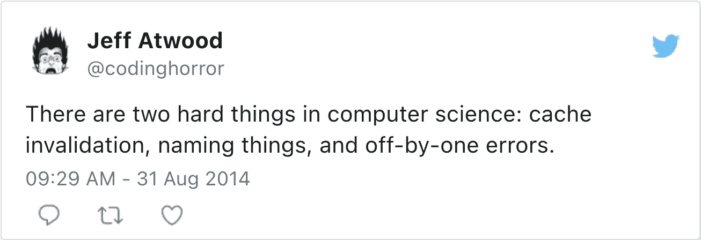

# 计算机科学中的难题

> 原文：<https://itnext.io/hard-things-computer-science-637ce4a4c5af?source=collection_archive---------1----------------------->


如果你有几年以上的 IT 经验，你可能会偶然发现下面这句话:

> *计算机科学只有两个硬东西:缓存失效和事物命名。*
> 
> *—菲尔·卡尔顿*

然后，因为这是一个伟大的报价，它演变成:



然而，我认为最初的引用是误导的。计算机科学里很多东西都很难。这篇文章旨在描述其中的一些。

# 缓存失效

在我的职业生涯中，我有一些缓存的用例。当我这么做时，主要是为了缓存 Hibernate 实体。我只实现过一次自己的缓存。我使用了一个简单的`HashMap`,因为它是一个批处理作业，因为缓存很小:不需要无效。

大多数缓存实现都实现了缓存备用策略。在缓存备用模式下，应用程序尝试从缓存中加载数据。如果缓存有它们，就返回它们；如果没有，应用程序从真实的来源读取数据——通常是数据库。

虽然数据存储在缓存中，但它们在数据库中可能会发生变化。简而言之，缓存中的数据和真实来源发生分歧的概率增加了久而久之。为此，我们有时需要将数据与事实的来源同步。这是通过从缓存中清除数据来实现的——缓存失效，也称为 TTL。

TTL 指定条目的有效时间。时间过去后，缓存会删除它，下一次读取将从真实源加载数据。

在这种情况下，棘手的是选择正确的 TTL:

1.  如果事实源中的引用数据在失效前发生了更改，客户端将读取陈旧数据
2.  如果失效发生在更改之前，就会发生不必要的重新加载。

本质上，TTL 越小，读取陈旧数据的机会就越少，但缓存的用处就越小。

# 命名事物

如果你有任何开发者的经验，你可能会确信给事物命名确实很有挑战性。如果没有，让我们引入另一个引语:

> *程序是给人类阅读的，只是偶尔让计算机执行*
> 
> *—唐纳德·克努特*

这里还有一个，稍微有点煽动性:

> 任何傻瓜都能写出计算机能理解的代码。优秀的程序员编写人类能够理解的代码。
> 
> *—马丁·福勒*

例如，下面是一些乱码:

```
data class Foo(val bar: String)class Baz : IllegalArgumentException()data class Qux(val quux: Double, val foo: Foo) {
    operator fun plus(qux: Qux) =
        if (foo != qux.foo) throw Baz()
        else Qux(quux + qux.quux, foo)
}
```

由于使用了 API，即`IllegalArgumentException`和`plus()`，您可能会推断出代码做了什么。然而，正确地重命名类和字段揭示了我们的意图:

```
data class Currency(val symbol: String)class MismatchCurrencyException : IllegalArgumentException()data class Amount(val number: Double, val currency: Currency) {
    operator fun plus(amount: Amount) =
        if (currency != amount.currency) throw MismatchCurrencyException()
        else Amount(number + amount.number, currency)
    }
}
```

当我参与项目时，在与业务人员交谈时，我总是提醒注意以下问题:

1.  用不同的词语来掩盖相同的事实
2.  用同一个词来掩盖不同的现实

第二种情况更糟糕，因为您可能认为您在与业务部门或其他开发人员谈论同样的事情，但您不是。如果谈判以一致结束，但每一方都有不同的现实，这是未来灾难的一个配方。

在言语交流的范围内，有可能就某个词的意思提出问题。在代码中，它不是！因此，命名类和变量必须传达确切的含义。

这很难，因为你需要精确而不啰嗦。

# 日期、时间和时区

我已经写了关于[日期和时间的问题](https://blog.frankel.ch/date-time-gotchas/)。总而言之:

*   从儒略历到公历的转变发生在不同的日期，这取决于所涉及的国家
*   一些国家的时区与其地理位置不完全一致
*   有些国家实行夏令时，有些国家不实行。更糟糕的是，有些人曾经是，现在不再是了。
*   国家有时会改变他们的时区。虽然它并不频繁，但发生的频率比大多数人想象的要高。
*   并非所有时区都相隔一小时。例如，印度是 UTC+5:30，但是三个时区相隔 45 分钟。

# 估计

软件开发项目中的估算很难得到正确的结果，以至于一些从事开发工作的人发起了“无估算”运动。我不会深究不做预估的利弊；我的观点是，评估一个重要的软件项目是具有挑战性的。

我认为整本书都写了为什么估算要求很高以及如何改进它们。我们来总结一下原因:

*   不仅仅是软件项目:
    许多参与软件项目但不知道他们是如何工作的人都渴望将这个活动与房屋建筑相比较。不幸的是，“住房”可以包含不同程度的工业化。人们所指的是现成的建筑。它涉及低定制或零定制。软件开发项目处于天平的另一边，类似于独特的建筑风格*主厨*。更详细的解释，请看下面关于房屋建筑和软件开发项目的[帖子。](https://blog.frankel.ch/on-house-building-software-development-projects/)
*   过程中的问题:
    在项目开始前提供估算，所有参数都在当时可用。不幸的是，虽然风险管理考虑到了已知的和已知的未知，但不可能预测未知的未知。由于软件项目的高度可变状态，几乎可以肯定会发生一些意想不到的事情，使我们之前的估计无效。
*   估计的性质:根据定义，估计是一种猜测。问题是，大多数人把它们当作最后期限。在这一点上，组织将关注于遵守截止日期，而不考虑折衷——失败的秘诀。


# 分布式系统

一台电脑可以做很多事情，即使是多核电脑。给计算机增加更多的资源会很快达到收益递减的临界点。此时，除了将负载分布到几台计算机上之外，您什么也做不了。欢迎来到分布式系统的领域！

分布式系统的问题在于它们很容易“出错”。以下是关于分布式系统的谬误列表:

1.  网络是可靠的
2.  延迟为零
3.  带宽是无限的
4.  网络是安全的
5.  拓扑不会改变
6.  有一个管理员
7.  运输成本为零
8.  网络是同构的。

> *—* [*维基百科，分布式计算的谬误*](https://en.wikipedia.org/wiki/Fallacies_of_distributed_computing)

大量的书籍和论文都是关于分布式系统的。能把它们做好的人值得我尊敬。

在我的职业生涯中，我偶然发现了两个分布式系统问题:

*   双重写入
*   领导人选举

# 双重写入

想象一个有两个分布式数据存储的系统。我们要求它们必须包含相同的数据。

它被称为*双重写入*问题。在单个数据库中，我们可以用数据库事务来解决。在两个不同的数据库中，[两阶段提交](https://en.wikipedia.org/wiki/Two-phase_commit_protocol)是可用的，即使它们可能不可靠。如果您需要写入的存储不能在 2PC 中注册，如在微服务架构中，您需要依赖[补偿事务](https://en.wikipedia.org/wiki/Compensating_transaction)。补偿事务很脆弱，要正确实现也很复杂。

从理论的角度来看， [CAP](https://en.wikipedia.org/wiki/CAP_theorem) 告诉我们，我们只能从三种能力中选择两种:一致性、可用性和分区容差。在现实中，选择是根本没有选择。因为系统是分布式的，我们需要选择 P；因为现代要求不允许我们阻塞，所以我们需要选择 A。权衡是一致性:随着时间的推移，两家商店将收敛到相同的状态**。**

**在解决这个问题时，我发现了[变更数据捕获](https://en.wikipedia.org/wiki/Change_data_capture)。CDC 背后的想法是将更新发送到单个存储，并将新状态的差异流式传输到另一个存储。自己去实施，不是小事。我建议使用现有的产品:我在过去的演示中已经成功地使用了 [Debezium](https://debezium.io/) 。**

# **领导人选举**

**分布式系统依赖于多个节点，它们之间的协调是强制性的。一些依赖于被称为**领导者**的特定节点来管理其他节点，而另一些则是*无领导者*。**

**大多数现代实现都是基于领导者的:看起来无领导者的实现不太可靠，不过，说实话，根据我目前的理解，在撰写本文时，我无法说出原因)。这种实现需要所有节点就其中哪个节点是领导者达成一致— *共识*。当网络分区发生时，一些节点不能与其他节点通信。在一个分区达成共识相对容易；网络重新组合时更具挑战性，必须在所有以前的领导者中选择一个领导者。**

**这就是为什么 [Paxos](https://en.wikipedia.org/wiki/Paxos_(computer_science)) 算法或 Paxos 算法家族被发明出来。然而，专家们似乎认为 Paxos 实现起来容易出错:Raft 算法是一个有吸引力的更容易实现的替代方案。无论如何，更容易并不意味着[容易](https://groups.google.com/g/raft-dev/c/JEtBYaPpHXo)。**

# **证明代码没有错误**

**传统的软件工程要求测试来避免错误。不幸的是，无论您喜欢哪种方法——单元、集成、端到端或者三者的混合——都不能保证您的代码没有错误。事实上，尽管臭名昭著的 [100%代码覆盖率](https://blog.frankel.ch/100-code-coverage/)，在产品中发现 bug 还是相当普遍的。拥有无 bug 代码的唯一可靠方法是证明它。它需要坚实的数学基础和允许正式证明的编程语言。**

**有几种这样的语言存在。不幸的是，他们都仍然属于学术界；我听说过的有 [Coq](https://en.wikipedia.org/wiki/Coq) 、 [Idris](https://en.wikipedia.org/wiki/Idris_(programming_language)) 和 [Isabelle](https://en.wikipedia.org/wiki/Isabelle_(proof_assistant)) 。**

**在他们中的任何一个进入主流行业之前，编写无错误代码将是计算机科学中最困难的事情之一。**

# **摘要**

**写计算机科学中有*只有*两个硬东西是强有力的主张。在这篇文章中，我试图列出我职业生涯中遇到的几件棘手的事情。我相信还有很多其他的:我会对你遇到的那些感兴趣。**

****更进一步:****

*   **[两个硬物](https://martinfowler.com/bliki/TwoHardThings.html)**
*   **我们能结束这种愚人的“估计”游戏吗？**

***原载于* [*一个 Java 怪胎*](https://blog.frankel.ch/hard-things-computer-science/)*2022 年 6 月 26 日***