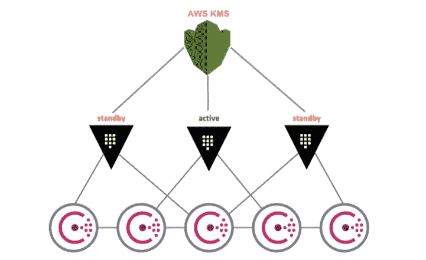
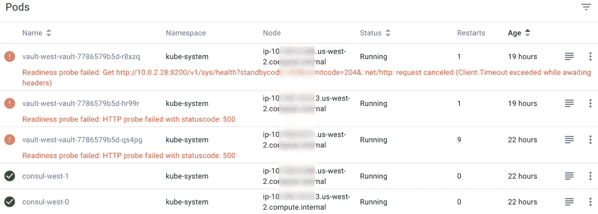
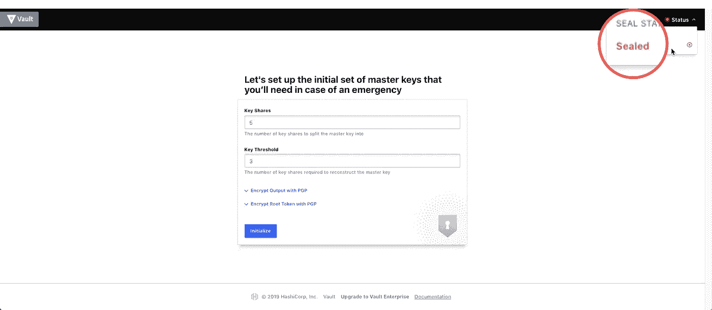
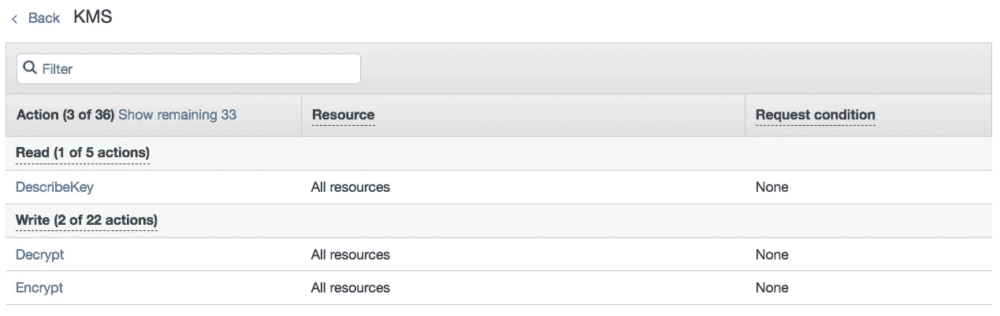
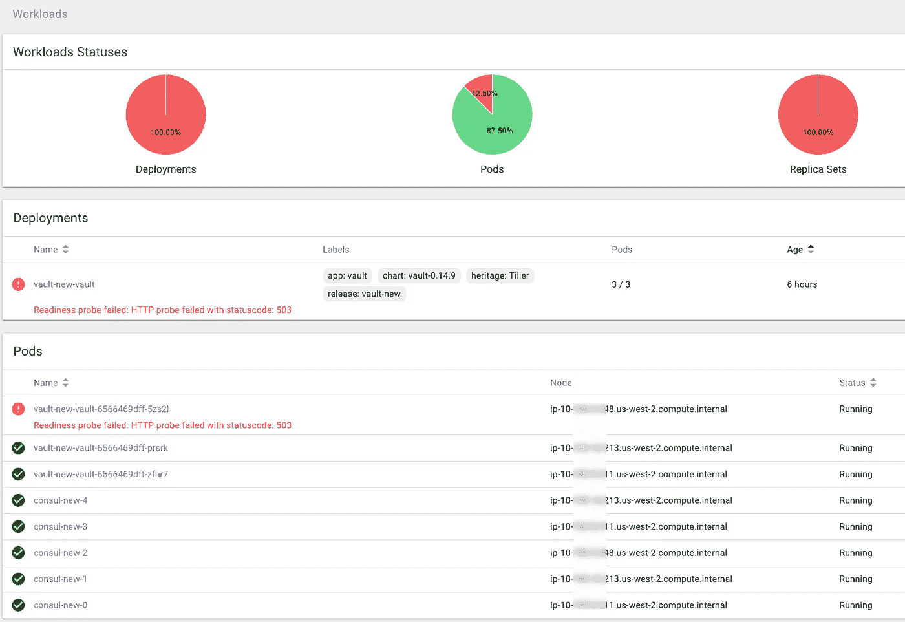
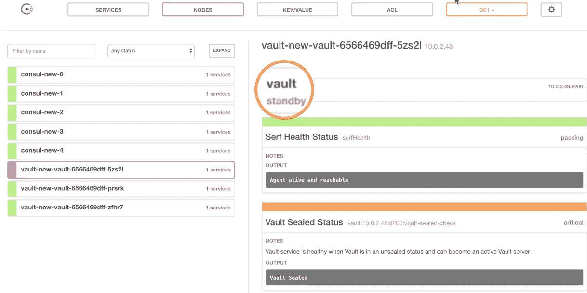
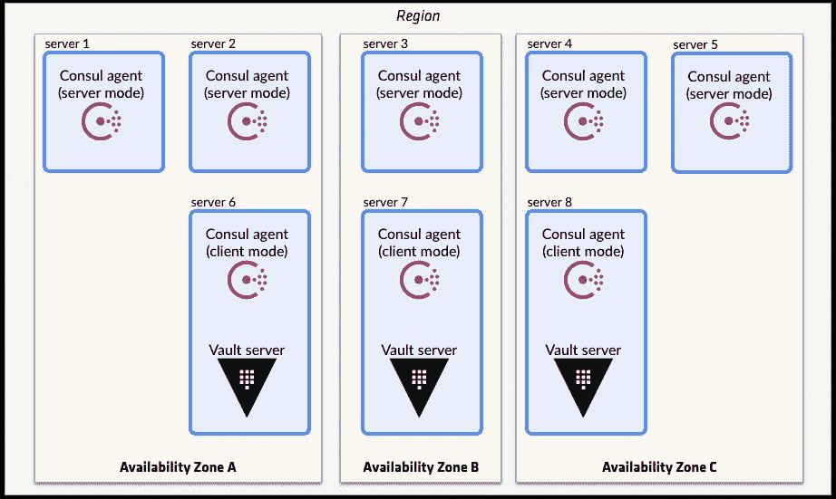
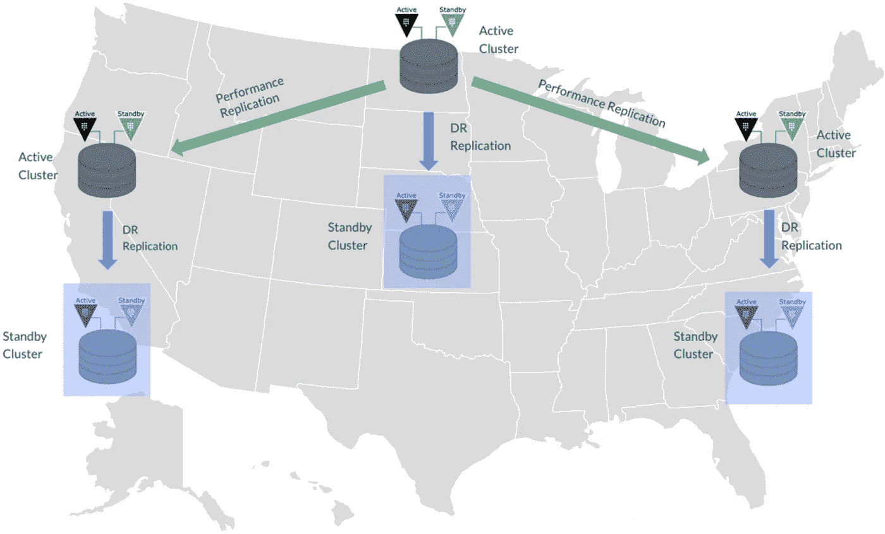

# Kubernetes 上的 Hashicorp 保险库具有自动解封功能

> 原文：<https://itnext.io/hashicorp-vault-on-kubernetes-with-auto-unseal-b7e64edbe63e?source=collection_archive---------1----------------------->

真的是自恢复和自动化友好的吗？有什么隐情？

机密管理和数据保护至关重要。然而，市场上的大多数解决方案并不是为 [DevSecOps](https://www.devsecops.org/) 设计的，这意味着它们并没有将安全性作为代码来开发。相反，它们是由手动配置和雪花变化驱动的。此外，在一些组织中，他们不得不雇佣专门的供应商顾问来维护这个[雪花服务器](https://martinfowler.com/bliki/SnowflakeServer.html)。

## DevSecOps 宣言

> **倚在**上空总是说“不”
> **数据&安全科学**上空恐惧， 不确定性和疑虑
> **开放贡献&协作**仅针对安全需求
> **使用 API 的可消费安全服务**针对强制安全控制&文书工作
> **业务驱动的安全分数**超过橡皮图章安全
> **红色&蓝色团队漏洞利用测试**过度依赖扫描&理论漏洞
> **全天候主动安全监控**在获悉事件后过度反应

Hashicorp Vault OSS 为机密管理、加密即服务、特权访问管理、动态机密、租赁和续订等提供了功能全面且代码友好的解决方案。

我已经尝试了几个令人印象深刻的功能，包括 AWS 认证后端，Kubernetes 认证后端，动态 MySQL 秘密，动态 AWS 访问凭证，等等。他们非常容易设置和自动化友好。

# 哈希公司开源自动解封前

如您所知，自动解封以前仅适用于 Vault Enterprise 客户。2018 年 12 月，Hashicorp 公布了 Vault 1.0 和 Vault OSS 中的自动解封功能。



> 开发自动解封是为了帮助降低解封保险库的操作复杂性，同时保持主密钥的安全。该功能将保护主密钥的责任从*操作员*委托给受信任的*设备*或*服务*。

在我们深入了解自动解封有多棒之前，让我们先来看看在旧版本的 vault 中我们必须手动做些什么。

正如我们所知，有两种常见的方法使保险库舱密封:

*   由于故障、部署或升级，保管库 pod 重新启动
*   意向封存操作:*金库操作员封存*

在这些情况下，Vault pods 将无法通过 Kubernetes 就绪性探测，并停止为流量提供服务。每当我有一个这样的仪表板，我的心就死了一点，这是为什么。



如下面的命令所示，要让这些 pod 重新投入业务，我们必须手动`kubectl port-foward`每个 vault pod，并使用唯一的解封密钥运行`vault operator unseal`至少 3 次。这需要 3 名操作员进行 9 次手动操作。

说真的，谁想在凌晨 3 点起床，参加网络会议，找到解封键，并运行解封命令呢？😅

**不仅运营成本如此之高，而且由于保险库停机导致的业务停机也是不可接受的。**

```
**# Check Vault Status, seems it is already sealed**
(⎈ |:)bash-3.2$ vault status
Key                Value
---                -----
Seal Type          shamir
**Sealed             true**
Total Shares       5
Threshold          3
**Unseal Progress    0/3**
Unseal Nonce       n/a
Version            0.10.1
HA Enabled         true**# First Unseal, they key is hidden of course** 
(⎈ |:)bash-3.2$ vault operator unseal
Unseal Key (will be hidden):
Key                Value
---                -----
Seal Type          shamir
Sealed             true
Total Shares       5
Threshold          3
**Unseal Progress    1/3**
Unseal Nonce       12345678-2c03-320a-6dea-12345678
Version            0.10.1
HA Enabled         true**# Second Unseal** (⎈ |:)bash-3.2$ vault operator unseal
Unseal Key (will be hidden):
Key                Value
---                -----
Seal Type          shamir
Sealed             true
Total Shares       5
Threshold          3
**Unseal Progress    2/3**
Unseal Nonce       12345678-2c03-320a-6dea-12345678
Version            0.10.1
HA Enabled         true**# Third Unseal is a charm!**
(⎈ |:)bash-3.2$ vault operator unseal
Unseal Key (will be hidden):
Key                    Value
---                    -----
Seal Type              shamir
**Sealed                 false**
Total Shares           5
Threshold              3
Version                0.10.1
Cluster Name           vault-cluster-e17ad79e
Cluster ID             ab0dd9a0-dfaa-25ef-0d30-12345678
HA Enabled             true
HA Cluster             [https://10.0.3.25:8201](https://10.0.3.25:8201)
**HA Mode                standby**
Active Node Address    [http://10.0.3.25:8200](http://10.0.3.25:8200)
```

# K8S 图表中的自动解封

我们的保险库部署管道非常简单，只有 2 个头盔图部署任务。

首先，使用以下值将[领事头盔图](https://github.com/helm/charts/tree/master/stable/consul)部署为保险库存储后端。yaml。该图由 OSS 社区构建，如果您更喜欢官方的 Hashicorp 版本，您可以从[此处](https://github.com/hashicorp/consul-helm)获得。

请注意，领事副本大小为 5。我们跨至少 3 个可用性区域(AZ)预配置了一个自动扩展组。AZ 编号因地区和不同的云提供商而异(最低要求为 3)。

自动缩放组中的 VM 实例由 Kubernetes 用`*kubectl label nodes <node-name> class=consul*`T9 来标记。下面的节点关联性和 pod 反关联性将确保 5 个咨询 pod 分布在至少 3 个 az 的 5 个节点上。

第二步，使用 vaule.yaml 部署[金库舵图](https://github.com/helm/charts/tree/master/incubator/vault)，如下图。启用了以下一些关键功能:

*   咨询代理被用作与咨询服务对话的辅助工具
*   **使用 AWS KMS 服务设置自动解封**
*   Statsd-exporter 作为 sidecar 运行，向 Prometheus 公开指标
*   Vault 通过 AWS 证书管理器(ACM)作为具有 SSL 的负载平衡器服务公开

# 自动解封:炸弹！

在几秒钟内，我们将启动并运行 Consul 和 Vault 服务。

首先，让*用密钥份额和密钥阈值的配置初始化* vault。



这个操作也可以在命令行中完成。

```
vault operator init -key-shares=5 -key-threshold=3
```

在初始化步骤之后，初始根令牌和恢复密钥都呈现给我们，并且可以作为文件下载。


请注意，这些密钥只能访问和下载一次，您将无法再次获得它们。与命令行相同，它只会被打印到终端一次。

注意此时，**金库已经自动解封**。事实上，我花了一段时间才意识到这一点，因为我的肌肉记忆仍然告诉我用其他操作者解封 9 次。为了确认内部到底发生了什么，我打开了 vault pod 日志，发现它正在使用指定的 kms_key_id 调用 AWS KMS 服务来自动解封自己。

现在我们来看看自动解封的杀手级特性。**无论什么原因导致保险库 pod 重新启动，它们总是以未密封状态返回。**我已经尝试过在分离舱内部杀死金库的过程；正在终止运行 vault pod 的虚拟机。我甚至做了一个`helm delete --purge vault`，只要我再次部署它，它总是出现未密封状态。

# 有什么条件

这听起来好得令人难以置信，对吗？一定有什么蹊跷。我们需要注入一些失败才能找到。

让我们倒回去检查一下我们之前做的一些准备工作。要使自动解封起作用，需要使用以下 KMS 权限部署保管库窗格。



这些 KMS 权限附加到 IAM 策略，可以通过 3 种不同的方式进行部署，选择您最喜欢的方式:

*   AWS 实例概要文件:虚拟机级别，标准过程
*   [Kube2IAM](https://github.com/jtblin/kube2iam) 角色注释:Pod 级别，更细粒度和自治
*   [AWS 访问密钥和访问密码](https://www.vaultproject.io/docs/configuration/seal/awskms.html#awskms-example)(仅 POC，不推荐)

## 故障注入案例 1: KMS 停机

有了这些信息，让我们通过删除 IAM 策略中的这些权限来模拟 AWS KMS 服务关闭，从而开始故障注入。这时，只有“KMS 倒下了”。然而，只要保险库舱没有重启，所有 3 个舱都将保持健康和未密封。

因此，在现实生活中，即使短期内无法获得 KMS 服务，对我们来说也不是什么大事。

## 故障注入情况 2: KMS 下降+ EC2 在 1 AZ 内下降

在下一个设置中，我删除了一个 pod，让它重新启动，这可以模拟一个虚拟机故障。
*可选:如果我们的 ASG 预选了 4+AZ，我们也可以模拟一个 AZ 级别的故障。在此期间，新的吊舱将在第四 AZ 发射。这可以通过屏蔽 NACL*[*混乱大猩猩*](https://en.wikipedia.org/wiki/Chaos_engineering#Chaos_Gorilla) *来实现。*

正如预期的那样，保险库 pod 以密封状态返回，它通过了*活性探测*，但未通过*准备就绪探测*。



Kubernetes:就绪探测失败

让我们更深入地研究下面的保险库 pod 日志。根据我们的失败注入，这个详细的错误消息非常有意义。如果这些 KMS 权限设置不正确，您也可能会在 POC 过程中看到类似的消息。

```
2019-02-21T21:59:28.288Z [INFO]  core: stored unseal keys supported, attempting fetch2019-02-21T21:59:28.623Z [WARN]  failed to unseal core: error="fetching stored unseal keys failed: failed to decrypt encrypted stored keys: error decrypting data encryption key: AccessDeniedException: The ciphertext refers to a customer master key that does not exist, does not exist in this region, or you are not allowed to access.status code: 400, request id: 123456-123456-123456-123456"
```

这时领事 UI 也给我们展示了匹配结果。只有一个保险舱被密封并处于*备用*模式。剩下的两个舱仍未密封，继续提供交通服务。Vault service 仍在运行，对最终用户没有影响。



**剧透**:一开始，我以为这是因为另外两个舱可以建立法定人数(2/3)并选出一个首领。然而，这不是真正的原因。我将在下一次测试中解释原因。

## 失败注射案例 3: KMS 下降+ EC2 在 2 AZs 内下降

让我们再杀死一个豆荚让它重新启动。不出所料，现在我们有 2 个*密封备用*保险库吊舱。然而， **Vault service 在这种严峻的形势下依然屹立不倒**。这和动物园管理员这种基于法定人数的领袖选举制度不一样吧？让我们仔细看看下面的高可用性定义。

***提示*** *:这 3 个跳马模式名称指的是同一个概念，可以互换使用:* ***主动、主、领导者。***

> 为了实现高可用性，**Vault 服务器节点之一在数据存储中获取一个锁。成功的服务器节点随后成为活动节点**；所有其他节点都成为备用节点。此时，如果备用节点收到请求，它们将根据集群的当前配置和状态转发请求或重定向客户端
> 
> **高可用性无法提高可扩展性。**一般来说，Vault 的瓶颈是数据存储本身，而不是 Vault 核心。例如:为了提高使用 Consul 的 Vault 的可伸缩性，通常应该扩展 Consul 而不是 Vault。

从我们的测试结果来看，这个剩余的未密封的*跳马吊舱很快就取得了领导地位，并自己为交通服务。外部流量没有经历任何存储停机。这与上面的 vault HA 设计相匹配。👆*

***简而言之，*** ***金库集群不需要建立法定人数来选举领袖。无论哪个单元获得锁，都将成为活动/主单元。***

## 故障注入:一个极端的例子

在我们当前的单区域 vault 集群设置中，如下图所示，一个潜在的停止服务灾难场景可能是:

*   AWS KMS 下降了很长时间。
*   同时，我们失去了 3 个不同可用性区域中的所有 3 个保险存储箱。
*   同时，Consul 群集(具有 5 个机架的 HA)停止运行，从而阻止了 Vault Service 的运行。



如你所知，发生这种特定灾难场景的概率非常低。然而，意识到最坏的情况并有合理的预期总是让我们感觉更好。

# 全局扩展 Vault

到目前为止，我们已经构建了一个单区域 HA Vault 集群，它满足了我们对 kubernetes 友好、代码驱动和自我恢复的需求。为了更进一步，这里有一些选择。

为了使 Vault Cluster HA 可跨多个区域扩展，Hashircorp 提供了一个开源工具 [consul-replicate](https://github.com/hashicorp/consul-replicate) ，它提供了一个将值从一个区域复制到另一个区域的解决方案。目前，我正在基于此构建一个定制的多区域 HA/DR 自动化。希望这项工作能产生另一篇文章。

HashiCorp Vault Enterprise 还通过提供两种复制模式解决了这些问题:性能(高级许可)和灾难恢复(专业许可)。如果有兴趣，你可以从[这里](https://learn.hashicorp.com/vault/operations/ops-reference-architecture#deployment-topology-for-multiple-datacenters)找到更多细节。



就是这样。我希望这是信息，可以帮助您了解保险库自动解封功能及其在故障期间的行为。

在我的下一篇文章中，我将分享我通过普罗米修斯使用*金库监控的经验，因为自我恢复设计总是在良好的监控堆栈下工作得更好。*

# 参考

[https://www.devsecops.org/](https://www.devsecops.org/)
[https://github.com/helm/charts/tree/master/incubator/vault](https://github.com/helm/charts/tree/master/incubator/vault)
[https://learn . hashi corp . com/vault/operations/ops-auto 启封-AWS-kms](https://learn.hashicorp.com/vault/operations/ops-autounseal-aws-kms)
[https://www . hashi corp . com/resources/vault-1-0-how-to-auto-启封-new-features](https://www.hashicorp.com/resources/vault-1-0-how-to-auto-unseal-new-features)
[https://www . vault project . io/docs/configuration/seal/AWS kms . html](https://www.vaultproject.io/docs/configuration/seal/awskms.html)