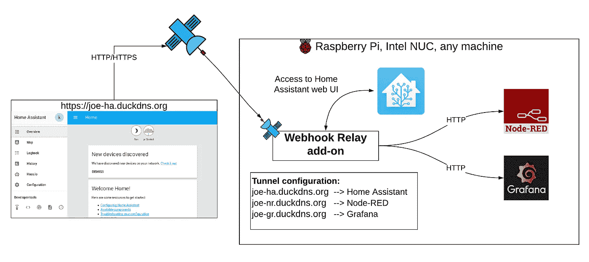
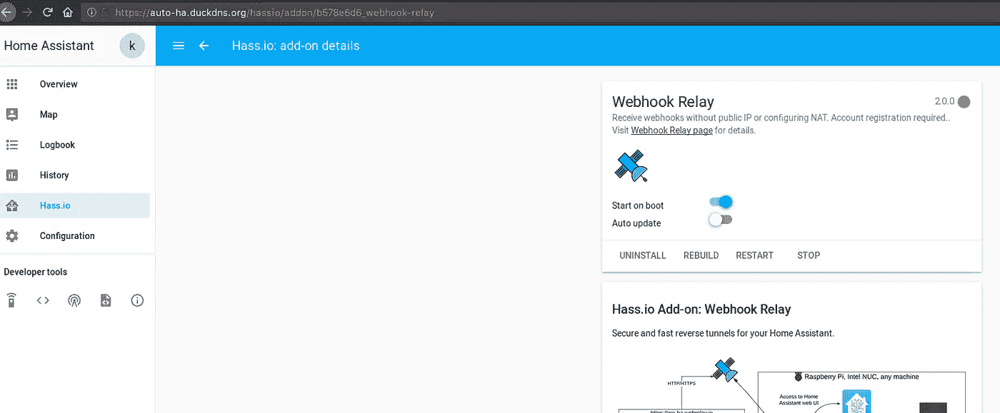

# Hass.io 插件:无需配置 NAT/防火墙的远程访问

> 原文：<https://itnext.io/hass-io-add-on-remote-access-without-configuring-nat-or-firewall-7ea9b2ea3a08?source=collection_archive---------1----------------------->



# 本教程的目标

无需配置路由器或静态 IP，即可对您的家庭助理进行安全的端到端 TLS 加密访问。我们将使用 [TLS 隧道](https://webhookrelay.com/v1/guide/tls-tunnels),而不是在 Webhook 中继服务器上终止的 HTTPS 隧道，这些隧道只在您的终端终止，因此即使我们被迫这样做，我们也无法在您的浏览器没有通知您的情况下拦截流量。

# 我对你的看法


# 在开始之前

本教程希望您具备:

*   [家庭助手](https://www.home-assistant.io/)实例
*   **基本加**订阅，支持白名单域和 TLS 直通隧道。通常情况下，它是付费的，但如果你想尝试一下，只需给我们发电子邮件或通过内部聊天联系，我们将启用这些功能。随时欢迎反馈:)
*   [DuckDNS](https://www.duckdns.org/) 账号获得自己的免费域名，通过[检索 TLS 证书让我们加密](https://letsencrypt.org/)。

# 快速启动

*   在这里创建 Webhook 中继账户
*   创建 [DuckDNS](https://www.duckdns.org/) 帐户

此附加组件的安装非常简单，与安装任何其他[has . io](https://hass.io/)附加组件相比没有什么不同:

1.  将我们的 Hass.io 附加组件存储库 URL 添加到您的 Hass.io 实例:[https://github.com/webhookrelay/home-assistant](https://github.com/webhookrelay/home-assistant)(如果您是通过您的 Home Assistant 附加组件页面看到这个，请跳过它)
2.  安装“Webhook Relay”附件。
3.  生成[令牌密钥&秘密对](https://my.webhookrelay.com/tokens)并将其添加到附加组件的配置中。
4.  获得 [DuckDNS](https://www.duckdns.org/) 令牌并创建你的域名。将这些详细信息添加到“隧道”配置部分和“duck_dns”部分。如果你接受[让我们加密 ToS](https://community.letsencrypt.org/tos) ，设置“accept_terms”为真。
5.  启动“Webhook 中继”附件。
6.  检查“Webhook Relay”附加组件的日志，看看是否一切顺利。它应该打印出你的公共网址。

# TLS 直通附加配置

一旦你:

*   Webhook 中继密钥和密码
*   DuckDNS 域
*   DuckDNS 令牌

使用这些详细信息来填充附加配置:

```
{
 "key": "your-webhookrelay-key",
 "secret": "your-webhookrelay-secret",
 "forwarding": [{
  "bucket": "ha",
  "destination": "[http://127.0.0.1:8123](http://127.0.0.1:8123)"
 }],
 "tunnels": [{
  "name": "ha",
  "destination": "[http://127.0.0.1:8123](http://127.0.0.1:8123)",
  "protocol": "tls",
  "domain": "your-domain.duckdns.org"
 }],
 "duck_dns": {
  "token": "your-duckdns-token",
  "accept_terms": true
 },
 "tunnels_enabled": true,
 "forwarding_enabled": false
}
```

确保“协议”设置为`tls`，`tunnels_enabled`设置为**真**。

```
}
```

确保“协议”设置为`tls`，`tunnels_enabled`设置为**真**。

附加组件将自动:

1.  将 DuckDNS 配置为指向正确的地址(公共隧道端点 IP)

# 。/wrap_up

1.  配置 Webhook 中继隧道



1.  开始提供交通服务

# 。/wrap_up

就这样，你应该可以通过你配置的域名访问你的家庭助手，在我的例子中是 https://auto-ha.duckdns.org。我们拥有完整的端到端加密，无需配置您的路由器或获取静态 IP 地址:

此外，除了使用 DuckDNS &让我们加密，您可以使用任何您想要的证书，或者不提供任何证书给附加组件，并在 Home Assistant 服务器上终止 TLS。为此，您只需在目的地:`"destination": "https://127.0.0.1:8123"`中指定 HTTPS

# 附言

如果你只是想获得网页挂钩，请随意使用我们的免费层！或者，如果你觉得破产了，发邮件到[【电子邮件保护】](https://webhookrelay.com/cdn-cgi/l/email-protection)给我们，我们可能会想出办法:)

不用 Hass.io？点击这里查看我之前的博文，其中详细介绍了 Docker [的简单设置。](https://webhookrelay.com/blog/2018/09/03/home-assistant-remote-access/)

*原载于 2018 年 10 月 12 日*[*webhookrelay.com*](https://webhookrelay.com/blog/2018/10/12/hassio-tls-tunnels-duckdns/)*。*