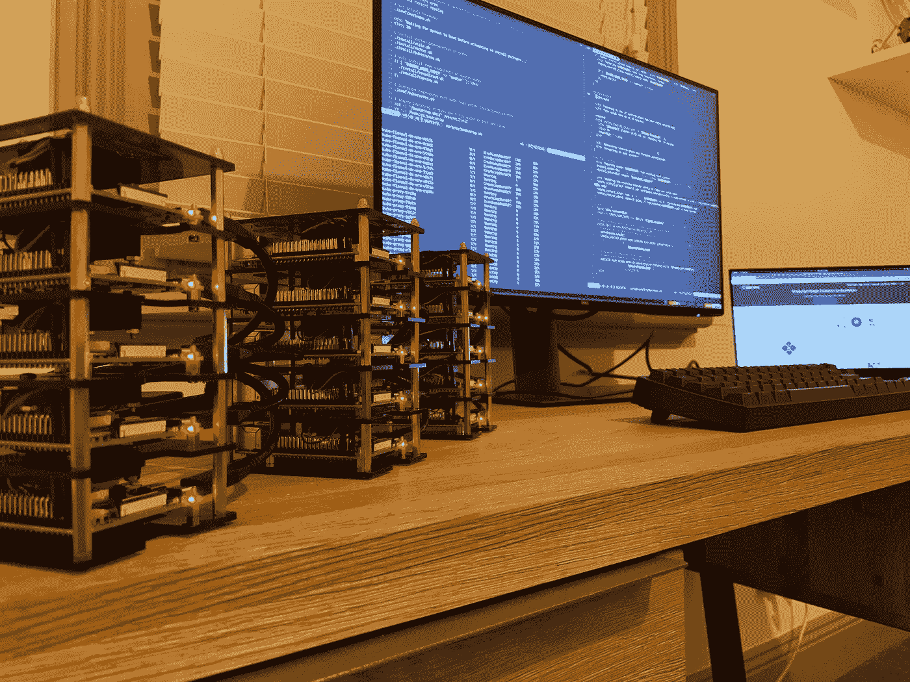
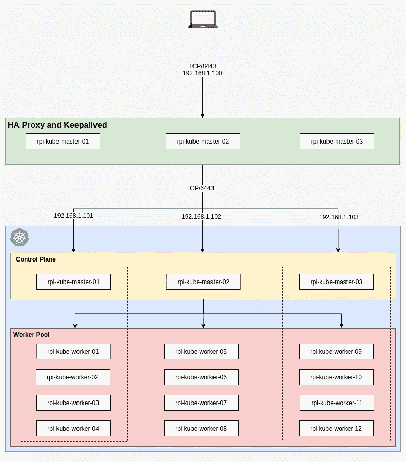
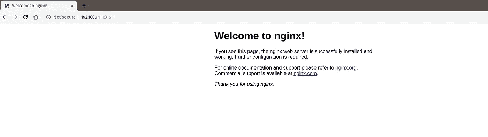

# 在 8 分钟内将 Kubernetes 自动部署到 15 个 Raspberry Pis 上

> 原文：<https://itnext.io/headless-kubernetes-on-15-raspberry-pis-boot-in-under-8-minutes-808402ea2348?source=collection_archive---------1----------------------->



别告诉我它不能自动化。

本指南将在 SD 卡上创建 Kubernetes 的自动部署。最后，你应该有一个 SD 卡加载到你的 Raspberry Pi 集群中，打开并“工作”。这是在您的家庭集群上运行和维护 Kubernetes 的一种完全自动化且几乎不变的方法。

范围是创建 Kubernetes 集群的自动化方法，对代码的研究留给您。

开发这一堆栈背后的主要驱动力是模拟在云环境(如[【GCP】](https://cloud.google.com/))中使用[宠物对牛方法](http://cloudscaling.com/blog/cloud-computing/the-history-of-pets-vs-cattle/)进行开发的情况。

## 先决条件

我的堆栈由 15 个覆盆子 Pis 组成，但是最小推荐数量是 4 个，以便能够遵循指南。

这在理论上可以用 2 个 Raspberry Pis 个主人和 1 个工人)来执行。然而，为了迎合这一点，你需要调整在`Makefile`中使用的`KUBE_MASTER_IP_XX`变量。

*   Linux 操作系统
*   [库贝克特尔](https://kubernetes.io/docs/tasks/tools/install-kubectl/)
*   至少 4 个树莓派(3 个主人和 1 个工人)
*   访问[https://github.com/lucasteligioridis/raspbernetes](https://github.com/lucasteligioridis/raspbernetes)

## 我的堆栈中的零件列表:

*   15 个[树莓 Pi 4 (4GB)](https://raspberry.piaustralia.com.au/raspberry-pi-4-model-b)
*   15 根 [USBA 到 USBC 的电缆](https://www.pccasegear.com/products/46540/pccg-usb-3-1-type-a-to-type-c-gen2-cable-50cm-black)(50 厘米)
*   15 根[以太网电缆](https://www.pccasegear.com/products/36092/cablemod-cat-6-ethernet-cable-blue-50cm)(50 厘米)
*   15 个 [Sandisk 32GB Ultra microSDHC 卡 10 类](https://www.amazon.com/SanDisk-Ultra-microSDXC-Memory-Adapter/dp/B073JWXGNT/ref=sr_1_2?keywords=sandisk+32gb+sd+card+micro&qid=1572351870&sr=8-2)
*   3 个 [Netgear ProSAFE 8 端口千兆交换机](https://www.pccasegear.com/products/39096)
*   3 个 [Anker PowerPort 6 端口 60W](https://www.amazon.com/Anker-Charger-PowerPort-iPhone-Galaxy/dp/B00P936188/ref=sr_1_4?keywords=anker+usb+hub+60w&qid=1572351821&s=electronics&sr=1-4)
*   4 x [GeeekPi 集群案例](https://www.amazon.com/GeeekPi-Cluster-Raspberry-Heatsink-Stackable/dp/B07MW24S61)

## 应用程序的版本

创建该堆栈的所有启动脚本都固定了所有应用程序版本，以产生一致的预期行为。

*   [拉斯扁](https://downloads.raspberrypi.org/raspbian_lite/images/raspbian_lite-2019-09-30/2019-09-26-raspbian-buster-lite.zip) —拉斯扁 _ lite-2019–09–30
*   [库伯内特斯](https://kubernetes.io/) — 1.16.1
*   [码头工人](https://www.docker.com/) — 18.09.0
*   [HA 代理](http://www.haproxy.org/) — 1.8.19
*   [保持激活](https://www.keepalived.org/) — 2.0.10
*   [法兰绒](https://raw.githubusercontent.com/coreos/flannel/2140ac876ef134e0ed5af15c65e414cf26827915/Documentation/kube-flannel.yml) —根据 [kubeadm 安装页面](https://kubernetes.io/docs/setup/production-environment/tools/kubeadm/create-cluster-kubeadm/#pod-network)上的说明

## 网络拓扑结构

该设计包括在三个主设备上使用浮动 VIP(虚拟 IP)的完全高可用性，以备断电时替代负载平衡器。

该设计还提供了一些额外的灵活性，允许任何节点断电而不影响群集。下图描述了整个堆栈的概要情况:



具有全网状 HA 的树莓 Pi 群集

## 主机名和 IP 配置

下面是本指南中经常使用的主机名和 IP 地址的完整列表，您可以随意创建自己的列表以供参考。

根据集群中 Raspberry Pis 的数量进行相应的调整，下面描述了我在集群中使用的配置:

*   rpi-kube-master-01:192 . 168 . 1 . 101
*   rpi-kube-master-02:192 . 168 . 1 . 102
*   rpi-kube-master-03:
*   rpi-kube-worker-01:192 . 168 . 1 . 111
*   rpi-kube-worker-02:192 . 168 . 1 . 112
*   rpi-kube-worker-03:192 . 168 . 1 . 113
*   rpi-kube-worker-04:192 . 168 . 1 . 114
*   rpi-kube-worker-05:192 . 168 . 1 . 115
*   rpi-kube-worker-06:192 . 168 . 1 . 116
*   rpi-kube-worker-07:192 . 168 . 1 . 117
*   rpi-kube-worker-08:192 . 168 . 1 . 118
*   rpi-kube-worker-09:192 . 168 . 1 . 119
*   rpi-kube-worker-10:192 . 168 . 1 . 120
*   rpi-kube-worker-11:192 . 168 . 1 . 121
*   rpi-kube-worker-12:192 . 168 . 1 . 122

# 必读

在开始之前，你应该知道有助于构建 SD 卡的`Makefile`。SD 设备的默认名称是:

*   **/dev/mmcblk0**

请注意，我只在基于 Debian 的操作系统上测试过，如果不小心，你可能会意外删除错误的设备。确保当您插入空白 SD 卡准备写入此堆栈的映像时，这些是正确的设备名称。为了确认这一点，一旦 SD 卡被插入到您的机器中，在您的终端中运行`lsblk`来确认，您应该得到如下或类似的输出:

```
$ lsblk
NAME            MAJ:MIN RM   SIZE RO TYPE  MOUNTPOINT
mmcblk0         179:0    0  29.7G  0 disk
├─mmcblk0p1     179:1    0   256M  0 part  
└─mmcblk0p2     179:2    0  29.5G  0 part 
```

如果您发现您的设备名称不同，您可以在终端中使用以下命令覆盖现有的默认名称:

```
export MNT_DEVICE=/dev/<YOUR_DEVICE_NAME>
```

# 设置

本指南中的每一步都假设您正在同一个终端会话中运行。

## 普通的

克隆已提供的存储库，并签出到下面列出的发布标签，以确保本指南中的说明与编写时一致:

```
git clone [git@github.com](mailto:git@github.com):lucasteligioridis/raspbernetes
cd raspbernetes
git checkout v1.0
```

如果想要对每个`make`目标的简要描述，只需在终端输入以下命令:

```
make
```

Bootstrap 每个排列或类型的节点将使用的第一组静态变量(根据您的特定环境进行更改):

```
export RPI_DNS=192.168.1.1
export RPI_NETWORK_TYPE=eth0
export RPI_TIMEZONE=Australia/Melbourne
export KUBE_MASTER_VIP=192.168.1.100
export KUBE_MASTER_IP_01=192.168.1.101
export KUBE_MASTER_IP_02=192.168.1.102
export KUBE_MASTER_IP_03=192.168.1.103
```

对于这种设置，假设`RPI_NETWORK_TYPE`是一个`eth0`(从 Raspberry Pi 连接到网络交换机的以太网电缆)。有一个通过设置以下命令连接到 WiFi 的选项(在导出密码环境变量时添加了一个空格作为后缀，以防止保存到历史记录):

```
export RPI_NETWORK_TYPE=wlan0
export WIFI_SSID="YourWifiSSID"
 export WIFI_PASSWORD="PasswordForWifi"
```

## 掌握

将 SD 卡插入机器的 SD 卡插槽，并运行以下命令:

```
export KUBE_NODE_TYPE=master
export RPI_HOSTNAME=rpi-kube-master-01
export RPI_IP=192.168.1.101make build
```

如果这是你第一次运行这个，你需要从官方网站下载 Raspbian 图像。只要您不删除下载到存储库`output/`目录中的`.img`文件，就只需要这样做一次。

你现在应该看到`dd`用一个全新的 Raspbian 副本格式化 SD 卡。将映像成功写入 SD 卡后，将生成配置文件并将其放在 SD 卡上，以便在引导时获取。

上述命令的输出应该类似于以下示例:

```
Formatting SD card with 2019-09-26-raspbian-buster-lite.img
2243952640 bytes (2.2 GB, 2.1 GiB) copied, 7 s, 317 MB/s
536+0 records in
536+0 records out
2248146944 bytes (2.2 GB, 2.1 GiB) copied, 109.321 s, 20.6 MB/sCreated a headless Kubernetes SD card with the following properties:
Network:
- Hostname: rpi-kube-master-01
- Static IP: 192.168.1.101
- Gateway address: 192.168.1.1
- Network adapter: eth0
- Timezone: Australia/Melbourne
Kubernetes:
- Node Type: master
- Control Plane Endpoint: 192.168.1.100
- Master IP 01: 192.168.1.101
- Master IP 02: 192.168.1.102
- Master IP 03: 192.168.1.103
```

现在，您可以随意将 SD 卡从您的机器中弹出，并插入您选择的 Raspberry Pi。

使用上述命令制作 2 个以上的主机，您将需要更改贴在上方的[表中的`RPI_HOSTNAME`和`RPI_IP`。](#c67e)

恭喜各位高手现在已经整装待发了！

## 工人

完全按照主设置插入 SD 卡，并参考贴在上方的[表，获取主机名和 IP 参考:](#c67e)

```
export KUBE_NODE_TYPE=worker
export RPI_HOSTNAME=rpi-kube-worker-01
export RPI_IP=192.168.1.111make build
```

一旦 SD 卡完成写入并且`make`命令成功完成，按照上面的[表中`RPI_HOSTNAME`和`RPI_IP`的详细信息，继续将剩余的 SD 卡作为工作节点写入。](#c67e)

恭喜你，所有的工人都准备好了！

# Kubernetes 集群时间

现在所有的 Raspberry Pis 都加载了正确的配置参数，您已经准备好打开集群了。引导的设计方式确保 Pis 可以以任何顺序引导，无需等待集群首先初始化。它已被配置为避免任何种类的竞争情况或集群的裂脑。

启动时将要发生的事情的分解:

1.  所有节点同时启动。
2.  已经设置了主机名和 IP。
3.  所有 Kubernetes 包都已经安装了所有必需的依赖项。
4.  `Keepalived`在一个主节点上设置 VIP 后，集群初始化开始。
5.  所有其他节点(主节点和工作节点)等待，直到第一个主节点初始化集群。
6.  可以开始加入集群，在托管 VIP 的主节点上并行检索加入命令和证书，以用于剩余的主节点和工作节点。

记下生成的 SSH 密钥，并放在用于所有集群间通信和远程 Raspberry Pis 的`output/ssh/`目录中。**不要丢掉这个！**

## 准备启动

因为我有 15 个不同的节点，我想监控所有的日志，所以我将用`tmux`分割我的终端，这是可选的。如果你不使用`tmux`,我强烈推荐你使用它，尽管你在本指南中并不需要它，它是一个在你的终端中有效导航的好工具。

## 通电

你现在可以以任何顺序开启你的覆盆子。在您的集群完全建立之前，这大约需要 8 分钟。在通电至少 1 分钟后(等待主机名发生更改)，您可以使用以下命令跟踪节点上的日志(用您要监视的节点替换 **< RPI_HOSTNAME >** ):

```
ssh -i output/ssh/id_ed25519 -o StrictHostKeyChecking=no pi@**<RPI_HOSTNAME>**.local tail -f -n 200 /var/log/syslog | grep -Eo 'kubernetes-bootstrap:(.*)'
```

如果正确遵循了所有步骤，那么您的 Kubernetes 集群就已经成功部署了！如果您跟踪所有或任何节点上的日志，输出中的最后一行应该是:

```
kubernetes-bootstrap: Finished booting! Kubernetes successfully running!
```

这表明节点已经完成引导并加入/初始化集群！恭喜你走到这一步！

下面是我的`tmux`会话的截图，它分布在所有 15 个跟踪日志的节点上:


带有 15 个分割窗格尾随引导日志的 Tmux

## 检索配置

既然您的集群已经启动，现在是时候从本地机器检索配置文件来运行`kubectl`命令了。要获取配置文件，请运行以下命令。请记住，这可能会覆盖您机器上现有的任何 Kubernetes 配置文件，因此请进行相应的调整:

```
mkdir -p ~/.kube/
scp pi@${KUBE_MASTER_VIP}:/home/pi/.kube/config ~/.kube/config
```

## 测试与集群的连接

测试 Kubernetes 集群是否正常工作:

```
kubectl get nodes
```

这将返回当前已经加入并创建了 kubernetes 集群的节点列表。在我的案例中，结果是:

```
NAME                 STATUS   ROLES    AGE     VERSION
rpi-kube-master-01   Ready    master   3m5s    v1.16.1
rpi-kube-master-02   Ready    master   115s    v1.16.1
rpi-kube-master-03   Ready    master   4m9s    v1.16.1
rpi-kube-worker-01   Ready    <none>   3m35s   v1.16.1
rpi-kube-worker-02   Ready    <none>   3m25s   v1.16.1
rpi-kube-worker-03   Ready    <none>   3m25s   v1.16.1
rpi-kube-worker-04   Ready    <none>   3m35s   v1.16.1
rpi-kube-worker-05   Ready    <none>   3m32s   v1.16.1
rpi-kube-worker-06   Ready    <none>   3m35s   v1.16.1
rpi-kube-worker-07   Ready    <none>   3m41s   v1.16.1
rpi-kube-worker-08   Ready    <none>   3m29s   v1.16.1
rpi-kube-worker-09   Ready    <none>   3m32s   v1.16.1
rpi-kube-worker-10   Ready    <none>   3m22s   v1.16.1
rpi-kube-worker-11   Ready    <none>   3m41s   v1.16.1
rpi-kube-worker-12   Ready    <none>   3m25s   v1.16.1
```

## 部署应用程序

我们将使用`[NGiNX](https://www.nginx.com/)`的[标准映像](https://hub.docker.com/_/nginx)作为集群上的 web 服务器进行测试。

创建一个[部署](https://kubernetes.io/docs/concepts/workloads/controllers/deployment/)，该部署将添加到运行单个 pod 的默认名称空间，为此，使用以下命令:

```
kubectl create deployment nginx --image=nginx
```

要查看部署状态，可以使用以下命令来查看一些基本的详细信息:

```
$ kubectl get deployments
NAME    READY   UP-TO-DATE   AVAILABLE   AGE
nginx   1/1     1            1           43s
```

您还可以查看将`NGiNX`部署到集群中的 [pod](https://kubernetes.io/docs/concepts/workloads/pods/pod/) 的状态:

```
$ kubectl get pods
NAME                     READY   STATUS    RESTARTS   AGE
nginx-86c57db685-n9w2b   1/1     Running   0          60s
```

用`[NodePort](https://kubernetes.io/docs/concepts/services-networking/service/#nodeport)` [服务](https://kubernetes.io/docs/concepts/services-networking/service/)暴露部署，因为这将是测试 pod 入口的最简单方法:

```
kubectl create service nodeport nginx --tcp=80:80
```

获取公开的服务信息以测试 web 服务器连接:

```
$ kubectl get service nginx
NAME    TYPE       CLUSTER-IP    EXTERNAL-IP   PORT(S)        AGE
nginx   NodePort   10.98.7.192   <none>        80:31611/TCP   2s
```

通过在终端中向上面列出的随机分配的端口发送一个`curl`请求来测试连通性，集群中的任何节点都可以用于将流量定向到 pod。将使用 IP 地址为`192.168.1.111`的主机`rpi-kube-worker-01`节点:

```
curl 192.168.1.111:31611
```

使用与上述相同的测试参数在浏览器中测试连接性，以了解网页渲染:



Chromium 中的 NGiNX 连接示例

您可以随意尝试一些事情，如[扩展](https://kubernetes.io/docs/concepts/workloads/controllers/deployment/#scaling-a-deployment)部署和观看 pod 扩展:

```
kubectl scale deployment/nginx --replicas=3
kubectl get pods -o wide -w
```

**恭喜恭喜！**您已经创建了一个可以成功部署 pod 的 Kubernetes 集群！

# 重新部署节点

这个堆栈构建方式中包含的一些好处是无缝重新部署。

当我运行这个集群自动化的开发时，我意外地破坏了节点并丢失了状态(因为在这个设计中我没有备份)，所以我决定增加一些额外的弹性并满足轻松替换 Raspberry Pi 的需要。

## 关机

举个例子，我指的是，选择一个主设备进行不安全的破坏或关闭(模拟一个混沌工程场景)。出于这个例子的目的，让我们选择`rpi-kube-master-01`并通过拔出电源线来关闭它。

关闭后，运行以下命令查看节点显示为`NotReady`(API 可能需要 20-30 秒来显示状态变化):

```
$ kubectl get nodes
NAME                 STATUS     ROLES    AGE     VERSION
rpi-kube-master-01   NotReady   master   7m36s   v1.16.1
rpi-kube-master-02   Ready      master   6m26s   v1.16.1
rpi-kube-master-03   Ready      master   8m40s   v1.16.1
rpi-kube-worker-01   Ready      <none>   8m6s    v1.16.1
rpi-kube-worker-02   Ready      <none>   7m56s   v1.16.1
rpi-kube-worker-03   Ready      <none>   7m56s   v1.16.1
rpi-kube-worker-04   Ready      <none>   8m6s    v1.16.1
rpi-kube-worker-05   Ready      <none>   8m3s    v1.16.1
rpi-kube-worker-06   Ready      <none>   8m6s    v1.16.1
rpi-kube-worker-07   Ready      <none>   8m12s   v1.16.1
rpi-kube-worker-08   Ready      <none>   8m      v1.16.1
rpi-kube-worker-09   Ready      <none>   8m3s    v1.16.1
rpi-kube-worker-10   Ready      <none>   7m53s   v1.16.1
rpi-kube-worker-11   Ready      <none>   8m12s   v1.16.1
rpi-kube-worker-12   Ready      <none>   7m56s   v1.16.1
```

## 重建

现在，节点确实已经关闭，Kubernetes 集群已经识别出故障，您可以从您关闭的 Raspberry Pi 中取出 SD 卡，并将其插回到您的计算机中，以便按照本指南前面或下面的相同配置进行重建。

```
export KUBE_NODE_TYPE=master
export RPI_HOSTNAME=rpi-kube-master-01
export RPI_IP=192.168.1.101make build
```

这已经用与最初启动时完全相同的配置写入了 SD 卡，使它回到了原始的无头状态。

## 通电

将 SD 卡插回之前关闭的 Raspberry Pi，然后重新打开电源。大约 6 分钟后，您可以运行`kubectl`命令，现在应该看到节点回到了`Ready`状态:

```
$ kubectl get nodes
NAME                 STATUS   ROLES    AGE   VERSION
rpi-kube-master-01   Ready    master   36s   v1.16.1
rpi-kube-master-02   Ready    master   12m   v1.16.1
rpi-kube-master-03   Ready    master   15m   v1.16.1
rpi-kube-worker-01   Ready    <none>   14m   v1.16.1
rpi-kube-worker-02   Ready    <none>   14m   v1.16.1
rpi-kube-worker-03   Ready    <none>   14m   v1.16.1
rpi-kube-worker-04   Ready    <none>   14m   v1.16.1
rpi-kube-worker-05   Ready    <none>   14m   v1.16.1
rpi-kube-worker-06   Ready    <none>   14m   v1.16.1
rpi-kube-worker-07   Ready    <none>   14m   v1.16.1
rpi-kube-worker-08   Ready    <none>   14m   v1.16.1
rpi-kube-worker-09   Ready    <none>   14m   v1.16.1
rpi-kube-worker-10   Ready    <none>   14m   v1.16.1
rpi-kube-worker-11   Ready    <none>   14m   v1.16.1
rpi-kube-worker-12   Ready    <none>   14m   v1.16.1
```

## 神奇吧？

让我们具体分析一下这里发生了什么:

1.  SD 卡是用我们开始时的原始参数重建的。
2.  Raspberry Pi 以`rpi-kube-master-01`的身份启动，并试图运行 Kubernetes 的启动脚本。
3.  启动脚本中的第一步检查现有集群是否正在运行，并找出与其自身匹配的节点名称是否存在并处于`NotReady`状态。
4.  已从 Kubernetes 群集中删除节点。
5.  从`etcd`配置中删除了过时的成员。
6.  更新了`kubeadm-config`配置图，删除了过时的节点。
7.  作为全新的主节点加入集群。

最终，`kubeadm`最好能提供某种清理功能，可以从集群中运行的现有主服务器上运行。这将减少对`kubeadm-config`和`etcd`配置进行任何修改的需要，所以我提供的代码补偿了这个缺失的功能。

上述重新部署方法理论上可以用于栈中的任何节点，但是对于 worker 类型，不需要进行`etcd`或`kubeadm-config`更改。只需简单地从 Kubernetes 中删除节点就可以满足特定的操作。

# 结论

在本指南结束时，您将熟悉如何编写一个 SD 卡，并对 Kubernetes 在 Raspberry Pi 集群上的运行进行最基本的依赖。这样做的目的不是教你部署 Kubernetes 的复杂性，而是鼓励并向你展示任何复杂的环境都可以通过简单的可维护代码抽象出来。

一些可能从中吸取的小东西:

1.  无论有多复杂，总是使用源代码控制来跟踪变更和管理您的基础设施。
2.  使用 git 项目可以帮助您跟踪基础设施在代码中的一致状态，以实现可重复、一致和可预测的部署。
3.  通过开源知识很容易分享和帮助社区。
4.  这种特殊的方法理论上是无限可扩展的。
5.  记得查看我共享的 [Github 项目](https://github.com/lucasteligioridis/raspbernetes)中的代码，以了解幕后发生了什么！如果你也发现了一些错误或改进，也许可以做些贡献！

# 参考

*   [HA 代理 Kubernetes 可用性](https://medium.com/@kvaps/for-make-this-scheme-more-safe-you-can-add-haproxy-layer-between-keepalived-and-kube-apiservers-62c344283076)
*   [Kubernetes 文档](https://kubernetes.io/docs)

感谢你跟随我的旅程。我希望你喜欢读这篇文章，并学到了一些东西！

> 请随时在 [LinkedIn](https://www.linkedin.com/in/lucas-teligioridis/) 上与我联系，并访问我的 [Github](https://github.com/lucasteligioridis) 。黑客快乐！