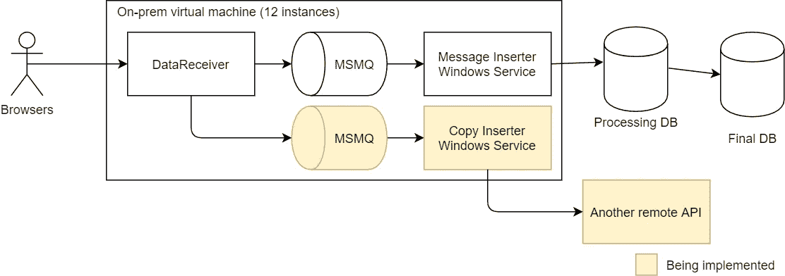
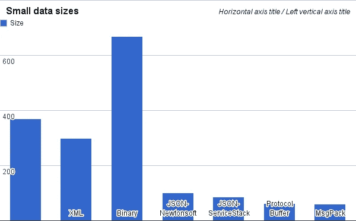
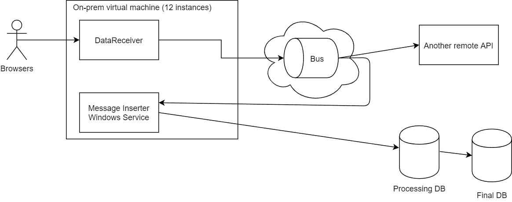
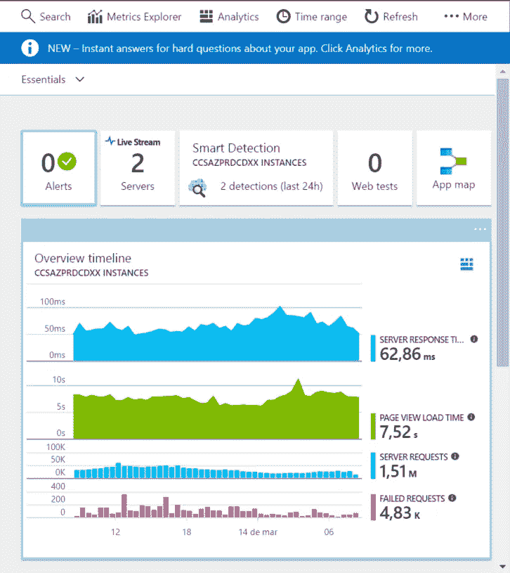
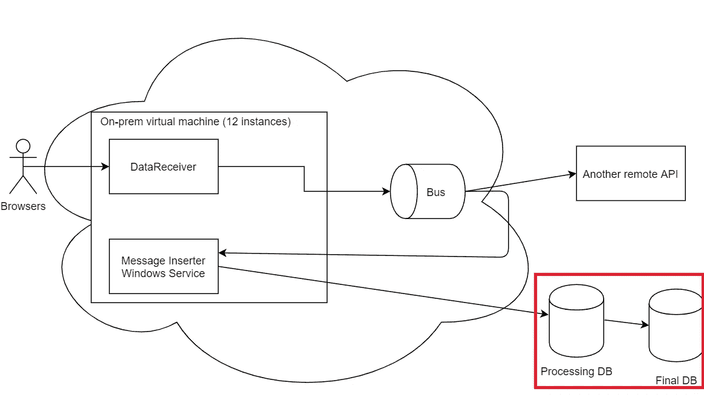
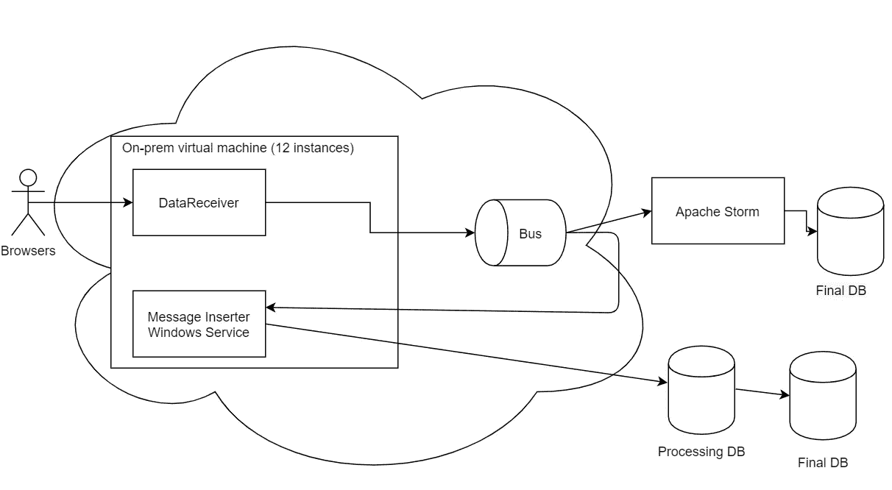

# 修复高吞吐量遗留 API — Azure 迁移

> 原文：<https://itnext.io/healing-a-high-throughput-legacy-api-azure-migration-df0cc65d07d4?source=collection_archive---------2----------------------->

在伦敦的第一个月，我加入了一家为其他电子商务提供服务的公司，通过从用户的浏览器接收信息，然后提供:

*   丢失的转换产品(如通过电子邮件发送未购买的购物篮)
*   分析，转化漏斗

在这篇文章中，我们将讨论接收所有流量、处理以及我们如何发展架构的技术挑战。这有助于您理解决策和改进，以便从中学习。

这是系统的架构:

架构图—绘制于 [draw.io](https://draw.io)

我们正在讨论的 API 称为 DataReceiver，它接收一个请求并将其添加到 Microsoft 消息队列中，然后一个 Windows 服务插入到数据库中。该 API 具有巨大的吞吐量，在正常情况下超过 10，000 个请求/秒。

## 一切都着火了！

这很好，米姆由 KC 绿色

我参与了这个项目，因为黄盒子正在开发中，任何时候他们试图发布这个新的拷贝流，都会使整个应用程序离线。一旦创建了这个队列，远程 API 就无法无延迟地接收 10，000 个请求/秒，导致队列在大约 126，000 条消息时被填满。一旦队列变满，游戏就结束了。

在这种情况下，你会建议或做什么？

我的第一个难题是，如果我们有 10，000 条消息/秒，我们只能将 126，000 条消息排队，一个缓慢的消息消费者(windows 服务)只需要 13 秒就可以让整个事情崩溃。

当向队列发送消息时，需要序列化消息体中的内容。此应用程序正在以二进制序列化程序格式发送消息。您可能认为二进制是高效的，但是。net framework 能让你大吃一惊。

“上快速搜索。net 连载比较”让我看到了这篇[的博文](https://maxondev.com/serialization-performance-comparison-c-net-formats-frameworks-xmldatacontractserializer-xmlserializer-binaryformatter-json-newtonsoft-servicestack-text/)。

序列化比较图表

我们发现二进制文件在大小和序列化时间上都比它的同类文件，甚至是 JSON 和 XML 要大得多。由于这是一个高吞吐量的 API，我决定使用 MsgPack，它将我们的消息大小减少了 90%。我们可以对更多的消息进行排队，比如 100 万条消息，但是 100 万条消息低于每秒 10，000 个请求，不需要很长时间就可以填满队列。

## 还在燃烧

让我们回到架构:

建筑图—在 [draw.io](https://draw.io) 绘制

你在这里还能发现什么问题？

两个主要的是:

*   消息队列没有冗余。如果虚拟机关闭时有消息在里面会怎样？
*   如果要通过复制消息的方式向多个消费者广播一条消息，这正常吗？

我想解决的第一件事是消息的无冗余性，我的目标是用 API 在虚拟机之外的某个地方聚集一个队列。那时我为 RabitMQ、Kafka 和 Azure Service Bus 做 POC。

为了方便和。net SDK 支持，Azure Service Bus 是明显的赢家。使用 Azure 服务的唯一挑战是我们仍然在本地，因此延迟可能是一个问题。

当处理如此高的流量时，记得为你的场景优化 SDK，例如，这些[微软推荐](https://docs.microsoft.com/en-us/azure/service-bus-messaging/service-bus-performance-improvements?tabs=net-standard-sdk)。一旦证明优化的延迟非常低，我们就开始在服务总线中使用主题。

这让我们有了这个架构:

建筑图—在 [draw.io](https://draw.io) 绘制

好处是:

*   我们现在有了一个很大的消息集群，Azure Service Bus 支持在一个主题下排队的高达 80GB 的数据。这给了我们更大的犯错空间。
*   Azure 服务总线实现了一个发布者/订阅者模式，因此我们可以发布一次消息，并拥有多个侦听器。

## 序列化不兼容

弗雷德里克·图比尔蒙特在 [Unsplash](https://unsplash.com/s/photos/plug?utm_source=unsplash&utm_medium=referral&utm_content=creditCopyText) 上拍摄的照片

我们的听众向我们提出，MsgPack 对他们使用的语言没有很好的支持，比如 Java/Python。回到 POC 模式，我查看了协议缓冲区、Avro 和 Thrift。

节俭在这种情况下是赢家，因为它允许我定义一个消费者可以从中产生客户的契约。

## 手动部署

约翰·穆切特在 [Unsplash](https://unsplash.com/s/photos/manual-work?utm_source=unsplash&utm_medium=referral&utm_content=creditCopyText) 上拍摄的照片

正如图中所提到的，在我们的主要生产环境中，我们有 12 个该 API 的生产实例。每当我们进行部署时，必须有人登录到每台虚拟机，进行部署并希望一切顺利。

手动部署的缺点，尤其是在这种情况下:

*   它们是不可审计的
*   部署是有风险的
*   痛苦的是，他们花了几个小时的体力劳动。你知道什么是最好的吗？当我们不得不回滚时，部署人员可能想杀了我们。

当时，该公司决定通过 Octopus Deploy 实现部署自动化。我帮助实现了测试环境的自动化，并参与了凌晨 2 点的第一次部署。

## 风险很高，所以我们在这里进行了第一次部署:

Octopus 上的部署正如您所预期的那样顺利。但是后来我们意识到我们的 API 通过 URL 关闭了。然后，我们打电话给我们的主办公司，请求 infra 团队的帮助，但我们仍然在努力。经过 4 个小时的折磨，有人发现我们的部署缺少一个 HTML 文件，负载平衡器用它来进行健康检查。

教训是:

> 当部署是手动的时，可能会有任何地方都没有记录的手动步骤。

## 没有能见度

马库斯·斯皮斯克在 [Unsplash](https://unsplash.com/s/photos/foggy?utm_source=unsplash&utm_medium=referral&utm_content=creditCopyText) 上的照片

以前，我们的系统通过屏幕上的仪表板和文本日志文件进行某种监控。老实说，就我目前的标准而言，我们对应用程序中发生的事情缺乏了解。

我团队中的一个同事在 Azure App Insights 中做了一个概念验证，这是一个多么大的改变。我们现在可以看到:

*   我们收到了多少请求。
*   多少人成功了/失败了。
*   可以绘制成图表的异常日志。

应用洞察仪表板示例

这样，我们发现大约 10%的请求失败了，管理层认为这是我们的一个高优先级，因为我们可能会损失 10%的收入，他们只能看到这一点，因为我们最终可以看到这个 API 中发生了什么。

**Azure 虚拟机迁移**

我们的基础设施团队在 Azure 迁移方面做得非常出色，他们将这些本地虚拟机迁移到 Azure 中的 IaaS，这为我们带来了更好的结果:

*   自动化供应
*   易于扩展

# 下一阶段

在所有这些改进之后，系统的稳定性得到了很好的排序，我们有了快速/安全的部署，对正在发生的事情的可见性，以及对慢消息消费者的余量。

两件事开始浮现出来:

*   这些消息被完全处理的速度有时比我们的功能所承诺的要慢。
*   在 azure 中，处理我们的消息的 SQL 数据库花费了一大笔钱。

架构图—在 [draw.io](https://draw.io) 绘制

这些消息在 SQL Server 中以大数据规模进行处理，然后存储在最终的数据库中。这是我们处理速度的瓶颈。

在这种情况下你会怎么做？SQL 是为了处理数百万个事件，然后编译成可理解的记录而构建的吗？

您可以像以前一样用 SQL 实现这一点，但这并不理想，所以我开始寻找替代方案。我在找大数据处理工具，偶然发现了 Apache Spark 和 Apache Storm。

当时的微软正在推出一项名为 HD Insights 的服务，这是 Apache Storm 的 PaaS，它可以运行 C# bingo！我花了几天时间创建 SQL 处理内部的图表，直到我们对它在做什么有了基本的了解。

## 推出新系统

使用服务总线的一个优点是，我们可以监听另一个订阅中的消息，处理消息并与现有的数据库进行比较。

我们达到了 99.99%的匹配，所以我们很高兴推出。我们推出了两个生产环境，进展非常顺利，但一旦我们尝试推出我们的最高吞吐量环境，Azure HD Insights 就会崩溃，而且不会告诉我们原因。

该团队在与微软进行了无数次对话后，决定部署他们自己的 Apache Storm，并用 Java 重写消息处理器。所以我的教训是:

> 小心基于语言偏好的框架选择。

如果最初的东西是用 Java 构建的，即使有一个学习曲线，也可能是一个更好的选择。我有过同样的场景，我们在。net，不用说，我们必须迁移到 Java，这样我们才能导入 Jar 文件。

# 结论

这是一个巨大的项目，在不到一年的时间里取得了令人难以置信的进展。这是一个真正的团队努力，所以我要感谢所有同事的帮助。

主要学习内容:

*   如果一条消息需要多个侦听器，请使用发布者/订阅者。
*   确保您的消息队列有冗余。
*   部署应该是自动化的。
*   你需要了解你的应用。
*   虽然你可以在数据库中进行处理，但要怀疑它是否是这项工作的最佳工具。