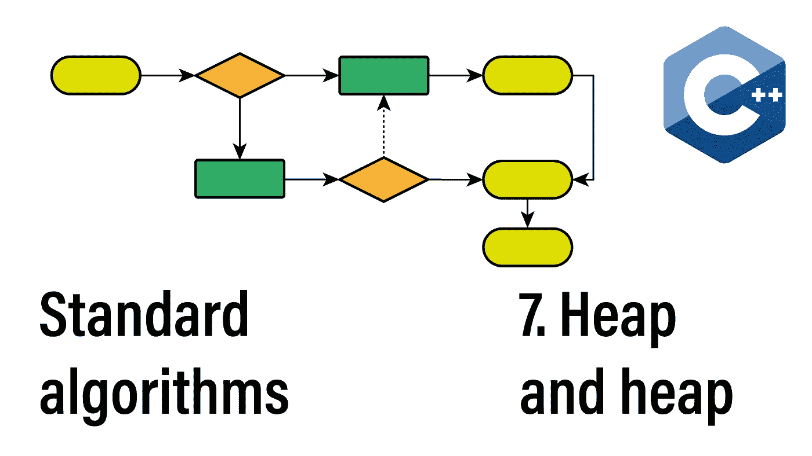
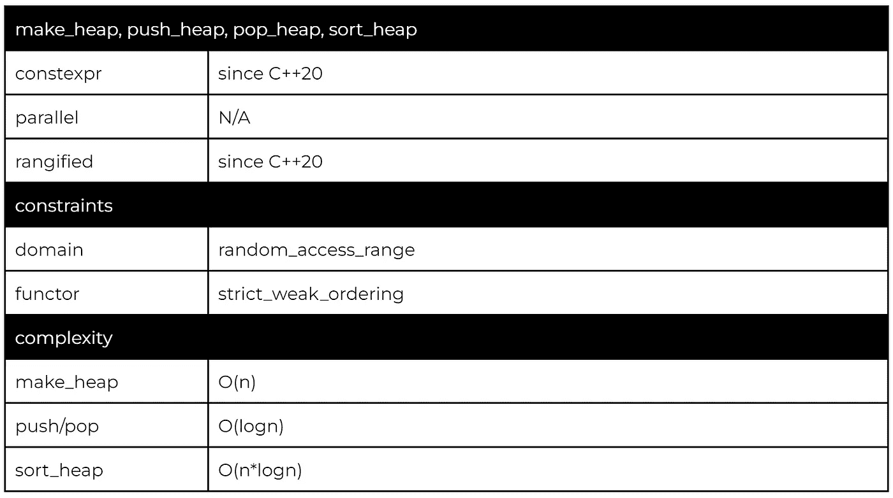
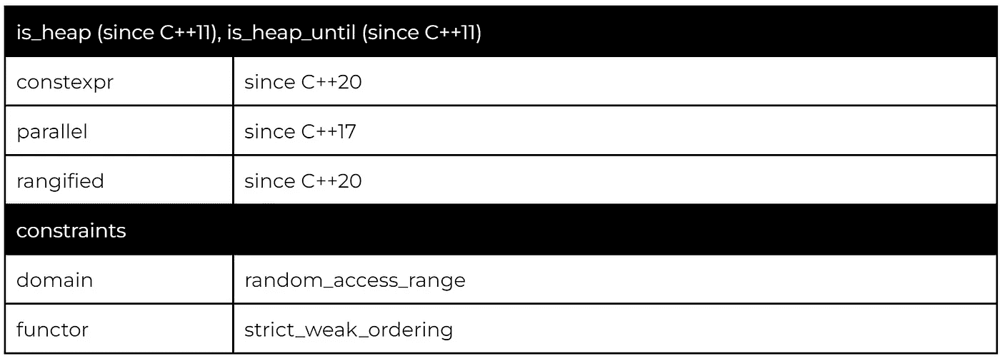
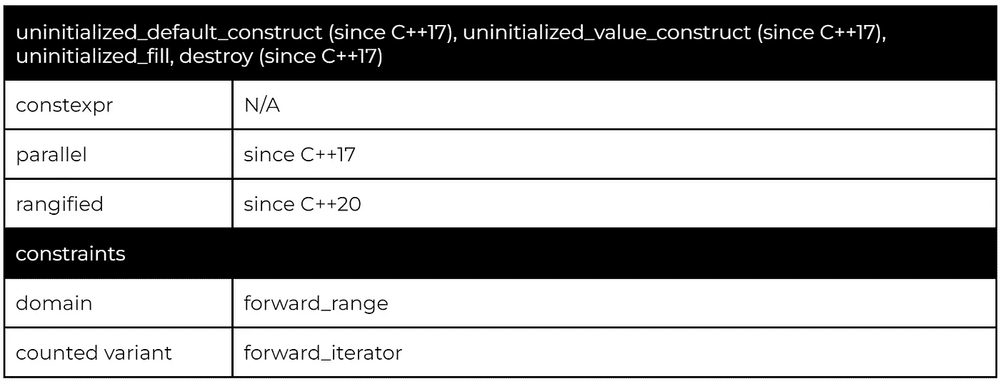
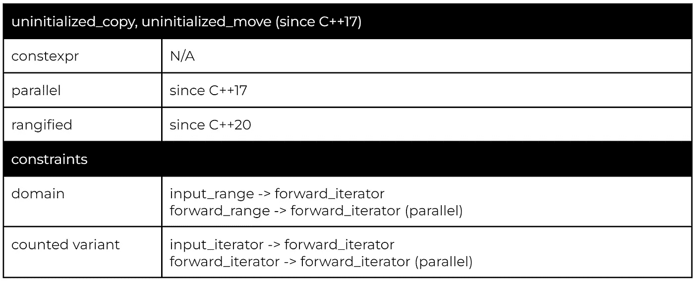

# 堆和堆:114 C++算法系列

> 原文：<https://itnext.io/heap-and-heap-the-114-c-algorithms-series-1d4215ae9f0d?source=collection_archive---------4----------------------->

欢迎来到 114 C++算法系列的第七部分。今天我们将讨论提供最大堆数据结构语义的算法和在未初始化(不仅仅是堆)内存上操作的算法。

## 该系列:

*   [简介](/the-114-standard-c-algorithms-introduction-2a75a2df4300)
*   [排序和分割算法](/sorting-partitioning-the-114-c-algorithms-series-6503ad41cede)
*   [对排序或分区范围进行操作的算法](/divide-conquer-and-sets-the-114-c-algorithms-series-d0085a38046e)
*   [转换算法](/transformations-the-114-c-algorithms-series-deacdbd4c373)
*   [左侧折叠和其他缩减](/left-folds-and-other-reductions-the-114-c-algorithms-series-6195724d324)
*   [生成器、复制和移动](/generators-copies-and-moves-the-114-c-algorithms-series-1d0774472877)
*   堆积和堆积
*   [搜索和最小值-最大值](https://medium.com/@simontoth/8a6ed951ad40)
*   结论(即将发布)

堆和未初始化内存算法代表了整个算法库中的一个小类别，主要是因为标准库提供了更方便的替代方法，另一方面，提供了更少的控制。因此，如果您希望或需要该控件，可以使用这些算法作为自定义实现的基础。

# 堆数据结构

该标准通过 *std::priority_queue* 为最大堆数据结构提供了一个方便的包装器。然而，当使用 *std::priority_queue 时，*我们失去了对底层数据的访问，这可能是不方便的。

为了比较，让我们实现一个简单版本的 *topk* 算法，它返回一个范围内的前 k 个元素(类似于 *partial_sort_copy* ):

当使用优先级队列时，我们可以利用提供的简单的 *push()* 和 *pop()* 接口(第 8 行和第 10 行)。然而，只有通过重复应用 *pop()* 直到队列为空(第 17 行)，才能从队列中提取所有数据。

当使用堆算法时，我们需要手动管理底层数据结构(第 6–7 行和第 9–10 行)。然而，我们不需要提取数据，除此之外，如果我们不需要排序顺序中的前 k 个元素，我们可以省略最后的 *sort_heap* (第 15 行)。

我们的示例没有利用 *std::make_heap* ，因为我们从一个空范围开始，这是一个有效的堆。

这两个测试算法检查堆不变量。Max heap 是一个二叉树，其中每个子元素等于或小于父元素。 *is_heap* 变量返回一个布尔值，其中 *is_heap_until* 返回一个迭代器，表示范围的前导部分，它满足最大堆不变量。

在应用 *make_heap* 之前，只有第一个元素处于正确的堆顺序(2 的父元素是 1，这违反了最大堆不变量)。因此， *is_heap* 返回 false(第 3 行)，而 *is_heap_until* 返回第二个元素的迭代器(第 4 行)。

应用 *make_heap* 后，整个范围都是堆顺序， *is_heap* 返回 *true* (第 8 行)，而 *is_heap_until* 返回范围迭代器的结尾(第 9 行)。

值得注意的是， *is_heap(begin，is_heap_until(begin，end))* 将始终返回 *true。*

# 使用未初始化的内存

我们今天要讨论的第二类算法是对未初始化内存进行操作的算法。像堆算法一样，您应该更喜欢高级别的抽象(例如多态内存资源)。然而，当使用未初始化的内存时，使用这些算法比从头开始实现所有功能更可取。

我们首先需要获得一块未初始化的内存，在 C++中有两种有效的方法。首先，我们可以用适当的[对齐方式](https://en.cppreference.com/w/cpp/language/object)和大小分配一个 *char* 数组。因为 char*被允许作为任何其他指针类型的别名，所以我们可以*重新解释 _ 转换*结果缓冲区为我们想要的类型。

或者，我们可以使用全局*操作符 new* ，因为 C++17 接受一个对齐参数并返回一个指向 void 的指针。然后，我们可以使用 *static_cast* 将该指针转换为所需的类型。

下面是一个使用全局*操作符 new* 为十个 *std::string* 对象分配(和释放)空间的例子:

这个例子包含了很多拼写，所以让我们一步一步来:

*   首先我们需要 *sizeof(std::string)*10* 字节，这是 new 运算符的第一个参数(第 2 行)。
*   每当分配原始内存时，我们必须确保要存储在该内存中的对象的对齐要求得到满足。
*   为了防止重载解析冲突，新操作符将 alignment 作为 *align_val_t* 而不是的 *alignof 返回的 *size_t* ，所以我们需要使用一个额外的 *static_cast* (line3)。*
*   最后，我们必须将 void 指针转换为所需的元素类型(第 1 行)。
*   删除时，我们需要确保使用匹配版本(这里是数组版本)的*操作符 delete* ，并按照前面提到的相同逻辑提供对齐。

下面是一个在堆栈上使用 char 缓冲区的示例:

因为内存在堆栈中，所以我们不需要释放步骤。

重要的是，在这两段代码中，我们所拥有的只是原始内存。没有创建或销毁类型为 *std::string* 的对象。此外，请注意*静态转换*与*重新解释转换的区别。**static _ cast*用于相关类型之间的转换( *void** 与所有指针类型相关)。 *reinterpret_cast* 用于不相关类型之间的转换( *char** 可以别名任何其他指针，但不是 *std::string** 的相关类型)。

## 建造，摧毁

*construct_at* 和 *destroy_at* 算法将在给定的地址构造/销毁单个元素。如果指定了额外的参数， *construct_at* 将*将这些转发给*对象的构造函数。

在这个例子中，construct_at 算法使用参数 *eight* 和*‘X’*(第 4 行)创建了一个 *std::string* 对象，这导致一个字符串填充了 X 字符的八个副本。

## 未初始化 _ 默认 _ 构造，未初始化 _ 值 _ 构造，未初始化 _ 填充，销毁

这三个算法涵盖了[默认初始化](https://en.cppreference.com/w/cpp/language/default_initialization)、[值初始化](https://en.cppreference.com/w/cpp/language/value_initialization)和元素的复制初始化。Destroy 在不释放底层内存的情况下销毁对象。

所有这些算法都计算了接受迭代器和元素计数的变量:

对于 *std::string* ，默认和数值初始化没有区别。在这两种情况下，我们都以空字符串结束。

## 未初始化 _ 复制，未初始化 _ 移动

这些算法遵循复制和移动算法的逻辑。但是，因为目标范围是未初始化的内存，所以它们变成了复制和移动构造，而不是复制和移动赋值。

## 交易行为

使用未初始化内存算法的主要好处是它们可以正确处理事务行为。在对象的构造函数可能引发。如果其中一个对象构造失败，算法将通过析构已经构造好的对象来正确地回滚。

我们可以通过构建一个玩具类型来观察这种行为，该玩具类型包含第三个结构:

因为自定义类在构造函数的第三次调用时抛出，我们将看到*STD::initialized _ default _ construct*算法创建两个实例，然后立即销毁*自定义*的两个实例，之后再次抛出异常。

# 感谢您的阅读

不要忘记关注，这样你就不会错过本系列的其他文章。例如，下面的文章将介绍最后一组算法:搜索和最小-最大算法。

我还在 T4 的 YouTube 上发布视频。你有问题吗？在 Twitter 或 LinkedIn 上联系我。